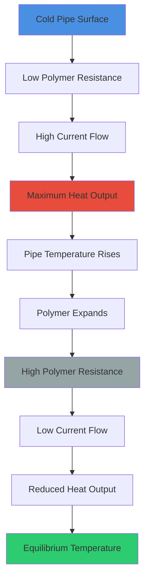

## Positive Temperature Coefficient Technology

Self-regulating heat trace cable employs a semiconductive polymer matrix with positive temperature coefficient (PTC) characteristics. The polymer core, positioned between two parallel bus wires, exhibits temperature-dependent electrical resistance that automatically modulates power output based on local pipe temperature.

### Physical Operation Principle

The conductive polymer contains dispersed carbon particles within a semi-crystalline polymer matrix. As temperature increases, thermal expansion reduces carbon particle connectivity, increasing electrical resistance and decreasing current flow. This inverse relationship between temperature and power output creates inherent self-regulation at every point along the cable length.

## Power Output Characteristics

Self-regulating cable power output follows a nonlinear temperature-power relationship governed by the polymer's PTC behavior.

### Temperature-Power Relationship

The power output per unit length decreases exponentially with increasing temperature:

$$P(T) = P_0 \cdot e^{-\alpha(T - T_0)}$$

Where:
- $P(T)$ = Power output at temperature $T$ (W/m)
- $P_0$ = Maximum rated power output at reference temperature (W/m)
- $\alpha$ = Temperature coefficient of the polymer (K⁻¹)
- $T$ = Pipe surface temperature (°C)
- $T_0$ = Reference temperature, typically 10°C (°C)

### Heat Transfer to Pipe

The steady-state heat balance for maintaining pipe temperature:

$$P_{cable} = \frac{(T_{maintain} - T_{ambient})}{R_{thermal}}$$

Where:
- $P_{cable}$ = Required cable power output (W/m)
- $T_{maintain}$ = Target pipe maintenance temperature (°C)
- $T_{ambient}$ = Ambient air temperature (°C)
- $R_{thermal}$ = Total thermal resistance (pipe insulation + air film) (m·K/W)

## Cable Construction

```mermaid
graph LR
    A[Outer Jacket] --> B[Grounding Braid]
    B --> C[Insulation Layer]
    C --> D[Conductive Polymer]
    D --> E[Bus Wire 1]
    D --> F[Bus Wire 2]

    style A fill:#34495E
    style B fill:#7F8C8D
    style C fill:#3498DB
    style D fill:#E67E22
    style E fill:#C0392B
    style F fill:#C0392B
```

### Core Components

| Component | Material | Function |
|-----------|----------|----------|
| Bus Wires | Tinned copper, 16-12 AWG | Electrical conductors parallel to cable length |
| Conductive Polymer | Carbon-loaded polyolefin | PTC heating element between bus wires |
| Electrical Insulation | Modified polyolefin | Dielectric barrier, typically 600V rated |
| Grounding Braid | Tinned copper | Equipment grounding conductor per NEC |
| Outer Jacket | Fluoropolymer or thermoplastic | Chemical/moisture resistance, mechanical protection |

## Performance Comparison

### Self-Regulating vs. Constant Wattage Cable

| Parameter | Self-Regulating | Constant Wattage |
|-----------|----------------|------------------|
| Power Modulation | Automatic per location | Fixed output |
| Overlapping | Permitted without damage | Prohibited - causes burnout |
| Maximum Length | 40-100 m typical | 150-300 m typical |
| Energy Consumption | 20-40% lower (modulates with need) | Constant regardless of conditions |
| Installation Complexity | Lower (self-limiting) | Higher (requires precision) |
| Initial Cost | Higher ($/m) | Lower ($/m) |
| Temperature Limitation | Self-limiting to ~150°C | Requires external control |
| Circuit Protection | Standard breakers adequate | Requires precise sizing |

## Sizing Methodology

### Heat Loss Calculation

Total heat loss from insulated pipe per ASHRAE Fundamentals:

$$Q_{loss} = \frac{2\pi L k_{ins} (T_{pipe} - T_{amb})}{\ln(r_{out}/r_{pipe})} + L \cdot h \cdot \pi D_{out} (T_{surf} - T_{amb})$$

Where:
- $Q_{loss}$ = Total heat loss (W)
- $L$ = Pipe length (m)
- $k_{ins}$ = Insulation thermal conductivity (W/m·K)
- $r_{out}$ = Outer insulation radius (m)
- $r_{pipe}$ = Pipe outer radius (m)
- $h$ = Convective heat transfer coefficient, typically 10 W/m²·K (W/m²·K)
- $D_{out}$ = Outer insulation diameter (m)

### Design Safety Factor

$$P_{required} = Q_{loss} \cdot SF \cdot \eta^{-1}$$

Where:
- $P_{required}$ = Required cable power rating (W/m)
- $SF$ = Safety factor, typically 1.2-1.5 for domestic hot water
- $\eta$ = Installation efficiency factor (0.85-0.95 depending on contact quality)

### Standard Power Ratings

| Cable Rating | Application | Typical Use |
|--------------|-------------|-------------|
| 3-5 W/m at 10°C | Light duty | Indoor, well-insulated pipes |
| 8-12 W/m at 10°C | Standard duty | Domestic hot water recirculation |
| 15-25 W/m at 10°C | Heavy duty | Outdoor applications, minimal insulation |
| 30-50 W/m at 10°C | Industrial | Process applications, high maintenance temp |

## Installation Requirements

### NEC Article 427 Compliance

Per NEC Article 427 (Electric Pipe Heating):

**Circuit Protection:**
- Ground fault protection required for all heat trace circuits
- Maximum overcurrent protection per manufacturer's instructions
- Typical: 15-30 A depending on cable length and rating

**Installation Methods:**
- Straight runs along bottom of horizontal pipe (6 o'clock position)
- Spiral wrap at manufacturer-specified pitch for higher output
- Must maintain minimum bend radius (typically 25 mm)
- Secure with fiberglass tape every 300-400 mm

**Grounding:**
- Equipment grounding conductor required per NEC 427.29
- Grounding braid must be continuous and properly terminated
- Ground fault equipment must be rated for anticipated fault current

### Thermal Insulation

Insulation applied over cable and pipe per ASHRAE 90.1:

| Pipe Size | Minimum Insulation Thickness | Thermal Conductivity |
|-----------|------------------------------|---------------------|
| ≤25 mm | 25 mm | ≤0.034 W/m·K at 24°C |
| 25-50 mm | 38 mm | ≤0.034 W/m·K at 24°C |
| 50-100 mm | 50 mm | ≤0.034 W/m·K at 24°C |
| >100 mm | 64 mm | ≤0.034 W/m·K at 24°C |

## Energy Efficiency Advantages

Self-regulating cable provides significant energy savings compared to constant wattage systems:

1. **Automatic load matching:** Power output decreases as pipe temperature rises, eliminating energy waste during low-demand periods

2. **Zone-specific response:** Each section of cable responds independently to local temperature conditions

3. **Seasonal adjustment:** Higher output during winter, lower during summer without control system changes

4. **Reduced cycling losses:** Eliminates on-off cycling of thermostatically controlled systems

**Typical Energy Savings:** 25-45% reduction in annual energy consumption compared to constant wattage cable with thermostat control.

## Operational Considerations

### Temperature Limitations

- **Maximum exposure temperature:** 65-85°C continuous (varies by model)
- **Maximum intermittent temperature:** 85-110°C (short duration)
- **Minimum installation temperature:** -40°C to -60°C depending on jacket material
- **Power output at maintenance temperature:** Derate to 30-50% of 10°C rating

### Circuit Length Limitations

Maximum circuit length determined by voltage drop and minimum starting current:

$$L_{max} = \frac{V^2 \cdot R_{polymer}}{P_0 \cdot (2 R_{bus} + R_{polymer})}$$

Where:
- $L_{max}$ = Maximum circuit length (m)
- $V$ = Supply voltage (V)
- $R_{polymer}$ = Polymer resistance per unit length at startup (Ω/m)
- $R_{bus}$ = Bus wire resistance per unit length (Ω/m)
- $P_0$ = Rated power at 10°C (W/m)

**Typical maximum lengths:**
- 120V circuits: 40-60 m
- 208-240V circuits: 70-100 m
- 277V circuits: 100-130 m

## Maintenance and Troubleshooting

**Annual Inspection:**
- Visual inspection of jacket integrity
- Insulation condition assessment
- Ground fault device testing per NEC 427.22
- Infrared thermography to identify dead sections

**Common Issues:**
- Physical damage to jacket (most common failure mode)
- Water intrusion at terminations
- Excessive bending causing bus wire fracture
- Insulation compression reducing effectiveness

**Performance Verification:**
- Measure current draw per manufacturer's tables
- Compare against expected values at measured ambient temperature
- Variance >20% indicates cable degradation or installation issues