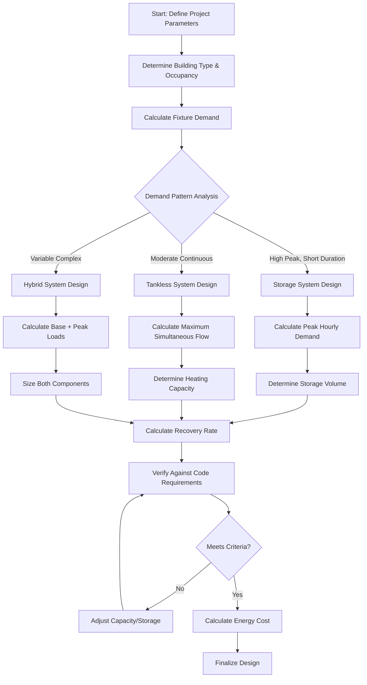
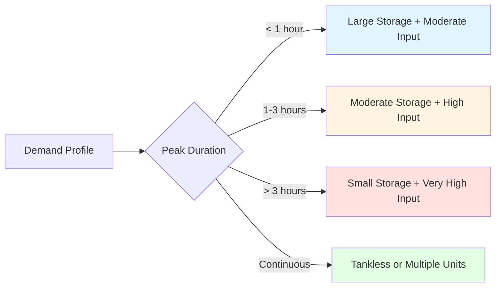

Water heater sizing determines equipment capacity to meet peak hot water demands while maintaining energy efficiency. Proper sizing prevents undersized systems that fail to meet demand and oversized systems that waste energy through excessive standby losses.

## Sizing Methodologies

Three primary methods exist for water heater sizing, each with specific applications and accuracy levels.

### Storage Method

The storage method sizes tanks based on peak hourly demand and system recovery capabilities. This approach applies to residential and light commercial applications where demand patterns are predictable.

**Storage volume calculation:**

$$V_s = \frac{Q_p - R \cdot t_p}{C_p \cdot \rho \cdot (T_d - T_s)}$$

Where:
- $V_s$ = storage volume (gallons)
- $Q_p$ = peak hourly demand (gallons)
- $R$ = recovery rate (gallons/hour)
- $t_p$ = peak demand duration (hours)
- $C_p$ = specific heat of water (1 BTU/lb-°F)
- $\rho$ = water density (8.34 lb/gallon)
- $T_d$ = delivery temperature (°F)
- $T_s$ = supply temperature (°F)

### Heat Transfer Method

The heat transfer method calculates required input capacity based on thermal energy requirements. This method provides precise sizing for commercial systems with known load profiles.

**Required heating capacity:**

$$\dot{Q} = \frac{\dot{m} \cdot C_p \cdot (T_d - T_s)}{\eta}$$

Where:
- $\dot{Q}$ = heating capacity (BTU/hr)
- $\dot{m}$ = mass flow rate (lb/hr)
- $\eta$ = heater efficiency (decimal)

### Modified Hunter Method

ASHRAE recommends the modified Hunter method for complex commercial and institutional buildings. This statistical approach accounts for simultaneous usage probability.

**Peak demand calculation:**

$$\dot{V}_p = K \cdot \sqrt{\sum WSU}$$

Where:
- $\dot{V}_p$ = peak flow rate (gpm)
- $K$ = demand factor (varies by building type)
- $WSU$ = water supply fixture units

## Storage vs Tankless Comparison

Selection between storage and tankless systems depends on demand patterns, space constraints, and energy targets.

| Parameter | Storage Tank | Tankless |
|-----------|--------------|----------|
| **Response Time** | Immediate | 2-5 second delay |
| **Efficiency** | 0.62-0.95 EF | 0.82-0.99 EF |
| **Standby Loss** | 1-3% per hour | None |
| **Flow Capacity** | Limited by storage | Limited by heating rate |
| **Space Required** | 3-12 sq ft | 0.5-2 sq ft |
| **Temperature Rise** | Pre-heated | Calculated per fixture |
| **Best Application** | High peak demand | Continuous moderate demand |

**Tankless capacity verification:**

$$\dot{Q}_{required} = \frac{GPM \cdot 8.34 \cdot 60 \cdot \Delta T}{\eta}$$

Where:
- $\dot{Q}_{required}$ = minimum input capacity (BTU/hr)
- $GPM$ = simultaneous flow rate (gallons per minute)
- $\Delta T$ = temperature rise required (°F)

## Demand Estimation

Accurate demand estimation requires analysis of fixture counts, occupancy patterns, and usage profiles.

### Residential Demand

| Occupants | Bedrooms | Storage (gal) | First Hour Rating (gal) | Tankless (GPM @ 77°F rise) |
|-----------|----------|---------------|------------------------|----------------------------|
| 1-2 | 1-2 | 30-40 | 40-50 | 2-3 |
| 2-3 | 2-3 | 40-50 | 50-60 | 3-4 |
| 3-4 | 3-4 | 50-65 | 60-75 | 4-5 |
| 4-5 | 4-5 | 65-80 | 75-90 | 5-7 |
| 5+ | 5+ | 80+ | 90+ | 7+ |

### Commercial Demand Factors

ASHRAE provides demand factors based on building type and occupancy density.

| Building Type | Peak Demand | Duration | Recovery Period |
|---------------|-------------|----------|-----------------|
| Office | 0.02-0.04 gal/person-hr | 1-2 hours | 4-6 hours |
| Restaurant | 1.5-2.5 gal/meal | 2-3 hours | 3-4 hours |
| Hotel | 25-35 gal/room-day | 1-1.5 hours | 4-5 hours |
| Hospital | 20-40 gal/bed-day | Continuous | N/A |
| Laundry | 2-4 gal/lb-laundry | 3-4 hours | 2-3 hours |

## Sizing Process Flow

## Code Requirements

Water heater sizing must comply with multiple code provisions addressing capacity, efficiency, and safety.

### Capacity Requirements

- **IPC Section 607**: Minimum capacity based on fixture unit method
- **UPC Section 508**: Water heater capacity and recovery
- **ASHRAE 90.1**: Energy efficiency minimums
- **Local Codes**: May impose stricter requirements

### Efficiency Standards

**Federal minimum efficiency (NAECA 2015):**

$$EF_{min} = 0.97 - \frac{0.00132 \cdot V}{1000}$$

For gas storage water heaters where $V$ = volume in gallons.

### Recovery Capacity Verification

Storage systems must demonstrate adequate recovery:

$$R = \frac{\dot{Q}_{input} \cdot \eta}{8.34 \cdot (T_d - T_s)}$$

Where:
- $R$ = recovery rate (gal/hr)
- $\dot{Q}_{input}$ = heater input (BTU/hr)

Minimum recovery rates:
- Residential: 70% of peak hourly demand
- Commercial: 100% of average hourly demand during peak period

## System Selection Matrix

Proper water heater sizing balances first cost, operating cost, and reliability. Undersizing by 20% results in comfort complaints and equipment stress, while oversizing by 20% increases standby losses by 15-25% without performance benefit. Use ASHRAE Handbook—HVAC Applications Chapter 51 for detailed commercial sizing procedures and specific building type demand profiles.
