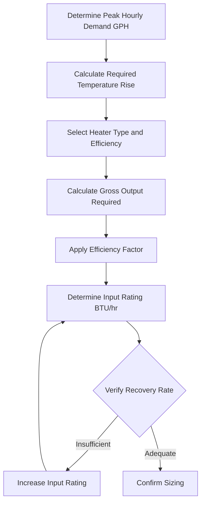
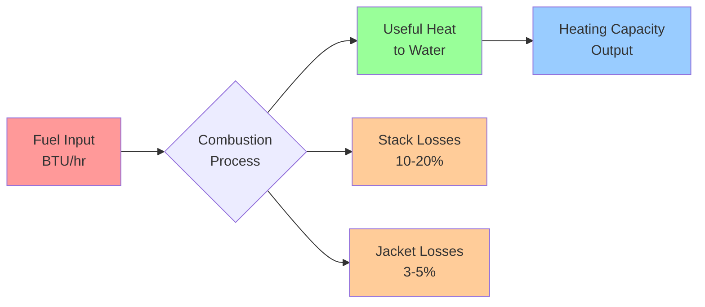

## BTU Per Hour Input Rating

The BTU per hour input rating represents the total energy consumed by a water heater and serves as the fundamental sizing parameter for both gas-fired and electric resistance units. This rating determines the heater's ability to satisfy peak demand while maintaining desired outlet temperatures under continuous draw conditions.

## Input Rating Calculation

The required input rating depends on recovery capacity, temperature rise, fluid properties, and thermal efficiency. The fundamental relationship:

$$Q_{input} = \frac{\dot{m} \cdot c_p \cdot \Delta T}{\eta}$$

Where:
- $Q_{input}$ = Input rating (BTU/hr)
- $\dot{m}$ = Mass flow rate (lb/hr)
- $c_p$ = Specific heat of water (1.0 BTU/lb·°F)
- $\Delta T$ = Temperature rise (°F)
- $\eta$ = Thermal efficiency (decimal)

For practical water heater sizing using volumetric flow:

$$Q_{input} = \frac{GPH \times 8.33 \times \Delta T}{\eta}$$

Where:
- $GPH$ = Gallons per hour recovery rate
- $8.33$ = Density of water (lb/gal at 60°F)

## Recovery Capacity Requirements

Recovery capacity represents the gallons per hour the heater must deliver to meet peak demand after the storage tank depletes. ASHRAE Standard 90.1 mandates minimum recovery efficiency (RE) ratios:

$$RE = \frac{GPH_{recovery}}{Q_{input}/1000}$$

Minimum RE values by type:
- Gas storage: 67 GPH per 1000 BTU/hr input
- Electric storage: 95 GPH per 1000 BTU/hr input

## Efficiency Impact on Input Requirements

Thermal efficiency directly affects input rating for equivalent output capacity. The efficiency factor accounts for combustion losses, standby losses, and jacket losses.

### Gas-Fired Water Heaters

Gas water heater efficiency ranges from 75% to 95% depending on technology:

| Heater Type | Efficiency Range | Input Multiplier |
|-------------|------------------|------------------|
| Atmospheric | 75-80% | 1.25-1.33 |
| Power-Vent | 80-85% | 1.18-1.25 |
| Condensing | 90-95% | 1.05-1.11 |

For a 40,000 BTU/hr output requirement:
- Atmospheric unit: $Q_{input} = 40,000 / 0.78 = 51,282$ BTU/hr
- Condensing unit: $Q_{input} = 40,000 / 0.93 = 43,011$ BTU/hr

### Electric Resistance Water Heaters

Electric units achieve 95-100% efficiency since all input energy converts to heat within the tank:

$$Q_{input} = Q_{output} \times \frac{1}{\eta} \times 3.412 \text{ (BTU/Watt-hr)}$$

For practical purposes, electric heater input equals output capacity with minimal jacket loss adjustment.

## Sizing Methodology

### Step-by-Step Sizing Process

1. **Establish demand profile**: Identify peak hourly usage (GPH) from fixture unit method or statistical analysis per ASPE standards
2. **Calculate temperature rise**: $\Delta T = T_{outlet} - T_{inlet}$, typically 100°F (140°F outlet, 40°F inlet)
3. **Determine gross output**: $Q_{output} = GPH \times 8.33 \times \Delta T$
4. **Select efficiency**: Apply appropriate $\eta$ based on heater technology and fuel type
5. **Calculate input rating**: $Q_{input} = Q_{output} / \eta$
6. **Verify against AHRI standards**: Confirm rated capacity meets calculated requirement

## Input Rating Tables by Heater Type

### Gas Storage Water Heaters (AHRI Certified)

| Tank Size (gal) | Input Rating (BTU/hr) | Recovery @ 100°F Rise | Efficiency |
|-----------------|------------------------|------------------------|------------|
| 30 | 30,000-40,000 | 25-32 GPH | 78-80% |
| 40 | 36,000-50,000 | 30-40 GPH | 78-82% |
| 50 | 38,000-55,000 | 32-45 GPH | 78-82% |
| 75 | 75,000-76,000 | 60-65 GPH | 80-82% |
| 100 | 100,000-120,000 | 80-100 GPH | 80-84% |

### Electric Storage Water Heaters

| Tank Size (gal) | Input Rating (kW) | Input (BTU/hr) | Recovery @ 100°F Rise |
|-----------------|-------------------|----------------|------------------------|
| 30 | 3.8-4.5 | 12,970-15,354 | 12-15 GPH |
| 40 | 4.5-5.5 | 15,354-18,768 | 15-18 GPH |
| 50 | 5.5-6.0 | 18,768-20,472 | 18-20 GPH |
| 80 | 6.0-6.0 | 20,472-20,472 | 20-20 GPH |
| 120 | 6.0-6.0 | 20,472-20,472 | 20-20 GPH |

## Energy Flow Diagram

## Design Considerations

**Gas heater advantages:**
- Higher recovery rates per dollar of equipment cost
- Faster temperature recovery during peak demand
- Lower operating cost in most regions

**Electric heater advantages:**
- Near 100% thermal efficiency
- No venting requirements reduce installation cost
- Precise input control eliminates oversizing
- Smaller footprint for equivalent storage

**Critical sizing factors:**
1. Peak hourly demand governs input rating selection
2. Storage tank volume moderates required input for intermittent loads
3. Safety factor of 1.1-1.25 accounts for inlet temperature variation
4. Altitude derating for gas units: 4% per 1000 ft above sea level

## Reference Standards

- **ASHRAE 90.1**: Energy efficiency requirements and recovery efficiency minimums
- **AHRI 110**: Performance rating of electric instantaneous water heaters
- **AHRI 1010**: Thermal efficiency testing for gas-fired storage water heaters
- **ASPE Domestic Water Heating Design Manual**: Sizing methodologies and demand calculation procedures

Proper input rating selection ensures adequate recovery capacity while minimizing standby losses and equipment cost. Undersized input ratings result in inadequate supply during peak periods, while oversized units incur unnecessary cycling losses and capital expense.
