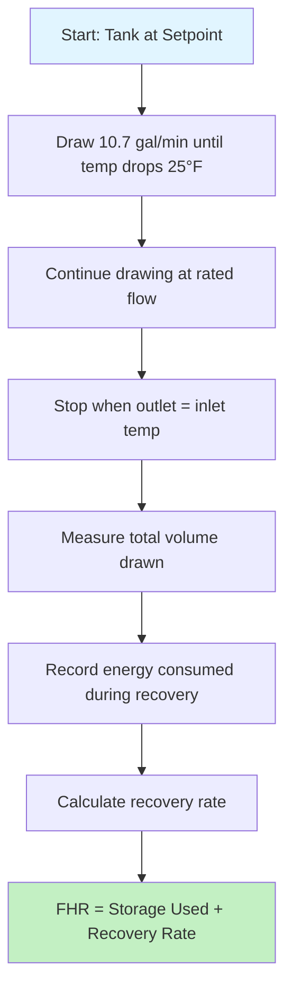
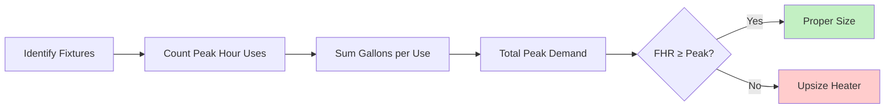
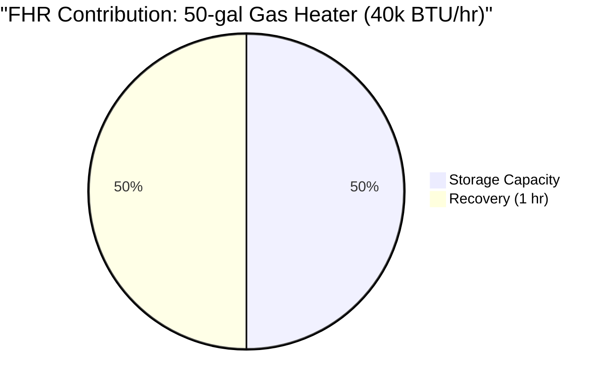

## First Hour Rating Definition

First Hour Rating (FHR) quantifies the maximum volume of hot water a storage water heater can deliver during one continuous hour of peak demand, starting with a fully heated tank. This performance metric combines both stored hot water capacity and the heater's ability to recover during draw periods, making it the primary sizing criterion for residential and light commercial applications.

The DOE mandates FHR disclosure on the EnergyGuide label of all residential storage water heaters under the Uniform Test Method for Measuring the Energy Consumption of Water Heaters (10 CFR 430, Subpart B, Appendix E).

## FHR Calculation Methodology

### Basic FHR Formula

The First Hour Rating consists of two components that operate simultaneously during peak demand:

$$\text{FHR} = V_{\text{storage}} + (Q_{\text{recovery}} \times t_{\text{hour}})$$

where:
- $\text{FHR}$ = First Hour Rating (gallons)
- $V_{\text{storage}}$ = Usable storage capacity (gallons)
- $Q_{\text{recovery}}$ = Recovery rate (gallons per hour)
- $t_{\text{hour}}$ = 1 hour time period

### Recovery Rate Calculation

The recovery rate depends on input power and temperature rise:

$$Q_{\text{recovery}} = \frac{P_{\text{input}} \times \eta}{8.33 \times \Delta T}$$

where:
- $P_{\text{input}}$ = Input power (BTU/hr for gas, Watts × 3.412 for electric)
- $\eta$ = Recovery efficiency (typically 0.76-0.78 for gas, 0.98 for electric)
- $8.33$ = Weight of water (lb/gal)
- $\Delta T$ = Temperature rise (°F), typically 90°F (entering 50°F, delivering 140°F)

For electric resistance heaters:

$$Q_{\text{recovery}} = \frac{W \times 3.412 \times 0.98}{8.33 \times 90} = \frac{W}{225}$$

For gas heaters with 40,000 BTU/hr input:

$$Q_{\text{recovery}} = \frac{40,000 \times 0.77}{8.33 \times 90} \approx 41 \text{ GPH}$$

## DOE Test Procedure

The standardized FHR test follows this protocol:

### Test Conditions (10 CFR 430)

| Parameter | Specification |
|-----------|---------------|
| Inlet water temperature | 58°F ± 2°F |
| Thermostat setting | 135°F ± 5°F |
| Draw rate | 3 GPM ± 0.25 GPM |
| Initial condition | Fully recovered tank |
| Ambient temperature | 67.5°F ± 2.5°F |

## FHR Performance Tables

### Typical FHR by Heater Type and Size

**Electric Resistance Water Heaters**

| Tank Size | Element (W) | Storage (gal) | Recovery (GPH) | FHR (gal) |
|-----------|-------------|---------------|----------------|-----------|
| 30 gal | 4500 | 24 | 20 | 44 |
| 40 gal | 4500 | 33 | 20 | 53 |
| 50 gal | 4500 | 42 | 20 | 62 |
| 50 gal | 5500 | 42 | 24 | 66 |
| 65 gal | 5500 | 55 | 24 | 79 |
| 80 gal | 5500 | 68 | 24 | 92 |

**Gas Storage Water Heaters**

| Tank Size | Input (BTU/hr) | Storage (gal) | Recovery (GPH) | FHR (gal) |
|-----------|----------------|---------------|----------------|-----------|
| 30 gal | 30,000 | 24 | 31 | 55 |
| 40 gal | 36,000 | 32 | 37 | 69 |
| 40 gal | 38,000 | 32 | 39 | 71 |
| 50 gal | 40,000 | 41 | 41 | 82 |
| 75 gal | 75,000 | 63 | 77 | 140 |

## Sizing to Peak Demand

### Residential Peak Hour Demand Estimation

ASHRAE Handbook—HVAC Applications provides fixture usage data for estimating peak hour demand:

**Typical Fixture Hot Water Usage (per event)**

| Fixture/Appliance | Gallons Hot Water |
|-------------------|-------------------|
| Shower | 20 gal |
| Bath | 15 gal |
| Shaving | 2 gal |
| Hand washing | 4 gal |
| Hair washing | 4 gal |
| Dishwasher | 7 gal |
| Clothes washer | 25 gal |

### Peak Hour Sizing Example

For a family of four during morning peak:
- 3 showers: 3 × 20 = 60 gal
- 2 hand washes: 2 × 4 = 8 gal
- 1 dishwasher: 1 × 7 = 7 gal

**Total peak demand = 75 gallons**

**Required FHR ≥ 75 gallons**

Selection: 75-gallon gas heater (75,000 BTU/hr input, FHR = 140 gal) provides 86% margin.

## Storage vs. Recovery Balance

The FHR equation reveals a design trade-off:

$$\text{FHR} = \underbrace{V_{\text{storage}}}_{\text{Physical Size}} + \underbrace{Q_{\text{recovery}} \times 1}_{\text{Input Power}}$$

**High-Recovery Strategy:**
- Smaller tank with higher input rating
- Reduced standby losses
- Faster temperature drop during heavy draws
- Example: 40-gal gas at 76,000 BTU/hr (FHR = 98 gal)

**High-Storage Strategy:**
- Larger tank with moderate input
- More stable outlet temperature
- Higher standby losses
- Example: 80-gal electric at 4500W (FHR = 88 gal)

## Commercial Applications

For commercial installations with higher demand variability, the Fixture Unit Method per ASPE (American Society of Plumbing Engineers) provides more accurate sizing. FHR remains valid for:
- Small offices (< 20 occupants)
- Retail spaces with minimal DHW use
- Residential-scale applications

Larger commercial systems require storage-to-demand ratio analysis, peak load diversity factors, and recovery time calculations beyond the one-hour FHR window.

## ASHRAE Standards Reference

ASHRAE 90.1 (Energy Standard for Buildings) and ASHRAE 62.1 (Ventilation for Acceptable Indoor Air Quality) do not mandate FHR sizing directly but require equipment efficiency ratings that correlate with FHR test procedures. ASHRAE Handbook—HVAC Applications Chapter 51 (Service Water Heating) provides comprehensive sizing methods including FHR application limits.

## Key Sizing Principles

1. **FHR must equal or exceed peak hour demand** for adequate hot water supply
2. **Storage capacity typically contributes 50-70%** of total FHR
3. **Recovery rate depends on fuel type:** gas offers 2-3× electric recovery at equal tank size
4. **Test procedure standardization** ensures manufacturer ratings are comparable
5. **Margin of 10-20% above calculated peak demand** accounts for usage variation

Proper application of FHR methodology ensures water heater systems meet occupant demand while avoiding oversizing that increases equipment cost and standby energy losses.
