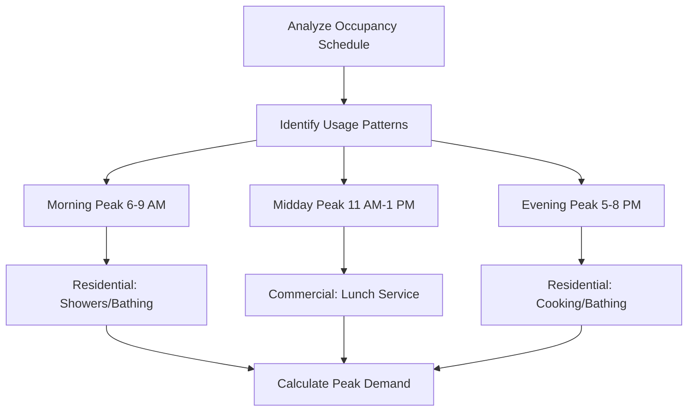

Peak demand calculation determines the maximum instantaneous hot water flow rate required for proper water heater sizing. Accurate peak demand analysis prevents undersized systems that fail to meet user needs and oversized systems that waste energy and capital.

## Fundamental Calculation Methods

### Fixture Unit Method

The fixture unit method converts individual fixtures into standardized units representing relative water demand. This probabilistic approach accounts for the fact that not all fixtures operate simultaneously.

**Basic fixture unit calculation:**

$$Q_{peak} = \sum_{i=1}^{n} (FU_i \times DF) \times GPM_{equivalent}$$

Where:
- $Q_{peak}$ = Peak demand flow rate (gpm)
- $FU_i$ = Fixture units for fixture type $i$
- $DF$ = Diversity factor (dimensionless)
- $GPM_{equivalent}$ = Flow rate per fixture unit (gpm/FU)

### Hunter Curve Application

The Hunter curve, developed by Roy B. Hunter in 1940, provides the relationship between total fixture units and probable simultaneous demand. This empirical method remains the industry standard for commercial applications.

**Hunter curve equation:**

$$Q = \sqrt{FU_{total}}$$

For systems with $FU_{total}$ < 1000:

$$Q = 0.6 \times \sqrt{FU_{total}} \times (1 + 0.1\sqrt{FU_{total}})$$

Where $Q$ represents probable peak demand in gpm.

## Probability of Use Analysis

The probability that multiple fixtures operate simultaneously decreases as the number of fixtures increases. This relationship forms the basis for diversity factor application.

**Probability equation:**

$$P_{simultaneous} = 1 - (1 - p)^n$$

Where:
- $P_{simultaneous}$ = Probability of simultaneous use
- $p$ = Individual fixture use probability
- $n$ = Number of fixtures

## Diversity Factors by Building Type

Diversity factors account for the statistical likelihood of simultaneous fixture use. These factors reduce the theoretical maximum demand to realistic peak values.

| Building Type | Diversity Factor | Peak Duration (min) | Notes |
|---------------|------------------|---------------------|-------|
| Single-family residence | 0.30 - 0.40 | 30 - 60 | Morning peak typical |
| Multi-family (< 20 units) | 0.40 - 0.50 | 45 - 90 | Staggered occupancy |
| Multi-family (> 20 units) | 0.25 - 0.35 | 60 - 120 | High diversity |
| Office buildings | 0.15 - 0.25 | 15 - 30 | Limited hot water use |
| Hotels | 0.35 - 0.50 | 60 - 90 | Morning shower peak |
| Hospitals | 0.50 - 0.70 | Continuous | Higher simultaneous use |
| Restaurants | 0.60 - 0.80 | 180 - 240 | Dishwashing cycles |
| Schools | 0.20 - 0.30 | 20 - 40 | Class change periods |
| Gymnasiums | 0.40 - 0.60 | 30 - 45 | Post-activity showers |

## Fixture Flow Rates and Units

Standard fixture flow rates establish the baseline for demand calculations.

| Fixture Type | Flow Rate (gpm) | Fixture Units (FU) | Hot Water % |
|--------------|-----------------|-----------------------|-------------|
| Lavatory (private) | 2.0 | 1.0 | 100% |
| Lavatory (public) | 2.5 | 2.0 | 100% |
| Shower head | 2.5 | 2.0 | 100% |
| Bathtub | 4.0 | 3.0 | 80% |
| Kitchen sink | 2.5 | 1.5 | 75% |
| Dishwasher (domestic) | 2.0 | 1.5 | 100% |
| Dishwasher (commercial) | 15.0 | 6.0 | 100% |
| Clothes washer | 3.0 | 2.0 | 50% |
| Service sink | 3.0 | 2.5 | 100% |

## Residential Bedroom Method

ASHRAE provides a simplified method for residential applications based on bedroom count as a proxy for occupancy.

**Peak demand equation:**

$$Q_{peak} = 12 + 3(N_{br} - 1)$$

Where:
- $Q_{peak}$ = Peak demand (gallons per hour)
- $N_{br}$ = Number of bedrooms

This method assumes standard fixture complements and typical residential usage patterns.

## Peak Hour Determination

Peak hour demand varies by building type and occupancy schedule. Identifying the critical period ensures adequate capacity during maximum load.

## Demand Profile Analysis

Typical demand profiles illustrate hourly hot water consumption patterns throughout a 24-hour period.

```mermaid
gantt
    title Residential Hot Water Demand Profile
    dateFormat HH:mm
    axisFormat %H:%M

    section Demand Level
    Low (10-20%)        :00:00, 06:00
    Peak (80-100%)      :06:00, 09:00
    Medium (30-40%)     :09:00, 17:00
    High (60-80%)       :17:00, 21:00
    Low (10-20%)        :21:00, 24:00
```

**Commercial demand profile characteristics:**

## Commercial Fixture Count Method

For commercial applications, sum fixture units and apply the Hunter curve or manufacturer-specific demand factors.

**Step-by-step procedure:**

1. **Inventory all fixtures** by type and count
2. **Assign fixture units** from standard tables
3. **Calculate total fixture units:** $FU_{total} = \sum FU_i$
4. **Apply Hunter curve** to determine probable demand
5. **Adjust for hot water percentage** of total flow
6. **Apply building-specific diversity factor**

**Final demand equation:**

$$Q_{peak,hot} = Q_{probable} \times \frac{T_{desired} - T_{cold}}{T_{hot} - T_{cold}} \times DF$$

Where temperatures are in °F or °C, and the fraction represents the mixing ratio to achieve desired delivery temperature.

## ASHRAE Reference Methodology

ASHRAE Handbook—HVAC Applications Chapter 51 (Service Water Heating) provides comprehensive tables and procedures for demand calculation. The methodology integrates fixture units, diversity factors, and storage capacity requirements for complete system sizing.

Key ASHRAE considerations:
- **Recirculation system impacts** on effective demand
- **Temperature maintenance energy** separate from demand load
- **Recovery rate requirements** based on storage volume
- **Safety factor application** (typically 1.1 to 1.25)

Peak demand calculation forms the foundation for water heater capacity selection, storage tank sizing, and distribution system design. Proper application of fixture unit methods, diversity factors, and demand profiles ensures systems meet actual usage patterns without excessive oversizing.
