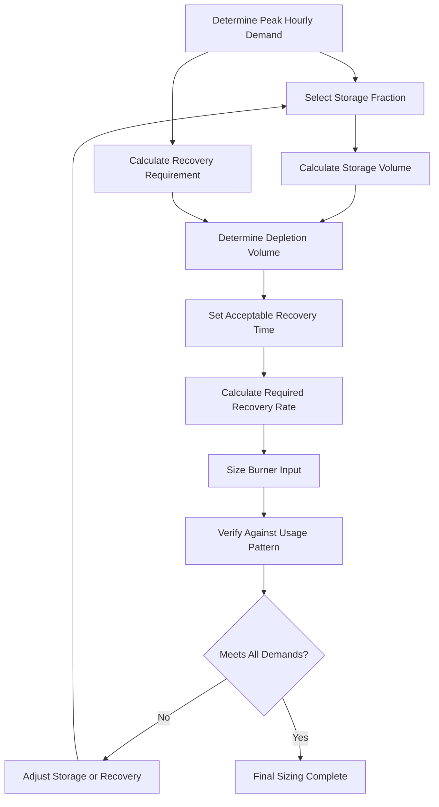
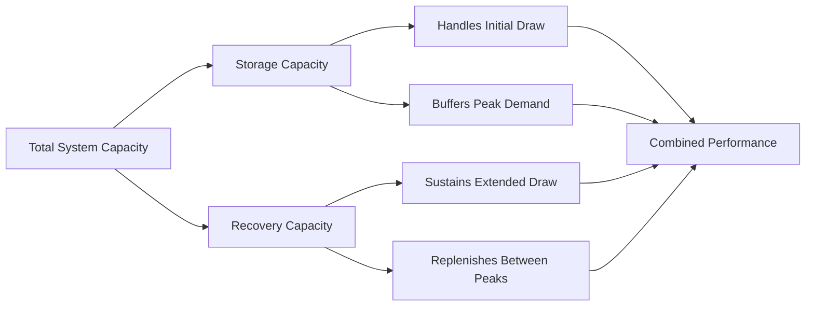

## Recovery Time Method Overview

The recovery time method balances storage capacity against heating rate to meet demand patterns efficiently. This approach sizes water heaters based on the time required to reheat depleted storage volume, ensuring adequate supply during peak usage periods while optimizing equipment capacity.

The method addresses the fundamental relationship between stored hot water volume, burner input capacity, and usage patterns to prevent supply shortfalls during consecutive draw events.

## Fundamental Recovery Equation

The basic recovery rate calculation determines how quickly a water heater can restore temperature:

$$Q_{recovery} = \frac{m \cdot c_p \cdot \Delta T}{t_{recovery}}$$

Where:
- $Q_{recovery}$ = Recovery heating rate (Btu/hr)
- $m$ = Mass of water to heat (lb)
- $c_p$ = Specific heat of water (1.0 Btu/lb·°F)
- $\Delta T$ = Temperature rise (°F)
- $t_{recovery}$ = Allowable recovery time (hr)

Converting to gallons-based calculation:

$$Q_{recovery} = \frac{V_{tank} \cdot 8.33 \cdot \Delta T}{t_{recovery}}$$

Where $V_{tank}$ is the storage volume in gallons.

## Recovery Rate in Gallons Per Hour

The practical recovery rate expression used in sizing:

$$R_{gph} = \frac{Q_{input} \cdot \eta_{recovery}}{8.33 \cdot \Delta T}$$

Where:
- $R_{gph}$ = Recovery rate (gallons/hr)
- $Q_{input}$ = Burner input (Btu/hr)
- $\eta_{recovery}$ = Recovery efficiency (typically 0.70-0.80 for gas, 0.90-0.98 for electric)
- $\Delta T$ = Temperature rise from inlet to setpoint (°F)

## Sizing Methodology

### Step-by-Step Sizing Process

1. **Determine Peak Hour Demand**: Establish maximum hourly hot water consumption from fixture units, occupancy data, or ASHRAE tables.

2. **Select Storage-Recovery Balance**: Choose the percentage of peak demand met by storage versus recovery capacity.

3. **Calculate Storage Volume**:
$$V_{storage} = D_{peak} \cdot f_{storage}$$
Where $f_{storage}$ is the storage fraction (typically 0.25-0.70).

4. **Calculate Recovery Portion**:
$$V_{recovery} = D_{peak} \cdot (1 - f_{storage})$$

5. **Set Recovery Time**: Define acceptable depletion recovery period based on usage intervals.

6. **Calculate Required Recovery Rate**:
$$R_{required} = \frac{V_{storage}}{t_{recovery}} + V_{recovery}$$

7. **Size Burner Input**:
$$Q_{input} = \frac{R_{required} \cdot 8.33 \cdot \Delta T}{\eta_{recovery}}$$

## Typical Recovery Time Standards

| Application Type | Acceptable Recovery Time | Storage Fraction | Recovery Fraction |
|------------------|-------------------------|------------------|-------------------|
| Residential | 2-4 hours | 60-70% | 30-40% |
| Office Building | 1-2 hours | 40-50% | 50-60% |
| Hospital | 0.5-1 hour | 30-40% | 60-70% |
| Restaurant/Kitchen | 0.5-1 hour | 25-35% | 65-75% |
| Hotel/Motel | 2-3 hours | 50-60% | 40-50% |
| Industrial | 1-2 hours | 35-45% | 55-65% |

## Usage Pattern Considerations

The recovery time method requires detailed understanding of demand characteristics:

**Intermittent High-Draw Applications**: Require larger storage with slower recovery (laundries, bathing facilities). Storage fraction 60-70%.

**Continuous Moderate-Draw Applications**: Favor smaller storage with high recovery rates (commercial kitchens, process applications). Storage fraction 25-40%.

**Multiple Peak Periods**: Need sufficient recovery between demand cycles. Recovery time must be less than interval between peaks.

## Storage and Recovery Balance

The optimal balance depends on:

- **Space constraints**: Limited space favors higher recovery, smaller storage
- **Energy source availability**: Gas recovery more economical than large electric storage
- **Demand predictability**: Predictable patterns allow aggressive recovery sizing
- **First-hour rating requirements**: Must meet ASHRAE 90.1 efficiency standards

## Recovery Efficiency Factors

Recovery efficiency varies by heater type and operating conditions:

| Heater Type | Typical Recovery Efficiency | Factors Affecting Efficiency |
|-------------|----------------------------|------------------------------|
| Gas Storage | 70-76% | Flue losses, cycling losses |
| Gas Condensing | 90-96% | Inlet temperature, modulation |
| Electric Storage | 95-98% | Minimal losses, element submersion |
| Heat Pump | 200-300% COP | Ambient conditions, source temperature |
| Indirect (Boiler) | 70-85% | Boiler efficiency, heat exchanger |

## ASHRAE Standards Reference

ASHRAE 90.1 Section 7.4.2 establishes minimum performance requirements:

- Thermal efficiency standards for storage water heaters
- Standby loss limitations based on tank volume
- Recovery efficiency requirements for rated input

ASHRAE Handbook—HVAC Applications Chapter 50 provides:

- Sizing tables for various building types
- Recovery rate calculation procedures
- Storage-recovery ratio recommendations

## Practical Sizing Example

For an office building with 80-gallon peak hour demand, 140°F setpoint, 50°F inlet:

Selecting 45% storage fraction:
- Storage volume: $80 \times 0.45 = 36$ gallons
- Recovery requirement: $80 \times 0.55 = 44$ gph
- With 1.5-hour recovery: $R_{required} = \frac{36}{1.5} + 44 = 68$ gph
- Temperature rise: $\Delta T = 140 - 50 = 90°F$
- For gas heater (75% efficiency): $Q_{input} = \frac{68 \times 8.33 \times 90}{0.75} = 68,326$ Btu/hr

Select 40-gallon tank with 75,000 Btu/hr input, providing 70 gph recovery.

## Critical Considerations

**Recovery Time Selection**: Must account for shortest interval between peak demands. Inadequate recovery time causes sequential shortfalls.

**Temperature Rise Variation**: Inlet water temperature varies seasonally. Size for coldest inlet condition.

**Efficiency Degradation**: Recovery efficiency decreases with scale buildup, improper combustion, and aging. Include safety margin.

**Code Compliance**: Verify sizing meets energy code minimum efficiency requirements while satisfying demand.

The recovery time method provides precise equipment sizing when usage patterns are well-defined, optimizing capital cost and operating efficiency through balanced storage-recovery design.