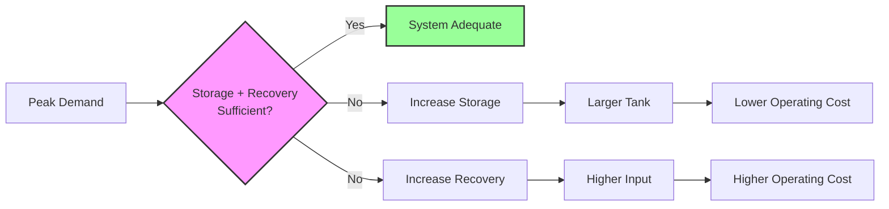
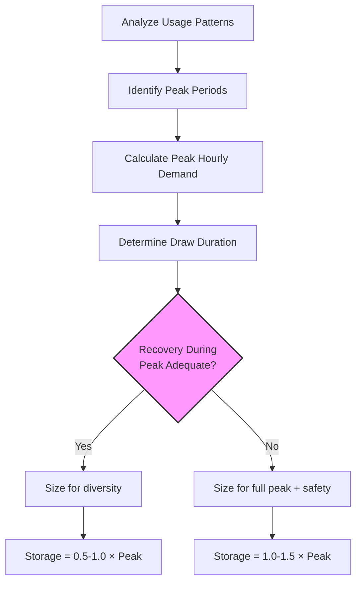

Storage capacity sizing determines the required tank volume to satisfy peak hot water demand while accounting for recovery capability. The fundamental tradeoff balances storage volume against recovery rate—larger storage reduces required recovery capacity, while higher recovery rates permit smaller tanks.

## Storage-Recovery Relationship

The total system capacity equals the sum of usable storage and recovered hot water during the draw period:

$$Q_{total} = V_{usable} \cdot \rho \cdot c_p \cdot (T_{tank} - T_{cold}) + \dot{Q}_{recovery} \cdot t_{draw}$$

Where:
- $Q_{total}$ = total heat delivery capacity (Btu)
- $V_{usable}$ = usable storage volume (gallons)
- $\rho$ = water density (8.33 lb/gal)
- $c_p$ = specific heat of water (1.0 Btu/lb-°F)
- $T_{tank}$ = tank temperature (°F)
- $T_{cold}$ = inlet cold water temperature (°F)
- $\dot{Q}_{recovery}$ = recovery rate (Btu/hr)
- $t_{draw}$ = draw period duration (hours)

## Usable Storage Fraction

Not all tank volume contributes to useful capacity. Thermal stratification and mixing reduce the effective storage:

$$V_{usable} = V_{tank} \cdot F_{mixing}$$

| System Type | Mixing Factor ($F_{mixing}$) | Notes |
|-------------|------------------------------|-------|
| Well-stratified tank | 0.70 - 0.80 | Vertical tank, top draw |
| Standard residential | 0.60 - 0.70 | Typical mixing |
| Poorly stratified | 0.50 - 0.60 | Horizontal tanks, turbulence |
| With recirculation | 0.40 - 0.50 | Continuous mixing |

ASHRAE Handbook—HVAC Applications recommends using 0.70 for typical commercial installations with proper stratification design.

## Peak Demand Coverage

Storage must satisfy peak hourly demand when recovery alone is insufficient:

$$V_{tank} = \frac{V_{peak,hr} - \frac{\dot{Q}_{recovery}}{500 \cdot \Delta T}}{F_{mixing}}$$

Where:
- $V_{peak,hr}$ = peak hourly demand (gallons)
- $\Delta T$ = temperature rise (°F)
- 500 = conversion factor (Btu/hr per gpm per °F rise)

The factor 500 derives from $\rho \cdot c_p \cdot 60 = 8.33 \times 1.0 \times 60 \approx 500$.

## Application-Specific Sizing Requirements

### Commercial Applications

| Application | Peak Draw Duration | Storage/Recovery Ratio | Tank Temperature |
|-------------|-------------------|------------------------|------------------|
| Office buildings | 1-2 hours | 1:1 to 2:1 | 140°F |
| Restaurants | 30-60 minutes | 0.5:1 to 1:1 | 140-160°F |
| Hotels/motels | 2-3 hours | 2:1 to 3:1 | 140°F |
| Hospitals | Continuous | 0.5:1 to 1:1 | 140-180°F |
| Laundries | 1-2 hours | 1:1 to 1.5:1 | 180°F |
| Gymnasiums | 1-2 hours | 1.5:1 to 2:1 | 140°F |
| Schools | 30-45 minutes | 1:1 to 1.5:1 | 140°F |

Storage/Recovery Ratio = (Usable Storage Capacity in Btu/hr) / (Recovery Rate in Btu/hr)

### Draw Pattern Analysis

Understanding demand patterns determines optimal storage sizing:

## Minimum Storage Requirements

For systems with recovery capability, minimum storage prevents short-cycling and ensures stable operation:

$$V_{min} = \frac{\dot{Q}_{input}}{500 \cdot \Delta T} \cdot t_{min,cycle}$$

Where $t_{min,cycle}$ = minimum cycle time (typically 10-15 minutes = 0.17-0.25 hours) to prevent excessive burner or element cycling.

## Safety Factors

Account for uncertainties and future capacity:

$$V_{design} = V_{calculated} \cdot (1 + SF)$$

| Condition | Safety Factor (SF) | Justification |
|-----------|-------------------|---------------|
| Known demand, stable | 0.10 - 0.15 | Minimal uncertainty |
| Estimated demand | 0.15 - 0.20 | Moderate uncertainty |
| Future expansion planned | 0.20 - 0.25 | Growth allowance |
| Critical applications | 0.25 - 0.30 | Redundancy requirement |

## First-Hour Rating

For residential and small commercial systems, manufacturers provide First-Hour Rating (FHR):

$$FHR = V_{tank} \cdot F_{mixing} + \frac{\dot{Q}_{recovery}}{500 \cdot \Delta T}$$

Select equipment where FHR ≥ peak hourly demand. ASHRAE Service Water Heating chapter provides detailed demand tables.

## System Configuration Impact

Configuration affects required storage:

**Single Tank System:**
- Full storage in one vessel
- Simple control
- Higher standby loss per unit volume

**Multiple Tank System:**
- Distributed storage
- Staging capability
- Reduced individual standby loss
- Better diversity factor application

**Storage with Separate Heating:**
- Maximum flexibility
- Optimize each component independently
- Higher initial cost
- Superior performance in variable load applications

## Design Procedure

1. **Determine peak hourly demand** from fixture counts or occupancy-based methods
2. **Select tank temperature** based on application and distribution system requirements
3. **Calculate required recovery rate** from continuous load or reheat time requirements
4. **Apply mixing factor** to determine usable storage fraction
5. **Size tank volume** using storage-recovery relationship
6. **Apply safety factor** for design margin
7. **Verify** minimum cycle time and standby loss acceptability

ASHRAE Handbook—HVAC Applications Chapter 51 (Service Water Heating) provides comprehensive demand data, sizing procedures, and application-specific guidance for all calculation steps.

Storage capacity sizing directly impacts system cost, efficiency, and performance. Proper analysis of demand patterns, recovery capability, and application requirements ensures reliable hot water delivery with optimal equipment investment.