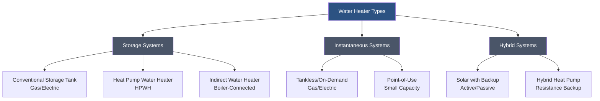

## Overview

Domestic hot water systems represent 14-25% of total building energy consumption in residential and commercial facilities. Selection of the appropriate water heater technology requires analysis of load profiles, energy costs, space constraints, and efficiency requirements. Modern water heater types differ fundamentally in energy source, storage methodology, and thermal efficiency characteristics.

The Department of Energy (DOE) establishes minimum efficiency standards for residential and commercial water heaters, while ASHRAE 90.1 provides additional performance requirements for commercial installations. Understanding the performance metrics and operational characteristics of each technology is essential for proper system specification.

## Water Heater Classification

## Performance Metrics

### Energy Factor and Thermal Efficiency

The energy factor (EF) quantifies overall water heater efficiency including standby losses:

$$\text{EF} = \frac{Q_{\text{delivered}}}{Q_{\text{input}}} = \frac{m \cdot c_p \cdot \Delta T}{E_{\text{consumed}}}$$

Where:
- $Q_{\text{delivered}}$ = useful energy delivered to water (Btu)
- $Q_{\text{input}}$ = total energy input (Btu)
- $m$ = mass of water heated (lb)
- $c_p$ = specific heat of water (1.0 Btu/lb·°F)
- $\Delta T$ = temperature rise (°F)
- $E_{\text{consumed}}$ = electrical or fuel energy consumed (Btu)

The Uniform Energy Factor (UEF) replaced EF in 2017, providing more realistic testing conditions based on actual usage patterns. UEF accounts for cycling losses and standby heat loss with improved accuracy.

### First Hour Rating

First Hour Rating (FHR) indicates the maximum volume of hot water deliverable in one hour starting with a full tank:

$$\text{FHR} = V_{\text{tank}} + (R_{\text{recovery}} \times 1 \text{ hr})$$

Where:
- $V_{\text{tank}}$ = storage tank volume (gallons)
- $R_{\text{recovery}}$ = recovery rate (gallons/hour)

Recovery rate depends on input power and temperature rise:

$$R_{\text{recovery}} = \frac{\dot{Q}_{\text{input}} \times \eta_{\text{thermal}}}{8.33 \times \Delta T}$$

Where:
- $\dot{Q}_{\text{input}}$ = burner or element input rate (Btu/hr)
- $\eta_{\text{thermal}}$ = combustion or element efficiency
- 8.33 = weight of one gallon of water (lb/gal)

## Water Heater Type Comparison

| Type | Energy Factor (UEF) | Recovery Rate | Installed Cost | Operating Cost | Best Application | Lifespan |
|------|---------------------|---------------|----------------|----------------|------------------|----------|
| **Gas Storage Tank** | 0.59-0.70 | 40-50 gal/hr | Low ($800-1,500) | Medium | High demand, low electric cost | 8-12 years |
| **Electric Storage Tank** | 0.90-0.95 | 18-25 gal/hr | Low ($500-1,200) | High | Low demand, electric-only | 10-15 years |
| **Tankless Gas** | 0.82-0.96 | Unlimited* | High ($1,500-3,000) | Low-Medium | Variable demand, space limited | 20+ years |
| **Tankless Electric** | 0.95-0.99 | Unlimited* | Medium ($800-1,800) | Medium-High | Point-of-use, small loads | 20+ years |
| **Heat Pump (HPWH)** | 2.0-3.5 | 15-20 gal/hr | High ($1,800-3,500) | Very Low | Moderate climate, adequate space | 10-15 years |
| **Indirect (Boiler)** | 0.70-0.85 | 40-100 gal/hr | Medium ($1,200-2,500) | Low-Medium | Existing boiler, hydronic systems | 20-30 years |
| **Solar + Backup** | 1.5-3.0 | Varies | Very High ($4,000-8,000) | Very Low | High solar resource, incentives | 20+ years |

*Subject to flow rate limitations and temperature rise requirements

## Technology-Specific Considerations

### Storage Tank Water Heaters

Conventional storage tanks maintain a reservoir of hot water with continuous standby losses. Thermal efficiency for gas units:

$$\eta_{\text{thermal}} = \frac{Q_{\text{water}}}{Q_{\text{fuel}}} = \frac{m \cdot c_p \cdot \Delta T}{\dot{m}_{\text{fuel}} \times \text{HHV}}$$

DOE minimum standards (effective 2015):
- Gas storage ≥55 gal: UEF ≥ 0.64 (residential)
- Electric storage ≥55 gal: UEF ≥ 0.93 (residential)

Standby heat loss coefficient must not exceed 0.84% per hour for gas units under DOE regulations.

### Tankless Water Heaters

Tankless units eliminate standby losses but require high instantaneous input rates. Minimum input capacity:

$$\dot{Q}_{\text{required}} = \frac{\dot{V} \times 8.33 \times \Delta T \times 60}{\eta_{\text{thermal}}}$$

Where:
- $\dot{V}$ = flow rate (gallons per minute)
- 60 = conversion factor (min/hr)

For a 2.5 GPM shower with 70°F rise at 0.85 efficiency:

$$\dot{Q}_{\text{required}} = \frac{2.5 \times 8.33 \times 70 \times 60}{0.85} = 87,353 \text{ Btu/hr}$$

ASHRAE 90.1-2019 requires UEF ≥ 0.81 for gas tankless units <2,000 Btu/hr·gal capacity.

### Heat Pump Water Heaters

HPWHs achieve coefficient of performance (COP) values of 2.0-3.5 by extracting heat from ambient air:

$$\text{COP} = \frac{Q_{\text{delivered}}}{W_{\text{compressor}} + W_{\text{fans}}}$$

Heat removed from surrounding space:

$$Q_{\text{cooling}} = Q_{\text{delivered}} \times \left(1 - \frac{1}{\text{COP}}\right)$$

This cooling effect benefits in warm climates but increases heating loads in cold climates. Minimum ambient temperature for operation typically ranges from 37-45°F depending on manufacturer.

DOE standards require UEF ≥ 2.0 for residential electric HPWHs ≥55 gallons.

### Indirect Water Heaters

Indirect water heaters use a heat exchanger submerged in a storage tank, with hot water or steam from a boiler circulating through the coil. System efficiency:

$$\eta_{\text{system}} = \eta_{\text{boiler}} \times \eta_{\text{HX}} \times \left(1 - L_{\text{standby}}\right)$$

Where:
- $\eta_{\text{boiler}}$ = boiler seasonal efficiency
- $\eta_{\text{HX}}$ = heat exchanger effectiveness (0.85-0.95)
- $L_{\text{standby}}$ = fractional standby loss

High-efficiency boilers (AFUE > 90%) coupled with well-insulated storage tanks achieve system efficiencies of 0.75-0.85.

### Solar Water Heating Systems

Solar fraction (SF) represents the percentage of annual hot water load provided by solar:

$$\text{SF} = \frac{Q_{\text{solar}}}{Q_{\text{total demand}}}$$

Active systems use pumps and controllers to circulate heat transfer fluid through collectors. Passive systems rely on thermosiphon or integral collector-storage (ICS) designs. Backup heating (electric, gas, or heat pump) provides supplemental capacity during low solar availability.

System sizing requires local solar radiation data, collector efficiency curves, and load profiles. Well-designed systems achieve SF of 50-80% in suitable climates.

## Selection Criteria

### Load Profile Analysis

Water heater selection begins with characterizing the hot water demand:

1. **Peak demand period** - maximum simultaneous fixture flow
2. **Daily consumption** - total gallons per day
3. **Usage pattern** - frequency and duration of draw events
4. **Recovery time requirements** - time between major draw events

Storage capacity should meet peak demands while input capacity handles recovery requirements between events.

### Energy Cost Analysis

Life-cycle cost analysis compares total ownership costs:

$$\text{LCC} = C_{\text{initial}} + \sum_{t=1}^{n} \frac{C_{\text{energy,t}} + C_{\text{maint,t}}}{(1+r)^t}$$

Where:
- $C_{\text{initial}}$ = installed equipment cost
- $C_{\text{energy,t}}$ = annual energy cost in year $t$
- $C_{\text{maint,t}}$ = annual maintenance cost in year $t$
- $r$ = discount rate
- $n$ = analysis period (years)

High-efficiency technologies with greater initial costs often achieve lower LCC through reduced operating expenses.

### Code Compliance

ASHRAE 90.1-2019 establishes minimum performance requirements for commercial water heaters:
- Storage water heaters: Based on storage volume and input capacity
- Instantaneous water heaters: UEF or thermal efficiency thresholds
- Heat pump water heaters: COP requirements
- Unfired storage tanks: Maximum UA values (Btu/hr·°F)

The International Energy Conservation Code (IECC) adopts similar standards for residential applications.

## Conclusion

Water heater technology selection requires balancing efficiency, capacity, installation constraints, and operating costs. Storage tank systems provide simple, low-cost solutions for consistent loads. Tankless units excel in space-constrained applications with variable demand. Heat pump water heaters achieve the highest efficiency in moderate climates. Indirect systems integrate effectively with hydronic heating. Solar thermal systems maximize renewable energy utilization where climate and economics align.

Proper sizing using FHR calculations, verification of code compliance with DOE and ASHRAE standards, and life-cycle cost analysis ensure optimal system performance and energy efficiency.
