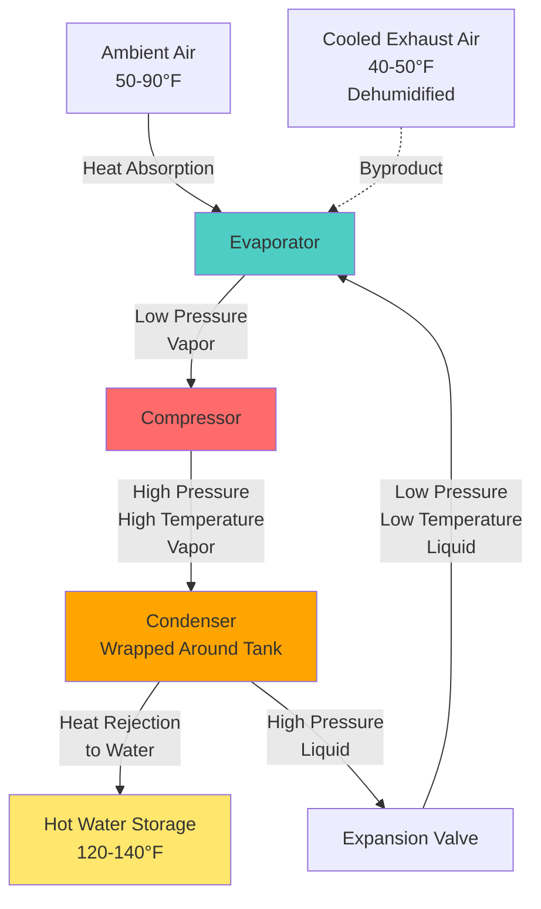

## Overview

Heat pump water heaters (HPWH) represent the most energy-efficient electric water heating technology available, utilizing vapor-compression refrigeration to extract thermal energy from ambient air and transfer it to domestic hot water. Unlike resistance electric heaters that convert electrical energy to heat at a theoretical maximum efficiency of 100%, HPWHs move heat from one location to another, achieving coefficient of performance (COP) values typically ranging from 2.0 to 4.0.

The fundamental operating principle involves a refrigeration cycle where a compressor, evaporator, condenser, and expansion device work in concert to absorb heat from surrounding air and reject it to water storage. This process provides the secondary benefit of dehumidifying and cooling the space where the unit operates, which can reduce cooling loads in warm climates but may increase heating loads in cold climates.

## Thermodynamic Performance

The coefficient of performance quantifies HPWH efficiency as the ratio of useful heat delivered to electrical energy consumed:

$$COP = \frac{Q_H}{W_{input}}$$

Where:
- $Q_H$ = heat delivered to water (Btu/hr or kW)
- $W_{input}$ = electrical power input to compressor and fans (Btu/hr or kW)

The Uniform Energy Factor (UEF) provides a standardized metric under DOE test procedures. Current Energy Star Version 4.0 specifications require:
- UEF ≥ 3.75 for 50-55 gallon residential HPWHs
- UEF ≥ 3.55 for 65-80 gallon units

Actual COP varies with ambient air temperature, inlet water temperature, and outlet water setpoint:

$$COP_{actual} = COP_{rated} \times \left(1 + k \cdot \frac{T_{amb} - T_{rated}}{T_{rated}}\right)$$

Where $k$ represents the temperature sensitivity coefficient (typically 0.015-0.025 for HPWHs). Performance degrades at ambient temperatures below 45°F and above 95°F.

## Refrigeration Cycle for Water Heating

The refrigeration cycle extracts sensible and latent heat from ambient air at the evaporator (typically 500-800 CFM airflow), compresses the refrigerant to elevate temperature and pressure, then rejects heat through a condenser coil wrapped around or immersed in the storage tank. The expansion valve throttles high-pressure liquid refrigerant back to evaporator conditions, completing the cycle.

## System Configurations

| Configuration | Description | Advantages | Disadvantages | Typical Applications |
|---------------|-------------|------------|---------------|---------------------|
| **Integrated Unit** | Self-contained tank with heat pump mounted on top | Simple installation, single equipment piece, compact footprint | Limited placement flexibility, requires adequate room air volume | Residential replacements, mechanical rooms, conditioned spaces |
| **Split System** | Remote heat pump connected to separate storage tank | Flexible placement, heat pump in unconditioned space, quieter | Higher installation cost, refrigerant line set required, potential leak points | Commercial applications, retrofit installations, tight mechanical rooms |
| **Ducted Configuration** | Intake/exhaust ducts for remote air source | Can utilize outdoor air or remote spaces, reduced impact on conditioned space | Additional duct installation cost, increased static pressure reduces efficiency | Garages, unconditioned basements, crawl spaces |
| **Non-Ducted** | Unit draws from and exhausts to surrounding space | Lowest installation cost, maximum efficiency (no duct losses) | Must be located in adequate space, affects room temperature/humidity | Conditioned basements, utility rooms with adequate volume |

## Ambient Air Requirements

HPWHs require adequate air volume for heat extraction without excessive temperature depression:

$$V_{min} = \frac{Q_{capacity} \times 3.41}{CFM \times 1.08 \times \Delta T_{allowable}}$$

For a typical residential 50-gallon HPWH with 4,000 Btu/hr (heat pump mode) capacity and 500 CFM airflow:

$$V_{min} = \frac{4,000 \times 3.41}{500 \times 1.08 \times 10} \approx 2,520 \text{ ft}^3$$

DOE standards require minimum 700 ft³ of surrounding air volume for non-ducted installations. Inadequate air volume causes rapid temperature drop, cycling on backup resistance elements, and degraded efficiency.

## Cold Climate Operation

HPWH performance declines significantly below 45°F ambient temperature. At 40°F, COP typically drops to 1.8-2.2, and below 35°F many units cannot operate in heat pump mode, defaulting to resistance backup heating. Cold climate strategies include:

- **Ducted intake from conditioned space**: Maintains higher evaporator temperatures but increases space heating load
- **Exhaust heat recovery**: Capture cooled exhaust air for cooling or dehumidification benefit
- **Hybrid operation**: Program unit to use resistance elements during coldest months
- **Strategic placement**: Install in spaces with waste heat (mechanical rooms, near appliances)

The annual energy consumption in heating-dominated climates must account for the interaction between HPWH cooling effect and increased space heating:

$$E_{total} = E_{HPWH} + \frac{Q_{cooling} \times HDD \times 24}{\eta_{heating} \times 10^6}$$

Where HDD represents heating degree days and $\eta_{heating}$ is the space heating system efficiency.

## Dehumidification Benefit

HPWHs provide substantial latent cooling, removing approximately 2-4 pints of moisture per hour during operation. In humid climates, this dehumidification offers value beyond water heating:

$$Q_{latent} = CFM \times 0.68 \times \Delta W \times h_{fg}$$

Where $\Delta W$ is the humidity ratio change (lb water/lb dry air) and $h_{fg}$ = 1,060 Btu/lb. For typical operation removing 3 pints/hr, latent cooling approximates 800-1,000 Btu/hr, which can offset 25-30% of the total cooling energy extracted from the air.

## Design Considerations

**Installation Requirements:**
- Minimum clearances for airflow (typically 12" front, 6" sides)
- Floor drain or condensate removal for moisture collection
- Electrical service: 30A circuit for units with resistance backup
- Acoustic considerations: 49-55 dBA typical sound levels

**Capacity Sizing:**
Recovery capacity combines heat pump output with tank volume. First-hour rating (FHR) must exceed peak demand. For residences:

$$FHR_{required} = N_{bedrooms} \times 30 + 10 \text{ gallons}$$

**Controls and Operating Modes:**
- Heat pump only: Maximum efficiency, slower recovery
- Hybrid/auto: Balances efficiency and recovery speed
- Electric/resistance: Backup for high demand or cold conditions
- Vacation: Maintains minimum temperature

**Maintenance:**
- Annual air filter cleaning/replacement
- Condensate drain verification
- Anode rod inspection (tank corrosion protection)
- Refrigerant charge verification (split systems)

## Regulatory Standards

Current DOE regulations (10 CFR 430) establish minimum efficiency standards effective April 2015. Energy Star certification requires performance exceeding federal minimums by 15-20%, ensuring UEF values above 3.5 for most residential sizes. Local utility rebates and federal tax credits (up to $2,000 under Inflation Reduction Act provisions through 2032) incentivize HPWH adoption as part of building decarbonization strategies.
