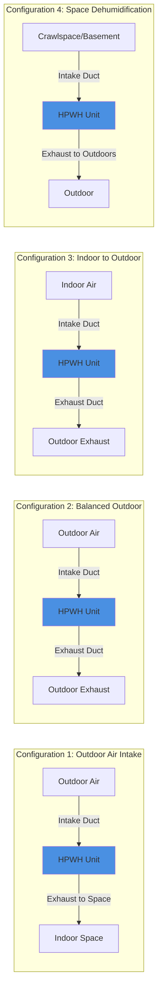

## Overview

Ducted heat pump water heater (HPWH) installations extend the air source and discharge points away from the unit itself, enabling flexible placement in confined spaces, conditioned areas, or locations where local air exchange is undesirable. Ducting allows the unit to draw air from outdoors, adjacent spaces, or ventilated areas while exhausting cooled, dehumidified air to appropriate discharge locations. Proper duct design is critical to maintain airflow rates, minimize static pressure losses, and preserve system efficiency.

## Duct Sizing Fundamentals

Heat pump water heaters typically move 200-500 CFM depending on capacity and manufacturer. Undersized ducts increase static pressure, reduce airflow, decrease COP, and may trigger fault codes.

### Airflow Requirements

Manufacturer specifications define required airflow at the evaporator coil. Common residential units operate at:

| Unit Capacity | Typical Airflow | Recommended Duct Diameter |
|---------------|-----------------|---------------------------|
| 50-gallon | 200-250 CFM | 6-7 inch |
| 65-80 gallon | 250-350 CFM | 7-8 inch |
| Commercial (>80 gal) | 350-500 CFM | 8-10 inch |

### Static Pressure Calculations

Maximum allowable external static pressure ranges from 0.1 to 0.3 inches water column (in. w.c.) for most residential HPWHs. Total static pressure is the sum of friction losses and fitting losses:

$$
\Delta P_{\text{total}} = \Delta P_{\text{friction}} + \Delta P_{\text{fittings}}
$$

Friction loss per 100 feet of straight duct:

$$
\Delta P_{\text{friction}} = f \cdot \frac{L}{D} \cdot \frac{\rho V^2}{2} \cdot \frac{1}{12}
$$

Where:
- $f$ = friction factor (dimensionless, typically 0.02-0.03 for smooth ducts)
- $L$ = duct length (ft)
- $D$ = duct diameter (ft)
- $\rho$ = air density (0.075 lb/ft³ at standard conditions)
- $V$ = air velocity (ft/min)

For practical sizing, limit duct velocity to 800-1000 ft/min on intake and 1000-1200 ft/min on discharge to minimize noise and pressure drop.

### Fitting Losses

Each elbow, transition, or termination adds equivalent length:

| Fitting Type | Equivalent Length (diameters) |
|--------------|-------------------------------|
| 90° elbow | 30-40 D |
| 45° elbow | 15-20 D |
| Tee branch | 60-80 D |
| Wall cap/hood | 20-30 D |
| Transition (abrupt) | 10-15 D |

Minimize fittings and use long-radius elbows where possible. A ducted system with two 90° elbows and a wall cap on 20 feet of 7-inch duct adds approximately 0.15-0.25 in. w.c. static pressure.

## Ducting Configurations

## Duct Routing Options Comparison

| Configuration | Advantages | Disadvantages | Best Applications |
|---------------|------------|---------------|-------------------|
| **Outdoor intake, indoor exhaust** | Prevents conditioning load; simple exhaust | Requires proper intake termination; freeze protection in cold climates | Mechanical rooms in hot climates; spaces where cooling is undesirable |
| **Balanced outdoor** | No impact on building load; year-round operation | Highest duct complexity; two penetrations; maximum pressure drop | Conditioned spaces; noise-sensitive areas; tight building envelopes |
| **Indoor intake, outdoor exhaust** | Provides space cooling and dehumidification | Increases heating load in winter; requires outdoor exhaust | Unconditioned basements; mechanical rooms; hot climates |
| **Targeted space dehumidification** | Dual-purpose: hot water + moisture control | Must ensure adequate air volume in source space | Crawlspaces; basements; enclosed garages |

## Outdoor Air Connection Requirements

When drawing outdoor air, ensure:

1. **Intake termination**: Install screened hood or wall cap with minimum 1/4-inch mesh to prevent debris and pest entry. Position intake to avoid recirculation of exhaust air.

2. **Condensate drainage**: Outdoor air in humid climates may produce additional condensate at the air filter or intake transition. Provide drainage or slope ducts toward the unit.

3. **Freeze protection**: In climates with extended periods below 40°F, insulate intake ducts and verify manufacturer's minimum operating temperature. Some units include intake dampers that close during standby to prevent cold air infiltration.

4. **Clearances**: Maintain 12-inch minimum clearance from grade, 24 inches from property lines, and 36 inches from mechanical exhaust or combustion air intakes per manufacturer guidelines and local codes.

## Noise Attenuation Strategies

HPWH fans generate 45-55 dBA at 3 feet. Ducted installations can amplify or transmit noise through rigid duct paths.

### Noise Reduction Techniques

- **Flexible duct sections**: Install 3-5 feet of insulated flex duct between the unit and rigid ductwork to decouple vibration transmission.

- **Duct lining**: Line first 10 feet of rigid duct with 1-inch fiberglass duct liner (25-50% noise reduction in 250-1000 Hz range).

- **Silencers**: Insert cylindrical silencers (12-24 inches long) in discharge ducts for critical applications. Adds 0.05-0.10 in. w.c. static pressure.

- **Avoid direct connections**: Never connect intake or exhaust directly to living spaces without attenuation. Route through mechanical rooms or buffer spaces.

## Installation Best Practices

1. **Support ducts independently**: Do not allow duct weight to bear on HPWH casing. Use strapping every 5 feet for horizontal runs.

2. **Seal all joints**: Use mastic or UL 181-rated foil tape. Leaks reduce airflow and efficiency.

3. **Insulate as required**: Insulate outdoor ducts and any ducts passing through unconditioned spaces to R-6 minimum to prevent condensation and heat loss.

4. **Verify airflow**: After installation, measure static pressure at the unit and confirm it remains below manufacturer limits. Adjust duct sizing if needed.

5. **Provide service access**: Ensure air filters remain accessible. Ducted units still require filter cleaning every 1-3 months depending on dust levels.

## Manufacturer Guidelines and Standards

Refer to:
- **Manufacturer installation manuals**: Specific duct size tables, maximum duct length, and maximum fitting quantities.
- **ASHRAE 90.2**: Prescriptive requirements for residential HVAC duct systems applicable to HPWH ducting.
- **ACCA Manual D**: Duct design principles for low-pressure residential systems.
- **IMC Section 504**: Mechanical ventilation and exhaust systems.

Ducted HPWH installations significantly expand application possibilities but require careful attention to airflow, static pressure, and acoustic design to maintain efficiency and occupant comfort.
