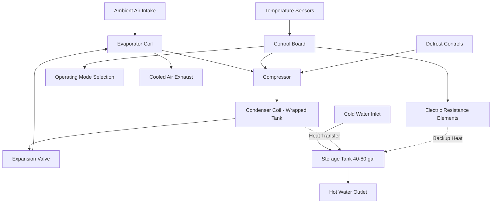

## System Overview

Integrated heat pump water heaters (HPWH) combine a vapor-compression refrigeration cycle with a storage tank in a single factory-assembled unit. The heat pump module mounts directly atop or alongside a storage tank, extracting thermal energy from ambient air to heat water while simultaneously cooling and dehumidifying the surrounding space.

These systems achieve thermal efficiencies 2 to 3 times higher than conventional electric resistance water heaters by leveraging the refrigeration cycle to move heat rather than generate it through electrical resistance. Standard integrated units range from 40 to 80 gallons with heat pump capacities of 1,500 to 4,500 BTU/hr.

## Thermodynamic Performance

### Coefficient of Performance

The COP quantifies the heat pump's thermal efficiency as the ratio of useful heating output to electrical energy input:

$$\text{COP} = \frac{Q_{\text{heating}}}{W_{\text{compressor}} + W_{\text{fan}}}$$

Where:
- $Q_{\text{heating}}$ = heat delivered to water (BTU/hr)
- $W_{\text{compressor}}$ = compressor electrical input (BTU/hr)
- $W_{\text{fan}}$ = evaporator fan electrical input (BTU/hr)

Integrated HPWH systems achieve COP values of 2.0 to 4.0 depending on ambient conditions, with peak performance at 70°F ambient temperature and 50% relative humidity. COP decreases at lower ambient temperatures due to reduced refrigerant evaporating pressure and increased compressor work.

### Uniform Energy Factor

The DOE Uniform Energy Factor (UEF) standardizes efficiency measurement across varying draw patterns:

$$\text{UEF} = \frac{\sum{Q_{\text{delivered}}}}{\sum{E_{\text{input}}}}$$

Energy Star certified integrated HPWH units must achieve UEF ≥ 3.0, representing 200% improvement over minimum code-compliant electric resistance water heaters (UEF ≈ 0.95).

## System Components

### Primary Components

| Component | Function | Specifications |
|-----------|----------|----------------|
| Compressor | Refrigerant compression | 0.25 - 0.75 HP rotary or reciprocating |
| Evaporator | Heat absorption from air | Finned tube, 150 - 400 CFM airflow |
| Condenser | Heat rejection to water | Wrapped or immersed coil, 4,500 - 18,000 BTU/hr |
| Expansion Device | Refrigerant pressure reduction | Capillary tube or TXV |
| Storage Tank | Thermal storage | 40 - 80 gallons, 2" foam insulation |
| Backup Elements | Supplemental heating | 3.8 - 4.5 kW electric resistance |
| Control Board | Mode selection & safety | Microprocessor with multiple sensors |

## Operating Modes

Integrated HPWH units provide multiple operating modes to balance efficiency, recovery speed, and application requirements:

1. **Heat Pump Only (Economy Mode)** - Maximum efficiency operation using only the heat pump compressor. COP = 2.5 - 4.0, recovery time 4 - 8 hours for full tank.

2. **Hybrid Mode (Auto)** - Automatic selection between heat pump and electric resistance based on demand patterns. Engages backup elements during high draw events.

3. **Electric Resistance Only (High Demand)** - Bypasses heat pump for fastest recovery. Used during peak demand periods or cold ambient conditions below 40°F.

4. **Vacation Mode** - Maintains minimum setpoint (50 - 60°F) to prevent freezing while minimizing energy consumption.

## Capacity and Sizing

### First Hour Rating Calculation

$$\text{FHR} = \frac{Q_{\text{HP}} + Q_{\text{ER}}}{1,000} \times 1\text{ hr} + V_{\text{tank}} \times 0.7$$

Where:
- FHR = First Hour Rating (gallons)
- $Q_{\text{HP}}$ = Heat pump capacity (BTU/hr)
- $Q_{\text{ER}}$ = Electric resistance capacity (BTU/hr) if active
- $V_{\text{tank}}$ = Tank volume (gallons)
- 0.7 = usable fraction of stored hot water

| Tank Size | Heat Pump Capacity | FHR (HP Only) | FHR (Hybrid) | UEF | Applications |
|-----------|-------------------|---------------|--------------|-----|--------------|
| 40 gal | 1,500 - 2,000 BTU/hr | 45 - 50 gal | 55 - 65 gal | 3.0 - 3.5 | 1-2 occupants |
| 50 gal | 2,000 - 2,500 BTU/hr | 52 - 58 gal | 65 - 75 gal | 3.2 - 3.7 | 2-3 occupants |
| 65 gal | 2,500 - 3,500 BTU/hr | 60 - 68 gal | 75 - 88 gal | 3.3 - 3.8 | 3-4 occupants |
| 80 gal | 3,500 - 4,500 BTU/hr | 72 - 82 gal | 90 - 105 gal | 3.4 - 4.0 | 4-6 occupants |

## Installation Requirements

### Space Requirements

Integrated HPWH units require minimum clearances for proper airflow and serviceability:

- **Minimum Air Volume**: 700 - 1,000 ft³ unconfined space
- **Ceiling Height**: 7 - 8 ft minimum for top-mounted heat pump
- **Service Clearance**: 18 - 24 inches on access panel side
- **Airflow Clearance**: 6 - 12 inches around air intake/exhaust

Inadequate space volume causes rapid ambient temperature depression, reducing COP and potentially triggering low-temperature cutouts (typically 37 - 40°F).

### Acoustic Considerations

Heat pump operation generates sound from compressor and evaporator fan:

- **Sound Pressure Level**: 49 - 65 dBA at 3 feet
- **Frequency Content**: Broadband with tonal components at compressor frequency (60 Hz fundamental)
- **Mitigation Strategies**: Locate away from bedrooms, install on vibration isolation pads, ensure adequate clearances

Noise levels exceed those of electric resistance water heaters (< 35 dBA) but remain below typical HVAC equipment (55 - 75 dBA).

## Refrigerant Systems

Modern integrated HPWH units employ environmentally responsible refrigerants:

| Refrigerant | Type | GWP | Operating Pressure | Applications |
|-------------|------|-----|-------------------|--------------|
| R-134a | HFC | 1,430 | Low (70 - 150 psig evap) | Legacy systems |
| R-744 (CO₂) | Natural | 1 | Transcritical (900 - 1,400 psig) | Premium efficiency units |
| R-1234yf | HFO | 4 | Low (70 - 150 psig evap) | Current production |
| R-290 (Propane) | Natural | 3 | Low (50 - 130 psig evap) | Emerging residential |

R-744 (CO₂) systems achieve highest COP values (3.5 - 4.5) due to superior heat transfer properties but require specialized high-pressure components and controls.

## Performance Standards

### Energy Star Certification Requirements

- **UEF ≥ 3.0** for integrated electric HPWH
- **First Hour Rating ≥ 50 gallons** for standard residential applications
- **Maximum Standby Loss**: 135 watts for 50-gallon units
- **Sound Rating**: Disclosed per AHRI Standard 1160

### DOE Test Procedures

24-hour simulated use test per 10 CFR 430, Subpart B, Appendix E evaluating:
- Energy consumption across draw patterns
- Standby heat loss
- Recovery efficiency
- First hour rating verification

## Advantages and Limitations

### System Benefits

- 50 - 70% reduction in water heating energy compared to electric resistance
- Annual dehumidification removal of 400 - 600 pints in heat pump mode
- Space cooling benefit of 1,500 - 4,500 BTU/hr during operation
- Lower lifecycle cost despite 2 - 3× higher initial equipment cost

### Design Constraints

- Ambient temperature dependency (optimal 50 - 90°F, cutout below 37 - 40°F)
- Longer recovery time (4 - 8 hours vs 1 - 2 hours electric resistance)
- Higher noise generation requiring acoustic planning
- Larger physical footprint (66 - 84 inches height typical)
- Condensate drainage requirement (2 - 4 gallons/day)

## Application Guidelines

Integrated HPWH systems achieve optimal performance in conditioned or semi-conditioned spaces (basements, mechanical rooms, garages) with stable ambient temperatures above 50°F. Installations in unconditioned spaces require hybrid mode operation or electric resistance backup during winter months.

Select integrated configurations for new construction and retrofit applications where space constraints preclude split systems but adequate installation volume exists. For mechanical rooms serving multiple functions, account for the cooling effect when sizing space conditioning equipment.

Verify local code requirements for temperature and pressure relief valve discharge piping, condensate drainage routing, and electrical service capacity (typically 30-amp 240V circuit for hybrid operation).
