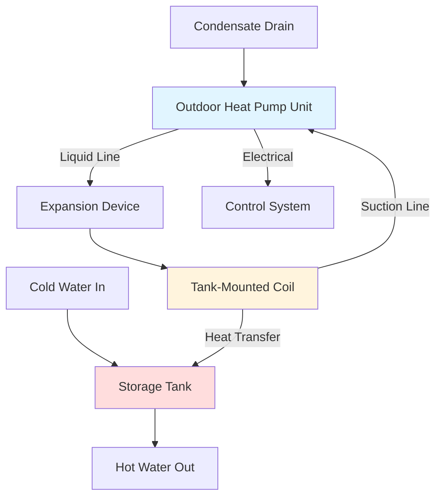

## Overview

Split system heat pump water heaters (HPWH) separate the heat pump evaporator/compressor unit from the storage tank, connected by refrigerant lines. This configuration provides installation flexibility, noise isolation, and access to outdoor air as a heat source, making split HPWHs particularly advantageous in cold climate applications and space-constrained mechanical rooms.

## System Configuration

The split HPWH consists of:

- **Outdoor Unit**: Evaporator coil, compressor, expansion device, controls
- **Storage Tank**: Insulated tank with refrigerant-to-water heat exchanger (wrap-around or immersed coil)
- **Refrigerant Lines**: Liquid and suction lines connecting outdoor unit to tank coil
- **Control System**: Manages compressor operation, defrost cycles, backup heating

## Refrigerant Line Sizing

Proper refrigerant line sizing ensures adequate refrigerant mass flow while minimizing pressure drop. The pressure drop in the suction line directly impacts system capacity and efficiency.

**Suction Line Pressure Drop:**

$$\Delta P_{\text{suction}} = f \cdot \frac{L}{D} \cdot \frac{\rho v^2}{2} + \Delta P_{\text{fittings}}$$

Where:
- $\Delta P_{\text{suction}}$ = pressure drop in suction line (Pa)
- $f$ = friction factor (0.015-0.025 for refrigerant lines)
- $L$ = equivalent line length including fittings (m)
- $D$ = inner diameter (m)
- $\rho$ = refrigerant vapor density (kg/m³)
- $v$ = refrigerant velocity (m/s)

**Maximum Recommended Pressure Drop:**
- Suction line: 1-2°C saturation temperature equivalent (approximately 15-30 kPa for R-134a)
- Liquid line: 0.5°C saturation temperature equivalent

**Capacity Impact from Line Losses:**

The effective heating capacity delivered to the tank accounting for refrigerant line losses:

$$Q_{\text{net}} = Q_{\text{rated}} \cdot \left(1 - \frac{\Delta P_{\text{suction}}}{P_{\text{evap}}}\right) - Q_{\text{line,loss}}$$

Where:
- $Q_{\text{net}}$ = net heating capacity at tank (W)
- $Q_{\text{rated}}$ = rated outdoor unit capacity (W)
- $P_{\text{evap}}$ = evaporator pressure (kPa)
- $Q_{\text{line,loss}}$ = heat loss from refrigerant lines (W)

## Installation Requirements

### Refrigerant Line Length Limits

| System Capacity | Maximum Line Length | Vertical Rise Limit | Refrigerant Charge Adjustment |
|----------------|---------------------|---------------------|-------------------------------|
| 2-3 kW (6,800-10,200 BTU/h) | 15 m (50 ft) | 7.5 m (25 ft) | Add 15 g/m beyond 7.5 m |
| 3-4.5 kW (10,200-15,300 BTU/h) | 25 m (80 ft) | 10 m (33 ft) | Add 20 g/m beyond 10 m |
| 4.5-6 kW (15,300-20,500 BTU/h) | 30 m (100 ft) | 15 m (50 ft) | Add 25 g/m beyond 15 m |

### Outdoor Unit Placement

**Clearance Requirements:**
- Minimum 305 mm (12 in) clearance on air intake side
- Minimum 610 mm (24 in) service clearance on front panel
- Elevated 152-305 mm (6-12 in) above grade for drainage and snow management
- Avoid placement under roof eaves where ice accumulation occurs

**Cold Climate Considerations:**
- Install drain pan heater for ambient temperatures below -10°C (14°F)
- Ensure adequate airflow around outdoor coil (minimum 1.5 m/s face velocity)
- Position away from prevailing winter winds if possible
- Consider snow shield or elevated platform in heavy snow regions

### Refrigerant Line Installation

**Insulation Requirements:**
- Suction line: Minimum 19 mm (3/4 in) closed-cell elastomeric insulation, R-4 minimum
- Liquid line: Minimum 9.5 mm (3/8 in) insulation in unconditioned spaces
- Use vapor barrier rated for -40°C to prevent moisture infiltration
- Support lines every 1.5-2 m (5-6.5 ft) to prevent sagging

**Line Routing Best Practices:**
- Minimize horizontal runs; pitch suction line toward outdoor unit for oil return
- Avoid traps that accumulate oil; use inverted P-traps only where necessary
- Install vibration isolators at outdoor unit connections
- Protect lines in UV-resistant conduit if exposed to sunlight

## Performance Characteristics

### Cold Climate Operation

Split HPWHs maintain heating capacity at low ambient temperatures superior to integrated units drawing indoor air:

**Typical COP vs. Ambient Temperature (Hot Water Output 55°C):**

| Ambient Temperature | COP (R-134a) | COP (R-410A) | Heating Capacity Retention |
|---------------------|--------------|--------------|----------------------------|
| 7°C (45°F) | 3.5-4.0 | 3.8-4.2 | 100% |
| 0°C (32°F) | 2.8-3.2 | 3.0-3.5 | 85-90% |
| -7°C (20°F) | 2.2-2.6 | 2.4-2.8 | 70-75% |
| -15°C (5°F) | 1.8-2.1 | 2.0-2.3 | 55-65% |

**Defrost Cycle Impact:**
Below 5°C (41°F) with high relative humidity, defrost cycles occur every 45-90 minutes, reducing effective COP by 5-15%.

### Energy Factor Calculation

The Uniform Energy Factor (UEF) for split HPWHs accounts for standby losses from both tank and refrigerant lines:

$$\text{UEF} = \frac{Q_{\text{delivered}}}{\sum E_{\text{input}} + E_{\text{standby}}}$$

Where:
- $Q_{\text{delivered}}$ = daily hot water energy delivered (kWh)
- $E_{\text{input}}$ = compressor and control electrical energy (kWh)
- $E_{\text{standby}}$ = standby heat loss from tank and lines (kWh)

Split systems typically achieve UEF of 2.8-3.5 in moderate climates, 2.3-3.0 in cold climates with outdoor placement.

## Comparison: Split vs. Integrated HPWH Systems

| Feature | Split System | Integrated System |
|---------|--------------|-------------------|
| **Installation Flexibility** | High - separate components | Limited - single unit placement |
| **Noise in Living Space** | Minimal - compressor outdoors | Moderate - all components indoor |
| **Cold Climate Suitability** | Excellent - outdoor air source | Poor - depletes conditioned space |
| **Refrigerant Line Requirements** | Required (15-30 m typical) | None - factory assembled |
| **Space Requirements** | Tank only indoors | Full unit indoors (larger footprint) |
| **Installation Complexity** | High - refrigerant work required | Low - plug-and-play |
| **Maintenance Access** | Outdoor unit easily accessed | Indoor unit in confined space |
| **First Cost** | Higher - field installation | Lower - factory assembled |
| **Operating Cost (Cold Climate)** | Lower - better COP at low temps | Higher - indoor air cooling penalty |
| **Typical UEF** | 2.8-3.5 | 3.2-3.8 (mild climate only) |
| **Line Loss Impact** | 3-8% capacity reduction | None |
| **Freeze Protection** | Required for outdoor unit | Not applicable |

## Installation Guidelines

**Pre-Installation Checklist:**
1. Verify outdoor unit location meets clearance requirements
2. Confirm refrigerant line path length within manufacturer limits
3. Ensure electrical service capacity (typically 15-30A, 240V)
4. Verify structural support for tank weight (400-600 kg when full)
5. Plan condensate drainage from outdoor unit

**Critical Installation Steps:**
1. Mount outdoor unit on level pad with vibration isolation
2. Route refrigerant lines with proper pitch and support
3. Insulate lines completely with vapor barrier
4. Evacuate refrigerant system to 500 microns before charging
5. Pressure test to 550 kPa (80 psi) nitrogen for 24 hours
6. Charge system per manufacturer specifications (typically 1.5-3 kg refrigerant)
7. Commission controls and verify defrost operation

**Commissioning Verification:**
- Measure suction and discharge pressures under design conditions
- Verify water temperature rise meets rated capacity
- Test defrost initiation and termination logic
- Confirm backup heating element operation (if equipped)
- Document refrigerant charge and superheat/subcooling

## Conclusion

Split system heat pump water heaters provide superior performance in cold climates and installations requiring noise isolation. Proper refrigerant line sizing and installation are critical to achieving rated efficiency. The added complexity and cost of field-installed refrigerant lines are offset by operational benefits in appropriate applications.
