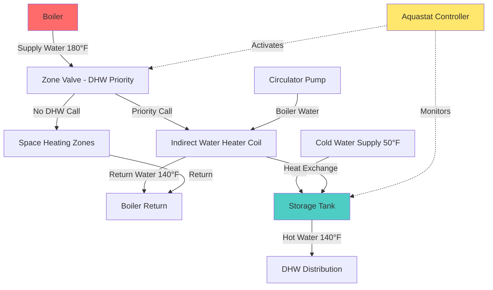

## Overview

Indirect water heaters utilize a heat exchanger submerged in a storage tank to transfer thermal energy from a primary heating source—typically a hydronic boiler—to potable water. This configuration isolates the potable water from the heating system fluid, providing superior efficiency, longevity, and water quality compared to direct-fired or tankless coil systems.

The fundamental advantage of indirect water heaters lies in their ability to leverage high-efficiency space heating equipment for domestic hot water production while maintaining complete separation between heating system water and potable water.

## Operating Principles

### Heat Transfer Mechanism

Heat transfer in indirect water heaters occurs through conduction across the heat exchanger surface, governed by the relationship:

$$Q = U \cdot A \cdot \Delta T_{lm}$$

Where:
- $Q$ = Heat transfer rate (BTU/hr)
- $U$ = Overall heat transfer coefficient (BTU/hr·ft²·°F)
- $A$ = Heat exchanger surface area (ft²)
- $\Delta T_{lm}$ = Log mean temperature difference (°F)

The log mean temperature difference accounts for the varying temperature gradient along the heat exchanger length:

$$\Delta T_{lm} = \frac{(T_{h,in} - T_{c,out}) - (T_{h,out} - T_{c,in})}{\ln\left(\frac{T_{h,in} - T_{c,out}}{T_{h,out} - T_{c,in}}\right)}$$

Where subscripts $h$ and $c$ denote hot (boiler) and cold (potable water) streams, respectively.

### System Configuration

## Recovery Rate Calculations

Recovery rate quantifies the volume of water heated per hour from inlet temperature to setpoint:

$$R = \frac{Q}{8.33 \cdot (T_{out} - T_{in})}$$

Where:
- $R$ = Recovery rate (GPH - gallons per hour)
- $Q$ = Heat input to water (BTU/hr)
- $8.33$ = Weight of water (lb/gal)
- $T_{out}$ = Desired outlet temperature (°F)
- $T_{in}$ = Inlet cold water temperature (°F)

**Example calculation:** For a system with 100,000 BTU/hr effective heat transfer, heating water from 50°F to 140°F:

$$R = \frac{100,000}{8.33 \cdot (140 - 50)} = \frac{100,000}{749.7} = 133.4 \text{ GPH}$$

## System Types Comparison

| Feature | Storage Indirect | Tankless Coil |
|---------|-----------------|---------------|
| **Storage capacity** | 30-120 gallons typical | None - instantaneous |
| **Recovery rate** | 100-200+ GPH | Limited by coil size |
| **Standby loss** | Minimal with insulation | None |
| **First-hour rating** | High (storage + recovery) | Low to moderate |
| **Boiler cycling** | Reduced via storage buffer | Frequent in summer |
| **Water quality** | Excellent (no stagnation) | Risk of scale buildup |
| **Initial cost** | Higher | Lower |
| **Efficiency** | 90-95% effective | 70-85% effective |
| **Maintenance** | Low | Moderate to high |
| **Lifespan** | 30+ years | 15-20 years |

## Boiler Integration Guidelines

### Sizing Considerations

The boiler must provide sufficient capacity for both space heating and domestic hot water loads. Two approaches exist:

**1. Dedicated DHW Boiler:** Sized for peak DHW demand with priority control

**2. Combined System:** Total boiler capacity must satisfy:

$$Q_{boiler} \geq Q_{heating} + Q_{DHW,peak}$$

Or with priority control (DHW interrupts heating):

$$Q_{boiler} \geq \max(Q_{heating}, Q_{DHW,peak})$$

For residential applications, a common sizing method uses the indirect tank's heat input requirement plus 70% of design space heating load to account for thermal mass and recovery time.

### Priority Control Strategy

Aquastat controllers monitor tank temperature and activate boiler priority mode when DHW temperature drops below setpoint. Priority control ensures:

- Zone valves close to space heating circuits
- Full boiler output diverts to indirect heater
- Rapid recovery minimizes occupant inconvenience
- Reduced boiler short-cycling during low heating loads

The aquastat differential typically ranges from 5-10°F to prevent excessive cycling.

### Coil Materials and Selection

Heat exchanger materials must resist corrosion while maximizing thermal conductivity:

| Material | Thermal Conductivity | Corrosion Resistance | Application |
|----------|---------------------|---------------------|-------------|
| **Copper** | 226 BTU/hr·ft·°F | Good (pH 6.5-8.5) | Standard residential |
| **Stainless steel** | 9.4 BTU/hr·ft·°F | Excellent (all pH) | Aggressive water |
| **Cupronickel** | 29 BTU/hr·ft·°F | Excellent | High chloride |

Copper coils provide superior heat transfer efficiency but require water chemistry management. Stainless steel offers longevity in aggressive water conditions at the cost of increased surface area requirements due to lower thermal conductivity.

## Design Recommendations

### Heat Exchanger Sizing

Select heat exchanger capacity to achieve target recovery rate. For residential applications, ASHRAE recommends first-hour ratings based on occupancy:

- 1-2 occupants: 40-50 gallons
- 3-4 occupants: 60-80 gallons
- 5+ occupants: 80-120 gallons

Commercial applications require detailed load profiling and diversity factor analysis.

### Installation Considerations

**Critical parameters:**
- Boiler supply temperature: 180-200°F for optimal performance
- Minimum tank insulation: R-16 to minimize standby losses
- Pressure relief valve: 150 PSI minimum rating
- Thermal expansion tank: Required per IPC 607.3
- Temperature limiting valve: ASSE 1017 thermostatic mixing valve to prevent scalding

### Efficiency Optimization

Maximize system efficiency through:
- High-efficiency condensing boiler integration (AFUE > 90%)
- Outdoor reset control for space heating circuits
- Insulated piping with heat trap fittings
- Strategic tank placement near primary DHW loads
- Regular maintenance of heat exchanger surfaces

## Conclusion

Indirect water heaters represent the optimal solution for hydronic heating systems requiring reliable domestic hot water. The combination of high recovery rates, excellent longevity, and operational efficiency justifies the higher initial investment. Proper sizing, priority control implementation, and material selection ensure decades of trouble-free service with minimal maintenance requirements.

