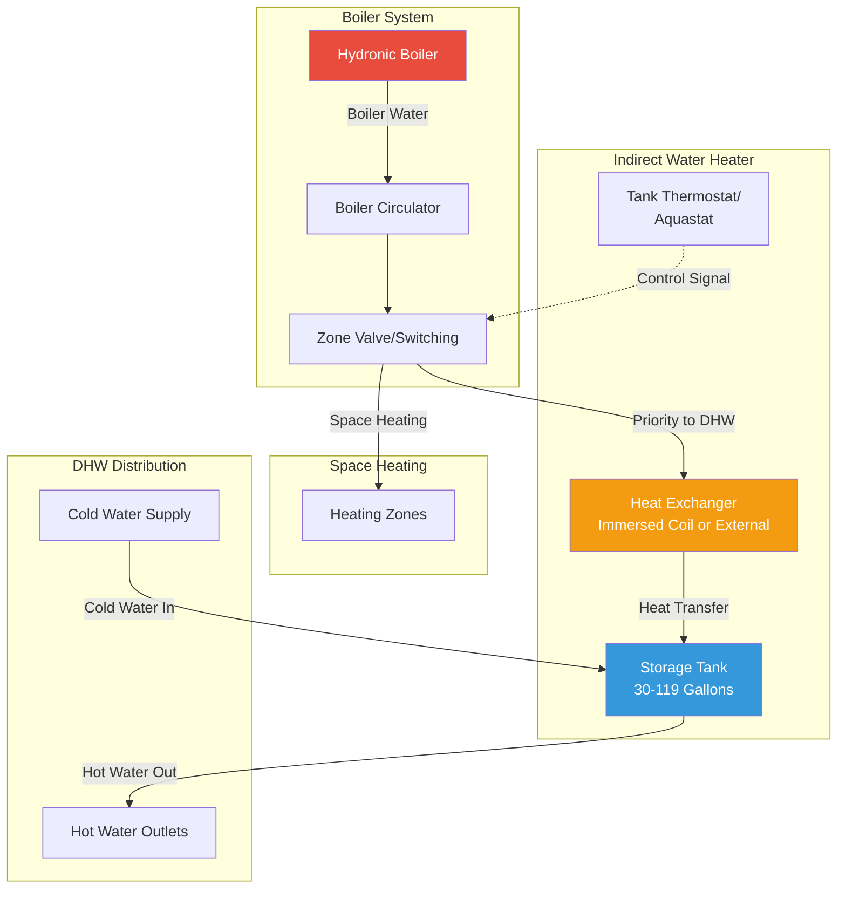

## Overview

Boiler-fired indirect water heaters utilize a hydronic boiler as the heat source, transferring thermal energy through a heat exchanger to produce domestic hot water. These systems provide high recovery rates, excellent efficiency by leveraging existing boiler infrastructure, and extended equipment life due to separation of combustion products from potable water.

The fundamental operation relies on boiler water circulating through a heat exchanger—either an immersed coil within the storage tank or an external shell-and-tube unit. When domestic hot water demand occurs, a priority control diverts boiler output to the water heater, suspending space heating temporarily to ensure rapid recovery.

## Heat Exchanger Configurations

### Immersed Coil Design

Immersed coil heat exchangers consist of stainless steel or copper tubing coiled within the storage tank, submerged directly in the potable water. Heat transfer occurs through the coil wall to the surrounding water by natural convection and conduction.

**Advantages:**
- Compact integration within tank
- No additional pumps required for tank side
- Simple piping connections
- Lower initial cost

**Limitations:**
- Lower heat transfer coefficients due to natural convection
- Potential for stratification reducing effective capacity
- Difficult to service without draining tank

### External Heat Exchanger Design

External heat exchangers mount separately from the storage tank, typically employing shell-and-tube or brazed plate configurations. A dedicated circulation pump moves tank water through the heat exchanger and back to storage.

**Advantages:**
- Higher heat transfer rates with forced convection
- Serviceable without tank access
- Better control over heat transfer process
- Can handle higher boiler temperatures

**Limitations:**
- Additional circulator required
- More complex piping arrangement
- Higher installation cost
- Increased space requirements

## Heat Transfer and Recovery Calculations

The heat exchanger capacity determines the recovery rate, calculated using the fundamental heat transfer equation:

$$Q = UA \cdot LMTD$$

Where:
- $Q$ = heat transfer rate (BTU/hr)
- $U$ = overall heat transfer coefficient (BTU/hr·ft²·°F)
- $A$ = heat exchanger surface area (ft²)
- $LMTD$ = log mean temperature difference (°F)

The log mean temperature difference accounts for varying temperature profiles:

$$LMTD = \frac{(T_{h,in} - T_{c,out}) - (T_{h,out} - T_{c,in})}{\ln\left(\frac{T_{h,in} - T_{c,out}}{T_{h,out} - T_{c,in}}\right)}$$

Where subscripts $h$ and $c$ denote hot (boiler) and cold (tank water) streams, with $in$ and $out$ indicating inlet and outlet conditions.

Recovery rate in gallons per hour can be determined from:

$$GPH = \frac{Q}{8.33 \cdot \Delta T}$$

Where $\Delta T$ is the temperature rise from incoming cold water to setpoint (typically 70-80°F for residential applications).

**Example Calculation:**

For a heat exchanger transferring 120,000 BTU/hr with incoming water at 60°F and setpoint of 140°F:

$$GPH = \frac{120,000}{8.33 \times (140 - 60)} = \frac{120,000}{666.4} = 180.1 \text{ GPH}$$

## System Piping Configuration

## Priority Control Strategy

Priority control ensures domestic hot water production takes precedence over space heating when tank temperature falls below setpoint. This control scheme maximizes recovery rate by directing full boiler output to the indirect tank.

**Control Sequence:**
1. Tank aquastat detects temperature drop below setpoint (typically 130-140°F)
2. Control activates boiler and opens indirect zone valve or energizes dedicated circulator
3. Space heating zones close or remain closed during DHW call
4. Boiler water flows through heat exchanger at design flow rate
5. Tank reaches setpoint; control terminates DHW priority
6. Space heating zones resume normal operation

**Response Time Considerations:**

System response depends on several factors:
- Boiler firing rate and available capacity
- Heat exchanger effectiveness
- Piping run length and insulation
- Circulator flow rate
- Tank stratification characteristics

For optimal performance, minimize piping length between boiler and indirect tank, insulate all hydronic piping to R-4 minimum, and size circulators for 4-8 GPM flow per 100,000 BTU/hr heat transfer capacity.

## Pipe Sizing Guidelines

Proper pipe sizing balances adequate flow delivery with acceptable pressure drop and pump energy consumption. Hydronic piping for indirect water heaters should be sized for velocities between 2-4 feet per second.

| Heat Exchanger Capacity | Flow Rate (GPM) | Pipe Size (Copper Type L) | Pressure Drop (ft/100 ft) |
|-------------------------|-----------------|---------------------------|---------------------------|
| 50,000 BTU/hr | 5 | 3/4" | 3.2 |
| 100,000 BTU/hr | 10 | 1" | 3.8 |
| 150,000 BTU/hr | 15 | 1-1/4" | 2.9 |
| 200,000 BTU/hr | 20 | 1-1/4" | 5.0 |
| 250,000 BTU/hr | 25 | 1-1/2" | 3.9 |

Flow rate calculation based on 20°F temperature drop across heat exchanger:

$$GPM = \frac{Q}{500 \cdot \Delta T} = \frac{Q}{500 \times 20} = \frac{Q}{10,000}$$

## Heat Exchanger Comparison

| Feature | Immersed Coil | External Heat Exchanger |
|---------|---------------|-------------------------|
| **Heat Transfer Coefficient (U)** | 50-100 BTU/hr·ft²·°F | 150-300 BTU/hr·ft²·°F |
| **Installation Complexity** | Low - factory integrated | Moderate - field piping required |
| **Space Requirements** | Minimal - within tank | Moderate - separate mounting |
| **Maintenance Access** | Difficult - requires tank drain | Easy - isolate and service |
| **Initial Cost** | Lower - fewer components | Higher - additional pump and HX |
| **Efficiency** | Good - natural circulation | Excellent - forced circulation |
| **Temperature Capability** | Limited - 200°F maximum | High - 240°F+ capability |
| **Stratification Control** | Limited - passive mixing | Good - controlled inlet design |
| **Typical Applications** | Residential, light commercial | Commercial, high-demand applications |

## Integration Guidelines

**Boiler Compatibility:**

Verify boiler capacity exceeds the combined peak loads of space heating and domestic hot water. For sizing purposes, assume simultaneous operation despite priority control, particularly in cold climates where rapid tank recovery during heating season is critical.

**Temperature Management:**

Set boiler aquastat to maintain supply temperature adequate for indirect tank operation, typically 160-180°F. Higher temperatures increase heat transfer rate but may cause scaling in hard water areas. Consider tempering valves on DHW distribution to prevent scalding while maintaining higher storage temperatures for legionella control.

**Expansion and Pressure Relief:**

Install thermal expansion tanks on both hydronic and domestic water systems. Size thermal expansion tank for potable water side according to total system volume and pressure relief valve setting. Install temperature and pressure relief valve rated 150 PSI and 210°F minimum on storage tank.

**Control Wiring:**

Wire tank aquastat to interrupt space heating zone control through a relay or directly to zone valves. Ensure proper electrical interlock prevents simultaneous operation of DHW priority and space heating. Use 24VAC control voltage for zone valves and circulators to match standard boiler control systems.

## Performance Optimization

Maximize system efficiency through proper commissioning:
- Balance flow rates to manufacturer specifications
- Verify priority control sequencing
- Check boiler firing rate under DHW load
- Confirm adequate circulator head pressure
- Test pressure relief valve operation
- Inspect all piping insulation integrity

Monitor long-term performance by tracking boiler runtime dedicated to DHW production versus space heating, identifying opportunities for storage tank upsizing or heat exchanger enhancement if recovery cycles become excessive.

## Conclusion

Boiler-fired indirect water heaters provide reliable, efficient domestic hot water production by integrating with existing hydronic heating infrastructure. Proper selection between immersed coil and external heat exchanger configurations depends on application demands, maintenance considerations, and budget constraints. Accurate heat transfer calculations, appropriate pipe sizing, and effective priority control implementation ensure optimal system performance and longevity.
