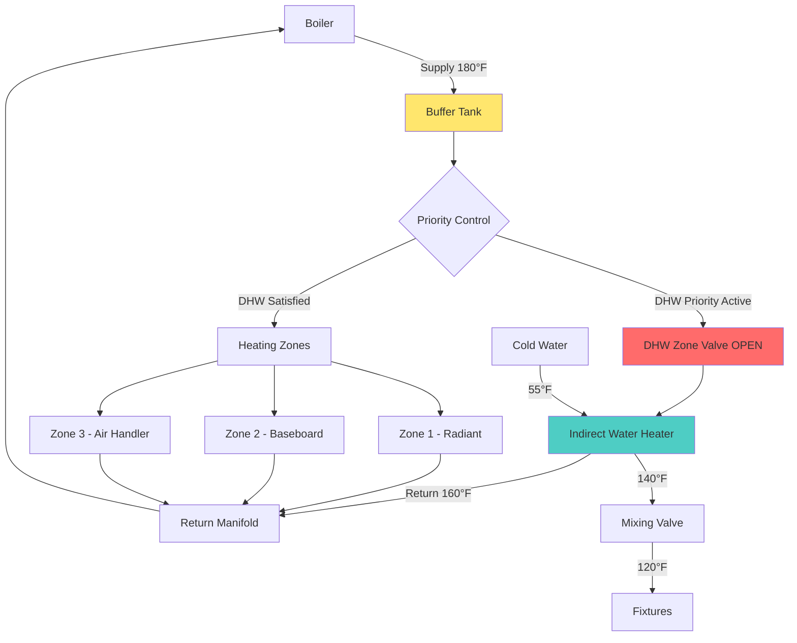

## Overview

Hydronic system indirect water heaters utilize the primary heating system—typically a boiler—as the heat source for domestic hot water production. The integration creates a dual-purpose heating plant where a heat exchanger (immersed coil or external plate heat exchanger) transfers thermal energy from the hydronic fluid to potable water. This approach offers high recovery rates, extended equipment lifespan, and eliminates the need for a separate water heater fuel source.

## Heat Transfer Fundamentals

The heat transfer rate in an indirect water heater depends on the temperature differential between the hydronic fluid and the stored water, the heat exchanger surface area, and the overall heat transfer coefficient:

$$Q = UA \cdot LMTD$$

Where:
- $Q$ = heat transfer rate (BTU/hr)
- $U$ = overall heat transfer coefficient (BTU/hr·ft²·°F)
- $A$ = heat exchanger surface area (ft²)
- $LMTD$ = log mean temperature difference (°F)

The log mean temperature difference for a coil-in-tank configuration is calculated as:

$$LMTD = \frac{(T_{h,in} - T_{w,out}) - (T_{h,out} - T_{w,in})}{\ln\left(\frac{T_{h,in} - T_{w,out}}{T_{h,out} - T_{w,in}}\right)}$$

Where:
- $T_{h,in}$ = hydronic supply temperature
- $T_{h,out}$ = hydronic return temperature
- $T_{w,in}$ = cold water inlet temperature
- $T_{w,out}$ = hot water storage temperature

## Integration Approaches

Three primary methods exist for integrating indirect water heaters with hydronic systems:

| Integration Method | Advantages | Disadvantages | Best Application |
|-------------------|------------|---------------|------------------|
| **Priority DHW Control** | Maximum recovery rate, simple control logic | Space heating interruption during DHW calls | Residential, light commercial |
| **Parallel Zone Operation** | Continuous space heating, no interruption | Slower DHW recovery, requires larger boiler | Commercial buildings, high heating loads |
| **Buffer Tank with Priority** | Fast recovery, thermal storage reduces cycling | Higher installation cost, space requirements | Variable load profiles, efficiency-focused |

### Priority DHW Control

The most common residential approach uses a zone valve or relay to shut down space heating zones when the indirect tank aquastat calls for heat. The entire boiler output directs to the domestic hot water load until the tank reaches setpoint.

**Control Logic:**
1. DHW aquastat closes on temperature drop
2. Space heating zones close
3. DHW circulator energizes
4. Boiler fires to high-temperature setpoint
5. DHW aquastat opens on satisfaction
6. Space heating zones resume operation

### Parallel Zone Operation

Commercial applications often require uninterrupted space heating. The indirect water heater operates as a standard zone alongside heating zones, with the boiler sized to handle simultaneous loads.

**Boiler Capacity Requirement:**

$$Q_{boiler} = Q_{heating,peak} + Q_{DHW,recovery}$$

This approach requires careful load calculation to prevent boiler short-cycling during low-load conditions.

### Buffer Tank Integration

A buffer tank between the boiler and loads provides thermal mass that reduces cycling frequency, particularly beneficial for condensing boilers and modulating burners. The indirect water heater draws from the buffer tank through a priority control sequence.

## Hydronic System Configuration

## Piping Configuration Requirements

### Primary-Secondary Piping

Hydraulic separation between the boiler loop and the indirect water heater prevents flow interference and maintains design flow rates through each component:

$$\dot{m} = \frac{Q}{c_p \cdot \Delta T}$$

Where:
- $\dot{m}$ = mass flow rate (lb/hr)
- $c_p$ = specific heat of water (1 BTU/lb·°F)
- $\Delta T$ = temperature drop across heat exchanger (°F)

For a 50,000 BTU/hr indirect tank with a 20°F temperature drop:

$$\dot{m} = \frac{50,000}{1 \times 20} = 2,500 \text{ lb/hr} \approx 5 \text{ GPM}$$

### Mixing Valve Installation

Thermostatic mixing valves at the tank outlet prevent scalding and extend tank capacity by storing water at elevated temperatures. A storage temperature of 140-160°F inhibits Legionella growth while allowing delivery of 120°F water to fixtures.

**Capacity Extension Factor:**

$$V_{effective} = V_{storage} \times \frac{T_{storage} - T_{cold}}{T_{delivery} - T_{cold}}$$

A 40-gallon tank at 140°F delivers equivalent to 53 gallons at 120°F (assuming 55°F inlet).

## Buffer Tank Sizing

Buffer tanks reduce boiler cycling frequency and improve system efficiency. Size based on minimum runtime requirements:

$$V_{buffer} = \frac{Q_{boiler,min} \times t_{min}}{c_p \cdot \rho \times \Delta T_{system}}$$

Where:
- $V_{buffer}$ = buffer tank volume (gallons)
- $Q_{boiler,min}$ = minimum boiler firing rate (BTU/hr)
- $t_{min}$ = desired minimum runtime (hours, typically 0.167 for 10 minutes)
- $\rho$ = density of water (8.34 lb/gal)
- $\Delta T_{system}$ = system temperature differential (°F)

For a 100,000 BTU/hr boiler with 10-minute minimum runtime and 20°F differential:

$$V_{buffer} = \frac{100,000 \times 0.167}{1 \times 8.34 \times 20} \approx 100 \text{ gallons}$$

## Seasonal Operation Considerations

### Summer DHW-Only Mode

Operating a large boiler solely for domestic hot water during non-heating seasons introduces efficiency penalties due to jacket losses and short cycling. Mitigation strategies include:

- **Boiler Setpoint Reduction:** Lower supply temperature to 140-150°F reduces standby losses
- **Timer Control:** Limit operating hours to morning/evening peak demand
- **Dual-Fuel Option:** Switch to electric resistance heating during summer
- **Separate Summer Boiler:** Small dedicated unit for DHW loads

**Standby Loss Calculation:**

$$Q_{standby} = UA_{jacket} \times (T_{boiler} - T_{ambient}) \times 24$$

A typical cast iron boiler with 10 ft² surface area and U-value of 0.5 BTU/hr·ft²·°F maintained at 180°F in a 70°F basement loses approximately 13,200 BTU/day to the surrounding space.

## Design Guidelines

**ASHRAE Handbook - HVAC Systems and Equipment:**
- Size indirect tanks for peak hourly demand using modified Hunter curves
- Maintain minimum 2:1 ratio of boiler input to DHW recovery rate for priority control
- Provide adequate pipe sizing for 4-8 GPM flow through heat exchanger
- Install expansion tank on DHW side if check valve prevents thermal expansion relief

**Hydronic System Integration:**
- Use closely-spaced tees (primary-secondary piping) within 12 inches center-to-center
- Install dirt separator on boiler return to protect heat exchangers
- Provide backflow prevention between potable and hydronic systems per code
- Consider system pressurization requirements (domestic water pressure typically exceeds hydronic)

**Control Sequence:**
1. Stage DHW priority above all space heating zones
2. Implement time delay (5-10 minutes) to prevent nuisance cycling
3. Monitor boiler return temperature to prevent flue gas condensation on non-condensing units
4. Interlock aquastat with boiler enable for summer operation optimization

## System Efficiency Factors

The combined efficiency of hydronic-integrated indirect water heating depends on multiple factors:

$$\eta_{system} = \eta_{boiler} \times \eta_{heat\ exchanger} \times (1 - f_{standby})$$

Where:
- $\eta_{boiler}$ = boiler seasonal efficiency (AFUE)
- $\eta_{heat\ exchanger}$ = heat exchanger effectiveness (typically 0.85-0.95)
- $f_{standby}$ = standby loss fraction (0.05-0.15 depending on insulation and operation)

High-performance systems achieve 80-85% overall efficiency, comparable to dedicated high-efficiency storage water heaters while offering superior recovery rates.

## Conclusion

Hydronic system indirect water heaters provide an effective dual-purpose solution when properly integrated with heating systems. Priority control schemes, appropriate buffer tank sizing, hydraulic separation through primary-secondary piping, and seasonal operating strategies optimize performance and efficiency. The approach particularly benefits installations with existing high-efficiency boilers, eliminating the capital cost and maintenance of separate water heating equipment while delivering unlimited recovery capacity for high-demand applications.
