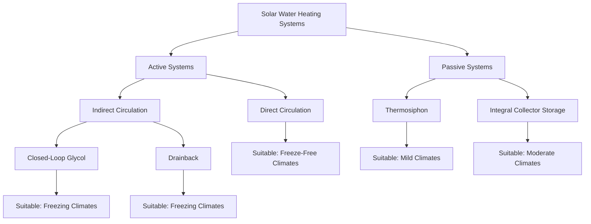

Solar water heating (SWH) systems use solar thermal collectors to convert solar radiation into thermal energy for domestic hot water production. These systems can provide 50-80% of annual hot water needs in favorable climates, offering significant energy savings and reduced carbon emissions compared to conventional water heating.

## Solar Water Heating Fundamentals

Solar domestic hot water (SDHW) systems capture solar radiation and transfer the thermal energy to potable water either directly or through a heat exchanger. System performance depends on solar insolation, collector efficiency, storage capacity, and hot water demand patterns.

### Solar Fraction

The solar fraction (SF) represents the portion of total hot water energy demand met by solar energy:

$$SF = \frac{Q_{solar}}{Q_{total}} = \frac{Q_{solar}}{Q_{solar} + Q_{aux}}$$

Where:
- $SF$ = solar fraction (dimensionless, 0 to 1)
- $Q_{solar}$ = energy delivered by solar system (Btu or kWh)
- $Q_{total}$ = total hot water energy demand (Btu or kWh)
- $Q_{aux}$ = auxiliary (backup) energy required (Btu or kWh)

Annual solar fraction depends on system size, collector performance, location, and load profile:

$$SF_{annual} = 1 - \frac{12 \times Q_{aux,monthly,avg}}{Q_{annual,total}}$$

## System Types

Solar water heating systems are classified as active or passive based on circulation method, and as direct or indirect based on fluid circulation.

### Active Systems

Active systems use pumps to circulate water or heat transfer fluid through collectors.

**Direct Circulation (Open-Loop)**
- Potable water circulates through collectors
- Simple design with high efficiency
- Requires freeze protection (recirculation or drain-down)
- Limited to freeze-free climates or seasonal use
- Lower installed cost than indirect systems

**Indirect Circulation (Closed-Loop)**
- Heat transfer fluid (typically propylene glycol) circulates through collectors
- Heat exchanger transfers energy to potable water
- Freeze-protected for all climates
- Higher installed cost but broader applicability
- Requires expansion tank and pressure relief on solar loop

**Drainback Systems**
- Collector loop drains when pump stops
- Uses water as heat transfer fluid
- Inherent freeze and overheat protection
- Requires proper piping slope (minimum 0.25 in/ft)
- Drainback reservoir sized for collector and piping volume

### Passive Systems

Passive systems rely on natural convection (thermosiphon) without pumps.

**Thermosiphon Systems**
- Storage tank located above collectors
- Warm water rises naturally into tank
- Cold water sinks to collector inlet
- Simple, reliable, no parasitic energy
- Requires structural support for elevated tank
- Common in residential applications worldwide

**Integral Collector Storage (ICS)**
- Combined collector and storage unit
- Preheats water before conventional heater
- Compact, simple installation
- Higher heat loss than separated systems
- Best suited for moderate climates

## Collector Types

Solar thermal collector efficiency and cost vary significantly by technology.

| Collector Type | Efficiency Range | Operating Temp Range | Cost ($/ft²) | Applications |
|---|---|---|---|---|
| Unglazed Flat Plate | 60-80% | Ambient to 90°F | $8-15 | Pool heating, low-temp applications |
| Glazed Flat Plate | 40-70% | 100-180°F | $25-50 | DHW, space heating |
| Evacuated Tube | 50-75% | 120-200°F | $50-100 | DHW, high-temp applications |
| Concentrating | 60-85% | 200-400°F | $100-200 | Industrial process heat |

### Flat Plate Collectors

Flat plate collectors consist of an absorber plate with integral or attached flow passages, transparent glazing, and insulated backing.

**Construction:**
- Absorber: copper or aluminum with selective coating (α/ε = 0.95/0.10)
- Glazing: low-iron tempered glass (transmittance > 0.90)
- Insulation: fiberglass or polyisocyanurate (R-10 to R-20)
- Frame: aluminum or stainless steel

**Performance:**
Collector efficiency decreases as fluid temperature exceeds ambient:

$$\eta = F_R(\tau\alpha) - F_R U_L \frac{(T_{in} - T_{amb})}{I}$$

Where:
- $\eta$ = instantaneous collector efficiency
- $F_R$ = collector heat removal factor (typically 0.85-0.95)
- $\tau\alpha$ = transmittance-absorptance product (typically 0.80-0.85)
- $U_L$ = overall heat loss coefficient (Btu/hr·ft²·°F, typically 0.6-1.2)
- $T_{in}$ = collector inlet temperature (°F)
- $T_{amb}$ = ambient temperature (°F)
- $I$ = solar irradiance (Btu/hr·ft²)

### Evacuated Tube Collectors

Evacuated tube collectors use vacuum insulation to minimize convective and conductive heat losses, achieving higher efficiencies at elevated temperatures.

**Construction:**
- Double-wall glass tubes with vacuum between walls
- Selective absorber coating on inner tube or fin
- Heat pipe or direct flow configuration
- Manifold connects individual tubes

**Advantages:**
- Higher efficiency at temperature differentials > 80°F
- Better performance in cold, cloudy conditions
- Cylindrical shape captures radiation from multiple angles
- Individual tube replacement possible

**Disadvantages:**
- Higher cost per unit area
- More complex installation
- Potential for overheating in high-insolation periods

## System Sizing

Proper sizing balances solar fraction, system cost, and available roof area.

### Collector Area Calculation

A simplified sizing method based on hot water demand:

$$A_{collector} = \frac{Q_{daily} \times (1 - \eta_{storage})}{\eta_{collector} \times I_{daily} \times SF_{target}}$$

Where:
- $A_{collector}$ = required collector area (ft²)
- $Q_{daily}$ = daily hot water energy demand (Btu/day)
- $\eta_{storage}$ = storage tank standby loss factor (typically 0.05-0.10)
- $\eta_{collector}$ = average collector efficiency (0.40-0.60)
- $I_{daily}$ = average daily insolation (Btu/ft²·day)
- $SF_{target}$ = target solar fraction (typically 0.50-0.70)

### Storage Sizing

Storage volume should accommodate 1.5-2.0 gallons per square foot of collector area:

$$V_{storage} = A_{collector} \times (1.5 \text{ to } 2.0) \text{ gal/ft}^2$$

Larger storage ratios improve performance in variable weather but increase heat loss and cost.

### Rule of Thumb Sizing

For residential applications:
- **Collector area:** 0.5-1.0 ft² per gallon of daily hot water use
- **Storage volume:** 1.5-2.0 gallons per ft² of collector area
- **Example:** 64 gallon/day usage requires 32-64 ft² collectors and 50-130 gallon storage

## Economics and Performance

Solar water heating economics depend on system cost, solar fraction, fuel displaced, and incentives.

### Simple Payback

$$\text{Payback (years)} = \frac{C_{installed} - \text{Incentives}}{E_{annual,saved} \times C_{fuel}}$$

Where:
- $C_{installed}$ = total installed system cost ($)
- $E_{annual,saved}$ = annual energy displaced (therms, kWh, etc.)
- $C_{fuel}$ = cost of displaced fuel ($/therm, $/kWh)

### Typical Performance Metrics

| Climate Zone | Annual Solar Fraction | Collector Area (ft²/person) | Simple Payback (years) |
|---|---|---|---|
| Hot-Sunny (Phoenix) | 0.70-0.85 | 15-20 | 6-10 |
| Warm-Sunny (Los Angeles) | 0.60-0.75 | 18-24 | 8-12 |
| Moderate (Atlanta) | 0.50-0.65 | 20-28 | 10-15 |
| Cold-Sunny (Denver) | 0.45-0.60 | 22-30 | 12-18 |
| Cold-Cloudy (Seattle) | 0.30-0.45 | 25-35 | 15-25 |

## Standards and Certification

### SRCC Certification

The Solar Rating and Certification Corporation (SRCC) provides independent certification and rating of solar collectors and complete systems per ANSI/SRCC Standard 100 (collectors) and 300 (systems).

**SRCC OG-100:** Collector certification including thermal performance, durability, and reliability testing.

**SRCC OG-300:** Complete system certification providing estimated annual performance for specific locations and load profiles.

### ASHRAE Standards

**ASHRAE 90.1/90.2:** Minimum efficiency requirements and calculation methods for solar water heating systems in commercial and residential buildings.

**ASHRAE 93:** Test method for determining thermal performance of solar collectors.

Consult SRCC ratings and local solar resource data when selecting and sizing solar water heating systems. Proper design, installation per manufacturer specifications, and regular maintenance ensure optimal long-term performance.
