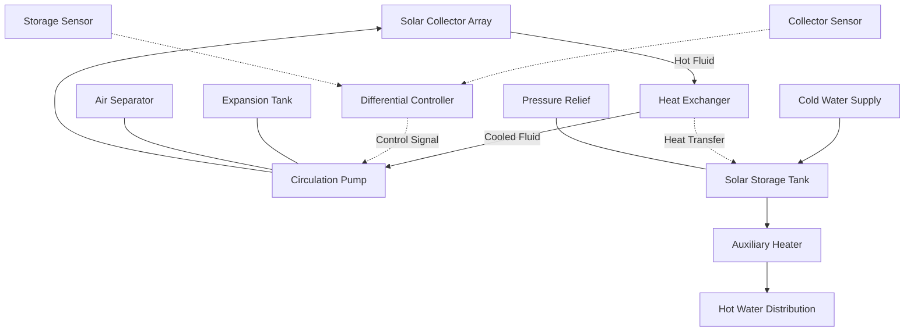

## System Overview

Active solar water heating systems utilize pumps to circulate heat transfer fluid through solar collectors and storage tanks. Unlike passive systems, active systems employ controllers that monitor temperature differentials and activate circulation pumps when solar energy is available for collection. These systems achieve solar fractions of 40% to 80% depending on climate, load patterns, and system sizing.

The fundamental operation relies on a differential temperature controller (DTC) that compares collector temperature to storage temperature. When the collector exceeds storage by a predetermined differential (typically 15-20°F), the controller activates the circulation pump to harvest solar energy.

## System Types

### Direct Circulation Systems

Direct circulation systems pump potable water directly through the solar collectors and back to storage. This configuration offers the highest efficiency due to the absence of heat exchangers but imposes significant constraints.

**Applications:**
- Non-freezing climates (minimum ambient temperature above 32°F)
- Low-mineral water supply (prevents scaling in collectors)
- No corrosion-prone collector materials in contact with potable water

**Advantages:**
- Higher system efficiency (no heat exchanger penalty)
- Lower first cost
- Simpler hydraulic design

**Limitations:**
- Freeze damage risk in cold climates
- Scaling potential with hard water
- Corrosion in certain collector types

### Indirect Circulation Systems

Indirect systems circulate a heat transfer fluid through collectors and transfer energy to potable water via a heat exchanger. This configuration dominates installations in freezing climates.

**Heat Transfer Fluids:**
- Propylene glycol/water solutions (most common)
- Ethylene glycol/water (higher toxicity, avoid in potable systems)
- Food-grade hydrocarbon oils (specialty applications)

**Heat Exchanger Types:**
- External shell-and-tube (most efficient)
- Tank-immersed coil (integrated with storage)
- Plate-and-frame (compact, high effectiveness)

## System Components

### Circulation Pump

The circulation pump must overcome:
1. Collector array pressure drop
2. Piping system friction losses
3. Heat exchanger pressure drop
4. Static head (vertical distance)

Pump sizing uses standard friction loss calculations. For glycol solutions, adjust friction factors for increased viscosity:

$$\mu_{\text{solution}} = \mu_{\text{water}} \times (1 + 0.05 \times \%_{\text{glycol}})$$

Typical pump power ranges from 0.02 to 0.05 hp per 100 ft² of collector area.

### Differential Temperature Controller

The DTC operates on a simple algorithm:

$$\Delta T_{\text{on}} = T_{\text{collector}} - T_{\text{storage}} \geq 15-20°F$$

$$\Delta T_{\text{off}} = T_{\text{collector}} - T_{\text{storage}} < 5-8°F$$

The differential prevents short-cycling while ensuring efficient energy collection. Advanced controllers incorporate:
- High-limit protection (prevents excessive storage temperature)
- Freeze protection activation
- Auxiliary heater coordination
- Data logging and performance monitoring

## Freeze Protection Strategies

### Recirculation (Direct Systems)

When collector temperature approaches freezing, the controller activates the pump to circulate warm water from storage through the collectors. This method:
- Sacrifices stored solar energy
- Increases auxiliary heating load
- Suitable for mild climates with infrequent freezing

### Drainback Systems

Collectors and exposed piping drain automatically when the pump stops. Requirements:
- Collectors and piping must slope continuously (minimum 1/4 inch per foot)
- Drainback reservoir at system low point
- Pump must overcome lift height to fill collectors
- System remains atmospheric pressure

### Antifreeze Systems

Glycol solutions prevent freezing in closed-loop indirect systems. Critical parameters:

| Glycol Concentration | Freeze Protection | Burst Protection | Specific Heat Penalty |
|---------------------|-------------------|------------------|---------------------|
| 30% Propylene Glycol | 0°F | -10°F | 5% reduction |
| 40% Propylene Glycol | -15°F | -25°F | 8% reduction |
| 50% Propylene Glycol | -30°F | -50°F | 12% reduction |

Glycol degrades over time due to high-temperature exposure. ASHRAE Standard 90.2 recommends testing and replacement every 3-5 years.

## System Sizing and Solar Fraction

The solar fraction (SF) represents the percentage of annual hot water load met by solar energy:

$$SF = \frac{Q_{\text{solar}}}{Q_{\text{total}}}$$

Where:
- $Q_{\text{solar}}$ = Annual solar energy contribution (Btu/yr)
- $Q_{\text{total}}$ = Annual hot water heating load (Btu/yr)

### F-Chart Method

The industry-standard F-Chart method correlates solar fraction to two dimensionless parameters:

$$X = \frac{F_R U_L A_c (T_{\text{ref}} - T_a) \Delta t}{Q_{\text{load}}}$$

$$Y = \frac{F_R (\tau\alpha) A_c \overline{H_T}}{Q_{\text{load}}}$$

Where:
- $F_R$ = Collector heat removal factor
- $U_L$ = Collector overall loss coefficient (Btu/hr·ft²·°F)
- $A_c$ = Collector area (ft²)
- $T_{\text{ref}}$ = Reference temperature (typically 212°F)
- $T_a$ = Ambient temperature (°F)
- $\Delta t$ = Time period (hr)
- $(\tau\alpha)$ = Transmittance-absorptance product
- $\overline{H_T}$ = Monthly average daily radiation on tilted surface (Btu/day·ft²)

The solar fraction follows an empirically derived correlation based on X and Y values.

### Sizing Guidelines

| Climate Zone | Collector Area per Person | Storage per Collector Area |
|--------------|---------------------------|----------------------------|
| Hot, Sunny (Phoenix, Miami) | 15-20 ft² | 1.5-2.0 gal/ft² |
| Moderate (San Francisco, Atlanta) | 20-25 ft² | 1.8-2.2 gal/ft² |
| Cold (Boston, Denver) | 25-30 ft² | 2.0-2.5 gal/ft² |

Assumptions: 20 gallons/person/day hot water use, 120°F delivery temperature.

## Controls and Safety

### Temperature Limits

**High-Limit Protection:** Controllers must prevent storage temperatures exceeding 180°F to prevent:
- Scalding hazards
- Glycol degradation (indirect systems)
- Storage tank pressure relief discharge

Implementation: Controller stops circulation pump when storage reaches setpoint.

**Overheat Protection:** In stagnation conditions (no load, pump failure), collectors can exceed 350°F. Protection includes:
- Pressure relief valves rated for maximum stagnation temperature
- Expansion tanks sized for full fluid expansion
- High-temperature piping materials and insulation

### Pressure Relief

Systems require dual protection:
1. Storage tank pressure relief (150 psi typical for residential)
2. Collector loop pressure relief (30-50 psi typical for closed-loop systems)

## Performance Standards

**SRCC OG-300:** Solar Thermal Collector certification standard by Solar Rating & Certification Corporation. Provides standardized performance ratings:
- Clear-day output at specified conditions
- Thermal performance coefficients ($F_R U_L$ and $F_R (\tau\alpha)$)
- Stagnation temperature
- Pressure drop characteristics

**ASHRAE Standard 90.2:** Energy-Efficient Design of Low-Rise Residential Buildings. Specifies:
- Minimum solar fraction requirements by climate zone
- Insulation R-values for piping and storage
- Control algorithms and safety features

**ASHRAE Standard 62.1:** Ventilation for Acceptable Indoor Air Quality. Addresses Legionella control in solar preheat systems (maintain storage above 140°F or periodic thermal pasteurization).

## Installation Considerations

**Collector Orientation:**
- Optimal azimuth: True south (northern hemisphere)
- Acceptable range: ±15° from south (minimal performance penalty)
- Tilt angle: Latitude ±10° for year-round performance
- Seasonal optimization: Latitude +15° (winter priority), Latitude -15° (summer priority)

**Piping Design:**
- Minimize pipe length between collectors and storage
- Insulation: Minimum R-4 for interior piping, R-6 for exterior piping
- Supports: Allow for thermal expansion (up to 200°F temperature swings)
- Air elimination: High-point air vents in closed-loop systems

**Hydraulic Balance:**
- Parallel collector arrays require flow balancing valves
- Target flow rate: 0.02-0.03 gpm per ft² of collector area
- Reverse-return piping promotes equal flow distribution

Active solar water heating systems provide substantial energy savings when properly designed and installed. System selection between direct and indirect configurations depends on climate, water quality, and site-specific constraints. Adherence to ASHRAE and SRCC standards ensures reliable, efficient operation over the 20-25 year system lifespan.
