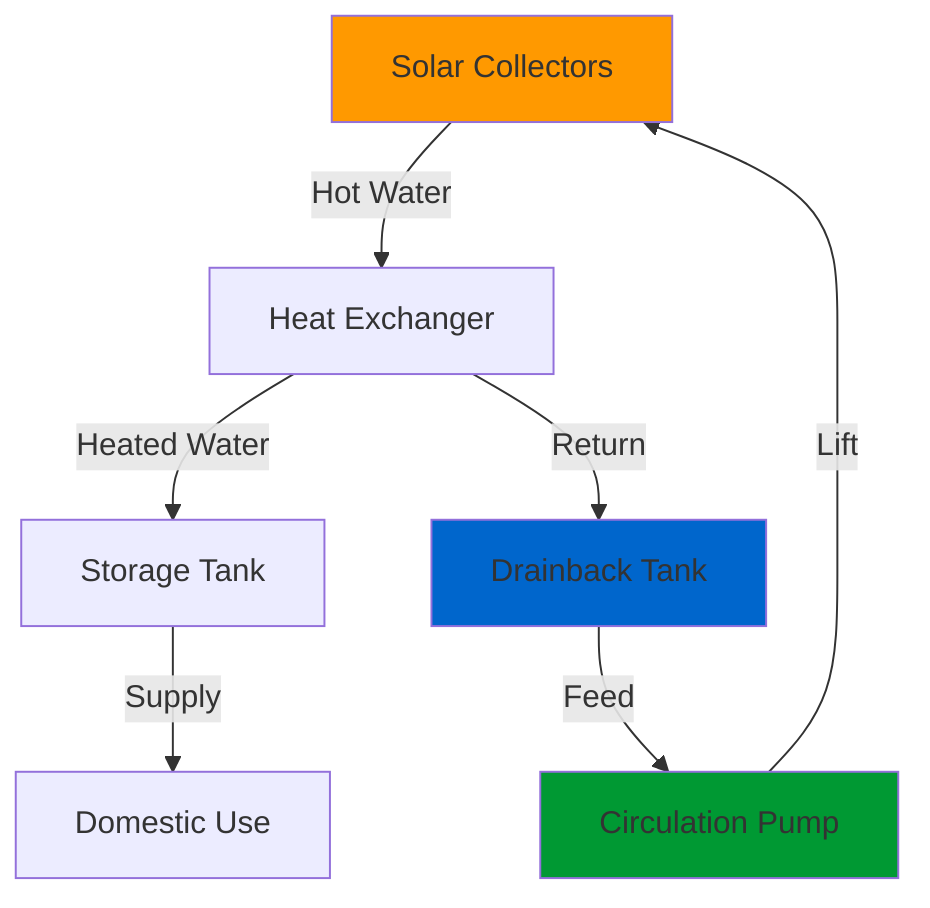
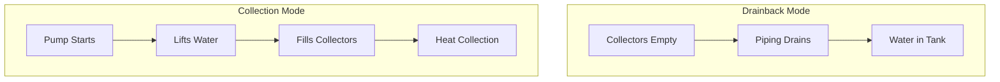

## Operating Principle

Drainback systems employ a gravity-based freeze protection strategy where the heat transfer fluid (typically distilled water) drains from the solar collectors and exposed piping into a drainback tank whenever the circulation pump stops. This passive protection mechanism eliminates the need for antifreeze solutions and their associated maintenance requirements.

The system operates in two distinct modes:

**Collection Mode:** The circulation pump lifts water from the drainback tank through the collectors where it absorbs solar energy, then returns to the storage system. The pump must overcome both the static lift and friction losses.

**Drainback Mode:** When the pump deactivates (due to insufficient solar gain, freezing conditions, or power loss), water drains by gravity from the collectors and all outdoor piping into the indoor drainback tank. This drainage occurs within 1-3 minutes depending on system configuration.

## Pump Head Requirements

The circulation pump must overcome significant static head plus dynamic losses. The total head calculation:

$$H_{total} = H_{static} + H_{friction} + H_{minor}$$

Where:
- $H_{static}$ = vertical elevation from drainback tank water level to highest point in collectors (ft or m)
- $H_{friction}$ = friction losses in piping
- $H_{minor}$ = minor losses from fittings, valves, heat exchangers

The static lift component dominates in drainback systems:

$$H_{static} = h_{collector} - h_{tank}$$

For a typical residential installation with collectors 15 ft above the drainback tank, static head alone equals 15 ft (6.5 psi). Total system head typically ranges from 18-25 ft (8-11 psi) for residential systems.

The pump must also provide adequate flow rate per SRCC guidelines:

$$\dot{m} = \frac{12.5 \times A_c}{c_p \times \Delta T_{design}}$$

Where:
- $\dot{m}$ = mass flow rate (lbm/hr)
- $A_c$ = collector area (ft²)
- $c_p$ = specific heat of water = 1 BTU/lbm·°F
- $\Delta T_{design}$ = design temperature rise = 10-20°F

Typical flow rates range from 0.02-0.04 gpm/ft² of collector area.

## Drainback Tank Design

The drainback tank serves three critical functions:

1. **Fluid Storage:** Contains all water that drains from collectors and piping
2. **Air Separation:** Allows air entrainment to separate before pump suction
3. **Thermal Expansion:** Accommodates volume changes

### Sizing Methodology

Minimum tank volume:

$$V_{tank} = V_{collectors} + V_{piping} + V_{expansion} + V_{reserve}$$

**Collector Volume:** Varies by collector type:
- Flat plate: 0.15-0.25 gal/ft²
- Evacuated tube: 0.10-0.15 gal/ft²

**Piping Volume:** Calculate from pipe dimensions:

$$V_{pipe} = \pi r^2 L \times 7.48$$

Where $r$ = radius (ft), $L$ = length (ft), result in gallons.

**Expansion Volume:** 10% of total fluid volume minimum.

**Reserve Volume:** 2-5 gallons to ensure pump never cavitates.

### Configuration Requirements

- Tank must be located indoors in conditioned or semi-conditioned space
- Water level must be below lowest collector connection
- Adequate air space above water level (minimum 30% tank volume)
- Accessible for inspection and water quality maintenance

## System Design Considerations

### Piping Requirements

**Slope:** All outdoor piping must slope continuously toward the drainback tank:
- Minimum slope: 1/4 inch per foot (2%)
- Preferred slope: 1/2 inch per foot (4%)
- No horizontal runs or sags that trap water

**Sizing:** Pipe diameter affects drainage:

| Pipe Size | Max Horizontal Run | Drainage Time |
|-----------|-------------------|---------------|
| 3/4" | 20 ft | < 90 sec |
| 1" | 40 ft | < 120 sec |
| 1-1/4" | 60 ft | < 150 sec |

**Material:** Copper Type L or M preferred; PEX-AL-PEX acceptable if rated for temperatures up to 200°F.

### Heat Exchanger Integration

Most drainback systems employ external heat exchangers between the collector loop and storage tank to prevent contamination. Heat exchanger effectiveness must exceed 0.50 per ASHRAE 93 testing protocols.

**Pressure Drop:** Heat exchanger $\Delta P$ typically represents 40-60% of total system head. Plate-and-frame exchangers offer superior performance over coil-in-tank designs:

| Heat Exchanger Type | Typical Effectiveness | Pressure Drop |
|---------------------|----------------------|---------------|
| Plate-and-Frame | 0.60-0.75 | 3-6 ft head |
| Brazed Plate | 0.55-0.70 | 4-7 ft head |
| Coil-in-Tank | 0.40-0.60 | 2-4 ft head |

## Advantages and Limitations

### Primary Advantages

- **Inherent Freeze Protection:** No antifreeze degradation or maintenance
- **Overheat Protection:** System automatically drains during stagnation
- **Simplified Maintenance:** Water-only heat transfer fluid
- **Long Service Life:** No glycol replacement every 3-5 years
- **Lower Operating Cost:** Reduced maintenance intervals

### Design Limitations

- **Higher Pump Energy:** Overcoming static lift requires more power
- **Installation Constraints:** Requires proper slope for drainage
- **Indoor Space:** Drainback tank must be located inside
- **Complexity:** Proper air management critical for reliable operation
- **First Cost:** Higher quality pumps and controls increase initial investment

## Control Strategy

Differential temperature controllers activate the pump when:

$$\Delta T = T_{collector} - T_{storage} > T_{on}$$

Typical $T_{on}$ = 15-20°F. The controller deactivates when:

$$\Delta T < T_{off}$$

Where $T_{off}$ = 3-5°F to prevent short cycling.

Advanced controllers incorporate:
- Freeze protection override (drain at outdoor temperature < 40°F)
- Maximum limit cutoff (drain at collector temperature > 200°F)
- Low flow detection to identify drainage issues
- Runtime totalization for maintenance scheduling

## Standards and Testing

SRCC OG-300 provides certification standards for solar water heating systems including drainback configurations. Systems must demonstrate:

- Complete drainage within 5 minutes under worst-case conditions
- No water retention in collectors or piping after drainage
- Pump performance adequate for specified temperature and flow conditions
- Freeze resistance to -30°F outdoor ambient

ASHRAE 90.1 and 90.2 establish minimum efficiency requirements for solar thermal systems in commercial and residential applications.

## Installation Verification

Commission drainback systems by verifying:

1. All piping slopes toward drainback tank with no sags
2. Complete drainage occurs within design timeframe
3. No gurgling or air binding during pump operation
4. Drainback tank maintains adequate water level
5. Heat exchanger achieves design temperature differential
6. Pump delivers specified flow at measured head

Proper installation ensures reliable freeze protection and optimal thermal performance throughout the system's 20-25 year design life.
