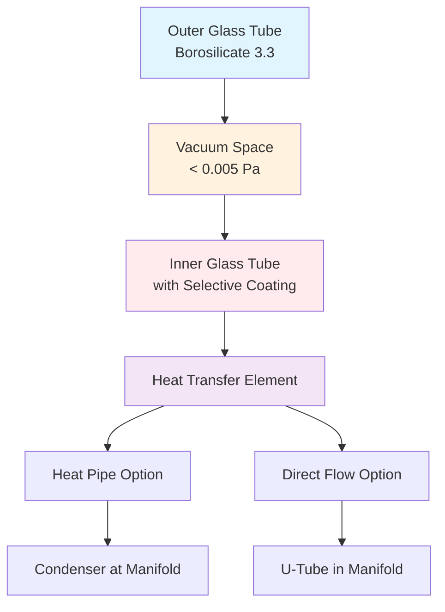

## Physical Principles of Evacuated Tube Collectors

Evacuated tube collectors (ETCs) represent advanced solar thermal technology that achieves superior efficiency through vacuum insulation. Each collector consists of parallel glass tubes, typically 47-58 mm in diameter and 1500-1800 mm in length, containing an absorber surface within an evacuated envelope maintained at pressures below 0.005 Pa.

The vacuum eliminates conductive and convective heat losses, leaving only radiative losses governed by the Stefan-Boltzmann law. This design enables efficient operation at temperatures 50-100°C above ambient, where flat plate collectors experience significant thermal degradation.

## Tube Construction and Heat Transfer

### Vacuum Insulation Physics

The thermal conductance across the evacuated annular space is minimized by removing gas molecules that would otherwise conduct heat. The residual heat transfer occurs only through:

1. **Radiative exchange** between glass surfaces (minimized by low-emissivity coatings)
2. **Conduction through support structures** (getter material and tube ends)
3. **Residual gas conduction** (negligible at operating vacuum levels)

The overall heat loss coefficient for the evacuated space is typically 0.3-0.6 W/m²·K, compared to 4-6 W/m²·K for flat plate collectors.

## Heat Pipe Technology

Heat pipe evacuated tubes utilize a sealed copper pipe containing a small quantity of pure water or other working fluid at reduced pressure. The physics operates through:

**Evaporation Phase:**
$$Q_{evap} = \.m \cdot h_{fg}$$

Where:
- $\.m$ = mass flow rate of vapor (kg/s)
- $h_{fg}$ = latent heat of vaporization (kJ/kg)

The absorber heats the working fluid, which evaporates and rises to the condenser bulb at the tube's sealed end. At the condenser, heat transfers to the manifold fluid, the vapor condenses, and liquid returns via gravity to complete the cycle.

**Heat Pipe Thermal Resistance:**
$$R_{hp} = \frac{1}{h_e A_e} + \frac{\ln(r_o/r_i)}{2\pi k L} + \frac{1}{h_c A_c}$$

Where:
- $h_e, h_c$ = evaporator and condenser heat transfer coefficients (W/m²·K)
- $A_e, A_c$ = evaporator and condenser surface areas (m²)
- $r_o, r_i$ = outer and inner pipe radii (m)
- $k$ = pipe thermal conductivity (W/m·K)
- $L$ = pipe length (m)

Heat pipes provide inherent overheat protection, as the working fluid stops evaporating when manifold temperatures exceed design limits (typically 120-150°C).

## Direct Flow Configuration

Direct flow evacuated tubes contain U-shaped copper tubing that carries heat transfer fluid directly through each tube. This design offers:

- Higher fluid flow rates for systems requiring large temperature lifts
- Simpler manifold construction
- Lower manufacturing costs
- No maximum temperature limitation from heat pipe physics

The flow arrangement creates counterflow heat exchange between rising and falling fluid streams, improving thermal effectiveness.

## Collector Efficiency

The instantaneous thermal efficiency of evacuated tube collectors follows:

$$\eta = \eta_0 - a_1 \frac{(T_m - T_a)}{G} - a_2 \frac{(T_m - T_a)^2}{G}$$

Where:
- $\eta_0$ = optical efficiency (typically 0.60-0.75)
- $a_1$ = first-order heat loss coefficient (W/m²·K), typically 0.8-1.5
- $a_2$ = second-order heat loss coefficient (W/m²·K²), typically 0.003-0.008
- $T_m$ = mean fluid temperature (°C)
- $T_a$ = ambient temperature (°C)
- $G$ = incident solar irradiance (W/m²)

The low $a_1$ and $a_2$ values reflect minimal convective losses, enabling ETCs to maintain 40-60% efficiency at temperature differences of 80-100°C, where flat plate efficiency drops below 20%.

## Performance Comparison

| Parameter | Evacuated Tube | Flat Plate |
|-----------|----------------|------------|
| Optical Efficiency ($\eta_0$) | 0.60-0.75 | 0.70-0.80 |
| Heat Loss Coefficient ($a_1$) | 0.8-1.5 W/m²·K | 3.5-4.5 W/m²·K |
| Efficiency at ΔT=50°C, G=800 W/m² | 55-65% | 40-55% |
| Stagnation Temperature | 200-400°C | 150-200°C |
| Snow Shedding | Excellent | Fair |
| Wind Sensitivity | Low | Moderate |
| Diffuse Light Performance | Good | Fair |
| Cost per m² Aperture | $250-400 | $150-250 |

## Applications and System Design

Evacuated tube collectors excel in applications requiring:

1. **High operating temperatures** (70-100°C) for industrial processes, absorption cooling, or space heating
2. **Cold climate installations** where ambient temperatures frequently drop below 0°C
3. **Limited roof area** where higher efficiency per unit area provides economic advantage
4. **Diffuse radiation climates** where cloudy conditions reduce direct beam radiation

**System Sizing Considerations:**

For domestic hot water in cold climates, ASHRAE 90.1 and the Solar Rating and Certification Corporation (SRCC) OG-100 standard recommend evacuated tube area based on:

$$A_{col} = \frac{Q_{daily}}{F_R(\tau\alpha) \cdot G_{avg} \cdot \eta_{system}}$$

Where:
- $Q_{daily}$ = daily hot water energy requirement (MJ/day)
- $F_R(\tau\alpha)$ = collector heat removal factor × transmittance-absorptance product
- $G_{avg}$ = average daily insolation on collector plane (MJ/m²·day)
- $\eta_{system}$ = system efficiency including storage and piping losses (0.60-0.75)

## Installation and Maintenance

**Orientation:** Evacuated tubes perform well at non-optimal orientations due to cylindrical absorber geometry. Tubes can be rotated within manifold mounting to optimize absorber angle toward equator.

**Pitch:** Maintain minimum 30° slope for heat pipe drainage and 20° for direct flow systems.

**Manifold Integration:** Dry connection heat pipes allow individual tube replacement without draining system. Direct flow systems require manifold isolation for tube service.

**Vacuum Integrity:** Visual inspection reveals loss of vacuum through white barium getter discoloration (active getters remain silver). SRCC OG-100 certification requires 10-year vacuum retention.

## Standards and Certification

SRCC OG-100 testing per ISO 9806 establishes collector performance ratings:
- All-day efficiency at specified operating conditions
- Stagnation temperature limits
- Thermal shock resistance (spray test)
- Exposure testing (30 days outdoor)
- Mechanical load testing (wind, snow)

ASHRAE 90.1 Section 6.5.5 requires minimum solar fraction calculations for service water heating using SRCC-certified collector ratings.

## Technical Considerations

**Condensation Risk:** Interior manifold surfaces can experience condensation if heat transfer fluid temperature drops below dew point during stagnation. Proper venting or fluid circulation prevents moisture accumulation.

**Thermal Expansion:** Manifold and tube connections must accommodate differential expansion. Copper heat pipe condensers expand 1.7 mm per meter per 100°C temperature rise.

**Overheat Protection:** Systems require provisions for excess energy rejection during low-load periods. Heat pipes provide passive protection; direct flow systems need active dump loads or drain-back design.
