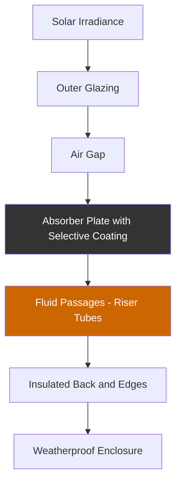
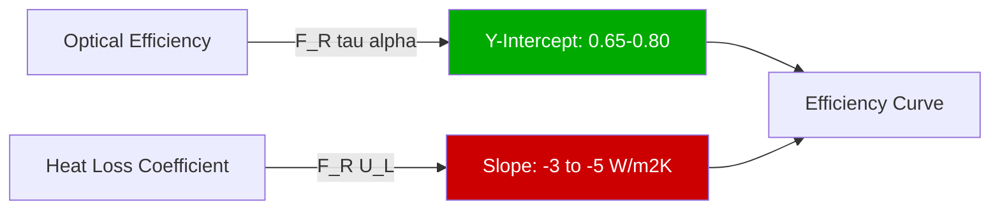

## Physical Construction

Flat plate collectors represent the most widely deployed solar thermal technology for domestic hot water systems, converting solar irradiance to thermal energy through absorptive surfaces. The collector assembly consists of five primary components functioning as an integrated thermal system.

### Absorber Plate Design

The absorber plate functions as the primary heat transfer surface, typically fabricated from copper or aluminum for high thermal conductivity. Copper absorbers provide thermal conductivity of 385 W/m·K, ensuring minimal temperature gradient between the absorption surface and fluid passages.

**Riser tube configurations:**
- Parallel tube: 8-12 tubes, 0.5-0.75 inch diameter, connected by header manifolds
- Serpentine: Single continuous tube path, higher pressure drop
- Flooded plate: Integral fluid passages within bonded metal sheets

Selective surface coatings maximize solar absorptance while minimizing thermal emittance. Black chrome, black nickel, or titanium oxynitride coatings achieve:
- Solar absorptance (α): 0.92-0.96
- Thermal emittance (ε): 0.05-0.15
- Enhanced performance at elevated temperatures

### Glazing Systems

Single or double glazing reduces convective and radiative heat losses from the absorber. Low-iron tempered glass transmits 85-91% of incident solar radiation while withstanding thermal stress and environmental loads.

| Glazing Configuration | Transmittance | Heat Loss Reduction | Cost Factor |
|----------------------|---------------|---------------------|-------------|
| Single 3.2mm low-iron glass | 0.91 | Baseline | 1.0 |
| Single 4.0mm low-iron glass | 0.89 | +5% | 1.1 |
| Double glazed with air gap | 0.82 | +15-25% | 1.6-1.8 |
| Single with anti-reflective coating | 0.94 | Baseline | 1.3 |

Air gap spacing between glazing and absorber typically ranges from 20-40mm, optimized to suppress convection while minimizing conduction.

### Insulation and Enclosure

Back and edge insulation minimizes conductive heat loss to ambient. Fiberglass, mineral wool, or polyisocyanurate insulation with thermal resistance R-11 to R-19 (1.9-3.3 m²·K/W) limits rear losses to 5-8% of collected energy.

The weatherproof enclosure, constructed from extruded aluminum or galvanized steel, protects internal components while maintaining structural integrity under wind and snow loads per ASCE 7.

## Thermal Performance Analysis

### Efficiency Equation

Collector thermal efficiency follows the modified Hottel-Whillier-Bliss equation per ASHRAE Standard 93:

$$\eta = F_R(\tau\alpha) - F_R U_L \frac{(T_i - T_a)}{G_T}$$

Where:
- $\eta$ = instantaneous thermal efficiency (dimensionless)
- $F_R$ = collector heat removal factor (0.85-0.95)
- $\tau$ = glazing transmittance (0.85-0.91)
- $\alpha$ = absorber absorptance (0.92-0.96)
- $U_L$ = overall heat loss coefficient (W/m²·K)
- $T_i$ = inlet fluid temperature (°C)
- $T_a$ = ambient air temperature (°C)
- $G_T$ = total solar irradiance on collector plane (W/m²)

The efficiency curve shows linear degradation as the temperature difference parameter $(T_i - T_a)/G_T$ increases.

### Efficiency Curve Characteristics

**Typical performance parameters:**
- Optical efficiency $F_R(\tau\alpha)$: 0.65-0.80
- First-order coefficient $F_R U_L$: 3.0-5.0 W/m²·K
- Second-order coefficient (nonlinear losses): 0.005-0.015 W/m²·K²

High-performance collectors with selective coatings and double glazing achieve reduced heat loss coefficients (2.5-3.5 W/m²·K), maintaining efficiency at higher operating temperatures.

### SRCC Performance Ratings

Solar Rating and Certification Corporation (SRCC) provides standardized performance ratings per ANSI/SRCC Standard 100. The OG-100 certification program tests collectors under controlled conditions, reporting:
- Daily energy output at specified conditions (MJ/day)
- Efficiency coefficients validated through testing
- Durability under thermal cycling and environmental exposure

## Operating Temperature Range

Flat plate collectors perform optimally in low-to-moderate temperature applications:

| Application | Operating Range | Typical Efficiency |
|-------------|----------------|-------------------|
| Domestic hot water preheating | 40-60°C (104-140°F) | 50-70% |
| Pool heating | 25-35°C (77-95°F) | 60-80% |
| Hydronic space heating | 50-70°C (122-158°F) | 40-60% |
| Process water heating | 60-80°C (140-176°F) | 30-50% |

Efficiency degrades at elevated temperatures due to increased thermal losses. For applications requiring temperatures above 80°C, evacuated tube collectors provide superior performance.

## System Integration Considerations

**Flow rate optimization:** Maintain fluid velocity of 0.3-0.5 m/s (1-1.5 fps) through risers, corresponding to flow rates of 0.012-0.020 L/s·m² (0.02-0.03 gpm/ft²) of collector area. Adequate flow ensures high heat removal factor while minimizing pumping energy.

**Stagnation temperature:** Under no-flow conditions with full solar irradiance, absorber temperatures can reach 150-200°C. System design must accommodate thermal expansion, pressure relief, and material degradation at stagnation.

**Orientation and tilt:** Maximize annual energy collection by orienting collectors toward the equator at tilt angle equal to latitude ±15°. Fixed installations compromise between summer and winter sun angles.

**Array configuration:** Series piping increases temperature rise per pass but elevates average operating temperature, reducing efficiency. Parallel reverse-return piping provides balanced flow distribution across multiple collectors.

## Performance Validation

ASHRAE Standard 93 specifies testing procedures for solar collector thermal performance, establishing standardized conditions:
- Irradiance levels: 800-1000 W/m²
- Inlet temperatures: Multiple test points spanning operating range
- Wind speed: Controlled or measured
- Incidence angle: Normal to collector aperture

Testing generates efficiency curves enabling system designers to predict energy delivery under varying meteorological conditions using hour-by-hour simulation tools such as TRNSYS or WATSUN.

## Economic and Practical Assessment

Flat plate collectors balance performance, durability, and cost-effectiveness for residential and light commercial applications. Typical installed costs range from $300-600/m² ($30-60/ft²), yielding simple payback periods of 10-20 years depending on displaced fuel costs and solar resource quality.

Service life exceeds 25 years with proper installation and maintenance, primarily involving periodic inspection of glazing seals, absorber coating integrity, and fluid quality. Collectors certified to SRCC OG-100 and ISO 9806 standards demonstrate proven long-term reliability under diverse climatic conditions.
