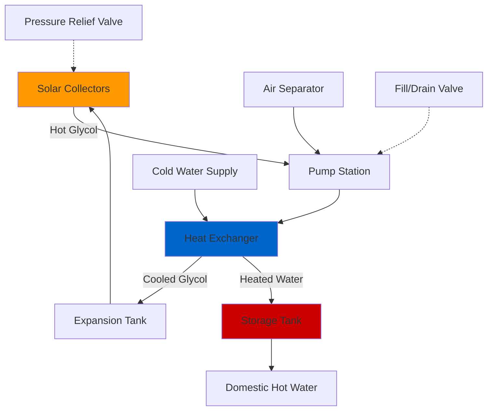

## Overview

Glycol-based solar water heating systems employ a closed-loop configuration with an antifreeze solution circulating through solar collectors, transferring heat to potable water via a heat exchanger. This indirect approach provides freeze protection in cold climates while isolating the collector fluid from the domestic water supply.

## Glycol Types and Selection

### Propylene Glycol vs. Ethylene Glycol

Propylene glycol is the preferred antifreeze for solar thermal applications due to its lower toxicity. While ethylene glycol offers superior heat transfer properties, its toxic nature creates unacceptable risks if the heat exchanger develops a leak into the potable water system.

**Key Properties Comparison:**

| Property | Propylene Glycol | Ethylene Glycol | Water |
|----------|-----------------|-----------------|-------|
| Specific Heat at 25°C (kJ/kg·K) | 2.48 | 2.35 | 4.18 |
| Thermal Conductivity (W/m·K) | 0.20 | 0.26 | 0.61 |
| Viscosity at 20°C (cP) | 60 | 20 | 1.0 |
| Toxicity | Low | High | None |

## Freeze Protection and Concentration

### Determining Required Glycol Concentration

The glycol concentration must be calculated based on the minimum expected ambient temperature with an appropriate safety factor.

**Design Temperature = Minimum Historical Temperature - 10°F**

This safety margin accounts for collector stagnation during power failures and extended periods without solar gain.

### Freeze Point vs. Concentration

| Glycol Concentration (% by volume) | Freeze Point (°F) | Freeze Point (°C) | Burst Protection (°F) |
|------------------------------------|-------------------|-------------------|-----------------------|
| 30% | 7 | -14 | -20 |
| 40% | -10 | -23 | -40 |
| 50% | -29 | -34 | -60 |
| 60% | -55 | -48 | -80 |

**Note:** Concentrations above 60% provide diminishing freeze protection and significantly reduce heat transfer efficiency. The optimal range for most applications is 40-50% by volume.

## System Configuration

### Primary Loop Components

1. **Solar Collectors** - Absorb solar radiation and heat the glycol solution
2. **Circulation Pump** - Maintains glycol flow rate per design specifications
3. **Heat Exchanger** - Transfers thermal energy from glycol to potable water
4. **Expansion Tank** - Accommodates thermal expansion of the glycol solution
5. **Air Separator** - Removes entrained air from the system
6. **Pressure Relief Valve** - Protects against over-pressure conditions

## Heat Exchanger Sizing

### Heat Transfer Calculations

The required heat exchanger area depends on the collector array output, fluid properties, and temperature differential.

**Basic Heat Transfer Equation:**

$$Q = UA \cdot LMTD$$

Where:
- $Q$ = Heat transfer rate (Btu/h)
- $U$ = Overall heat transfer coefficient (Btu/h·ft²·°F)
- $A$ = Heat exchanger surface area (ft²)
- $LMTD$ = Log mean temperature difference (°F)

**Log Mean Temperature Difference:**

$$LMTD = \frac{\Delta T_1 - \Delta T_2}{\ln(\Delta T_1 / \Delta T_2)}$$

Where:
- $\Delta T_1 = T_{glycol,in} - T_{water,out}$
- $\Delta T_2 = T_{glycol,out} - T_{water,in}$

### Overall Heat Transfer Coefficient

The overall heat transfer coefficient for glycol-to-water heat exchangers accounts for convective resistance on both sides plus conductive resistance through the exchanger material:

$$\frac{1}{U} = \frac{1}{h_{glycol}} + \frac{t_{wall}}{k_{wall}} + \frac{1}{h_{water}}$$

**Typical U-values for solar applications:**
- Plate heat exchangers: 150-250 Btu/h·ft²·°F
- Shell and tube: 80-120 Btu/h·ft²·°F
- Coil-in-tank: 50-80 Btu/h·ft²·°F

### Heat Exchanger Effectiveness

The effectiveness-NTU method provides an alternative sizing approach:

$$\varepsilon = \frac{Q_{actual}}{Q_{maximum}} = \frac{C_h(T_{h,in} - T_{h,out})}{C_{min}(T_{h,in} - T_{c,in})}$$

$$NTU = \frac{UA}{C_{min}}$$

Where:
- $\varepsilon$ = Heat exchanger effectiveness
- $NTU$ = Number of transfer units
- $C_{min}$ = Minimum heat capacity rate (Btu/h·°F)

**Design Target:** Heat exchanger effectiveness of 0.4-0.5 for economical solar thermal systems per ASHRAE 90.1 guidelines.

## Glycol Degradation and Maintenance

### Degradation Mechanisms

High-temperature stagnation degrades glycol through:
1. **Thermal breakdown** - Occurs above 250°F
2. **Oxidation** - Accelerated by air entrainment
3. **pH reduction** - Acidic conditions promote corrosion

### Monitoring Requirements

**Annual Testing Protocol:**
- pH measurement (acceptable range: 8.0-10.5)
- Freeze point verification with refractometer
- Visual inspection for color change (darkening indicates degradation)
- Inhibitor concentration check

### Replacement Criteria

Replace glycol solution when:
- pH drops below 7.5
- Freeze point rises 10°F above design value
- Solution appears dark brown or contains sediment
- System experiences repeated high-temperature stagnation events

ASHRAE Standard 90.1 requires glycol systems to include means for testing, draining, and recharging the collector fluid without breaking pressure-bearing connections.

## Expansion Tank Sizing

The expansion tank must accommodate volumetric expansion from minimum fill temperature to maximum stagnation temperature.

$$V_t = \frac{V_s \cdot \Delta v}{1 - \frac{P_i}{P_f}}$$

Where:
- $V_t$ = Required tank volume (gallons)
- $V_s$ = System fluid volume (gallons)
- $\Delta v$ = Specific volume change (typically 0.10-0.15 for 40-50% glycol)
- $P_i$ = Initial system pressure (psi absolute)
- $P_f$ = Final system pressure at pressure relief setting (psi absolute)

**Design Practice:** Size expansion tanks for 350°F maximum fluid temperature to account for stagnation conditions.

## Pressure Relief Protection

ASHRAE Standard 90.1 Section 7.4.4.2 requires:
- Pressure relief valve set at maximum collector rating or 150 psi, whichever is lower
- Relief discharge piped to approved location
- No shutoff valves between collectors and relief valve
- Relief valve sized per system fill volume and collector stagnation temperature

## Performance Considerations

### Heat Transfer Penalty

Glycol solutions reduce heat transfer efficiency compared to water due to lower specific heat and thermal conductivity. The performance penalty ranges from 5-15% depending on concentration.

**Correction Factor:**

$$\eta_{glycol} = \eta_{water} \cdot (0.90 - 0.002 \cdot C)$$

Where $C$ = glycol concentration (% by volume)

### Pumping Energy

Higher viscosity increases pumping power requirements. At 40% concentration and 100°F, propylene glycol viscosity is approximately 4-5 times that of water, requiring careful pump selection and verification of flow rates.

## Code Compliance

Systems must comply with:
- **ASHRAE 90.1** - Energy Standard for Buildings
- **IAPMO PS 11** - Solar Thermal System Fluids
- **SRCC Standard 400** - Rating and Certification of Solar Water Heating Systems
- Local plumbing and mechanical codes governing heat exchanger installation and cross-connection protection

Double-wall heat exchangers with intermediate venting may be required by local authority having jurisdiction to prevent glycol contamination of potable water supply.