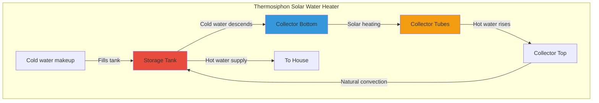
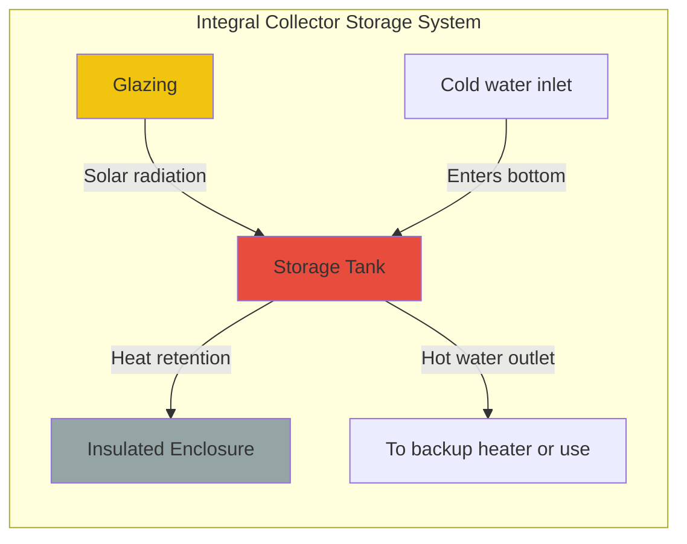

## Introduction to Passive Solar Water Heating

Passive solar water heating systems harness solar energy without mechanical pumps or controllers, relying on natural convection (thermosiphon effect) or direct storage within the collector. These systems offer simplicity, reliability, and lower installation costs compared to active systems, making them suitable for mild climates with minimal freeze risk.

## Thermosiphon Systems

### Operating Principle

Thermosiphon systems exploit the density difference between hot and cold water to establish natural circulation. As solar radiation heats water in the collector, its density decreases, causing it to rise into the storage tank positioned above. Cold water from the tank bottom flows down to replace it, creating a continuous circulation loop.

The buoyancy-driven flow rate in a thermosiphon loop is governed by:

$$Q = A \cdot v = A \sqrt{2g H \frac{\Delta \rho}{\rho_{avg}}}$$

Where:
- $Q$ = volumetric flow rate (m³/s)
- $A$ = flow cross-sectional area (m²)
- $v$ = flow velocity (m/s)
- $g$ = gravitational acceleration (9.81 m/s²)
- $H$ = vertical height between collector center and tank center (m)
- $\Delta \rho$ = density difference between hot and cold water (kg/m³)
- $\rho_{avg}$ = average water density (kg/m³)

The driving pressure differential is:

$$\Delta P = g \cdot H \cdot \Delta \rho$$

This pressure must overcome frictional losses in piping:

$$\Delta P_{friction} = f \frac{L}{D} \frac{\rho v^2}{2}$$

Where $f$ is the Darcy friction factor, $L$ is pipe length, and $D$ is pipe diameter.

### Critical Design Parameters

**Elevation Requirement:** The storage tank bottom must be positioned at least 300-600 mm (12-24 inches) above the collector top to ensure adequate thermosiphon pressure. Insufficient elevation results in weak circulation and poor performance.

**Pipe Sizing:** Larger diameter piping (typically 19-25 mm or 3/4-1 inch) reduces frictional resistance. The connecting pipes should be as short and straight as possible, with minimal bends.

**Reverse Circulation Prevention:** At night, reverse thermosiphon flow can occur if the collector cools below tank temperature. Check valves or thermal traps (upward pipe loops) prevent heat loss through reverse circulation.

### System Configuration

| Component | Specification | Purpose |
|-----------|---------------|---------|
| Collector area | 2-6 m² (20-65 ft²) | Sized for household demand |
| Storage tank | 150-300 L (40-80 gal) | 50-75 L per m² of collector |
| Tank elevation | 300-600 mm above collector | Enables thermosiphon pressure |
| Pipe diameter | 19-25 mm (3/4-1 inch) | Minimizes flow resistance |
| Insulation | R-10 to R-20 | Reduces standby losses |

## Integral Collector Storage (ICS) Systems

### Batch Heater Design

ICS systems, commonly called batch heaters, combine collection and storage in a single insulated unit. One or more water tanks are enclosed in a glazed, insulated box that serves as both collector and storage. Water heats throughout the day and is drawn directly for use or fed to a conventional backup heater.

The useful energy gain for an ICS system is:

$$Q_u = A_c \left[ S - U_L (T_{storage} - T_{ambient}) \right]$$

Where:
- $Q_u$ = useful energy collected (W)
- $A_c$ = collector aperture area (m²)
- $S$ = absorbed solar radiation (W/m²)
- $U_L$ = overall heat loss coefficient (W/m²·K)
- $T_{storage}$ = storage water temperature (°C)
- $T_{ambient}$ = ambient air temperature (°C)

The temperature rise in the storage volume over time $\Delta t$ is:

$$\Delta T = \frac{Q_u \cdot \Delta t}{m \cdot c_p}$$

Where $m$ is water mass and $c_p$ is specific heat (4,186 J/kg·K).

### Performance Characteristics

**Advantages:**
- No moving parts or separate storage tank
- Lower installation cost
- Minimal maintenance
- Compact footprint

**Limitations:**
- Higher heat loss at night (despite insulation)
- Limited capacity compared to thermosiphon systems
- Not suitable for freeze-prone climates
- Less efficient due to higher operating temperature

## Climate Suitability Analysis

Passive solar water heating systems have geographic and climatic constraints:

| Climate Zone | Thermosiphon Feasibility | ICS Feasibility | Primary Concern |
|--------------|--------------------------|-----------------|-----------------|
| Frost-free (USDA 9-11) | Excellent | Excellent | None |
| Mild winter (USDA 7-8) | Good with drain-back | Marginal | Occasional freeze |
| Moderate winter (USDA 5-6) | Requires drain-down | Not recommended | Frequent freeze |
| Cold winter (USDA 1-4) | Not recommended | Not recommended | Severe freeze risk |

**Freeze Protection Strategies:**

1. **Manual drain-down:** User drains system when freezing is forecast
2. **Automatic drain-back:** System drains to indoor tank when circulation stops
3. **Recirculation:** Pump circulates warm water during freeze events (converts to active system)
4. **Antifreeze solutions:** Not practical for potable water contact in passive systems

## Design Standards and Performance

ASHRAE 90.2 and the Solar Rating and Certification Corporation (SRCC) provide testing standards for passive solar water heaters. SRCC OG-300 establishes rating procedures for ICS systems, while thermosiphon systems follow similar protocols adapted from active system standards.

**Typical Performance Metrics:**

- Solar fraction: 40-70% in suitable climates
- Daily efficiency: 30-50% (ICS), 40-60% (thermosiphon)
- Payback period: 5-12 years depending on energy costs
- System life: 15-25 years with proper maintenance

## System Comparison

| Feature | Thermosiphon | ICS (Batch Heater) |
|---------|--------------|---------------------|
| Complexity | Moderate | Low |
| Efficiency | Higher | Moderate |
| Night heat loss | Low (insulated tank) | Higher (exposed mass) |
| Freeze tolerance | Very poor | Very poor |
| Installation cost | $3,000-5,000 | $2,000-4,000 |
| Roof load | Separate tank and collector | Heavier single unit |
| Best application | Mild climates, year-round use | Vacation homes, seasonal use |

## Installation Considerations

**Structural Requirements:** ICS units impose significant roof loads (200-400 kg when filled). Structural analysis is mandatory per building codes.

**Orientation:** Collectors should face true south (northern hemisphere) with tilt angle approximately equal to latitude for optimal year-round performance.

**Plumbing Integration:** Passive systems typically serve as preheaters to conventional water heaters, providing tempered water that reduces backup heating energy.

**Maintenance:** Annual inspection includes checking glazing integrity, insulation condition, and verifying proper thermosiphon circulation through temperature measurements at collector inlet and outlet.

## Conclusion

Passive solar water heating systems offer reliable, low-maintenance solar energy utilization in appropriate climates. Thermosiphon systems provide superior performance but require careful attention to tank elevation and piping design. ICS systems trade efficiency for simplicity and lower cost. Both technologies are viable only in frost-free or mild climates unless equipped with freeze protection measures that may compromise their passive operation.

Selection between passive and active solar water heating depends on climate severity, installation constraints, budget, and user tolerance for seasonal performance variation.