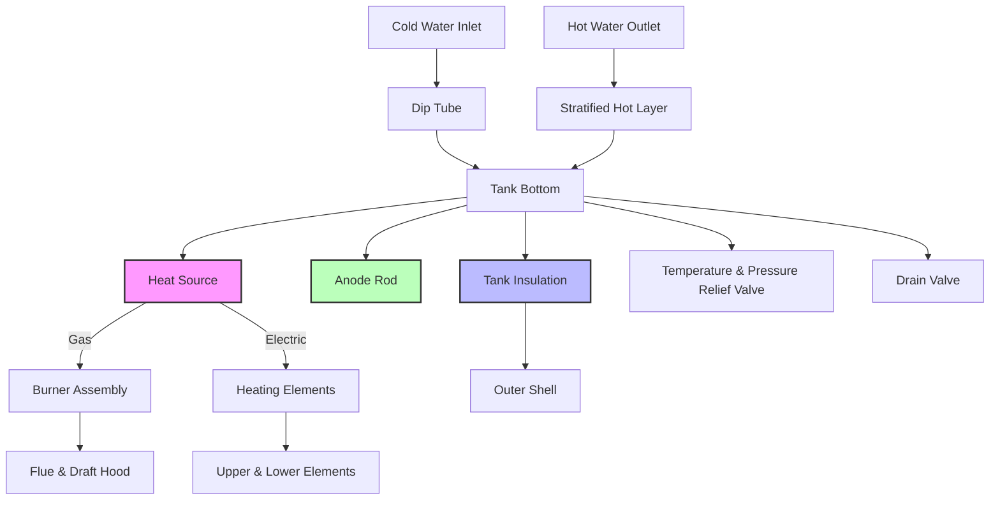

Storage tank water heaters represent the most common domestic hot water system in residential and light commercial applications. These units combine heat generation with thermal storage, maintaining a reserve of hot water at setpoint temperature through continuous or staged heating cycles.

## Operating Principles

Storage tank water heaters operate on a simple thermostatic control principle. Cold water enters the tank bottom through a dip tube, displacing hot water at the top through buoyancy-driven stratification. When tank temperature drops below setpoint, burners or electric elements activate until temperature recovers. This thermal storage approach provides high instantaneous flow rates exceeding the heater's continuous heating capacity.

The fundamental energy balance governing tank operation:

$$Q_{stored} = m c_p \Delta T = \rho V c_p (T_{tank} - T_{inlet})$$

Where:
- $Q_{stored}$ = stored energy (BTU or kJ)
- $m$ = water mass (lb or kg)
- $\rho$ = water density (8.34 lb/gal or 1000 kg/m³)
- $V$ = tank volume (gal or L)
- $c_p$ = specific heat of water (1.0 BTU/lb·°F or 4.186 kJ/kg·K)
- $\Delta T$ = temperature rise (°F or K)

## System Components

**Critical Components:**

- **Tank Construction**: Glass-lined steel or stainless steel pressure vessel rated 150 psi minimum
- **Anode Rod**: Sacrificial magnesium or aluminum electrode protecting tank from galvanic corrosion
- **Insulation**: Polyurethane foam or fiberglass blanket (R-12 to R-24 typical)
- **Dip Tube**: Delivers cold water to tank bottom, preserving stratification
- **T&P Relief Valve**: Safety device opening at 150 psi or 210°F

## Performance Metrics

### Recovery Rate

Recovery rate quantifies the heater's ability to raise water temperature continuously:

$$R = \frac{Q_{input} \times \eta}{8.34 \times \Delta T} \text{ (gal/hr)}$$

Where:
- $Q_{input}$ = burner or element input (BTU/hr)
- $\eta$ = thermal efficiency (decimal)
- $\Delta T$ = temperature rise (°F)
- 8.34 = water density (lb/gal)

**Example**: A 40,000 BTU/hr gas heater at 62% efficiency raising water 90°F:

$$R = \frac{40,000 \times 0.62}{8.34 \times 90} = 33 \text{ gal/hr}$$

### First Hour Rating (FHR)

FHR represents total hot water delivery in the first hour of maximum draw:

$$FHR = V \times 0.7 + R \text{ (gallons)}$$

The 0.7 factor accounts for usable storage before excessive mixing occurs. This metric sizes heaters for peak demand periods.

### Standby Loss

Standby loss quantifies heat dissipation through tank surfaces:

$$Q_{standby} = UA(T_{tank} - T_{ambient})$$

Where:
- $U$ = overall heat transfer coefficient (BTU/hr·ft²·°F)
- $A$ = tank surface area (ft²)
- Typical standby loss: 1-3% of tank energy per hour

DOE test procedures measure standby loss as percentage per hour at 135°F setpoint.

## Temperature Stratification

Thermal stratification significantly impacts performance. Hot water (lower density) naturally rises, creating distinct temperature layers. Strong stratification preserves hot water availability; mixing reduces effective storage. Design factors affecting stratification:

- Dip tube length and placement
- Draw flow rates (>3 gpm promotes mixing)
- Tank height-to-diameter ratio (>2:1 optimal)
- Internal baffles or diffusers

## Gas vs Electric Comparison

| Parameter | Gas Storage Tank | Electric Storage Tank |
|-----------|------------------|----------------------|
| **Energy Factor (EF)** | 0.58 - 0.70 | 0.90 - 0.95 |
| **Recovery Rate** | 35-60 gal/hr (40k BTU) | 15-25 gal/hr (4.5kW) |
| **Input Range** | 30,000 - 75,000 BTU/hr | 3,000 - 6,000 W |
| **Venting Required** | Yes (Type B or power) | No |
| **Operating Cost** | Lower (typical) | Higher (electric rates) |
| **Installation Cost** | Higher (venting, gas line) | Lower |
| **Lifespan** | 8-12 years | 10-15 years |
| **Combustion Air** | 50 CFM per 1000 BTU | None |

## DOE Efficiency Standards

Current federal standards (effective 2015, updated 2023) mandate minimum Energy Factor (EF) or Uniform Energy Factor (UEF) values:

**Residential Gas Storage (<55 gal)**:
- UEF ≥ 0.64 - 0.0019 × V (where V = volume in gallons)

**Residential Electric Storage (<55 gal)**:
- UEF ≥ 0.93 - 0.00132 × V

**Commercial Applications (>119 gal)**:
- Thermal efficiency ≥ 80% (gas)
- Standby loss ≤ specified tables

The UEF test protocol incorporates realistic draw patterns (low, medium, high usage) replacing the single-point EF test.

## Sizing Methodology

Proper sizing balances first-hour rating against peak demand:

1. **Determine Peak Hour Demand**: Sum fixture usage during maximum draw period
2. **Calculate Required FHR**: Must exceed peak demand by 10-20%
3. **Select Tank Size**: Balance FHR, recovery rate, and space constraints
4. **Verify Recovery**: Recovery rate should handle sustained draws

**Typical Residential Sizing**:
- 1-2 people: 30-40 gal (47-60 FHR)
- 3-4 people: 40-50 gal (60-80 FHR)
- 5+ people: 50-80 gal (80-100+ FHR)

## Efficiency Optimization

Maximizing thermal efficiency requires attention to heat retention and combustion/electrical efficiency:

- **Insulation Upgrades**: Add R-10 blanket to older units (pre-2004)
- **Pipe Insulation**: First 6 ft of hot and cold pipes reduces standby loss 2-4%
- **Temperature Setpoint**: 120°F balances safety and efficiency (each 10°F reduction saves 3-5%)
- **Anode Maintenance**: Replace when >6 inches of core wire exposed
- **Sediment Flushing**: Annual drain removes insulating scale layer

## Installation Considerations

Code-compliant installation addresses safety and performance:

- **Clearances**: 6 inches combustibles (gas), zero clearance typically allowed (electric)
- **T&P Discharge**: Pipe to approved location within 6 inches of floor
- **Seismic Restraints**: Two straps required in seismic zones
- **Combustion Air**: 50 CFM per 1,000 BTU input minimum (gas)
- **Expansion Tank**: Required in closed systems to prevent excessive pressure
- **Drain Pan**: Mandatory in spaces above finished areas

Storage tank water heaters continue evolving with improved insulation, electronic controls, and hybrid heat pump variants, but fundamental thermal storage principles remain unchanged. Proper selection, installation, and maintenance deliver reliable domestic hot water service for residential and light commercial applications.
