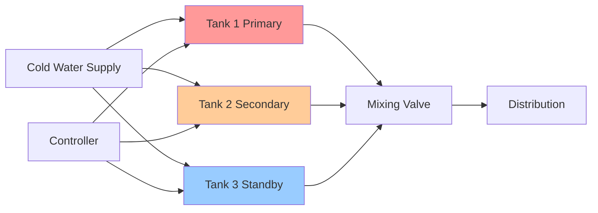
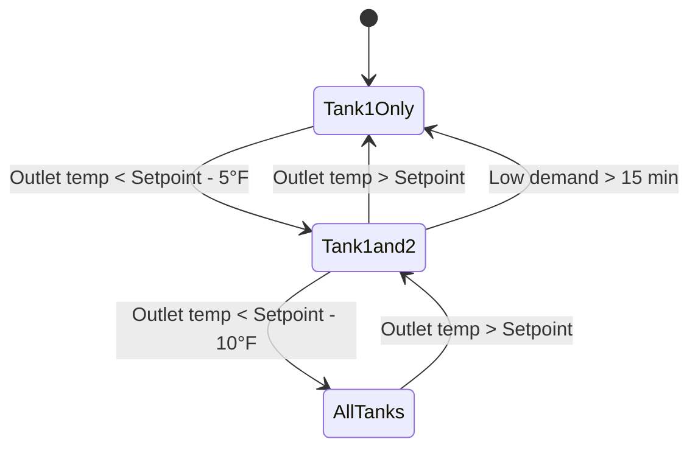

## Overview

Commercial storage tank water heaters serve applications requiring substantial hot water volumes with consistent delivery temperatures. These systems range from 80 to 1000+ gallons and incorporate heavy-duty construction, enhanced insulation, and high-capacity burners to meet commercial demand profiles.

Storage tank heaters store heated water at setpoint temperature (typically 120-140°F) and deliver it on demand. The tank provides thermal mass that buffers short-duration peak loads while the burner recovers stored volume during off-peak periods.

## Construction and Components

### Glass-Lined Tank Construction

Commercial storage tanks employ glass-lined steel construction to resist corrosion in potable water service:

**Tank Design Elements:**
- Carbon steel tank with porcelain enamel glass lining
- Lining thickness 0.010-0.020 inches
- Vitreous coating applied at 1500°F
- Anode rod(s) for cathodic protection
- ASME pressure vessel certification (typically 150 PSI working pressure)

Glass lining provides a barrier between water and steel substrate. Magnesium or aluminum anode rods sacrifice themselves to protect exposed steel at lining imperfections.

### Insulation Systems

Commercial units feature substantially higher insulation values than residential models:

| Insulation Level | R-Value | Application |
|-----------------|---------|-------------|
| Standard Commercial | R-16 | General commercial applications |
| High-Efficiency | R-20 to R-24 | Energy code compliance, high-temperature setpoints |
| Ultra-Efficient | R-28+ | Hospitals, laboratories requiring minimal standby loss |

Insulation consists of polyurethane foam or fiberglass blanket between tank and jacket. Standby heat loss decreases approximately 15-20% for each R-4 increase in insulation value.

### High-Input Burners

Commercial burners deliver substantially higher heat input than residential units:

**Typical Input Ranges by Tank Size:**

| Tank Capacity (gal) | Gas Input (MBH) | Electric Input (kW) | Recovery @ 100°F Rise (GPH) |
|---------------------|-----------------|---------------------|------------------------------|
| 80-100 | 75-100 | 18-27 | 75-95 |
| 119-150 | 100-150 | 36-54 | 95-145 |
| 200-300 | 150-250 | 54-90 | 145-240 |
| 400-500 | 250-400 | 90-144 | 240-380 |

Recovery rate represents gallons per hour the burner can heat from incoming cold water temperature to setpoint.

## Sizing Methodology

### Storage and Recovery Calculation

Commercial water heater sizing combines storage volume and recovery rate to meet peak hourly demand. ASHRAE 90.1 and local plumbing codes govern minimum efficiency and sizing approaches.

**Primary Sizing Equation:**

$$V_{storage} + (t_{peak} \times R) \geq Q_{peak}$$

Where:
- $V_{storage}$ = usable storage capacity (gallons)
- $t_{peak}$ = duration of peak demand period (hours)
- $R$ = recovery rate (GPH)
- $Q_{peak}$ = peak hourly demand (gallons)

**Recovery Rate Calculation:**

$$R = \frac{Q_{input} \times \eta \times 60}{8.33 \times \Delta T}$$

Where:
- $Q_{input}$ = burner input rate (BTU/hr)
- $\eta$ = thermal efficiency (typically 0.80-0.82 for atmospheric gas, 0.98+ for condensing)
- $\Delta T$ = temperature rise (°F) = setpoint - incoming water temperature
- $8.33$ = weight of water (lb/gal)
- $60$ = minutes per hour

**Example Calculation:**

For a commercial kitchen requiring 400 gallons peak draw over 1 hour, incoming water at 50°F, setpoint 140°F:

$$\Delta T = 140 - 50 = 90°F$$

Assume 200 MBH input, 80% efficiency:

$$R = \frac{200{,}000 \times 0.80 \times 60}{8.33 \times 90} = 159.8 \text{ GPH}$$

Required storage:

$$V_{storage} = 400 - (1.0 \times 159.8) = 240.2 \text{ gallons}$$

Select 250-gallon tank with 200 MBH input.

### ASHRAE Draw Profile Method

ASHRAE Standard 118.1 and 118.2 define standardized draw profiles for equipment testing. The modified draw method accounts for realistic usage patterns:

**Draw Profile Equation:**

$$V_{tank} = \frac{Q_{peak} - (R \times t_{draw})}{F_{storage}}$$

Where:
- $F_{storage}$ = storage utilization factor (0.70-0.85 typical)
- $t_{draw}$ = actual draw duration during peak hour

This method recognizes that only 70-85% of tank volume is thermally useful before significant temperature degradation occurs.

## Multiple Tank Systems

### Configuration Options

Large commercial installations often employ multiple smaller tanks rather than single large units for redundancy, maintenance access, and equipment fit.

**Series Configuration:**

Cold water feeds first tank, outlet feeds second tank inlet. Provides maximum recovery but sequential failure risk.

**Parallel Configuration:**

Cold water feeds all tanks via manifold, outlets combine to distribution. Provides redundancy and staging capability.

**Master-Slave Staging:**

Primary tank(s) operate continuously, secondary tanks fire based on outlet temperature or flow demand. Reduces cycling and improves efficiency during low-demand periods.

### Staging Control Logic

Modern commercial systems employ microprocessor controls for multi-tank staging:

Staging logic prevents short-cycling while maintaining supply temperature during demand fluctuations.

## Efficiency Standards

ASHRAE 90.1 and DOE 10 CFR 431 establish minimum efficiency requirements for commercial storage water heaters:

**Gas-Fired Storage (≥ 75,000 BTU/hr):**

$$E_t = \frac{Q_{input}}{800 + 110\sqrt{V}}$$

Where:
- $E_t$ = thermal efficiency (decimal)
- $V$ = rated storage volume (gallons)

**Standby Loss Requirement:**

$$SL \leq \frac{Q_{input}}{800 + 110\sqrt{V}} \times \left(\frac{70}{\sqrt{V}}\right)$$

Maximum standby loss decreases as tank volume increases due to surface area to volume relationship.

## Installation Considerations

**Venting Requirements:**

High-input atmospheric units require category I venting sized per NFPA 54. Single-wall metal vent diameter:

$$D_{vent} = \sqrt{\frac{Q_{input}}{1000 \times C_{factor}}}$$

Where $C_{factor}$ ranges from 25-35 depending on vent height and configuration.

Condensing units employ category IV (positive pressure, condensing) PVC or CPVC venting.

**Combustion Air:**

Standard method requires 50 CFM per 1000 BTU/hr input from outside air or 1 square inch free area per 4000 BTU/hr.

**Seismic Restraint:**

IBC and IPC require seismic restraint strapping at upper third and lower third of tank height in seismic zones. Straps must resist 0.4 times equipment operating weight.

## Maintenance and Service Life

**Expected Service Life:**

Glass-lined commercial tanks: 10-15 years typical, 20+ years with proper maintenance.

**Critical Maintenance Tasks:**

- Anode rod inspection annually, replacement when 75% depleted
- Temperature-pressure relief valve annual operation test
- Drain and flush sediment semi-annually in hard water areas
- Combustion analysis and burner tune-up annually
- Insulation jacket inspection for damage

**Failure Modes:**

Primary failure mechanism is lining degradation exposing steel to corrosive water chemistry. Depleted anode rods accelerate tank perforation. Regular anode replacement extends service life substantially.

## Application Selection Guide

| Application Type | Recommended Configuration | Sizing Factor |
|------------------|---------------------------|---------------|
| Office buildings | Single tank, standard recovery | 0.5-1.0 gal per person |
| Restaurants | Multiple tanks, high recovery | 1.5-2.5 gal per meal served |
| Hotels | Staged parallel tanks | 30-40 gal per room |
| Healthcare | Redundant parallel, high temp | 25-35 gal per bed |
| Fitness centers | High recovery, tempering | 3-5 gal per locker |

Selection must account for usage diversity, peak duration, and temperature requirements per ASHRAE Applications Handbook Chapter 51.

---

**References:**
- ASHRAE 90.1: Energy Standard for Buildings
- ASHRAE 118.1: Method of Testing for Rating Commercial Gas Water Heating Equipment
- AHRI 1500: Performance Rating of Commercial Storage Water Heaters
- IPC: International Plumbing Code
