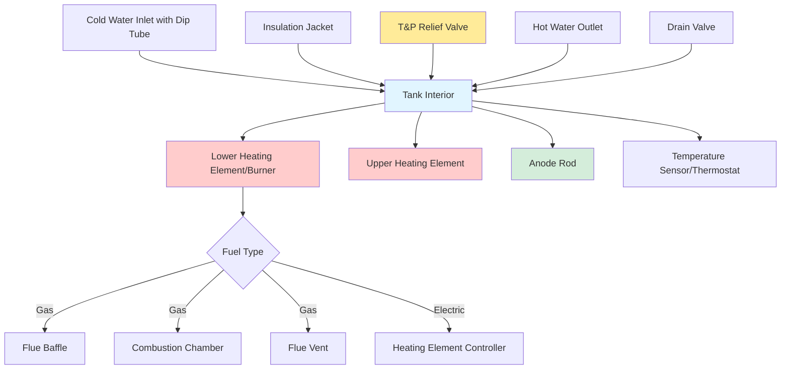

Residential storage water heaters represent the dominant technology for domestic hot water production in single-family and multi-family dwellings. These systems maintain a volume of heated water at setpoint temperature (typically 120-140°F) through continuous energy input to offset standby thermal losses and meet intermittent draw demands.

## Fuel Types and Heat Transfer Mechanisms

### Gas-Fired Storage Heaters

Gas-fired units employ atmospheric or power-vented burners located beneath the tank. Combustion products transfer heat through a central flue tube running vertically through the water volume. Typical input ranges from 30,000 to 76,000 BTU/hr for residential applications, with thermal efficiencies of 60-67% for atmospheric venting and up to 80% for power-vented or direct-vent configurations.

The recovery rate for gas heaters is calculated as:

$$R_{gas} = \frac{\eta \cdot Q_{input}}{8.33 \cdot \Delta T}$$

where:
- $R_{gas}$ = recovery rate (gallons per hour)
- $\eta$ = thermal efficiency (decimal)
- $Q_{input}$ = burner input rate (BTU/hr)
- $\Delta T$ = temperature rise (°F), typically 90°F for 50°F inlet to 140°F setpoint

### Electric Resistance Heaters

Electric units utilize immersion heating elements (typically 3,500-5,500 watts each) positioned in the lower and upper portions of the tank. Heat transfer occurs through direct conduction into the surrounding water. Electric heaters achieve 100% conversion efficiency but incur higher operating costs in most utility rate structures.

Recovery rate for electric heaters:

$$R_{elec} = \frac{3.412 \cdot P_{total}}{8.33 \cdot \Delta T}$$

where $P_{total}$ is total element wattage and 3.412 converts watts to BTU/hr.

## Performance Metrics

### First Hour Rating (FHR)

FHR quantifies the volume of hot water deliverable in one hour starting with a fully heated tank, accounting for both stored volume and recovery during draw. This metric directly correlates to occupant usage patterns.

$$\text{FHR} = V_{tank} \cdot 0.70 + R \cdot 1.0$$

where $V_{tank}$ is nominal capacity and $R$ is recovery rate. The 0.70 factor accounts for thermal stratification and usable volume.

### Energy Factor (EF)

Energy Factor represents the ratio of useful energy output to total energy input under standardized DOE test conditions. The inverse relationship defines annual energy consumption:

$$E_{annual} = \frac{12,500 + 17,000 \cdot N_{BR} - 4,000 \cdot N_{units}}{\text{EF}}$$

where $N_{BR}$ is number of bedrooms and $N_{units}$ is number of dwelling units served.

### Uniform Energy Factor (UEF)

DOE standards effective 2015 replaced EF with UEF, which evaluates performance across multiple draw patterns. UEF testing protocols better simulate actual usage and standby conditions. Minimum UEF requirements vary by tank capacity and fuel type, with current standards requiring:

- Gas storage ≥ 55 gallons: UEF ≥ 0.64
- Electric storage ≥ 55 gallons: UEF ≥ 0.92

## Residential Tank Heater Components

## Residential Storage Tank Comparison

| Parameter | 40 Gallon | 50 Gallon | 80 Gallon |
|-----------|-----------|-----------|-----------|
| **Gas-Fired Units** | | | |
| Input Rate (BTU/hr) | 36,000-40,000 | 38,000-40,000 | 75,000-76,000 |
| Recovery @ 90°F Rise (GPH) | 40-43 | 41-43 | 80-82 |
| First Hour Rating (Gal) | 68-71 | 75-78 | 136-138 |
| Typical UEF | 0.62-0.67 | 0.61-0.65 | 0.64-0.68 |
| Standby Loss (%/hr) | 1.8-2.2 | 1.5-1.9 | 1.2-1.6 |
| **Electric Units** | | | |
| Element Wattage | 4,500 | 4,500-5,500 | 5,500 |
| Recovery @ 90°F Rise (GPH) | 18-19 | 18-23 | 23-24 |
| First Hour Rating (Gal) | 46-47 | 53-58 | 80-82 |
| Typical UEF | 0.93-0.95 | 0.92-0.94 | 0.90-0.92 |
| Standby Loss (%/hr) | 1.0-1.4 | 0.9-1.2 | 0.7-1.0 |
| **Physical Dimensions** | | | |
| Height (inches) | 54-61 | 58-65 | 72-78 |
| Diameter (inches) | 20-22 | 20-22 | 24-26 |
| Weight Empty (lbs) | 95-130 | 110-145 | 165-210 |
| Weight Full (lbs) | 430-465 | 525-560 | 830-875 |

## Sizing Methodology

Residential water heater selection requires matching FHR to peak hourly demand. ASHRAE guideline values for fixture flow rates:

- Shower: 2.5 GPM × 10 minutes = 25 gallons
- Bath: 1.0 GPM × 15 minutes = 15 gallons
- Dishwasher: 6 gallons per cycle
- Clothes washer: 7 gallons per cycle

For a 3-bedroom home with morning peak usage (2 showers + dishwasher), minimum FHR = 56 gallons, indicating a 40-gallon gas or 50-gallon electric unit.

## Critical Installation Requirements

### Combustion Air and Venting

Gas heaters require adequate combustion air—50 cubic feet per 1,000 BTU/hr input when using indoor air. Atmospheric venting demands Type B double-wall vent with minimum 1/4 inch per foot rise. Power-vented units exhaust through PVC or CPVC horizontally.

### Temperature and Pressure Relief

All storage heaters require T&P relief valves rated for tank working pressure (typically 150 PSIG) and 210°F, with discharge piping terminating within 6 inches of floor and sized to valve connection (typically 3/4 inch).

### Thermal Expansion Control

Closed water supply systems (with backflow preventers or check valves) mandate thermal expansion tanks to accommodate volumetric increase during heating, preventing nuisance T&P discharge or system overpressurization.

### Seismic and Floodplain Considerations

Installation in seismic zones requires restraint strapping at upper and lower thirds of tank height. Units in floodplain areas must be elevated above base flood elevation or utilize flood-resistant construction.

## Efficiency Enhancement Technologies

Modern residential storage heaters incorporate foam insulation (R-16 to R-24), submerged combustion chambers, and electronic ignition to minimize standby losses. Heat trap nipples on inlet and outlet connections prevent thermosiphoning. Powered anode rods extend service life by providing continuous corrosion protection independent of sacrificial consumption.

## Maintenance and Service Life

Residential storage tanks typically achieve 8-12 year service life with proper maintenance. Annual tasks include:

- Sediment flushing via drain valve
- Anode rod inspection and replacement at 50% depletion
- T&P valve operation verification
- Combustion analysis for gas units (CO levels, flue draft)

Premature failure modes include tank perforation from corrosion, element burnout from sediment accumulation, and thermostat malfunction from mineral scaling.
