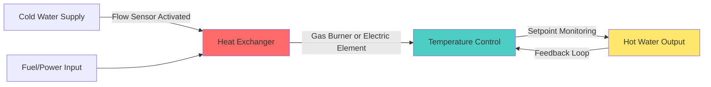

# Tankless Water Heaters

Tankless water heaters, also known as instantaneous or on-demand water heaters, eliminate the storage tank and heat water directly as it flows through the unit. This fundamental design difference creates distinct performance characteristics and application considerations compared to conventional storage systems.

## Operating Principle

When a hot water tap opens, cold water travels through a pipe into the tankless unit. A flow sensor detects the water movement and activates the heating element or gas burner. The water passes through a heat exchanger where it rapidly absorbs thermal energy before exiting to the fixture.

The control system modulates the heat input to maintain the target outlet temperature across varying flow rates. This dynamic response differentiates tankless units from the relatively static operation of storage heaters.

## Fundamental Sizing Equation

The required heating capacity depends on the simultaneous flow rate and the temperature rise needed:

$$Q = \dot{m} \cdot c_p \cdot \Delta T$$

Where:
- $Q$ = required heating capacity (Btu/hr or kW)
- $\dot{m}$ = mass flow rate (lb/hr or kg/hr)
- $c_p$ = specific heat of water (1.0 Btu/lb·°F or 4.186 kJ/kg·K)
- $\Delta T$ = temperature rise (°F or °C)

For practical application using volumetric flow rate:

$$Q = 500 \cdot \text{GPM} \cdot \Delta T \quad \text{(Btu/hr)}$$

$$Q = 4.186 \cdot \text{LPM} \cdot \Delta T \quad \text{(kW)}$$

### Example Calculation

Design a tankless heater for a residential application:
- Simultaneous flow: 3.0 GPM (shower + sink)
- Inlet temperature: 50°F
- Desired outlet: 120°F
- Temperature rise: 70°F

$$Q = 500 \times 3.0 \times 70 = 105{,}000 \text{ Btu/hr}$$

Select a unit rated for at least 105,000 Btu/hr input capacity. Account for efficiency:

$$\text{Output} = \text{Input} \times \eta$$

For a unit with 0.95 efficiency: $105{,}000 \times 0.95 = 99{,}750$ Btu/hr delivered capacity.

## Technology Comparison

| Parameter | Gas Tankless | Electric Tankless |
|-----------|--------------|-------------------|
| Typical Capacity Range | 140,000-199,000 Btu/hr | 12-36 kW (41,000-123,000 Btu/hr) |
| Thermal Efficiency | 0.82-0.98 (condensing) | 0.99 |
| Installation Complexity | High (venting, gas line) | Moderate to High (electrical service) |
| Electrical Requirements | 120V, <2A | 208-240V, 50-150A |
| Maintenance Frequency | Annual descaling, combustion check | Minimal, occasional descaling |
| Lifespan | 15-20 years | 10-15 years |
| Space Requirements | 18" × 24" × 10" typical | 12" × 18" × 4" typical |
| Cold Climate Performance | Excellent with sufficient capacity | Limited by electrical service |

## Performance Characteristics

### Flow Rate Limitations

Each tankless unit has a maximum flow rate at which it can maintain the specified temperature rise. This creates a performance envelope:

$$\text{GPM}_{\text{max}} = \frac{Q}{500 \cdot \Delta T}$$

As inlet temperature decreases (winter conditions), the maximum achievable flow rate decreases proportionally. A unit providing 5.0 GPM at 50°F inlet may only deliver 3.5 GPM at 35°F inlet for the same outlet temperature.

### Temperature Stability

Modern tankless units employ proportional-integral-derivative (PID) control algorithms to maintain outlet temperature. However, sudden flow changes can cause brief temperature fluctuations of ±5-10°F during the adjustment period.

## Advantages and Disadvantages

### Advantages

**Energy Efficiency**: Eliminates standby heat loss inherent in storage tanks. ASHRAE 118.2 testing shows annual energy savings of 24-34% for typical residential usage patterns compared to standard storage heaters with 0.55-0.60 energy factor.

**Unlimited Hot Water**: Continuous operation provides endless hot water supply, limited only by the flow rate capacity.

**Space Savings**: Wall-mounted units occupy 1-2 ft² compared to 9-16 ft² for equivalent storage systems.

**Longevity**: Properly maintained tankless units typically exceed storage heater lifespans by 5-10 years.

**Reduced Scaling**: Continuous flow reduces sediment accumulation compared to stagnant storage tanks.

### Disadvantages

**High Initial Cost**: Purchase and installation costs run 2-3× higher than conventional storage systems.

**Flow Rate Constraints**: Cannot serve unlimited simultaneous fixtures. Requires careful sizing for peak demand.

**Temperature Rise Limitations**: Cold climates require higher capacity units or acceptance of lower flow rates.

**Electrical Demand**: Whole-house electric units require 150-200A service, often necessitating panel upgrades.

**Recirculation Energy Penalty**: Maintaining instant hot water via recirculation loops eliminates much of the efficiency advantage.

## Application Guidelines

### Residential Applications

**Single Bathroom Home**: 140,000-180,000 Btu/hr gas or 18-24 kW electric
**Multi-Bathroom Home**: 180,000-199,000 Btu/hr gas or 24-36 kW electric (may require multiple units)
**Point-of-Use**: 27-36 kW electric for remote bathrooms or kitchens

### Commercial Applications

Tankless units excel in applications with intermittent demand patterns:
- Restaurants (warewashing stations)
- Industrial facilities (process water)
- Emergency showers
- Remote facility buildings

For continuous high-volume commercial applications, storage or semi-instantaneous designs typically prove more economical.

## Design Considerations Per ASHRAE Standards

ASHRAE 90.1 requires:
- Thermal efficiency ≥ 0.80 for gas units < 200,000 Btu/hr
- Thermal efficiency ≥ 0.90 for condensing gas units
- Standby loss < 2% of stored energy (tankless inherently complies)

ASHRAE 118.2 provides standardized testing procedures for simulated use tests, enabling accurate comparison between models and technologies.

## Installation Requirements

**Gas Units**:
- Category III or IV venting (stainless steel or PVC for condensing)
- Adequate gas supply: verify pressure drop at design flow
- Condensate drain for condensing models
- Freeze protection in unconditioned spaces

**Electric Units**:
- Dedicated circuits sized per NEC Article 422
- Wire gauge adequate for amperage: 6 AWG minimum for 40A, 3 AWG for 80A
- Appropriate overcurrent protection
- GFCI protection per local codes

## Maintenance Protocol

**Annual Tasks**:
1. Descale heat exchanger with citric acid or manufacturer solution
2. Clean inlet filter screens
3. Verify proper combustion (gas units): CO < 400 ppm air-free
4. Check and clean flame sensor
5. Inspect venting system for obstructions or deterioration

**Every 5 Years**:
- Replace sacrificial anode (if equipped)
- Inspect and test pressure relief valve
- Verify flow sensor calibration

Proper maintenance extends service life and preserves efficiency within 2-3% of nameplate ratings throughout the unit's operational lifetime.
