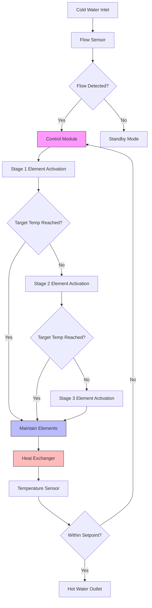
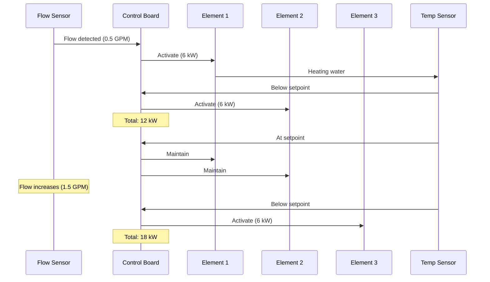

Electric tankless water heaters provide on-demand hot water through resistance heating elements without storage tanks. These units range from compact point-of-use models (3-12 kW) to whole-house systems (18-36 kW), offering installation flexibility but requiring substantial electrical infrastructure.

## Operating Principles

Electric tankless heaters use resistance heating elements that activate when flow sensors detect water movement. As cold water passes through the heat exchanger, multiple heating elements stage on progressively to achieve the target temperature rise. The instantaneous nature eliminates standby losses but demands high electrical power density.

**Heat Transfer Equation:**

The required power is calculated from the fundamental heat transfer relationship:

$$P = \frac{\dot{m} \cdot c_p \cdot \Delta T}{\eta}$$

Where:
- $P$ = electrical power required (kW)
- $\dot{m}$ = mass flow rate (kg/s)
- $c_p$ = specific heat of water = 4.186 kJ/(kg·K)
- $\Delta T$ = temperature rise (K or °C)
- $\eta$ = heating efficiency (typically 0.98-0.99)

**Practical Sizing Formula:**

For field calculations using common units:

$$P_{kW} = \frac{GPM \times \Delta T \times 8.33}{3412 \times \eta}$$

Simplified for 99% efficiency:

$$P_{kW} \approx \frac{GPM \times \Delta T}{500}$$

Where:
- $GPM$ = gallons per minute
- $\Delta T$ = temperature rise (°F)
- 8.33 = pounds per gallon of water
- 3412 = BTU per kWh

## Electrical Requirements

Electric tankless heaters impose significant electrical demands that often exceed residential service capacities. NEC Article 422.13 classifies these as fixed storage-type water heaters requiring dedicated branch circuits.

### Typical Power Requirements

| Application | Flow Rate | Temp Rise | Power Required | Voltage | Amperage |
|-------------|-----------|-----------|----------------|---------|----------|
| Point-of-use (sink) | 0.5 GPM | 70°F | 7 kW | 240V | 29A |
| Point-of-use (shower) | 1.5 GPM | 70°F | 21 kW | 240V | 87A |
| Single bathroom | 2.0 GPM | 70°F | 28 kW | 240V | 117A |
| Whole-house (2 bath) | 3.5 GPM | 70°F | 49 kW | 240V | 204A |
| Whole-house (3 bath) | 5.0 GPM | 70°F | 70 kW | 240V | 292A |

**Note:** Amperage calculations assume 240V single-phase. Actual current draw includes safety factor per NEC 422.10.

### NEC Compliance Requirements

Per NEC 2020:

- **Branch Circuit Sizing:** Conductors rated minimum 125% of heater nameplate rating (NEC 422.10)
- **Overcurrent Protection:** Circuit breaker sized per manufacturer specifications
- **Wire Gauge:** Must handle continuous load without exceeding temperature rating
- **Grounding:** Required per NEC 250.110
- **GFCI Protection:** Required for units in bathrooms and outdoor locations (NEC 422.5)

### Conductor Sizing

For 75°C copper conductors (common residential):

| Heater Power | Minimum Conductor | Circuit Breaker | Notes |
|--------------|-------------------|-----------------|-------|
| 3-7 kW | 10 AWG | 30A | Point-of-use |
| 8-11 kW | 8 AWG | 40A | Point-of-use |
| 12-16 kW | 6 AWG | 60A | Single fixture |
| 18-24 kW | 4 AWG | 80A | Small whole-house |
| 27-36 kW | 2 AWG | 125A | Typical whole-house |

## Sizing Methodology

### Step 1: Determine Peak Demand

Calculate simultaneous fixture demand using ASHRAE 49 probability method or fixture unit approach. Common peak demands:

- Kitchen sink: 1.5 GPM
- Bathroom lavatory: 0.5 GPM
- Shower: 2.0-2.5 GPM
- Bathtub: 4.0 GPM

### Step 2: Calculate Temperature Rise

$$\Delta T = T_{desired} - T_{inlet}$$

Standard inlet temperatures by region:
- Southern US: 60-65°F
- Central US: 50-55°F
- Northern US: 40-45°F

Desired outlet temperatures:
- Handwashing: 105°F
- Showering: 105-110°F
- Dishwashing: 120°F

### Step 3: Apply Sizing Formula

Using the simplified formula for required power, verify against available electrical service capacity.

## System Architecture

## Element Staging Control

Electric tankless heaters employ sequential element staging to match heating capacity with demand:

## Point-of-Use Applications

Point-of-use electric tankless heaters (3-12 kW) excel in specific applications:

**Advantages:**
- Minimal piping run reduces heat loss
- Lower electrical demand than whole-house models
- Eliminates wait time for hot water
- Multiple units distribute electrical load
- Ideal for renovations with limited electrical service

**Common Applications:**
- Remote bathroom sinks
- Outdoor showers
- Commercial handwash stations
- Recirculation loop boosters
- Temperature maintenance

**Installation Considerations:**
- Install within 10 feet of fixture for optimal performance
- Verify adequate electrical service at installation location
- Account for voltage drop on long circuit runs
- Ensure adequate flow rate (minimum 0.3-0.5 GPM activation)

## Efficiency Characteristics

Electric tankless heaters achieve high energy factors due to resistance heating and elimination of standby losses.

**ASHRAE 118.2 Ratings:**
- Thermal efficiency: 98-99%
- Energy Factor (EF): 0.96-0.99
- Uniform Energy Factor (UEF): 0.91-0.96

**Efficiency Benefits:**
- No flue losses (vs. combustion heaters)
- No standby heat loss
- Near-unity power factor
- Modulating capacity matches load

**Limitations:**
- High electrical rates reduce operational savings
- Peak demand charges may apply
- Requires oversized electrical service
- Source energy efficiency depends on power generation method

## Performance Limitations

Temperature rise capability decreases with increased flow:

| Flow Rate (GPM) | 7 kW Rise | 14 kW Rise | 21 kW Rise | 28 kW Rise |
|-----------------|-----------|------------|------------|------------|
| 0.5 | 70°F | 140°F | 210°F | 280°F |
| 1.0 | 35°F | 70°F | 105°F | 140°F |
| 2.0 | 18°F | 35°F | 53°F | 70°F |
| 3.0 | 12°F | 23°F | 35°F | 47°F |
| 4.0 | 9°F | 18°F | 26°F | 35°F |

This inverse relationship necessitates careful sizing based on climate zone and expected simultaneous demands.

## Design Considerations

**Electrical Service Analysis:**
Verify total service capacity accommodates heater plus other loads. A 36 kW whole-house heater consumes 150A continuously, exceeding many 200A residential service capabilities.

**Water Quality:**
Hard water causes scale formation on heating elements. Install water softener or use self-descaling models in areas exceeding 10 grains hardness.

**Pressure Drop:**
Compact heat exchangers create 5-15 psi pressure drop. Verify adequate inlet pressure (minimum 30 psi recommended).

**Temperature Stability:**
Modulating controls maintain outlet temperature within 1-2°F during steady flow. Flow rate changes cause brief temperature fluctuations.

**Service Access:**
Mount units with clearances per manufacturer specifications. Heating element replacement requires unit draining and electrical disconnection.

## Code and Standard References

- **NEC Article 422:** Appliances, specifically 422.10 (branch circuit rating), 422.13 (storage water heaters)
- **ASHRAE 118.2:** Method of Testing for Rating Residential Water Heaters
- **ASHRAE 90.2:** Energy-Efficient Design of Low-Rise Residential Buildings
- **UL 499:** Standard for Safety for Electric Heating Appliances
- **NSF/ANSI 372:** Drinking Water System Components - Lead Content

Proper specification requires coordination between plumbing, electrical, and structural trades to ensure code-compliant installation with adequate capacity for design conditions.
