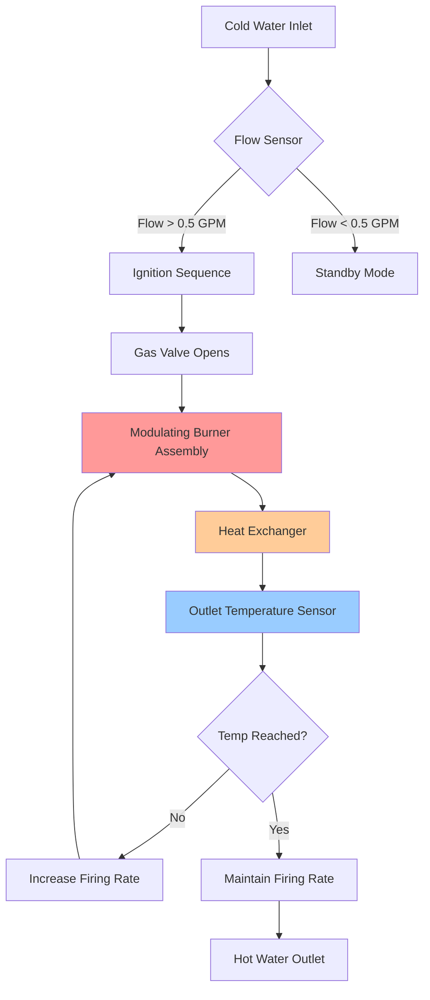
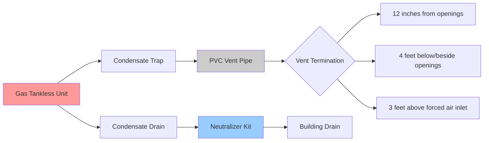

Gas-fired tankless water heaters provide continuous domestic hot water by heating water only when flow is detected, eliminating standby losses inherent in tank-type systems. These instantaneous heating systems achieve thermal efficiencies ranging from 80% (non-condensing) to 98% (condensing models) and require careful sizing based on simultaneous fixture demand and required temperature rise.

## Operating Principle

Gas tankless water heaters activate when water flow exceeds a minimum threshold (typically 0.4 to 0.6 gpm). Flow sensors trigger the ignition sequence, and modulating burners adjust firing rate to maintain the user-programmed outlet temperature. The fundamental heat transfer relationship governs sizing:

$$Q = \dot{m} \cdot c_p \cdot \Delta T = 500 \cdot \text{GPM} \cdot \Delta T$$

Where:
- $Q$ = Required heating capacity (BTU/hr)
- $\dot{m}$ = Mass flow rate (lb/hr)
- $c_p$ = Specific heat of water (1 BTU/lb·°F)
- GPM = Volumetric flow rate (gallons per minute)
- $\Delta T$ = Temperature rise (°F)

The coefficient 500 represents the product of water density (8.33 lb/gal) and specific heat (1 BTU/lb·°F) multiplied by 60 min/hr.

## Condensing vs Non-Condensing Technology

The distinction between condensing and non-condensing gas tankless units centers on flue gas heat recovery and resulting efficiency:

**Non-Condensing Units:**
- Thermal efficiency: 80-85%
- Exhaust temperature: 300-400°F
- Category I or III venting (single-wall metal or stainless steel)
- Lower initial cost
- No condensate neutralization required

**Condensing Units:**
- Thermal efficiency: 90-98%
- Exhaust temperature: 100-130°F
- Category II or IV venting (PVC, CPVC, or polypropylene)
- Secondary heat exchanger recovers latent heat
- Condensate drain required with pH neutralization per local codes
- Higher initial cost offset by energy savings

ASHRAE 90.1 mandates minimum thermal efficiency of 0.82 Et for gas-fired instantaneous water heaters, effectively requiring condensing technology for most commercial applications.

## Sizing Methodology

Proper sizing requires analysis of simultaneous fixture demand and inlet water temperature. The design process follows these steps:

1. **Determine Peak Simultaneous Flow:**

| Fixture Type | Flow Rate (GPM) | Quantity | Total Flow |
|--------------|----------------|----------|------------|
| Shower | 2.5 | 2 | 5.0 |
| Lavatory | 1.5 | 1 | 1.5 |
| Kitchen Sink | 2.0 | 1 | 2.0 |
| **Design Flow** | | | **8.5 GPM** |

2. **Calculate Required Temperature Rise:**

$$\Delta T = T_{\text{outlet}} - T_{\text{inlet}}$$

For a 120°F setpoint with 50°F inlet water:
$$\Delta T = 120 - 50 = 70°F$$

3. **Determine Required Capacity:**

$$Q = 500 \times 8.5 \times 70 = 297,500 \text{ BTU/hr}$$

4. **Apply Efficiency Factor:**

For a 95% efficient condensing unit:
$$\text{Input} = \frac{297,500}{0.95} = 313,158 \text{ BTU/hr input}$$

Select a unit rated for 320,000 BTU/hr input minimum.

## Performance at Various Conditions

Gas tankless capacity varies significantly with inlet temperature. The following table illustrates maximum flow rates for a 199,000 BTU/hr unit:

| Inlet Temp (°F) | Outlet Temp (°F) | ΔT (°F) | Max Flow (GPM) |
|----------------|------------------|---------|----------------|
| 40 | 120 | 80 | 4.97 |
| 50 | 120 | 70 | 5.68 |
| 60 | 120 | 60 | 6.63 |
| 70 | 120 | 50 | 7.96 |

This demonstrates the critical importance of using realistic inlet temperatures. Northern climate applications with 40°F groundwater require larger capacity units than southern installations with 70°F supply water.

## Venting Requirements

Gas tankless venting must comply with NFPA 54 (National Fuel Gas Code) and IFGC (International Fuel Gas Code). Venting category determines material and installation requirements:

**Category I (Non-Condensing):**
- Type B vent or listed chimney
- Natural draft operation
- Positive flue pressure
- Cannot share vent with other appliances unless specifically listed

**Category III (Non-Condensing, Forced Draft):**
- Stainless steel vent pipe
- Positive pressure, non-condensing
- Direct vent or power vent configurations

**Category IV (Condensing):**
- PVC Schedule 40, CPVC, or polypropylene
- Exhaust temperature below 140°F
- Direct vent (sealed combustion) preferred
- Vent slope minimum 1/4 inch per foot toward appliance
- Condensate trap required at appliance

Maximum equivalent vent length varies by model and category. A typical 199,000 BTU/hr condensing unit with 3-inch PVC vent might allow 60 feet equivalent length (each 90° elbow counts as 5 feet).

## Gas Supply and Electrical Requirements

Gas piping must deliver adequate pressure and volume to support maximum firing rate. Typical requirements include:

- **Natural Gas:** 5-10.5 inches water column supply pressure
- **Propane (LP):** 11-14 inches water column supply pressure
- **Gas Pipe Sizing:** Per IFGC Chapter 4, accounting for total BTU load and equivalent length
- **Electrical:** 120V/15A dedicated circuit for ignition, controls, and blower

Verify gas meter capacity exceeds total connected load. A 199,000 BTU/hr unit requires approximately 200 CFH (cubic feet per hour) of natural gas at full fire.

## Energy Efficiency and Operating Cost

Condensing gas tankless units achieve Uniform Energy Factor (UEF) ratings of 0.90 to 0.96 under DOE test procedures. Annual operating cost comparison for 64 gallons per day usage:

| Heater Type | Efficiency | Annual Therms | Cost at $1.50/Therm |
|-------------|-----------|---------------|---------------------|
| Tank (0.60 EF) | 60% | 258 | $387 |
| Non-Cond Tankless | 82% | 189 | $283 |
| Cond Tankless | 95% | 163 | $245 |

The condensing tankless saves approximately $142 annually compared to tank-type, with higher savings in colder climates requiring greater temperature rise.

## Installation Considerations

Critical installation factors include:

- **Minimum Flow Rate:** Units will not activate below threshold (0.4-0.6 GPM). Low-flow fixtures may not trigger ignition.
- **Temperature Modulation:** Digital control maintains ±1-2°F outlet temperature across varying flow rates.
- **Freeze Protection:** Required for outdoor or unconditioned space installations. Most units include electric heating elements for freeze protection, increasing electrical load to 600-1400W.
- **Water Quality:** Hard water (>120 ppm) requires annual descaling. Water softeners extend heat exchanger life.
- **Combustion Air:** Direct vent (sealed combustion) eliminates infiltration losses and depressurization concerns.

ASHRAE Standard 118.2 provides testing and rating procedures for gas-fired tankless water heaters, establishing uniform performance metrics across manufacturers.

## Code Compliance Summary

Installation must comply with:
- **NFPA 54 / IFGC:** Gas piping, venting, combustion air
- **UPC / IPC:** Plumbing connections, temperature and pressure relief, thermal expansion
- **ASHRAE 90.1:** Energy efficiency minimums for commercial applications
- **Local Amendments:** Condensate neutralization, backflow prevention, seismic restraint

The combination of high efficiency, compact footprint, and unlimited capacity makes gas-fired tankless water heaters ideal for applications with moderate to high hot water demand and available gas service. Proper sizing based on simultaneous demand and realistic inlet temperatures ensures satisfactory performance across all operating conditions.
