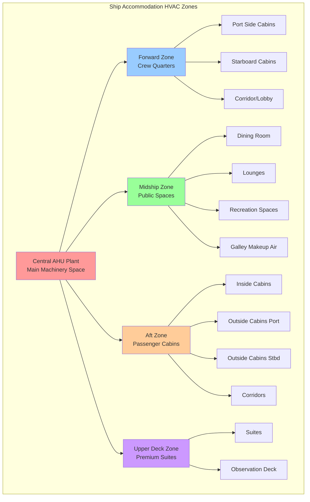

Ship accommodation spaces require precise climate control to maintain habitability during extended voyages across diverse thermal environments. The HVAC systems serving these areas must balance comfort requirements, space constraints, energy efficiency, and regulatory compliance while operating in the challenging marine environment. Understanding the physics of heat transfer, psychrometrics, and airflow distribution in confined spaces forms the foundation for effective accommodation HVAC design.

## Thermal Load Characteristics

Accommodation spaces exhibit distinct load patterns driven by occupancy schedules, envelope construction, and vessel operation.

**Internal Heat Gains**

Crew cabins and passenger staterooms generate sensible heat from occupants at approximately 75 W per person during sedentary activities and 115 W during light activity. Latent heat production adds 55-75 W per person from respiration and perspiration, creating a sensible heat ratio of 0.55-0.65 in occupied cabins. Electronic equipment including televisions, lighting, and personal devices contributes an additional 150-300 W per cabin depending on amenities level.

Common spaces such as lounges, dining rooms, and recreation areas experience higher occupant densities reaching 3-5 persons per 10 m². During peak usage periods, internal gains can reach 150-200 W/m² of floor area, requiring substantial cooling capacity. The transient nature of occupancy in these spaces necessitates responsive control systems to prevent overcooling during low-occupancy periods.

**Envelope Heat Transfer**

The ship hull forms the primary thermal boundary for accommodation spaces. Steel hull construction provides minimal thermal resistance, with U-values of 5-6 W/m²K for uninsulated surfaces. Insulation systems using mineral wool or closed-cell foam reduce heat transfer to 0.3-0.5 W/m²K. Exterior cabins experience direct solar radiation on exposed bulkheads and windows, adding 150-400 W/m² during peak conditions depending on orientation and latitude.

Interior cabins surrounded by conditioned spaces exhibit minimal envelope loads, with heat transfer primarily driven by temperature differentials between adjacent zones. Machinery space adjacency creates elevated boundary temperatures of 40-50°C, requiring enhanced insulation to prevent excessive heat gain.

## Ventilation Requirements and Air Change Calculations

Accommodation spaces require adequate outdoor air to maintain indoor air quality and prevent odor accumulation in confined volumes.

**Minimum Ventilation Rates**

SOLAS Chapter II-2 and classification society rules establish minimum ventilation requirements:

- Crew cabins: 6-8 air changes per hour (ACH)
- Passenger staterooms: 8-10 ACH for inside cabins, 6-8 ACH for outside cabins with operable windows
- Public spaces: 10-15 ACH or 10 L/s per person, whichever is greater
- Corridors and passageways: 6-10 ACH

The volumetric airflow required is calculated from the space volume and air change rate:

$$Q = \frac{V \cdot ACH}{3600}$$

where $Q$ is volumetric flow rate (m³/s), $V$ is cabin volume (m³), and $ACH$ is air changes per hour.

For a typical crew cabin measuring 3.0 m × 2.5 m × 2.4 m high with a volume of 18 m³ requiring 8 ACH:

$$Q = \frac{18 \text{ m}^3 \cdot 8 \text{ ACH}}{3600 \text{ s/h}} = 0.04 \text{ m}^3\text{/s} = 40 \text{ L/s}$$

**Outdoor Air Fraction**

The fraction of outdoor air in the supply airstream must satisfy both ventilation and pressurization requirements:

$$\frac{Q_{oa}}{Q_{supply}} = \max\left(\frac{V_{oa,min}}{Q_{supply}}, \frac{\Delta P \cdot A_{leak}}{Q_{supply} \cdot \rho}\right)$$

where $Q_{oa}$ is outdoor air flow, $V_{oa,min}$ is minimum ventilation requirement per codes (typically 2-3 ACH based on outdoor air only), $\Delta P$ is desired space pressurization (10-15 Pa for accommodation spaces), $A_{leak}$ is effective leakage area, and $\rho$ is air density.

Accommodation spaces are maintained at positive pressure relative to exterior and machinery spaces to prevent infiltration of humid salt air and engine fumes. This requires continuous outdoor air supply even during maximum cooling or heating modes.

## HVAC System Configurations

Marine accommodation HVAC systems utilize centralized or distributed architectures depending on vessel size and service type.

**Central Air Handling Systems**

Large passenger vessels employ central air handling units serving multiple cabins through duct distribution. Each AHU includes:

- Prefilters (MERV 8) and final filters (MERV 11-13)
- Chilled water cooling coils with 6-way control valves
- Hot water heating coils for cold climate operation
- Supply fans with VFD control
- Mixing chambers for outdoor air integration

Chilled water is supplied at 5-7°C from central chillers, with return at 12-15°C. The temperature rise through the coil is:

$$\Delta T_{water} = \frac{Q_{cooling}}{\.m_{water} \cdot c_{p,water}} = \frac{Q_{cooling}}{\.V_{water} \cdot \rho_{water} \cdot c_{p,water}}$$

For a cooling load of 100 kW with water flow rate of 5 L/s:

$$\Delta T_{water} = \frac{100{,}000 \text{ W}}{0.005 \text{ m}^3\text{/s} \cdot 1000 \text{ kg/m}^3 \cdot 4186 \text{ J/kg·K}} = 4.8 \text{ K}$$

**Fan Coil Unit Systems**

Individual fan coil units in each cabin provide zone-level control while minimizing ductwork. Four-pipe systems supply both chilled and hot water simultaneously, allowing individual temperature control. Condensate removal requires pumped drainage systems to overcome ship motion and hull curvature.

Fan coil units sized for accommodation spaces typically provide:

- Cooling capacity: 1.5-2.5 kW for standard cabins, 3-5 kW for suites
- Heating capacity: 1.0-1.5 kW (lower than cooling due to reduced envelope loads)
- Airflow: 80-150 L/s per unit
- Sound level: <35 dB(A) at 1 meter to maintain acceptable acoustic environment

**Outdoor Air Distribution**

Dedicated outdoor air systems (DOAS) precondition ventilation air before delivery to cabins. The DOAS handles latent loads through cooling below the dewpoint temperature, then reheats to prevent overcooling. Energy recovery wheels capture 60-75% of cooling energy from exhaust air, reducing load on central chillers.

## Zone Design and Air Distribution

Accommodation areas are divided into thermal zones based on orientation, occupancy patterns, and fire boundaries.

**Duct Distribution**

Main supply ducts route through dedicated shafts at ship centerline to minimize run lengths. Branch ducts to individual cabins incorporate:

- Volume dampers for airflow balancing
- Fire dampers at zone boundaries per SOLAS requirements
- Acoustically lined ductwork to attenuate fan noise
- Flexible connections at equipment to accommodate vibration

Supply diffusers provide 4-6 air changes per hour with throw patterns that prevent drafts on sleeping surfaces. Discharge velocities of 2-3 m/s at the diffuser face create proper mixing without excessive noise generation.

**Return Air Systems**

Return air transfers through door undercuts (15-20 mm clearance) or transfer grilles to corridor return plenums. Central return ducts collect air for delivery back to AHUs. Toilet and shower exhaust systems operate independently with dedicated fans discharging above deck to prevent recirculation.

## Space-Specific Requirements

Different accommodation space types require tailored HVAC approaches based on function and occupancy.

| Space Type | Temperature Range | ACH Required | Humidity Range | Special Considerations |
|------------|------------------|--------------|----------------|------------------------|
| Crew Cabins | 22-24°C | 6-8 | 40-60% RH | Individual control, quiet operation <35 dB(A) |
| Passenger Staterooms | 21-25°C (adjustable) | 8-10 | 40-60% RH | Thermostat control, low velocity <0.15 m/s |
| Public Dining Rooms | 22-24°C | 12-15 | 40-55% RH | High latent load from occupants and food service |
| Lounges/Bars | 22-24°C | 10-12 | 40-55% RH | Variable occupancy, smoking exhaust if applicable |
| Corridors/Lobbies | 23-25°C | 6-10 | 40-60% RH | Maintain positive pressure, transit space |
| Gymnasiums | 18-20°C | 15-20 | 35-50% RH | High sensible and latent loads, enhanced ventilation |
| Libraries/Reading Rooms | 22-24°C | 8-10 | 40-55% RH | Quiet operation critical, humidity control for materials |
| Medical Facilities | 21-23°C | 12-15 | 40-60% RH | Filtration MERV 14+, isolation capability |

**Crew Quarters**

Crew accommodations require durable, low-maintenance systems with straightforward controls. Cabins typically house 1-2 occupants in volumes of 15-25 m³. The compact size creates rapid temperature swings when equipment operates, necessitating modulating control rather than on-off cycling. Noise control is critical during sleep periods, requiring vibration isolation and acoustic treatment.

**Passenger Staterooms**

Passenger expectations for comfort exceed crew standards, demanding individual room temperature control, low air velocities to prevent drafts, and whisper-quiet operation. Premium accommodations may include separate climate zones for sleeping and sitting areas, with dedicated thermostats for each zone.

Outside cabins with windows require solar load management through window treatments and enhanced cooling capacity. The asymmetric load profile between exposed and interior walls can create comfort issues if not properly addressed through air distribution design.

**Public Spaces**

Restaurants, theaters, and atriums experience highly variable occupancy with peak loads 3-5 times higher than minimum. Demand-controlled ventilation using CO₂ sensors modulates outdoor air intake to match actual occupancy, reducing overcooling and energy consumption during low-use periods.

High ceilings in atriums and public spaces create stratification with warm air accumulating at upper levels. Destratification fans or properly designed air distribution with high sidewall discharge velocities maintain uniform conditions throughout the occupied zone.

## Comfort Standards and Regulatory Compliance

International maritime regulations establish minimum environmental conditions for habitability.

**SOLAS Requirements**

The International Convention for the Safety of Life at Sea (SOLAS) Chapter II-1, Regulation 3-12 mandates that accommodation spaces maintain "air of appropriate temperature, humidity, and purity." While specific numerical values are not defined in SOLAS itself, classification societies interpret this to require:

- Temperature control within 21-27°C range with ±2°C accuracy
- Relative humidity maintained between 30-70% (target 40-60%)
- Adequate ventilation to prevent CO₂ accumulation above 1000 ppm
- Air velocity in occupied zones below 0.25 m/s to prevent drafts

**Classification Society Rules**

Individual classification societies provide detailed requirements:

- American Bureau of Shipping (ABS): Specifies 24°C ±2°C for accommodations with 50% RH target
- Det Norske Veritas (DNV): Requires design conditions of 35°C ambient with 70% RH outdoor air
- Lloyd's Register: Mandates testing and commissioning verification of temperature and airflow rates
- Bureau Veritas: Specifies noise limits of 60 dB(A) in cabins, 65 dB(A) in public spaces

**Performance Verification**

Commissioning testing validates HVAC system performance before vessel delivery. Tests include:

1. Airflow verification at each diffuser and total system flow
2. Temperature maintenance across design ambient conditions (0°C to 45°C)
3. Humidity control verification under high latent load conditions
4. Sound level measurements in all accommodation spaces
5. Pressurization testing to confirm positive pressure relative to exterior

Ship accommodation HVAC systems represent a critical component of vessel habitability, requiring careful integration of thermal comfort principles, maritime regulations, and practical shipboard constraints. Successful designs balance occupant comfort with energy efficiency while maintaining reliability in the demanding marine environment.
