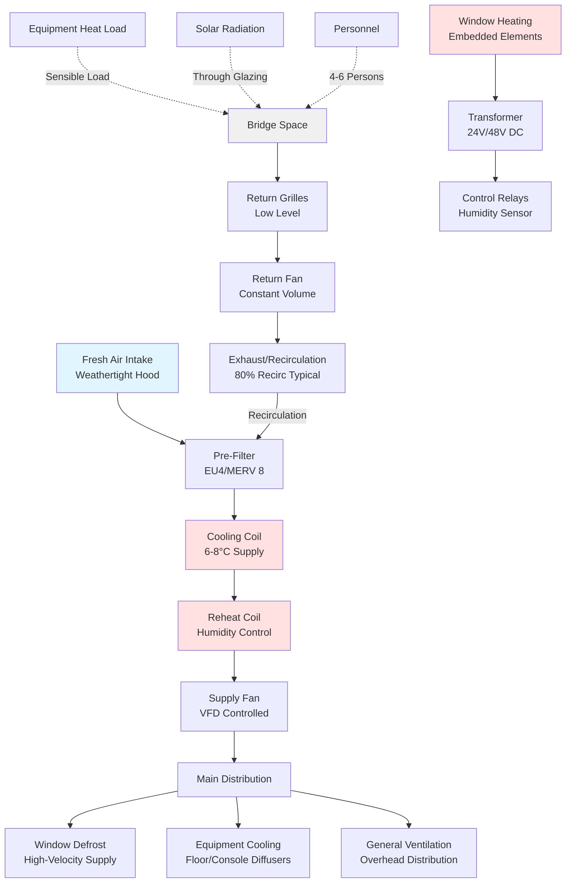

## Physical Principles of Bridge Climate Control

The bridge represents the most critical occupied space aboard any vessel, requiring precise environmental control to support navigation operations, equipment performance, and crew effectiveness during continuous 24-hour watches. Unlike other accommodation spaces, the bridge presents unique thermal challenges from extensive glazing exposure, high-precision electronic equipment heat loads, and stringent visibility requirements that prohibit window condensation or fogging under any conditions.

The fundamental challenge stems from the bridge's architectural requirement for 360-degree visibility, resulting in window-to-floor ratios often exceeding 0.6 compared to typical building values of 0.15-0.30. This creates severe solar heat gain in tropical operations and substantial conductive losses in arctic conditions, both requiring active HVAC intervention to maintain the narrow temperature band necessary for equipment reliability and human performance.

## Solar Heat Gain Through Bridge Glazing

Solar radiation through bridge windows represents the dominant cooling load component during daylight operations. The instantaneous heat gain follows:

$$Q_{solar} = A_{window} \cdot SHGC \cdot I_{total} \cdot CLF$$

Where:
- $Q_{solar}$ = solar heat gain (W)
- $A_{window}$ = total glazing area (m²)
- $SHGC$ = solar heat gain coefficient (dimensionless, typically 0.25-0.40 for marine glazing)
- $I_{total}$ = total incident solar radiation (W/m²)
- $CLF$ = cooling load factor accounting for thermal mass

The total incident radiation combines direct beam and diffuse components:

$$I_{total} = I_{beam} \cdot \cos(\theta) + I_{diffuse}$$

For a bridge with 45 m² of glazing at latitude 20°N during summer noon with SHGC = 0.30:

$$Q_{solar} = 45 \times 0.30 \times (950 \times \cos(15°) + 120) \times 0.85 = 10,890 \text{ W}$$

This 10.9 kW load from glazing alone typically exceeds the total sensible load of a small residential space, requiring dedicated cooling capacity beyond baseline ventilation requirements.

The window conduction load adds additional burden:

$$Q_{cond} = U \cdot A_{window} \cdot (T_{outside} - T_{inside})$$

With U-values for marine glazing ranging from 2.8-5.7 W/(m²·K) depending on single/double glazing and coating specifications.

## Navigation Equipment Thermal Management

Modern integrated bridge systems generate substantial heat loads from electronic navigation equipment that must be continuously removed to prevent equipment failure and maintain accuracy. ECDIS (Electronic Chart Display and Information System) workstations, radar processors, GPS receivers, and communication equipment collectively produce:

$$Q_{equipment} = \sum (P_{rated} \times LF \times FUM)$$

Where:
- $P_{rated}$ = nameplate power consumption
- $LF$ = load factor (typically 0.70-0.85 for navigation equipment)
- $FUM$ = fraction to conditioned space (0.90-1.00 for bridge equipment)

Typical bridge equipment loads range from 5-15 kW depending on vessel size and sophistication. Critical equipment requires supply air temperatures maintained within 18-24°C with humidity below 60% RH to prevent condensation on circuit boards during temperature transitions.

Equipment manufacturers specify maximum ambient temperatures of 40-55°C for naval-rated components, but optimal performance occurs at 20-25°C. Radar magnetron life decreases exponentially with temperature according to:

$$L = L_0 \cdot e^{-E_a/kT}$$

Where equipment life $L$ follows Arrhenius relationship with activation energy $E_a$, demonstrating why maintaining lower temperatures extends expensive electronics lifespan significantly.

## Window Anti-Fog and Defrost Systems

Bridge window clarity represents a non-negotiable safety requirement. Condensation forms when interior glass surface temperature drops below the dewpoint temperature of bridge air:

$$T_{surface} < T_{dewpoint} = T_{db} - \frac{100 - RH}{5}$$

This requires maintaining interior glass surface temperature above dewpoint through three mechanisms:

1. **Forced air circulation** - High-velocity air (3-5 m/s) directed across window interior surfaces
2. **Resistive heating** - Embedded heating elements in glass (150-300 W/m²)
3. **Humidity control** - Maintaining RH below 50% reduces dewpoint temperature

The heat transfer from warm air to glass surface follows:

$$q = h \cdot (T_{air} - T_{surface})$$

Where convective coefficient $h$ increases with air velocity according to:

$$h = 5.7 + 3.8v$$

For forced convection at v = 4 m/s, h = 20.9 W/(m²·K), providing sufficient heat transfer to maintain glass temperature above dewpoint even with exterior temperatures at -20°C when combined with heated glass.

## Bridge Environmental Requirements

| Parameter | Requirement | Rationale |
|-----------|-------------|-----------|
| Dry-bulb temperature | 22-24°C ± 1°C | Equipment specs, human alertness |
| Relative humidity | 40-50% | Prevent condensation, static control |
| Air velocity | < 0.15 m/s (occupied zone) | Avoid paper disturbance, draft discomfort |
| Sound level | NC 35-40 | Communication clarity, alarm audibility |
| Ventilation rate | 8-10 ACH minimum | Equipment heat removal, CO₂ control |
| Temperature uniformity | ± 2°C max deviation | Prevent local equipment overheating |
| Recovery time | < 15 minutes | After door opening events |

## System Architecture

Bridge HVAC systems employ dedicated air handling units separate from general accommodation systems to ensure continuous operation independent of other spaces and allow different temperature setpoints. The typical configuration includes:

## Design Considerations

**Redundancy Requirements** - Critical vessel operations mandate N+1 redundancy for bridge HVAC, with automatic changeover to standby units within 30 seconds of primary failure. Emergency ventilation must maintain minimum 4 ACH using ship's emergency power.

**Pressurization Control** - Bridge spaces maintain slight positive pressure (+5 to +15 Pa) relative to adjacent spaces preventing infiltration of engine room heat, galley odors, or accommodation corridor air. This requires precise supply/exhaust balancing with pressure sensors and motorized damper control.

**Noise Control** - Sound attenuation receives priority to ensure alarm audibility and radio communication clarity. Supply ductwork incorporates acoustical lining, low-velocity design (< 5 m/s in occupied zones), and vibration isolation of mechanical equipment. Fan selection targets sound power levels below 65 dBA at design flow.

**Filtration** - Marine bridge environments require robust filtration to handle salt spray, diesel particulates, and airborne contaminants during port operations. Multi-stage filtration with pre-filters (MERV 8) and final filters (MERV 13) protects sensitive navigation equipment while maintaining acceptable pressure drop.

**Control Integration** - Modern bridge HVAC integrates with vessel automation systems, providing remote monitoring, automatic mode switching (tropical/arctic/temperate), and maintenance alerts. Temperature sensors at multiple locations prevent local hotspots near concentrated equipment, while humidity sensors activate window heating as dewpoint approaches.

The bridge HVAC system represents a specialized application where failure consequences extend beyond occupant discomfort to vessel safety, making robust design, quality components, and preventive maintenance essential investments in maritime operations.

## Performance Verification

Commissioning of bridge HVAC systems must verify temperature uniformity across navigation workstations, adequate air velocities at window surfaces, proper humidity control under extreme conditions, and system response time to thermal disturbances. Testing under simulated maximum solar load conditions ensures adequate capacity before vessel delivery.
