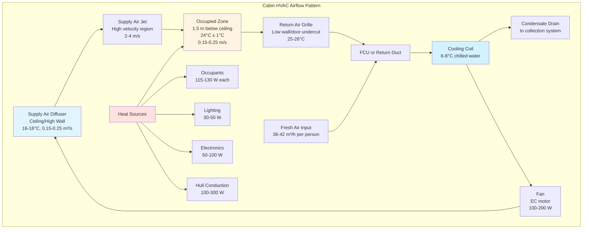

## Physical Principles of Marine Cabin Climatization

Ship cabins and staterooms present distinctive HVAC challenges driven by confined geometry, space constraints, continuous operation demands, and variable environmental exposures. The thermodynamic behavior of these compact enclosures requires precise heat balance analysis accounting for hull-transmitted solar radiation, adjacent space coupling, occupant metabolic loads, and equipment dissipation.

Marine accommodation spaces experience heat transfer through multiple boundary conditions simultaneously: exposed exterior bulkheads transfer solar and ambient loads, interior partitions couple thermally with adjacent cabins and corridors, deck boundaries conduct heat from machinery spaces below or sun-exposed decks above, and fenestration admits both conductive and radiative heat gains.

## Cabin Heat Load Calculation

The total cooling load for a ship cabin derives from conduction, convection, radiation, infiltration, and internal generation components. The fundamental heat balance equation:

$$Q_{total} = Q_{cond} + Q_{sol} + Q_{vent} + Q_{occ} + Q_{lights} + Q_{equip}$$

### Conduction Through Hull and Bulkheads

Heat transfer through the cabin envelope follows Fourier's law, modified for composite marine construction:

$$Q_{cond} = U \cdot A \cdot \Delta T$$

where $U$ represents the overall heat transfer coefficient (W/m²·K), $A$ the surface area (m²), and $\Delta T$ the temperature difference between exterior and interior conditions.

For insulated steel hull sections:

$$U = \frac{1}{\frac{1}{h_o} + \frac{t_{steel}}{k_{steel}} + \frac{t_{insul}}{k_{insul}} + \frac{1}{h_i}}$$

Typical values: $h_o$ = 20-25 W/m²·K (exterior), $h_i$ = 8-10 W/m²·K (interior), $k_{steel}$ = 45 W/m·K, $k_{insul}$ = 0.03-0.04 W/m·K for polyurethane foam.

### Solar Radiation Through Portholes

Solar heat gain through cabin windows combines direct beam, diffuse, and reflected components:

$$Q_{sol} = A_{glass} \cdot SHGC \cdot I_{total} \cdot CF$$

where $SHGC$ represents the solar heat gain coefficient (typically 0.25-0.40 for marine glazing), $I_{total}$ the total incident radiation (W/m²), and $CF$ a correction factor for curtains or blinds (0.5-0.8).

### Ventilation and Fresh Air Loads

Fresh air requirements per ISO 7547 and SOLAS mandate minimum ventilation rates. The sensible and latent loads from outdoor air:

$$Q_{vent,sens} = \dot{m} \cdot c_p \cdot (T_{outside} - T_{cabin})$$

$$Q_{vent,lat} = \dot{m} \cdot h_{fg} \cdot (W_{outside} - W_{cabin})$$

where $\dot{m}$ represents the mass flow rate (kg/s), $c_p$ = 1.006 kJ/kg·K, $h_{fg}$ = 2450 kJ/kg, and $W$ denotes humidity ratio (kg water/kg dry air).

Minimum fresh air: 36 m³/h per person for passenger cabins, 42 m³/h per person for crew cabins per ISO 8861.

### Occupant Heat Generation

Human metabolic heat generation varies with activity level. For cabin occupancy at rest:

$$Q_{occ} = N \cdot (Q_{sens} + Q_{lat})$$

Typical values per person: $Q_{sens}$ = 65-75 W, $Q_{lat}$ = 45-55 W at 24°C cabin temperature, sedentary activity. Total metabolic rate approximately 115-130 W per occupant.

## Marine Cabin HVAC System Types

| System Type | Cooling Capacity | Advantages | Disadvantages | Typical Application |
|-------------|------------------|------------|---------------|---------------------|
| **Self-Contained Through-Wall Units** | 2.0-3.5 kW | Simple installation, individual control, easy maintenance | Hull penetrations, noise, limited efficiency | Crew cabins, budget vessels |
| **Fan Coil Units (FCU)** | 1.5-4.0 kW | Quiet operation, central plant efficiency, space-saving | Requires chilled water distribution, complex piping | Passenger staterooms, luxury vessels |
| **Variable Refrigerant Flow (VRF)** | 2.0-5.0 kW | High efficiency, heat recovery, precise control | Higher initial cost, refrigerant charge limits | Modern cruise ships, ferries |
| **Split Systems** | 2.5-4.5 kW | Moderate cost, good efficiency, flexible placement | Refrigerant piping runs, multiple outdoor units | Small vessels, retrofits |
| **Packaged Terminal AC (PTAC)** | 2.0-3.0 kW | Robust construction, simple controls, proven reliability | Higher energy consumption, maintenance access | Naval vessels, cargo ship accommodations |

## Airflow Distribution Patterns

Proper air distribution prevents stratification, eliminates drafts, and maintains uniform temperature distribution within the confined cabin volume.

## Marine Comfort Standards and Design Criteria

**Temperature Requirements:**
- Passenger cabins: 22-24°C dry bulb, controllable ±2°C
- Crew cabins: 22-26°C dry bulb per SOLAS regulations
- Design outdoor conditions: 35-45°C depending on service route

**Humidity Control:**
- Relative humidity: 45-55% for comfort
- Maximum 65% RH to prevent mold and corrosion
- Dehumidification capacity: 0.3-0.5 L/day per m² cabin area

**Ventilation Standards:**
- ISO 7547: Minimum 36 m³/h per person fresh air
- Air change rate: 8-12 ACH for occupied cabins
- Filtration: MERV 8-11 for supply air

**Acoustic Performance:**
- Maximum NC 35-40 for passenger cabins
- NC 40-45 acceptable for crew accommodations
- Duct velocities limited to 3-5 m/s to minimize noise generation

**Vibration Isolation:**
- Equipment mounted on spring isolators (deflection 12-25 mm)
- Flexible connections for all piping and ductwork
- Structural decoupling to prevent transmission from machinery spaces

## System Design Considerations

**Space Constraints:**
Cabin ceiling heights of 2.1-2.4 m limit vertical equipment placement. FCU cassettes typically require 250-350 mm above ceiling depth. Horizontal fan coils installed above bathroom areas maximize usable cabin space.

**Salt Air Corrosion:**
All equipment exposed to exterior air requires marine-grade corrosion protection. Aluminum fins receive epoxy coating, copper tubing uses inhibited alloys, and steel frames employ hot-dip galvanizing or powder coating.

**Individual Control:**
Thermostatic control within ±2°C range provides occupant satisfaction. Modern systems integrate digital thermostats with fan speed selection (typically 3-4 speeds) and on/off capability.

**Condensate Management:**
Gravity drainage to collection tanks or pumped discharge prevents overflow. Drain pans constructed of stainless steel with 1:50 minimum slope toward discharge. Trap depth minimum 50 mm prevents air re-entrainment.

**Energy Efficiency:**
Variable speed EC motors reduce fan energy by 30-50% compared to PSC motors. Chilled water system benefits from central plant efficiency (COP 4.5-6.0) versus self-contained DX systems (EER 2.5-3.2).

**Maintenance Access:**
Filter accessibility through cabin entrance or bathroom ceiling. Coil cleaning requires panel removal or access doors. Condensate drain inspection ports prevent clogging.

**Emergency Ventilation:**
Natural ventilation capability through operable portholes or mechanical backup from emergency generators maintains habitability during power loss.

---

## Components

- Passenger Cabin Hvac
- Crew Cabin Ventilation
- Individual Temperature Control
- Through Wall Ac Units
- Fan Coil Units Cabins
- Fresh Air Supply Cabins
- Bathroom Exhaust Cabins
- Noise Control Cabins
- Vibration Isolation Cabins
