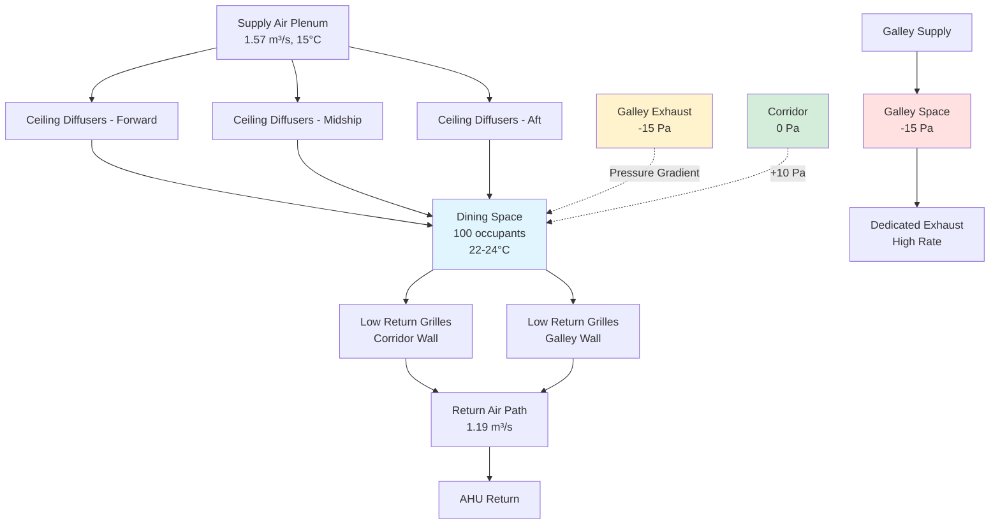

Dining spaces on marine vessels require specialized HVAC design to manage simultaneous cooling loads, odor transmission from adjacent galleys, occupancy variations, and sanitation requirements. These spaces experience load density variations from empty to peak meal service within minutes, necessitating responsive temperature and ventilation control while preventing galley odors from entering dining areas.

## Heat Load Characteristics

Dining spaces generate sensible and latent heat from occupants, lighting, and heat transfer from adjacent galley operations. The fundamental heat balance governs space temperature:

$$Q_{total} = Q_{occupants} + Q_{lights} + Q_{equipment} + Q_{infiltration} + Q_{transmission}$$

**Occupant Heat Gains**

Personnel seated at meals generate approximately 115 W sensible and 55 W latent heat per person, lower than standing or active rates due to reduced metabolic activity. Peak occupancy occurs during scheduled meal periods, creating step-change loads:

$$Q_{occupants} = N_{people} \times (q_{sensible} + q_{latent})$$

For a crew mess serving 100 personnel:

$$Q_{occupants} = 100 \times (115 + 55) = 17,000 \text{ W} = 17 \text{ kW}$$

**Transmission from Galley**

Dining spaces adjacent to galleys experience heat transmission through bulkheads despite insulation. Heat flow follows Fourier's law:

$$Q_{transmission} = U \times A \times \Delta T$$

Where U is the overall heat transfer coefficient (typically 0.5-1.0 W/m²K for insulated marine bulkheads), A is the bulkhead area, and ΔT is the temperature difference between galley (30-35°C) and dining space (22-24°C).

For a 20 m² bulkhead with U = 0.7 W/m²K and ΔT = 10°C:

$$Q_{transmission} = 0.7 \times 20 \times 10 = 140 \text{ W}$$

## Ventilation Requirements

Dining space ventilation must provide adequate outdoor air for occupants, maintain slight positive pressure relative to corridors, and prevent odor intrusion from galley operations.

**Outdoor Air Calculation**

Minimum ventilation follows occupancy-based requirements from classification societies and IMO guidelines. For dining spaces, 7.5 L/s per person provides adequate air quality:

$$\dot{V}_{OA} = N_{people} \times v_{person}$$

For 100 occupants:

$$\dot{V}_{OA} = 100 \times 7.5 = 750 \text{ L/s} = 0.75 \text{ m³/s} = 2700 \text{ m³/h}$$

**Supply Air for Cooling**

Total supply air must satisfy both cooling and ventilation requirements. The cooling airflow is determined by:

$$\dot{V}_{cooling} = \frac{Q_{sensible}}{\rho \times c_p \times \Delta T}$$

Using standard air properties (ρ = 1.2 kg/m³, cp = 1005 J/kg·K) and supply air temperature differential of 8-10°C:

$$\dot{V}_{cooling} = \frac{17000}{1.2 \times 1005 \times 9} = 1.57 \text{ m³/s} = 5652 \text{ m³/h}$$

The cooling requirement dominates, so supply air equals 1.57 m³/s with 48% minimum outdoor air fraction (750/1570).

**Pressurization Strategy**

Dining spaces must maintain positive pressure relative to corridors (+5 to +10 Pa) and negative pressure relative to galleys (-10 to -15 Pa) to prevent odor migration. This requires careful supply and exhaust balancing:

$$\Delta P = \frac{\rho \times (\dot{V}_{supply} - \dot{V}_{exhaust})^2}{2 \times A_{leakage}^2}$$

Achieving -10 Pa relative to the galley requires exhaust from the dining space or supply to the galley exceeding dining supply. Typical configurations maintain galley under negative pressure through dedicated exhaust, allowing dining space to operate at slight positive pressure relative to corridors.

## Odor Control Mechanisms

Preventing galley odors from entering dining spaces requires integrated pressure management, air distribution, and barrier systems.

**Pressure Cascade**

Establish pressure hierarchy: Dining (+10 Pa) → Corridor (0 Pa) → Galley (-15 Pa). This gradient ensures airflow from clean to contaminated spaces. Air curtains or vestibules at galley-dining interfaces provide additional separation during door openings.

**Vestibule Design**

Dedicated vestibules between galley and dining areas create airflow barriers. Supply air to the vestibule at high velocity (2-3 m/s) directed toward the galley creates a pressure curtain preventing odor backflow during door operation. Vestibule supply rate:

$$\dot{V}_{vestibule} = A_{door} \times v_{air} = 2 \times 2.5 = 5 \text{ m³/s}$$

For a 2 m² door opening with 2.5 m/s velocity.

**Exhaust Location**

Dedicated dining space exhaust, if provided, should be located near the galley interface wall at low level where any infiltrated odors accumulate. Exhaust rate of 20-30% of supply prevents over-ventilation while removing localized contamination.

## Air Distribution Design

Effective air distribution in mess halls must accommodate variable occupancy, prevent drafts during low loads, and provide rapid temperature recovery during meal periods.

**Diffuser Selection**

High-induction ceiling diffusers with adjustable throw patterns accommodate variable loads. During peak occupancy, high supply airflow creates good mixing without excessive velocities in the occupied zone. During low occupancy, reduced airflow maintains acceptable air change rates for sanitation.

Throw distance should reach 75% of the room length at peak flow, corresponding to terminal velocity of 0.25 m/s at the occupied zone. For linear diffusers, the throw equation:

$$L = K \times \sqrt{\frac{\dot{V}}{l}}$$

Where K is the diffuser constant (60-80 for ceiling diffusers), V̇ is airflow per diffuser, and l is diffuser length.

**Return Air Location**

Low-level returns promote downward air movement, carrying odors and contaminants toward exhaust points. Placement at the galley-side wall captures any infiltrated odors before distribution through the dining space. Return grille velocity should not exceed 2.5 m/s to prevent noise and dust entrainment.

## Ventilation Rate Comparison

Different zones adjacent to or within food service areas require specific ventilation rates based on contamination sources and occupancy patterns.

| Space Type | Minimum Ventilation | Design Air Changes | Pressure Relative to Corridor | Primary Concerns |
|-----------|-------------------|------------------|-------------------------------|------------------|
| Crew Mess Hall | 7.5 L/s per person | 8-12 ACH | +5 to +10 Pa | Odor prevention, occupancy loads |
| Officer Dining | 7.5 L/s per person | 10-15 ACH | +8 to +12 Pa | Comfort, reduced noise |
| Passenger Dining | 10 L/s per person | 12-18 ACH | +10 to +15 Pa | Premium comfort, rapid load response |
| Galley Proper | 20 L/s per person | 30-40 ACH | -15 to -25 Pa | Heat removal, odor containment |
| Dish Washing | 15 L/s per person | 25-35 ACH | -10 to -20 Pa | Steam removal, sanitation |
| Food Preparation | 12 L/s per person | 15-25 ACH | -5 to -15 Pa | Temperature control, odor control |
| Dry Storage | 2 ACH minimum | 4-6 ACH | 0 to +5 Pa | Moisture control, temperature stability |
| Cold Storage | 2 ACH minimum | 4-8 ACH | 0 to +5 Pa | Temperature maintenance, defrost moisture |

Galley spaces require substantially higher ventilation rates driven by heat generation from cooking equipment and odor control requirements. The negative pressure cascade prevents contamination migration to dining spaces while maintaining acceptable temperature conditions for workers.

## Sanitation Requirements

Marine dining spaces must comply with health regulations for food service environments, including air quality, surface cleanliness, and prevention of pathogen transmission.

**Air Filtration**

Supply air filtration to MERV 8-11 removes particulates and biological contaminants. Higher filtration levels (MERV 13-14) may be specified for passenger vessels with health service facilities or immunocompromised passengers. Filter maintenance schedules must account for salt aerosol loading in marine environments, typically requiring monthly inspection and quarterly replacement.

**Surface Condensation Prevention**

Cold surfaces from air conditioning components or hull contact areas can promote condensation and microbial growth. Insulation with vapor barriers on chilled water piping and diffusers prevents surface temperatures from reaching the dew point. For seawater-exposed hull sections, interior insulation must maintain surface temperature above:

$$T_{surface,min} = T_{dewpoint} + 2°C$$

This margin prevents condensation during normal operation and humidity excursions.

**Sanitization Cycles**

HVAC systems should support periodic sanitization through elevated temperature purges or ultraviolet germicidal irradiation (UVGI) in the return air path. UVGI systems sizing follows:

$$I_{required} = \frac{D \times \dot{V}}{A_{lamp} \times \eta_{lamp}}$$

Where D is the required dose for target organism inactivation (typically 20-40 mJ/cm² for bacteria), V̇ is airflow, Alamp is the irradiated cross-section area, and ηlamp is lamp efficiency.

## Load Management Strategies

The extreme variation in dining space occupancy from empty between meals to 100% during service requires responsive control strategies.

**Scheduled Setback**

Program temperature setpoints based on meal schedules. During unoccupied periods (typically 2-3 hours between meals), raise cooling setpoint to 26-27°C and reduce ventilation to minimum sanitation rates (2-4 ACH). This reduces compressor runtime and pump energy while maintaining adequate air exchange.

**Demand-Based Ventilation**

CO₂ sensors enable occupancy-responsive ventilation control. As occupancy increases during meal service, CO₂ concentration rises, triggering increased outdoor air intake. Target CO₂ levels of 800-1000 ppm above ambient (approximately 1200-1400 ppm absolute) ensure adequate ventilation without excessive outdoor air energy penalty.

The required outdoor air based on CO₂ concentration:

$$\dot{V}_{OA} = \frac{N \times G_{CO_2}}{C_{space} - C_{outdoor}}$$

Where N is occupancy, GCO₂ is CO₂ generation per person (0.005 L/s), Cspace is target space concentration (1200 ppm), and Coutdoor is outdoor concentration (400 ppm).

**Pre-Cooling**

Begin space cooling 30-45 minutes before scheduled meal times to achieve target temperature before occupancy. This pre-cooling strategy accounts for thermal mass in tables, chairs, and structure that would otherwise delay temperature response. The required pre-cooling period:

$$t_{precool} = \frac{m \times c_p \times \Delta T}{Q_{cooling}}$$

Where m is the effective thermal mass, cp is specific heat, ΔT is the desired temperature reduction, and Qcooling is the available cooling capacity.

Marine dining and mess hall HVAC systems must balance competing requirements for comfort, sanitation, odor control, and energy efficiency within the constraints of shipboard installation. Proper pressure management prevents galley odor intrusion, responsive controls accommodate variable loads, and adequate ventilation maintains air quality across the full range of operational conditions. These systems demonstrate the integration of fundamental heat transfer, fluid mechanics, and psychrometric principles with marine-specific requirements.
