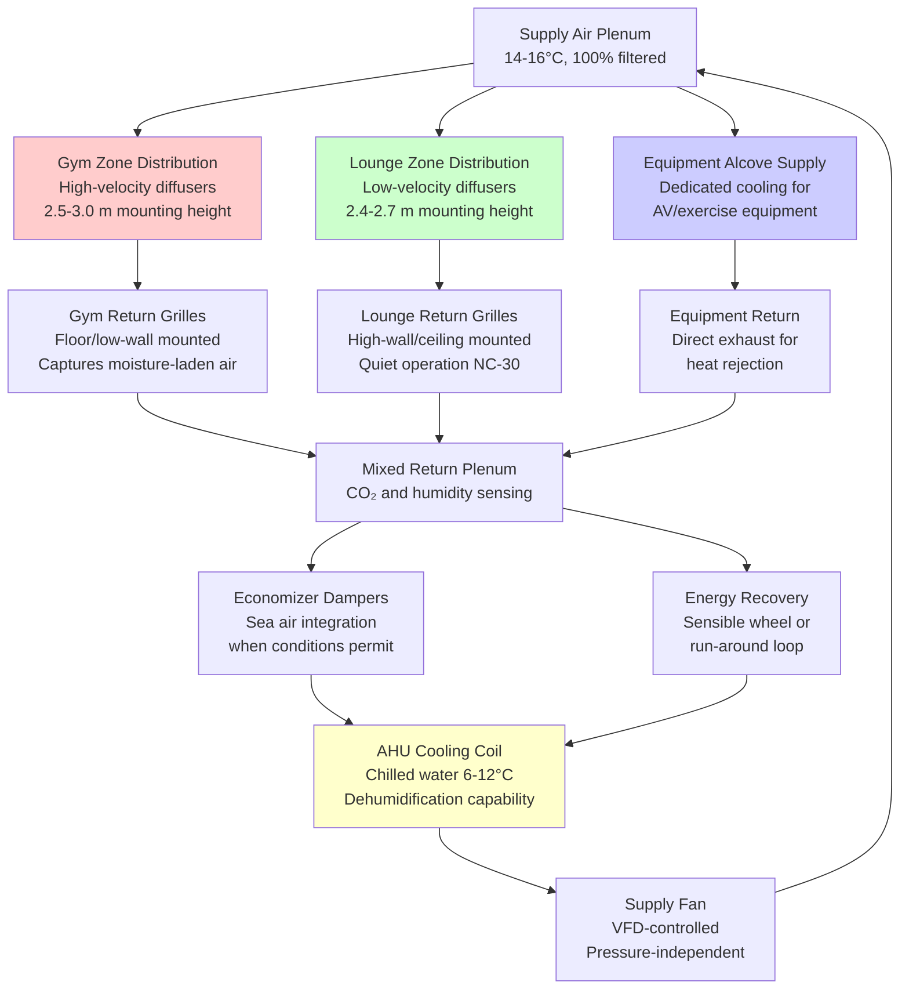

Recreation spaces aboard ships present unique HVAC challenges due to highly variable occupancy patterns, diverse metabolic heat generation rates, and the critical importance of crew welfare during extended voyages. The design must accommodate everything from sedentary activities in lounges to high-intensity exercise in fitness centers while operating within the constraints of limited shipboard power and space.

## Fundamental Heat Transfer Considerations

Recreation spaces experience dramatic load variations as occupancy fluctuates between scheduled activities and off-hours. The sensible heat gain from occupants varies by activity level, ranging from 70 W per person in sedentary lounge settings to 300-400 W per person during vigorous exercise. This variability necessitates responsive HVAC systems capable of modulating capacity.

The total cooling load combines metabolic heat, lighting, equipment, and solar gains through portholes or windows. For spaces below the waterline, solar contribution is eliminated, but equipment loads from entertainment systems, exercise machines, and auxiliary lighting remain constant. The envelope load is minimal due to surrounding conditioned spaces, making occupancy-driven loads dominant.

Ventilation requirements shift based on activity intensity. Sedentary spaces require 7.5-10 L/s per person for odor control and CO₂ dilution, while gymnasiums demand 20-25 L/s per person to handle elevated metabolic CO₂ production and moisture generation. The increased ventilation in fitness areas also aids in managing latent heat, which can constitute 50-60% of total occupant heat gain during exercise.

## Variable Occupancy Ventilation Calculations

The required ventilation rate for recreation spaces must account for both design occupancy and metabolic intensity. The volumetric flow rate is:

$$\dot{V}_{oa} = N \cdot v_{pp} \cdot AF$$

where:
- $\dot{V}_{oa}$ = outdoor air flow rate (L/s)
- $N$ = design occupancy (persons)
- $v_{pp}$ = ventilation per person (L/s per person)
- $AF$ = activity factor (1.0 for sedentary, 2.5-3.0 for exercise)

For CO₂-based demand control, the required ventilation to maintain concentration below 1000 ppm is:

$$\dot{V}_{oa} = \frac{N \cdot G_{CO_2}}{(C_s - C_o) \cdot \rho_{air}}$$

where:
- $G_{CO_2}$ = CO₂ generation rate per person (18-20 mL/s sedentary, 50-70 mL/s exercise)
- $C_s$ = space CO₂ concentration limit (1000 ppm = 1.8 g/m³)
- $C_o$ = outdoor air CO₂ concentration (400 ppm = 0.72 g/m³)
- $\rho_{air}$ = air density (1.2 kg/m³)

The sensible cooling load from occupants varies with metabolic rate:

$$q_s = N \cdot M \cdot (1 - LHR)$$

where:
- $q_s$ = sensible heat gain (W)
- $M$ = metabolic rate (115 W sedentary, 350 W moderate exercise, 440 W heavy exercise)
- $LHR$ = latent heat ratio (0.25-0.30 sedentary, 0.50-0.60 exercise)

The supply air temperature must be selected to avoid drafts in low-activity zones while providing adequate cooling in high-intensity areas:

$$T_{supply} = T_{space} - \frac{q_s}{\dot{m}_{air} \cdot c_p}$$

where typical $T_{space}$ = 24°C for gyms, 22-23°C for lounges, and $c_p$ = 1005 J/(kg·K).

## Recreation Space HVAC Comparison

| Space Type | Ventilation Rate | Cooling Load | Temperature | Humidity Control | Special Requirements |
|------------|-----------------|--------------|-------------|------------------|---------------------|
| **Gymnasium** | 20-25 L/s/person | 300-400 W/person | 22-24°C | 40-55% RH | High air changes (12-15 ACH), moisture removal, equipment heat |
| **Lounge/Library** | 7.5-10 L/s/person | 90-115 W/person | 22-23°C | 45-55% RH | Low noise (NC-30), minimal drafts, AV equipment cooling |
| **Game Room** | 10-12 L/s/person | 115-150 W/person | 22-24°C | 45-55% RH | Electronic equipment heat, moderate activity level |
| **Cinema/Theater** | 8-10 L/s/person | 90-105 W/person | 21-23°C | 45-50% RH | Very low noise (NC-25), projection equipment heat, tiered seating |
| **Pool/Spa Area** | 15-20 L/s/person | 200-250 W/person | 26-28°C | 50-60% RH | Dehumidification (3-5 kg/h), chloramine removal, corrosion resistance |

## Air Distribution Strategy

Recreation spaces require careful air distribution to maintain comfort across varying activity zones while minimizing noise and drafts. The following diagram illustrates the layered ventilation approach:

## Crew Welfare and Comfort Standards

Maritime regulations increasingly emphasize crew welfare as essential to safety and operational effectiveness. The Maritime Labour Convention (MLC, 2006) establishes minimum standards for accommodation spaces, including recreation areas. While specific HVAC parameters are not mandated, the convention requires "adequate headroom and adequate air space" and "adequate ventilation and heating."

Classification societies and flag states interpret these requirements more specifically. The American Bureau of Shipping (ABS) recommends maintaining 22-24°C in recreation spaces with relative humidity between 40-60%. Air change rates should provide minimum 25 m³/h per person in gymnasiums and 15 m³/h per person in lounges.

Extended voyage considerations drive more stringent comfort requirements. Crews on long-haul vessels (30+ day voyages) require recreational facilities that approach shoreside quality to maintain morale and mental health. This translates to HVAC systems with responsive controls, low noise levels (NC-30 or lower), and the ability to maintain setpoints within ±1°C during all sea conditions.

Sound attenuation becomes critical in multi-function recreation spaces. Duct silencers, vibration isolation, and low-velocity distribution (terminal velocity below 3 m/s in sedentary zones) prevent HVAC noise from interfering with activities. In cinema spaces, background noise must remain below NC-25 to preserve audio quality.

## Control Strategies for Variable Loads

Modern recreation space HVAC employs occupancy sensing and CO₂-based demand control to optimize energy consumption while maintaining comfort. Passive infrared (PIR) sensors detect occupancy in discrete zones, enabling the building automation system to modulate supply air volume and temperature.

CO₂ sensing provides a reliable proxy for metabolic load in gymnasiums and high-occupancy spaces. When concentrations exceed 800-900 ppm, the control system increases outdoor air fraction and supply volume to restore air quality. This approach reduces energy consumption by 20-35% compared to constant-volume operation during partial occupancy periods.

Temperature reset strategies adjust supply air temperature based on space demand. During low-occupancy periods in gymnasiums, supply temperature can rise to 16-18°C, reducing chiller energy and reheat requirements. As occupancy and metabolic loads increase, supply temperature drops to 13-15°C to maintain space conditions.

Humidity control in fitness areas requires active dehumidification during heavy use periods. When space humidity exceeds 55-60% RH, the cooling coil operates at reduced airflow to enhance moisture removal, with reheat applied if necessary to avoid overcooling. This maintains the 40-55% RH range optimal for comfort and equipment preservation.

## Components

- Lounge Hvac Systems
- Gym Fitness Center Ventilation
- Cinema Theater Ac
- Library Reading Room Climate
- Game Room Ventilation
- Swimming Pool Dehumidification
- Spa Sauna Ventilation
