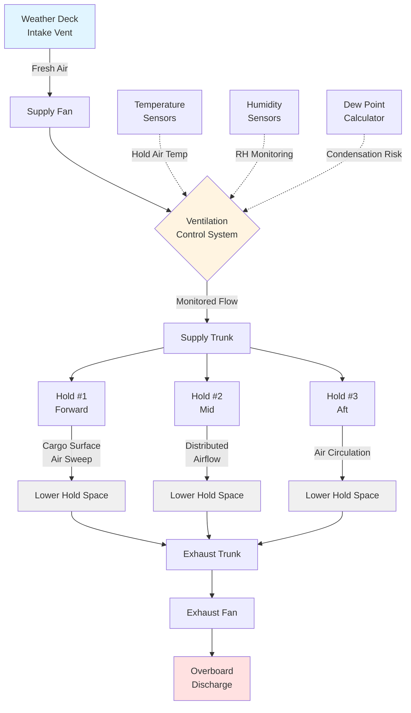

# Cargo Hold Ventilation Systems

Cargo hold ventilation serves to preserve cargo integrity during ocean transport by controlling temperature, humidity, and preventing condensation-related damage. The physics governing these systems centers on psychrometric relationships, mass transfer of water vapor, and thermodynamic exchanges between cargo, surrounding air, and hull surfaces.

## Fundamental Operating Principles

### Heat and Moisture Transfer Mechanisms

Cargo holds experience continuous heat and moisture exchange through three primary pathways:

**Conduction Through Hull Structure**

The ship's steel hull conducts heat based on exterior seawater temperature and interior hold air temperature. Heat flux follows Fourier's law:

$q = k \cdot A \cdot \frac{(T_{sea} - T_{hold})}{t}$

Where:
- $q$ = Heat transfer rate (W)
- $k$ = Thermal conductivity of steel (50 W/m·K)
- $A$ = Hull surface area (m²)
- $T_{sea}$ = Seawater temperature (°C)
- $T_{hold}$ = Hold air temperature (°C)
- $t$ = Hull thickness (m)

During tropical voyages with seawater at 28-30°C and hold temperatures at 15-20°C, significant heat ingress occurs. Conversely, cold seawater (5-10°C) in northern routes extracts heat from cargo holds, creating conditions for cargo sweating.

**Moisture Migration**

Water vapor moves from higher to lower vapor pressure regions. Cargo with elevated moisture content (grain at 14-16% moisture, coal at 8-12%) releases water vapor into hold air. The driving force is vapor pressure differential:

$\dot{m}_{vapor} = h_{m} \cdot A \cdot (P_{v,cargo} - P_{v,air})$

Where:
- $\dot{m}_{vapor}$ = Moisture transfer rate (kg/s)
- $h_{m}$ = Mass transfer coefficient (m/s)
- $A$ = Cargo surface area (m²)
- $P_{v,cargo}$ = Vapor pressure at cargo surface (Pa)
- $P_{v,air}$ = Vapor pressure of hold air (Pa)

**Condensation Risk**

When warm, moisture-laden air contacts cold surfaces (hull plating, deck beams, hatch covers), water vapor condenses if surface temperature drops below the air's dew point. Condensed water drips onto cargo, causing damage to grain cargoes, iron ore oxidation, or coal spontaneous heating. The condensation rate is governed by:

$\dot{m}_{cond} = h_{c} \cdot A \cdot (T_{air} - T_{surface})$ when $T_{surface} < T_{dewpoint}$

## Ventilation System Design Objectives

### Moisture Control Modes

Cargo hold ventilation operates in three distinct modes depending on voyage conditions:

| Ventilation Mode | Application | Airflow Direction | Objective |
|------------------|-------------|-------------------|-----------|
| **Supply Ventilation** | Hygroscopic cargo requiring drying | Fresh air into hold | Remove moisture from cargo |
| **No Ventilation** | Stable cargo, unfavorable exterior conditions | System closed | Prevent moisture ingress |
| **Controlled Exchange** | Temperature equalization | Limited fresh air | Prevent condensation on hull |

### Air Exchange Rate Calculations

The required ventilation rate depends on cargo moisture emission and hold volume. IMO recommends minimum rates, but physical calculations determine actual needs:

$N = \frac{Q}{V}$

Where:
- $N$ = Air changes per hour (ACH)
- $Q$ = Volumetric airflow rate (m³/h)
- $V$ = Hold volume (m³)

For moisture removal from cargo:

$Q = \frac{\dot{m}_{vapor} \cdot 3600}{\rho_{air} \cdot (W_{inlet} - W_{outlet})}$

Where:
- $\dot{m}_{vapor}$ = Moisture emission rate from cargo (kg/h)
- $\rho_{air}$ = Air density (1.2 kg/m³)
- $W_{inlet}$ = Inlet air humidity ratio (kg water/kg dry air)
- $W_{outlet}$ = Outlet air humidity ratio (kg water/kg dry air)

Typical design values:
- Grain cargo: 2-6 ACH during favorable conditions
- Coal cargo: 10-15 ACH for fire prevention
- General cargo holds: 4-8 ACH intermittent operation
- Empty holds: 1-2 ACH to prevent corrosion

## Cargo-Specific Ventilation Requirements

### Hygroscopic Cargo Management

Grain, soybeans, and agricultural products absorb or release moisture to equilibrate with surrounding air relative humidity. Ventilation prevents cargo from exceeding safe moisture limits:

| Cargo Type | Safe Moisture Content | Critical Damage Threshold | Recommended ACH |
|------------|------------------------|---------------------------|-----------------|
| Wheat, corn | 13-14% | 15% (mold growth) | 3-5 ACH |
| Soybeans | 12-13% | 14% (heating) | 4-6 ACH |
| Rice | 13-14% | 15% (discoloration) | 2-4 ACH |
| Copra | 6-7% | 8% (spontaneous heating) | 6-10 ACH |

Ventilate only when exterior air has lower absolute humidity than hold air to drive moisture out of cargo.

### Bulk Mineral Cargoes

Iron ore, coal, and mineral concentrates present distinct ventilation challenges:

**Coal Cargoes**

Coal oxidizes slowly at ambient temperature, generating heat and consuming oxygen. Ventilation prevents oxygen depletion and removes oxidation heat:

Minimum ventilation rate: $Q_{coal} = 10 \text{ m}^3\text{/h per tonne of coal}$

For a 50,000 DWT coal cargo:
$Q_{coal} = 50,000 \times 10 = 500,000 \text{ m}^3\text{/h} = 139 \text{ m}^3\text{/s}$

This extreme rate explains why coal carriers employ extensive natural ventilation systems with large mushroom vents.

**Iron Ore**

Iron ore requires minimal ventilation unless moisture content is elevated. Wet iron ore fines can liquefy during voyage, creating cargo shift hazards. Ventilation removes free surface moisture but cannot address interstitial water requiring shore-side treatment.

### Containerized and General Cargo

Container vessels with weather deck stowage require no cargo hold ventilation for containers. However, under-deck holds carrying breakbulk cargo or vehicles need:

- 4-6 ACH for vehicle decks (battery off-gassing)
- 2-4 ACH for general cargo (condensation prevention)
- 8-12 ACH for hazardous cargo (flammable vapor control per IMDG Code)

## System Configuration and Airflow Paths

### Supply and Exhaust Arrangements

**Supply Systems**

Supply fans force fresh air through trunking to cargo hold spaces. Air distribution requires:

- Inlet velocity: 6-10 m/s at trunk outlets
- Air throw: Sufficient to reach cargo surface without excessive turbulence
- Multiple inlet points: Prevent dead zones in large holds (30,000+ m³)

Supply trunking typically runs vertically along hold boundaries with horizontal branches directing air across cargo surface.

**Exhaust Systems**

Exhaust fans extract air from hold spaces, creating slight negative pressure (10-20 Pa) relative to adjacent spaces. This prevents moisture-laden hold air from infiltrating accommodation or machinery spaces.

Exhaust capacity exceeds supply by 5-10% to ensure negative pressure maintenance:

$Q_{exhaust} = 1.05 \cdot Q_{supply}$

### Natural Ventilation Systems

Bulk carriers and some cargo vessels employ natural ventilation exploiting wind pressure and thermal buoyancy. Mushroom vents (wind scoops) capture ram air pressure while cowl vents create negative pressure zones promoting exhaust flow.

Natural ventilation effectiveness varies with ship speed and wind direction:

$Q_{natural} = C_{d} \cdot A_{vent} \cdot \sqrt{2 \cdot \Delta P / \rho}$

Where:
- $C_{d}$ = Discharge coefficient (0.6-0.8)
- $A_{vent}$ = Vent opening area (m²)
- $\Delta P$ = Pressure differential (Pa)
- $\rho$ = Air density (kg/m³)

Ship speed generates dynamic pressure:
$\Delta P = 0.5 \cdot \rho \cdot v^2$

At 15 knots (7.7 m/s): $\Delta P = 0.5 \times 1.2 \times 7.7^2 = 35.6 \text{ Pa}$

## Regulatory Requirements and Standards

### IMO and SOLAS Provisions

**SOLAS Chapter VI (Carriage of Cargoes)**

Regulation 3 mandates adequate ventilation for cargo spaces carrying goods requiring atmospheric control. Specific requirements include:

- Grain cargoes: Continuous ventilation capability during voyage
- Coal cargoes: Minimum 2 ACH continuous ventilation
- Solid bulk cargoes: Ventilation meeting IMSBC Code requirements

**International Maritime Solid Bulk Cargoes (IMSBC) Code**

The IMSBC Code classifies bulk cargoes into groups requiring specific ventilation protocols:

- **Group A:** Cargoes that may liquefy (require moisture control, limited ventilation)
- **Group B:** Cargoes with chemical hazards (coal, direct reduced iron - require continuous ventilation)
- **Group C:** Cargoes neither liquefying nor chemically hazardous (ventilation as needed for preservation)

### Classification Society Rules

Major classification societies (ABS, DNV, Lloyd's Register, Bureau Veritas) specify minimum ventilation capacities:

- Cargo holds: 6 ACH mechanical ventilation capability
- Ventilation system controls accessible from deck without hold entry
- Separate systems for forward and aft hold groups
- Emergency shutdown capability for fire scenarios

Documentation requirements include:
- Ventilation capacity calculations demonstrating regulatory compliance
- Fan performance curves at design operating point
- Control system diagrams and operational procedures
- Cargo-specific ventilation guidance in ship's loading manual

## Operational Decision-Making

### Psychrometric Analysis

Effective ventilation requires continuous monitoring of three psychrometric conditions:

1. **Exterior air** (potential supply source)
2. **Hold air** (current condition)
3. **Cargo temperature** (determines surface dew point)

Ventilate only when exterior air dew point is lower than cargo surface temperature and exterior absolute humidity is less than hold air absolute humidity.

Decision criteria:
$T_{dew,exterior} < T_{cargo} - 2°C$ (safety margin)

And: $W_{exterior} < W_{hold}$

### Temperature Monitoring

Modern cargo vessels employ distributed temperature sensing:
- RTD sensors every 10-15 meters along hold length
- Cargo surface temperature probes
- Hull inner surface temperature monitoring
- Data logging at 1-hour intervals

Automated systems compare conditions and provide ventilation recommendations, but master retains operational authority per SOLAS requirements.

## System Maintenance and Troubleshooting

Cargo ventilation system reliability is critical for cargo claim prevention. Common failure modes include:

- **Fan motor bearing failure:** Vibration monitoring and scheduled lubrication prevent premature wear
- **Damper seizure:** Salt accumulation in damper linkages requires regular exercising
- **Sensor calibration drift:** Annual psychrometric sensor calibration ensures accurate operational decisions
- **Trunk corrosion:** Internal trunk inspection during dry-dock identifies structural degradation

Fan performance degradation from blade erosion (bulk cargo dust) or corrosion reduces airflow 15-25% over 5-year intervals. Periodic fan curve verification identifies reduced capacity requiring blade replacement.

Cargo hold ventilation represents a specialized application where thermodynamic principles directly affect cargo value preservation. Proper system design and operation require understanding of psychrometrics, heat transfer, and regulatory frameworks specific to maritime commerce.
