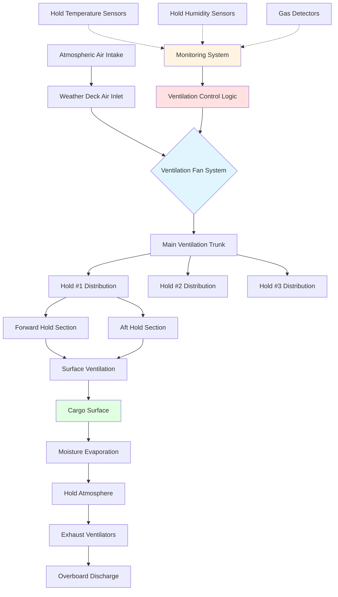

Bulk carrier cargo hold ventilation protects bulk commodities during ocean transport by controlling moisture migration, preventing condensation damage, and managing hazardous atmospheres. Ventilation system design must account for cargo hygroscopic properties, temperature differentials between cargo and ambient conditions, and the generation of toxic or oxygen-depleting gases.

## Ventilation Requirements by Cargo Type

Bulk cargoes exhibit vastly different ventilation requirements based on their physical and chemical properties:

| Cargo Type | Ventilation Rate | Primary Concern | IMSBC Classification |
|------------|------------------|-----------------|----------------------|
| Grain (wheat, corn, barley) | 2-4 air changes/h | Moisture migration, cargo sweat | Group C |
| Coal | 0.5-1 air changes/h | Self-heating, methane generation | Group B (some Group A) |
| Iron ore | 0.25 air changes/h | Minimal; dust suppression | Group A/C |
| Concentrates (mineral) | Minimal or closed | Oxidation, moisture increase | Group A |
| Fertilizers (urea, DAP) | 1-2 air changes/h | Caking, toxic gas release | Group B/C |
| Woodchips | 2-3 air changes/h | Self-heating, oxygen depletion | Group B |
| Sugar (bulk) | 1-3 air changes/h | Moisture absorption, caking | Group C |
| Cement | Closed system | Moisture contamination | Group C |

## Grain Cargo Ventilation

Grain cargoes require the most sophisticated ventilation management due to their hygroscopic nature and susceptibility to both cargo sweat and ship sweat condensation.

### Ventilation Rate Calculation

The required ventilation rate for grain cargoes depends on the moisture differential between the cargo and ambient air:

$$Q = \frac{V \cdot N}{60}$$

Where:
- $Q$ = volumetric flow rate (m³/min)
- $V$ = cargo hold volume (m³)
- $N$ = air changes per hour (typically 2-4)

The psychrometric driving force determines whether ventilation should occur:

$$\Delta W = W_{amb} - W_{eq}$$

Where:
- $\Delta W$ = moisture differential (kg water/kg dry air)
- $W_{amb}$ = ambient air humidity ratio
- $W_{eq}$ = equilibrium humidity ratio for grain at current temperature

**Ventilation Rule**: Ventilate only when $\Delta W < 0$ (ambient air is drier than equilibrium conditions).

### Surface Ventilation Method

For grain cargoes, surface ventilation directs airflow across the cargo surface to remove moisture that migrates upward due to temperature gradients:

$$q_{surf} = \frac{0.3 \cdot A_{surf}}{1000}$$

Where:
- $q_{surf}$ = surface ventilation rate (m³/s)
- $A_{surf}$ = cargo surface area (m²)
- Constant 0.3 represents minimum surface velocity of 0.3 m/s

## Cargo Sweat vs. Ship Sweat

Two distinct condensation mechanisms threaten bulk cargoes:

**Cargo Sweat**: Occurs when warm cargo encounters cooler air (typically when vessel moves from warm to cold regions). Moisture migrates from warm cargo interior to cooler surface where it condenses. This damages the top layers of grain.

**Ship Sweat**: Occurs when cold cargo or cold steel holds encounter warm, humid air (vessel moving from cold to warm regions). Condensation forms on steel surfaces and drips onto cargo.

### Prevention Strategies

| Condition | Temperature Gradient | Ventilation Strategy | Physical Control |
|-----------|---------------------|----------------------|------------------|
| Cargo sweat risk | $T_{cargo} > T_{ambient} + 5°C$ | Close ventilators; prevent cold air entry | Insulate hatch covers |
| Ship sweat risk | $T_{steel} < T_{dewpoint}$ | Ventilate with warm air if possible | Portable heaters in holds |
| Safe to ventilate | $T_{ambient} < T_{cargo}$ and low RH | Maximum ventilation rate | Open all ventilators |

## Toxic and Hazardous Atmospheres

Certain bulk cargoes generate hazardous atmospheres requiring specialized ventilation and monitoring:

### Coal Cargoes

Coal generates methane (CH₄) and depletes oxygen through oxidation. Minimum continuous ventilation prevents explosive methane accumulation:

$$Q_{min} = k \cdot M \cdot C$$

Where:
- $Q_{min}$ = minimum ventilation rate (m³/h)
- $k$ = safety factor (typically 10-20)
- $M$ = cargo mass (tonnes)
- $C$ = gas generation rate (m³/tonne·h, typically 0.001-0.01)

**Critical thresholds**:
- Methane: <1% by volume (LEL is 5%)
- Oxygen: >20% by volume
- Carbon monoxide: <50 ppm

### Sulfide-Bearing Concentrates

Metal sulfide concentrates oxidize in the presence of moisture and oxygen, generating sulfur dioxide (SO₂) and potentially hydrogen sulfide (H₂S):

- Closed ventilation system required during voyage
- Pre-shipment moisture content critical
- Atmosphere monitoring mandatory before hold entry
- Emergency ventilation capacity: 6-10 air changes/hour

## Bulk Carrier Ventilation System Design

## IMSBC Code Compliance

The International Maritime Solid Bulk Cargoes (IMSBC) Code mandates specific ventilation requirements:

**Group A Cargoes** (may liquefy): Ventilation may increase moisture content; closed or minimal ventilation typically required.

**Group B Cargoes** (chemical hazards): Continuous mechanical ventilation required; natural ventilation insufficient for hazardous gas dilution.

**Group C Cargoes** (neither Group A nor B): Ventilation as necessary to protect cargo quality; master's discretion based on psychrometric conditions.

### Hold Ventilation Capacity

IMSBC Code minimum ventilation capacity for cargo holds:

- Mechanical ventilation: minimum 2 air changes per hour per hold
- Natural ventilation: adequate flow area through ventilators (typically 1/1000 of hold volume in m²)
- Emergency ventilation: 6 air changes per hour for hazardous atmosphere response

## Monitoring and Control Systems

Modern bulk carriers employ automated ventilation control based on continuous monitoring:

**Sensor array per hold**:
- Temperature sensors: cargo surface, mid-depth, bottom layers (minimum 3 points)
- Humidity sensors: hold atmosphere
- Gas detectors: O₂, CO, CH₄, H₂S (cargo-dependent)

**Control logic**:
1. Calculate equilibrium moisture content from cargo temperature
2. Compare with ambient air humidity ratio
3. Assess condensation risk from temperature differentials
4. Activate ventilation when conditions favorable
5. Close ventilators when condensation risk present

## Operational Best Practices

**Loading phase**:
- Record cargo temperature and moisture content
- Verify hold cleanliness and dryness
- Test ventilation system operation
- Brief crew on cargo-specific ventilation requirements

**Voyage management**:
- Monitor weather routing and temperature transitions
- Log ventilation hours and atmospheric conditions
- Conduct regular gas monitoring for hazardous cargoes
- Adjust ventilation strategy as vessel transits climate zones

**Discharge preparation**:
- Verify hold atmosphere safe for entry (O₂ >20%, toxic gases below threshold)
- Document cargo condition
- Mechanical ventilation before personnel entry for all Group B cargoes

The effectiveness of bulk carrier hold ventilation depends on understanding the thermodynamic and mass transfer processes governing moisture migration, combined with disciplined operational procedures based on continuous monitoring of cargo and atmospheric conditions.
