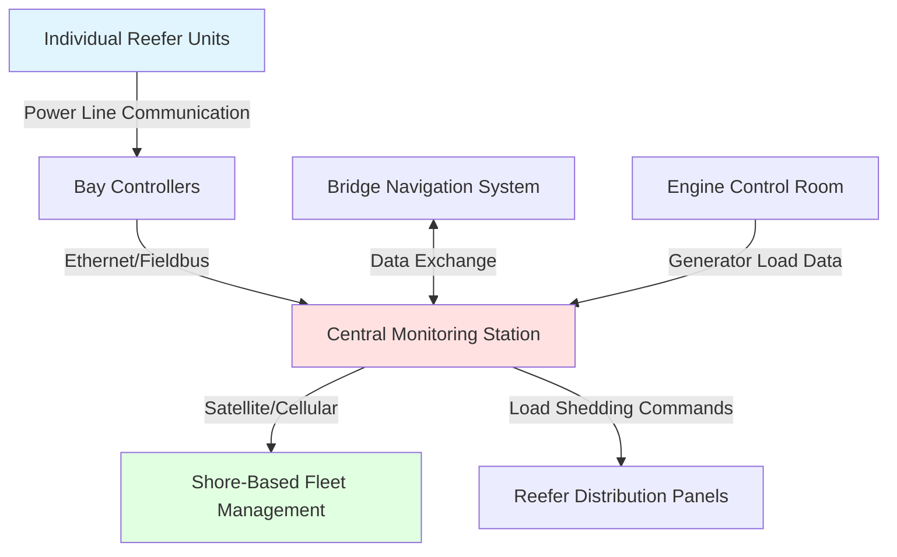

Container ships present unique HVAC challenges due to the combination of non-refrigerated (dry) containers requiring ventilation and refrigerated (reefer) containers demanding substantial electrical power for integral refrigeration units. Modern ultra-large container vessels (ULCV) carry 20,000+ TEU (Twenty-foot Equivalent Units), with reefer capacity ranging from 500 to 2,000+ plugs requiring coordinated power distribution and thermal management.

## Reefer Container Power Distribution

Refrigerated containers operate on standardized electrical connections providing power to integral refrigeration units mounted on each container. The power infrastructure represents a critical HVAC-related electrical system requiring substantial generation capacity and sophisticated load management.

### Electrical Requirements per ISO 1496-2

Reefer containers require three-phase power at specified voltage and frequency standards:

| Power Standard | Voltage | Frequency | Amperage per Container | Power per Container |
|----------------|---------|-----------|------------------------|---------------------|
| International | 380-460V | 50/60 Hz | 32A @ 460V | 14.7 kW |
| International | 380-460V | 50/60 Hz | 25A @ 460V | 11.5 kW |
| Legacy | 440V | 60 Hz | 16A @ 440V | 7.0 kW |
| European | 400V | 50 Hz | 32A @ 400V | 12.8 kW |

Modern reefer units average 10-12 kW per container under tropical operating conditions. Total electrical demand calculation:

$$
P_{total} = N_{reefer} \times P_{avg} \times DF \times SF
$$

Where:
- $P_{total}$ = Total reefer electrical demand (kW)
- $N_{reefer}$ = Number of reefer plugs
- $P_{avg}$ = Average power per container (11 kW typical)
- $DF$ = Diversity factor (0.70-0.85)
- $SF$ = Safety factor (1.15-1.25)

For a vessel with 1,000 reefer plugs:

$$
P_{total} = 1000 \times 11 \times 0.75 \times 1.20 = 9,900 \text{ kW}
$$

This substantial load requires dedicated generator capacity and sophisticated load-shedding protocols to maintain vessel electrical stability during peak demand conditions.

### Reefer Bay Power Distribution

Container bays are equipped with vertical and horizontal power rails feeding individual receptacles at each container position. The electrical distribution system must provide:

- **Continuous power supply**: Reefer cargo cannot tolerate interruptions exceeding 15-30 minutes without temperature excursions
- **Voltage regulation**: ±10% voltage tolerance per ISO standards
- **Frequency stability**: ±2% frequency variation maximum
- **Ground fault protection**: Individual circuit breakers or RCDs per stack
- **Load monitoring**: Current sensing on each receptacle for alarm generation

Power distribution follows a hierarchical structure from main switchboard through reefer distribution panels to bay-level junction boxes and finally to individual container receptacles.

## Below-Deck Container Hold Ventilation

Containers stowed in closed holds below deck require mechanical ventilation to prevent moisture accumulation, control temperature, and remove contaminants. SOLAS Chapter II-2 mandates ventilation systems capable of maintaining safe atmospheric conditions.

### Ventilation Rate Calculation

Ventilation rates for container holds depend on cargo characteristics, ambient conditions, and voyage duration. The fundamental ventilation requirement:

$$
Q = V \times ACH \times \frac{1}{60}
$$

Where:
- $Q$ = Ventilation airflow (m³/min)
- $V$ = Hold volume (m³)
- $ACH$ = Air changes per hour (6-12 typical)

For moisture control in holds carrying hygroscopic cargo or preventing condensation on steel structures:

$$
Q_{moisture} = \frac{W_{gen}}{(\rho \times (w_{hold} - w_{supply}))}
$$

Where:
- $Q_{moisture}$ = Required ventilation for moisture removal (m³/s)
- $W_{gen}$ = Moisture generation rate (kg/s)
- $\rho$ = Air density (kg/m³)
- $w_{hold}$ = Hold air humidity ratio (kg water/kg dry air)
- $w_{supply}$ = Supply air humidity ratio (kg water/kg dry air)

### Ventilation System Design

Container hold ventilation systems employ ducted supply and exhaust with the following characteristics:

**Supply Air System:**
- Intake from weather deck positioned to minimize salt spray and exhaust gas contamination
- Air handling units with filtration (G3-G4 minimum per ISO 16890)
- Optional heating coils for cold climate operations
- Distribution ductwork with diffusers at hold bottom or ends
- Supply air velocity 2-4 m/s to promote air circulation without disturbing cargo

**Exhaust Air System:**
- Exhaust grilles at opposite end from supply (cross-flow ventilation)
- Exhaust fans sized for slight negative pressure (-5 to -10 Pa relative to machinery spaces)
- Flame arrestors where required for hazardous cargo ventilation
- Emergency high-capacity ventilation (20-30 ACH) for hazmat incidents

### Temperature Control Considerations

Unlike reefer containers with active refrigeration, dry containers in holds experience temperature variations influenced by:

- External ambient temperature
- Solar radiation on deck and hull
- Heat from adjacent machinery spaces
- Heat from reefer container refrigeration units (condensing unit rejection)

Temperature stratification in large holds can reach 5-10°C between upper and lower container tiers. Ventilation design must promote vertical air mixing through:

$$
\dot{Q}_{convection} = \rho \times c_p \times Q \times \Delta T
$$

Where:
- $\dot{Q}_{convection}$ = Convective heat removal capacity (W)
- $c_p$ = Specific heat of air (1,005 J/kg·K)
- $\Delta T$ = Temperature difference between supply and exhaust (K)

## Reefer Container Monitoring Systems

Modern container vessels employ sophisticated monitoring systems tracking each reefer container's operational status. The integrated monitoring architecture provides:

**Data Points per Container:**
- Supply air temperature setpoint and actual
- Return air temperature
- Electrical current draw (per phase)
- Compressor running hours
- Alarm status (high/low temperature, power failure, door open)
- Controlled atmosphere parameters (O₂, CO₂) for CA reefers

**Centralized Monitoring Functions:**
- Real-time status display for all connected reefers
- Historical data logging (temperature profiles, alarm events)
- Automated alarm notification to bridge and shore operations
- Predictive maintenance alerts based on operating parameters
- Load management and power optimization

**Communication Architecture:**

The monitoring system enables crew to identify failing reefers, coordinate repairs during port calls, and provide cargo owners with continuous cold chain documentation—critical for high-value pharmaceutical and perishable food shipments.

## Reefer Bay Thermal Management

Reefer containers reject heat from their refrigeration cycles through condenser fans exhausting to ambient air. When multiple reefers operate in close proximity below deck, the cumulative heat rejection creates elevated ambient temperatures that reduce refrigeration efficiency and can cause compressor high-pressure cutouts.

Heat rejection per reefer container:

$$
\dot{Q}_{reject} = \dot{Q}_{cargo} + P_{compressor}
$$

For a typical reefer maintaining -18°C cargo with ambient at 35°C:
- $\dot{Q}_{cargo}$ = 8-10 kW (cargo cooling load)
- $P_{compressor}$ = 10-12 kW (compressor electrical input)
- $\dot{Q}_{reject}$ = 18-22 kW (total condenser heat rejection)

In a below-deck bay with 40 reefers operating simultaneously:

$$
\dot{Q}_{total} = 40 \times 20 = 800 \text{ kW}
$$

This heat load requires forced ventilation with supply air from weather deck and exhaust to atmosphere. Reefer bay ventilation systems provide:

- Minimum 20-30 air changes per hour during peak reefer operation
- Directional airflow patterns preventing hot exhaust air recirculation
- Temperature monitoring with automatic fan speed modulation
- Ambient temperature maintenance below 45°C (reefer unit maximum operating ambient)

Insufficient reefer bay ventilation results in cascading failures as elevated ambient temperatures force individual units into alarm, further concentrating the heat load on remaining operational units.

## Standards and Regulatory Requirements

Container ship HVAC and reefer systems operate under multiple regulatory frameworks:

**International Standards:**
- SOLAS Chapter II-2: Fire safety and ventilation requirements
- ISO 1496-2: Thermal containers specifications
- IEC 60092: Electrical installations in ships
- IMO Code of Safe Practice for Cargo Stowage and Securing

**Classification Society Rules:**
- American Bureau of Shipping (ABS) Rules for Building and Classing Steel Vessels
- Det Norske Veritas (DNV) Rules for Ships
- Lloyd's Register Rules and Regulations for the Classification of Ships

**Industry Standards:**
- Carrier Transicold, Thermo King, Daikin reefer technical specifications
- Container Owners Association operational guidelines
- IICL (Institute of International Container Lessors) inspection criteria

These standards govern reefer electrical systems, ventilation requirements for hazardous and non-hazardous cargo, and fire protection systems integrated with HVAC operations—including smoke detection, CO₂ firefighting system interaction with ventilation dampers, and emergency ventilation protocols.

## Operational Considerations

Container ship HVAC operations balance competing objectives of cargo protection, energy efficiency, and safety:

**Pre-Departure Procedures:**
- Verify all reefer connections and electrical continuity
- Set temperature parameters per cargo requirements
- Confirm monitoring system communication
- Document initial cargo temperatures (for cold chain validation)

**Voyage Operations:**
- Continuous monitoring of reefer performance and hold ventilation
- Generator load management during peak reefer demand periods
- Weather-dependent ventilation adjustments (close dampers in heavy seas)
- Respond to reefer alarms and coordinate repairs

**Energy Optimization:**
- Load sequencing to minimize generator fuel consumption
- Temperature setpoint optimization within cargo tolerances
- Ventilation fan speed modulation based on actual heat loads
- Power factor correction to reduce reactive power losses

Effective container ship HVAC management requires coordination between deck officers (cargo responsibility), engineering officers (power generation and HVAC systems), and shore-based logistics teams (cargo owner communication)—making it one of the most complex marine HVAC applications.
