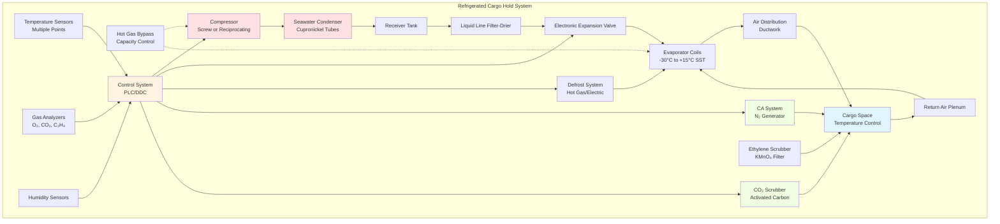

Refrigerated cargo holds and container refrigeration systems maintain precise temperature and atmospheric conditions for perishable goods during maritime transport. These systems must operate continuously for voyages lasting weeks while accommodating diverse cargo requirements ranging from frozen products at -30°C to fresh produce at controlled temperatures above freezing with specific gas concentrations.

## Refrigerated Cargo Types and Requirements

Different perishable cargo categories demand distinct environmental control parameters for optimal preservation during transport.

### Temperature and Humidity Specifications

| Cargo Type | Temperature Range | Relative Humidity | Atmospheric Control | Storage Duration |
|------------|-------------------|-------------------|---------------------|------------------|
| Frozen meat | -18°C to -25°C | 90-95% | Standard air | 6-12 months |
| Frozen fish | -25°C to -30°C | 90-95% | Standard air | 12-24 months |
| Fresh beef (chilled) | -1.5°C to 0°C | 90-95% | Standard air | 30-60 days |
| Fresh produce (bananas) | 13°C to 14°C | 90-95% | CA: 2-5% O₂, 2-5% CO₂ | 20-30 days |
| Fresh produce (apples) | 0°C to 2°C | 90-95% | CA: 1-3% O₂, 1-3% CO₂ | 60-120 days |
| Citrus fruits | 4°C to 8°C | 85-90% | Standard air | 30-60 days |
| Dairy products | 2°C to 4°C | 80-85% | Standard air | 30-90 days |
| Pharmaceuticals | 2°C to 8°C | 40-60% | Standard air | Per product spec |

**Cargo-Specific Considerations**

Frozen cargo requires deep temperature maintenance with minimal fluctuation to prevent ice crystal growth that damages cellular structure. Fresh produce benefits from controlled atmosphere (CA) storage where oxygen reduction and carbon dioxide elevation slow respiration rates and extend shelf life. Ethylene-sensitive commodities require active gas scrubbing to prevent premature ripening. Pharmaceuticals demand validated temperature control with continuous monitoring and alarm systems per Good Distribution Practice (GDP) requirements.

## Refrigeration System Design

Reefer hold systems employ vapor-compression refrigeration with configurations optimized for marine application constraints.

### Heat Load Calculations

Total refrigeration load comprises multiple components requiring individual quantification:

$$Q_{total} = Q_{product} + Q_{transmission} + Q_{air} + Q_{people} + Q_{equipment} + Q_{respiration}$$

**Product Cooling Load**

The sensible heat removal from cargo during cooldown:

$$Q_{product} = \frac{m \cdot c_p \cdot (T_i - T_f)}{t_{pulldown}}$$

Where:
- $m$ = cargo mass (kg)
- $c_p$ = specific heat of product (kJ/kg·K)
- $T_i$ = initial product temperature (°C)
- $T_f$ = final storage temperature (°C)
- $t_{pulldown}$ = allowable pulldown time (hours)

For frozen cargo requiring latent heat removal during freezing:

$$Q_{freezing} = m \cdot h_{latent} + m \cdot c_{p,frozen} \cdot (T_{freeze} - T_f)$$

Where $h_{latent}$ represents the latent heat of fusion (typically 250-335 kJ/kg for high-water-content foods).

**Transmission Load**

Heat gain through insulated boundaries from adjacent spaces and external environment:

$$Q_{transmission} = U \cdot A \cdot \Delta T$$

Where:
- $U$ = overall heat transfer coefficient (W/m²K)
- $A$ = surface area (m²)
- $\Delta T$ = temperature difference across boundary (K)

For insulated cargo holds, typical U-values range from 0.15-0.25 W/m²K using polyurethane foam insulation 100-150 mm thick.

**Air Infiltration Load**

Heat gain from outside air entering during door openings:

$$Q_{air} = \rho \cdot V_{air} \cdot c_p \cdot (T_{ambient} - T_{hold}) + \rho \cdot V_{air} \cdot h_{fg} \cdot (\omega_{ambient} - \omega_{hold})$$

Where:
- $\rho$ = air density (kg/m³)
- $V_{air}$ = infiltration air volume (m³/h)
- $h_{fg}$ = latent heat of vaporization (2501 kJ/kg at 0°C)
- $\omega$ = humidity ratio (kg water/kg dry air)

### Refrigeration System Components

**Compressor Selection**

Screw compressors dominate reefer applications for capacities above 50 kW due to continuous operation capability and slide valve capacity modulation from 10-100%. For smaller systems or containerized reefer units, reciprocating compressors with cylinder unloading provide staged capacity control. Marine-rated compressors feature:

- Vibration isolation mountings for shipboard shock resistance
- Oil cooling systems using seawater or chilled water
- High-efficiency motor designs for electrical load reduction
- Corrosion-resistant exterior coatings

**Evaporator Design**

Forced-air evaporators employ finned tube coils with electric or hot-gas defrost capability. Design parameters include:

- Air temperature difference (ΔT): 8-12°C for frozen cargo, 4-6°C for fresh produce
- Face velocity: 2.5-3.5 m/s to balance heat transfer against pressure drop
- Fin spacing: 4-6 mm for frozen service, 6-10 mm for fresh cargo
- Defrost cycle frequency: Every 6-12 hours for frozen cargo, 12-24 hours for fresh cargo

Fin spacing must prevent excessive frost accumulation while maintaining airflow. Tighter spacing improves heat transfer but increases defrost requirements.

## Air Circulation Systems

Proper air distribution ensures uniform temperature throughout the cargo space and prevents localized warm spots.

### Air Circulation Rates

Required air circulation depends on cargo type and refrigeration load intensity:

$$V_{circulation} = \frac{Q_{refrigeration}}{\rho \cdot c_p \cdot \Delta T_{supply}}$$

Where:
- $V_{circulation}$ = volumetric airflow rate (m³/s)
- $Q_{refrigeration}$ = total cooling capacity (kW)
- $\Delta T_{supply}$ = supply-to-return air temperature difference (K)

Typical air change rates range from 30-60 ACH for frozen cargo holds to 60-120 ACH for fresh produce requiring precise temperature control. Higher circulation rates reduce temperature gradients but increase fan power consumption and cargo dehydration.

### Air Distribution Patterns

Bottom-air delivery systems force cold air beneath cargo through floor gratings. Air rises through cargo stacks, absorbing heat before returning to evaporator coils. This arrangement:

- Ensures coldest air contacts bottom cargo layers most vulnerable to heat ingress
- Provides uniform temperature distribution in properly stowed cargo
- Requires adequate air passages between cargo units (75-100 mm minimum)

Top-air delivery systems supply cold air above cargo with return air drawn from floor level. This configuration suits containerized cargo where bottom-air delivery is impractical but creates greater vertical temperature stratification.

## Defrost Cycle Management

Frost accumulation on evaporator coils degrades heat transfer efficiency and restricts airflow. Effective defrost strategies maintain system performance while minimizing temperature excursions.

### Defrost Methods

**Hot Gas Defrost**

Compressor discharge gas bypasses the condenser and flows directly to evaporator coils. The high-temperature refrigerant (60-80°C) melts accumulated frost rapidly. This method:

- Completes defrost cycles in 15-30 minutes
- Recovers condensed refrigerant to receiver tank
- Causes minimal cargo temperature rise with proper control
- Requires additional hot gas piping and control valves

**Electric Defrost**

Resistance heaters embedded in evaporator fins melt frost through direct contact heating. Electric defrost:

- Provides simple control without additional refrigerant piping
- Requires longer defrost periods (30-60 minutes)
- Consumes significant electrical power (typically 25-35% of refrigeration capacity)
- Suits containerized reefer units with integrated power supplies

### Defrost Cycle Optimization

Defrost initiation strategies include:

1. **Time-based**: Fixed intervals (6, 8, 12 hours) regardless of frost accumulation
2. **Demand-based**: Pressure differential across coil triggers defrost when airflow restriction reaches threshold
3. **Temperature-based**: Coil surface temperature depression indicates frost thickness

Time-based defrost provides predictable operation but may defrost prematurely or allow excessive frost buildup. Demand-based approaches optimize energy consumption by defrosting only when necessary.

Defrost termination occurs when:
- Coil surface temperature reaches 10-15°C indicating complete frost melt
- Fixed time period elapses (backup termination)
- Drain pan temperature confirms complete water drainage

## Controlled Atmosphere Systems

CA storage extends fresh produce shelf life by modifying oxygen and carbon dioxide concentrations to slow metabolic processes.

### Gas Concentration Control

Nitrogen generation systems using pressure swing adsorption (PSA) reduce oxygen from atmospheric 21% to target levels of 1-5%. Carbon dioxide levels increase naturally through produce respiration or require active injection to reach target concentrations.

Required nitrogen generation capacity:

$$V_{N_2} = V_{hold} \cdot \frac{(O_{2,initial} - O_{2,target})}{100} + L_{leakage} \cdot t$$

Where:
- $V_{hold}$ = cargo hold volume (m³)
- $O_{2,initial}$ = initial oxygen concentration (%)
- $O_{2,target}$ = target oxygen concentration (%)
- $L_{leakage}$ = air leakage rate (m³/h)
- $t$ = time to achieve target atmosphere (hours)

Hold gas-tightness is critical. Acceptable leakage rates are <0.5% hold volume per 24 hours at 100 Pa pressure differential.

### Gas Monitoring and Control

Continuous gas analysis using electrochemical or paramagnetic sensors monitors oxygen, carbon dioxide, and ethylene concentrations. Control systems adjust:

- Nitrogen injection rate to maintain oxygen setpoint
- Carbon dioxide scrubbing rate using calcium hydroxide or activated carbon
- Ethylene removal through catalytic oxidation or potassium permanganate filtration

Fresh air exchange during CA storage balances respiration product removal against atmospheric gas ingress. Typical fresh air rates are 5-10 m³/h per ton of produce.

## Marine Cold Chain Standards

International standards govern refrigerated cargo handling and equipment performance.

**IMO Requirements**

The International Maritime Organization establishes minimum standards for refrigerated cargo spaces including:

- Insulation requirements: U-value ≤ 0.40 W/m²K for refrigerated holds
- Temperature control accuracy: ±1.0°C from setpoint
- Alarm systems for temperature deviation and equipment failure
- Emergency backup refrigeration capacity

**Reefer Container Standards**

ISO 1496-2 specifies dimensions, strength, and thermal performance for refrigerated containers. Key requirements include:

- Cooling capacity: Maintain -25°C internal with +30°C ambient at 80% RH
- Air circulation: Minimum delivery airflow based on container size
- Temperature uniformity: ±0.5°C throughout cargo space
- Defrost capability without exceeding +12°C internal temperature

**Perishable Cargo Protocols**

The Comité International des Transports Ferroviaires (CITF) ATP Agreement establishes temperature control requirements for international perishable transport. Classification includes equipment categories (IN, FRC, FRF) based on achievable internal temperatures and insulation quality.

Refrigerated cargo systems represent a critical component of global food supply chains, requiring sophisticated refrigeration engineering adapted to marine operational constraints. Proper system design ensures product quality preservation across extended voyage durations while minimizing energy consumption and operational costs.
