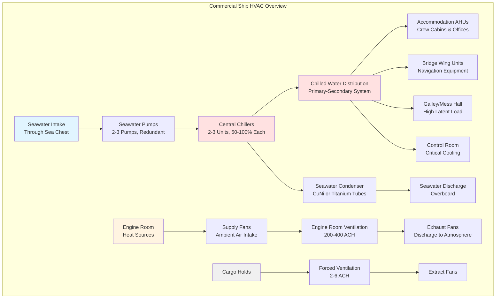

Commercial vessels operate under demanding conditions requiring HVAC systems designed for reliability, energy efficiency, and regulatory compliance. Unlike passenger ships with extensive accommodation requirements, commercial cargo vessels prioritize crew comfort, cargo protection, and engine room cooling while minimizing power consumption and installation costs.

## Commercial Vessel Categories

Different commercial vessel types present distinct HVAC requirements based on crew complement, cargo sensitivity, and operational profiles.

### Vessel Type Comparison

| Vessel Type | Crew Size | Primary HVAC Load | Cargo Considerations | Typical System |
|-------------|-----------|-------------------|---------------------|----------------|
| Bulk Carrier | 20-25 | Accommodation block | Minimal cargo ventilation | Split DX + natural ventilation |
| Container Ship | 20-30 | Accommodation + bridge | Reefer container monitoring | Central chilled water |
| Oil/Chemical Tanker | 25-35 | Accommodation + control room | Tank atmosphere control | Central plant + special exhaust |
| General Cargo | 15-25 | Accommodation + holds | Cargo hold dehumidification | DX units + forced ventilation |
| LNG Carrier | 30-40 | Accommodation + control | Boil-off gas management | Redundant central systems |
| Ro-Ro/Car Carrier | 20-30 | Accommodation + vehicle decks | Vehicle deck ventilation | Central plant + high-capacity fans |

**Bulk Carriers and Dry Cargo Vessels**

These vessels transport non-perishable commodities (ore, grain, coal) with minimal cargo climate control. HVAC focuses on crew accommodation blocks, typically located aft above the engine room. Standard configurations include:

- Split DX systems for individual cabins and offices
- Centralized air handling for mess halls and common areas
- Natural ventilation for cargo holds with mechanical assist during loading
- Engine room supply/exhaust fans sized for machinery cooling

Crew areas require 25-30 kW of cooling capacity for typical 20-person complement. Cargo hold ventilation provides 2-6 air changes per hour to prevent moisture accumulation and spontaneous combustion risks in materials like coal.

**Container Ships**

Modern container ships carry 3,000-24,000 TEU with significant electrical loads from refrigerated containers. HVAC considerations include:

- Bridge wing air conditioning for navigational electronics (5-10 kW)
- Accommodation tower with central chilled water (100-200 kW total)
- Ventilation for below-deck container holds to remove diesel exhaust during port operations
- Dedicated cooling for reefer container monitoring systems

The accommodation block experiences high solar loads on exposed vertical surfaces. Calculation requires consideration of sun angle variation during global routes.

**Tankers (Oil, Chemical, LNG)**

Hazardous cargo vessels demand explosion-proof HVAC equipment in classified zones and specialized ventilation for tank atmospheres.

- ATEX/IECEx certified equipment for Zone 1/2 hazardous areas
- Inert gas systems providing nitrogen blankets for cargo tanks
- Positive pressure systems for accommodation to prevent hydrocarbon vapor intrusion
- Emergency shutdown integration with cargo handling systems

Tank atmosphere control maintains cargo integrity through temperature regulation and inert gas blanketing. LNG carriers utilize boil-off gas for propulsion fuel while maintaining cargo at -162°C, requiring thermal isolation between cargo systems and accommodation HVAC.

## Heat Load Calculations

Marine HVAC load calculations follow established principles with modifications for shipboard conditions.

### Accommodation Space Cooling Load

The total cooling load combines sensible and latent components from multiple sources:

$$Q_{\text{total}} = Q_{\text{solar}} + Q_{\text{transmission}} + Q_{\text{ventilation}} + Q_{\text{internal}} + Q_{\text{latent}}$$

**Solar Heat Gain**

Solar radiation through windows and absorbed by steel structure creates significant loads. The instantaneous solar heat gain through glazing:

$$Q_{\text{solar}} = A \cdot \text{SHGC} \cdot I_{\text{total}} \cdot \text{CLF}$$

where:
- $A$ = glazed area, m²
- $\text{SHGC}$ = solar heat gain coefficient (0.25-0.85 depending on glass type)
- $I_{\text{total}}$ = total solar irradiance, W/m² (varies by latitude, heading, and time)
- $\text{CLF}$ = cooling load factor accounting for thermal mass

For steel-hulled vessels with limited thermal mass, CLF approaches 1.0. Peak solar loads occur on bridge wings with west-facing glazing during afternoon watches in tropical latitudes (up to 1000 W/m²).

**Transmission Load**

Heat conducted through external boundaries depends on surface area, U-factor, and temperature difference:

$$Q_{\text{transmission}} = U \cdot A \cdot \Delta T$$

Typical U-values for marine construction:
- Insulated steel bulkhead: 0.4-0.6 W/m²K
- Uninsulated steel deck: 5.0-6.0 W/m²K
- Double-glazed window: 2.5-3.0 W/m²K

Cabins adjacent to machinery spaces require enhanced insulation (U < 0.3 W/m²K) to prevent heat gain from 45-50°C engine room temperatures.

**Ventilation Load**

Outside air introduced for IAQ creates both sensible and latent loads:

$$Q_{\text{vent,sensible}} = \dot{m}_{\text{air}} \cdot c_p \cdot (T_{\text{outside}} - T_{\text{inside}})$$

$$Q_{\text{vent,latent}} = \dot{m}_{\text{air}} \cdot h_{fg} \cdot (\omega_{\text{outside}} - \omega_{\text{inside}})$$

where:
- $\dot{m}_{\text{air}}$ = mass flow rate, kg/s
- $c_p$ = specific heat of air, 1.006 kJ/kgK
- $h_{fg}$ = enthalpy of vaporization, 2500 kJ/kg
- $\omega$ = humidity ratio, kg water/kg dry air

Minimum ventilation rates per SOLAS: 30 m³/hr per person for accommodation spaces. In tropical conditions (35°C, 80% RH), ventilation load dominates total cooling requirement.

**Internal Heat Gain**

Occupants, lighting, and equipment contribute sensible and latent loads:

$$Q_{\text{internal}} = Q_{\text{occupants}} + Q_{\text{lighting}} + Q_{\text{equipment}}$$

Occupant heat gain varies with activity level:
- Sleeping: 70 W/person (40 W sensible, 30 W latent)
- Seated/moderate work: 130 W/person (70 W sensible, 60 W latent)
- Heavy work: 200 W/person (100 W sensible, 100 W latent)

Modern LED lighting reduces electrical loads to 5-10 W/m² compared to 15-20 W/m² for traditional fluorescent systems.

### Total Cooling Capacity

Summing all load components and applying safety factors:

$$Q_{\text{design}} = (Q_{\text{total}}) \cdot \text{SF}$$

Safety factors for marine applications range from 1.15-1.25 to account for equipment degradation from salt exposure and reduced condenser performance with elevated seawater temperatures (up to 32°C in tropical ports).

## System Design Considerations

Commercial vessel HVAC systems balance performance requirements against space, weight, and power constraints.

### Chiller Selection

Central chilled water plants provide cooling for accommodation and electronics. Selection criteria include:

**Capacity Distribution**

Two-chiller systems operate at 60-70% capacity each under normal conditions, allowing single-unit operation during reduced loads or providing full capacity if one unit fails. Three-chiller configurations offer greater flexibility:

- Normal operation: 2 units at 50% load (100% total)
- Tropical conditions: 3 units at 65% load (195% total)
- Single unit failure: 2 units at 75% load (150% minimum)

**Refrigerant Selection**

Marine chillers utilize refrigerants balancing performance, safety, and environmental compliance:

| Refrigerant | Type | ODP | GWP | Safety | Application |
|-------------|------|-----|-----|--------|-------------|
| R-134a | HFC | 0 | 1430 | A1 | Legacy installations |
| R-513A | HFO blend | 0 | 631 | A1 | Low-GWP replacement |
| R-1234ze | HFO | 0 | 6 | A2L | New installations |
| R-717 (NH₃) | Natural | 0 | 0 | B2 | Large vessels, machinery spaces only |

IMO MARPOL Annex VI and EU F-Gas regulations drive transition to low-GWP refrigerants. R-1234ze offers near-zero GWP but requires A2L safety protocols for mildly flammable refrigerants.

**Condenser Design**

Seawater-cooled condensers use tube materials resisting corrosion:

- 90-10 Copper-nickel: standard for clean seawater, 2.5 m/s max velocity
- 70-30 Copper-nickel: polluted waters or higher velocities (3.0 m/s)
- Titanium Grade 2: superior corrosion resistance, allows 3.5 m/s, higher cost

Fouling factors of 0.000176 m²K/W (0.001 hr·ft²·°F/BTU) account for biological growth and scale accumulation. Automatic tube cleaning systems extend intervals between manual cleaning.

### Air Distribution

Accommodation air handling units deliver conditioned air through insulated ductwork systems.

**Ductwork Routing**

Space constraints require compact duct distribution. Rectangular ducts maximize use of overhead spaces between deck beams. Typical duct velocities:

- Main distribution ducts: 6-8 m/s
- Branch ducts: 4-6 m/s
- Terminal diffusers: 2-4 m/s

Lower velocities reduce noise transmission critical for crew rest areas. Acoustic lining in main ducts attenuates fan and turbulence noise.

**Air Handling Units**

Marine AHUs incorporate features addressing shipboard conditions:

- Stainless steel construction (304/316) for corrosion resistance
- Access panels on all sides for maintenance in restricted spaces
- Condensate pumps overcoming ship motion (0.5-1.0 m head)
- Vibration isolation mounts (spring or elastomeric, deflection 10-25 mm)
- Washable filters for saltwater spray environments

Supply air temperature setpoints of 12-14°C provide adequate dehumidification in tropical climates while avoiding excessive overcooling requiring reheat.

## Regulatory Compliance

Commercial vessels must satisfy classification society and international standards.

### SOLAS Requirements

The International Convention for Safety of Life at Sea establishes minimum HVAC standards:

**Temperature Control**
- Accommodation spaces: 18°C minimum, 25°C maximum (tropical conditions)
- Machinery control rooms: 18-28°C for electronics operation
- Medical facilities: 20-22°C year-round

**Ventilation Rates**
- Crew cabins: 6 air changes per hour minimum
- Mess rooms: 8 ACH minimum
- Machinery spaces: 30 ACH minimum
- Galleys: 10-15 ACH with dedicated exhaust

**Fire Safety**
- Automatic fire dampers at main vertical zone boundaries (A-60 divisions)
- Remote shutdown from bridge and emergency stations
- Smoke detection in supply and return air streams
- Emergency power for essential ventilation systems

### Classification Society Rules

ABS, DNV-GL, Lloyd's Register, and other societies publish detailed HVAC requirements:

**Equipment Certification**
- Type approval testing per society standards
- Vibration testing: IEC 60068-2-6 (10-200 Hz sweep)
- Shock testing: MIL-S-901D for naval applications
- Salt spray testing: ASTM B117 (1000+ hours exposure)

**Material Standards**
- Copper alloys: ASTM B111 for condenser tubes
- Stainless steel: AISI 316L minimum for seawater contact
- Insulation: IMO 2010 FTP Code for fire properties
- Refrigerants: ISO 817 safety classifications

**System Performance**
- Design conditions: 35°C dry bulb, 70% RH (tropical)
- Seawater temperature: 32°C maximum
- Machinery space ventilation: maintain <45°C ambient
- Noise limits: <60 dB(A) in accommodation per IMO Res. A.468

### IMO Environmental Standards

International Maritime Organization regulations address environmental impacts:

**MARPOL Annex VI**
- Phase-out of high-GWP refrigerants (>2500 GWP)
- Mandatory refrigerant leak detection systems
- Recovery and recycling requirements for refrigerants
- Discharge temperature limits (10°C above ambient) in sensitive waters

**Energy Efficiency**
- EEDI (Energy Efficiency Design Index) includes HVAC power consumption
- SEEMP (Ship Energy Efficiency Management Plan) requires HVAC optimization
- Waste heat recovery from engine cooling for accommodation heating

## Operational Considerations

Commercial vessel HVAC systems operate under variable conditions requiring adaptive control strategies.

### Load Variation Management

Cargo operations create significant load changes:

- Port operations: crew working throughout vessel, high internal gains
- Sea passage: reduced crew activity, lower ventilation requirements
- Tropical transits: maximum cooling load from solar and ambient conditions
- Arctic operations: heating loads, freeze protection for exposed piping

Variable frequency drives on chiller compressors and chilled water pumps enable capacity modulation matching actual loads. Sequencing controls bring additional chillers online based on supply water temperature deviation from setpoint.

### Maintenance Accessibility

Long voyages between ports require onboard maintenance capabilities. Design considerations include:

- Equipment placement allowing compressor removal without cutting bulkheads
- Filter access without confined space entry requirements
- Spare parts storage for critical components (compressor valves, seals, controls)
- Tool and instrumentation provision for crew-performed maintenance

Classification societies require annual surveys verifying HVAC system performance. Documentation of maintenance activities demonstrates compliance with statutory requirements.

### Energy Optimization

Fuel costs dominate vessel operating expenses, making HVAC energy efficiency critical:

- Chiller staging based on part-load performance curves
- Free cooling using seawater during cold-water transits (direct or via heat exchangers)
- Heat recovery from engine jacket water for accommodation heating
- LED lighting reducing internal cooling loads
- Variable air volume systems for spaces with varying occupancy

Modern commercial vessels achieve specific cooling power of 0.6-0.8 kW refrigeration per kW electrical input through optimized equipment selection and control strategies.

Commercial ship HVAC engineering requires integration of thermodynamic principles with marine operational realities. System designs prioritizing reliability, compliance, and efficiency ensure crew comfort and cargo protection throughout global voyages while minimizing lifecycle costs.
