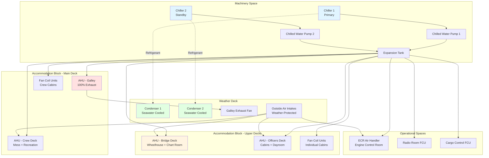

Cargo ship HVAC systems provide crew comfort in accommodation spaces, maintain operational conditions in the bridge and control rooms, and support refrigerated cargo operations while meeting stringent maritime regulations and operating under extreme environmental conditions.

## Design Requirements and Standards

### SOLAS Comfort Requirements

The International Convention for the Safety of Life at Sea (SOLAS) Chapter II-1, Regulation 3-12 mandates air conditioning in accommodation spaces, radio rooms, and wheelhouse for vessels over 1600 gross tonnage. Classification societies (Lloyd's Register, ABS, DNV, BV) enforce additional comfort standards.

**SOLAS Temperature Requirements:**

| Space Type | Temperature Range | Air Changes/Hour | Notes |
|------------|------------------|------------------|-------|
| Crew Cabins | 20-25°C (68-77°F) | 6-8 ACH | Individual control required |
| Officers' Cabins | 20-25°C (68-77°F) | 6-8 ACH | Individual control required |
| Mess Rooms | 22-26°C (72-79°F) | 10-12 ACH | High occupancy loading |
| Galley | 24-28°C (75-82°F) | 20-30 ACH | Heat and moisture removal |
| Bridge/Wheelhouse | 20-24°C (68-75°F) | 8-10 ACH | Precise control, low noise |
| Radio Room | 20-24°C (68-75°F) | 8-10 ACH | Equipment cooling priority |
| Engine Control Room | 22-26°C (72-79°F) | 10-15 ACH | Positive pressure |
| Hospital | 22-24°C (72-75°F) | 6-8 ACH | Humidity control critical |

### Classification Society Standards

Classification societies specify design conditions, equipment certification, and installation practices. ABS Rules for Building and Classing Steel Vessels require:

- Design for 35°C (95°F) outdoor, 50% RH minimum
- Arctic-class vessels: -40°C (-40°F) outdoor capability
- Relative humidity maintained at 45-55% year-round
- Maximum noise levels: 55 dB(A) cabins, 60 dB(A) public spaces, 65 dB(A) bridge

## HVAC System Architecture

Cargo ships employ centralized chilled water systems with air handling units distributed throughout the accommodation block. The typical arrangement separates systems by function: crew comfort, navigational electronics cooling, and reefer container support.

## Cooling Load Calculations

### Accommodation Block Load

Total cooling load combines sensible and latent heat from multiple sources:

$$Q_{total} = Q_{sensible} + Q_{latent}$$

**Sensible Heat Components:**

$$Q_{sensible} = Q_{envelope} + Q_{equipment} + Q_{lighting} + Q_{people,sens} + Q_{ventilation,sens}$$

Where:
- $Q_{envelope}$ = Heat transmission through hull and superstructure (W)
- $Q_{equipment}$ = Electronics, appliances, galley equipment (W)
- $Q_{lighting}$ = Lighting heat gain (W)
- $Q_{people,sens}$ = Occupant sensible heat (W)
- $Q_{ventilation,sens}$ = Outdoor air sensible load (W)

**Envelope Heat Gain:**

$$Q_{envelope} = U \cdot A \cdot (T_{outdoor} - T_{indoor})$$

Where:
- $U$ = Overall heat transfer coefficient (W/m²·K), typical values:
  - Insulated steel hull: 0.35-0.45 W/m²·K
  - Superstructure walls: 0.40-0.55 W/m²·K
  - Windows/portholes: 2.5-3.5 W/m²·K
- $A$ = Surface area (m²)
- $T_{outdoor}$ = Design outdoor temperature (°C)
- $T_{indoor}$ = Design indoor temperature (°C)

**Solar Heat Gain Through Glass:**

$$Q_{solar} = A_{glass} \cdot SHGC \cdot I_{solar}$$

Where:
- $A_{glass}$ = Glass area (m²)
- $SHGC$ = Solar heat gain coefficient (0.25-0.40 for marine-grade glass)
- $I_{solar}$ = Solar irradiance (W/m²), typically 800-1000 W/m² for tropical operations

**Latent Heat Components:**

$$Q_{latent} = Q_{people,lat} + Q_{ventilation,lat}$$

**People Load:**

$$Q_{people,total} = N \cdot (q_{sens} + q_{lat})$$

Typical values at moderate activity:
- $q_{sens}$ = 75 W/person (sensible)
- $q_{lat}$ = 55 W/person (latent)
- Total = 130 W/person

**Ventilation Load:**

$$Q_{ventilation} = \dot{m}_{air} \cdot c_p \cdot \Delta T + \dot{m}_{air} \cdot h_{fg} \cdot \Delta W$$

Where:
- $\dot{m}_{air}$ = Mass flow rate of outdoor air (kg/s)
- $c_p$ = Specific heat of air = 1.006 kJ/kg·K
- $\Delta T$ = Temperature difference (K)
- $h_{fg}$ = Latent heat of vaporization = 2501 kJ/kg at 0°C
- $\Delta W$ = Humidity ratio difference (kg moisture/kg dry air)

### Bridge Climate Control Load

Bridge HVAC requires precise temperature control to protect navigation electronics and maintain operator alertness:

$$Q_{bridge} = Q_{envelope} + Q_{solar,glass} + Q_{equipment} + Q_{people} + Q_{ventilation}$$

Equipment heat loads for modern integrated bridge:
- ECDIS displays: 200-400 W
- Radar systems: 300-600 W
- Communication equipment: 150-300 W
- Chart table lighting: 100-150 W
- Total equipment load: 750-1450 W typical

**Chiller Capacity Sizing:**

$$Q_{chiller} = \frac{Q_{design} \cdot SF}{COP}$$

Where:
- $Q_{design}$ = Total design cooling load (kW)
- $SF$ = Safety factor = 1.15-1.25
- $COP$ = Coefficient of performance = 2.5-3.5 for marine chillers

For redundancy, cargo ships install N+1 chiller configuration with each unit sized for 60-70% of total load.

## Reefer Container Support

Container ships carrying refrigerated cargo require substantial electrical power for reefer containers:

**Electrical Load per Reefer:**

$$P_{reefer} = 7 \text{ to } 12 \text{ kW per 40-ft container}$$

**Total Reefer Power:**

$$P_{total,reefer} = N_{reefer} \cdot P_{avg} \cdot DF$$

Where:
- $N_{reefer}$ = Number of reefer container slots
- $P_{avg}$ = Average power per container = 8-10 kW
- $DF$ = Diversity factor = 0.75-0.85

Large container ships may allocate 2-4 MW for reefer container operations.

## System Components and Design Considerations

**Chilled Water System:**
- Central chillers: 100-500 kW capacity, R-134a or R-513A refrigerant
- Seawater-cooled condensers: Titanium tubes, removable tube bundles
- Chilled water temperature: 7-12°C supply, 14-18°C return
- System pressure: 3-6 bar, accommodate vessel motion

**Air Handling Units:**
- Marine-grade construction: Galvanized/powder-coated steel, stainless fasteners
- Draw-through configuration with chilled water coils
- Outside air economizers for temperate climates
- HEPA filtration optional for specialized cargo

**Distribution:**
- Individual fan coil units in cabins with local thermostats
- Insulated chilled water piping: Copper or stainless steel
- Flexible connections at equipment to absorb vibration
- Drain pans with positive drainage, condensate pumps where required

**Controls:**
- DDC system with central monitoring from bridge
- Individual cabin temperature control
- Automatic switchover between chillers
- Integration with vessel automation system

**Noise and Vibration:**
- Vibration isolators on all rotating equipment
- Flexible duct connections at AHUs
- Sound attenuation in bridge and cabin supply/return ducts
- Maximum NC-35 in wheelhouse, NC-40 in cabins

## Operational Considerations

Cargo ship HVAC systems operate continuously during voyages spanning weeks to months across varying climates. Design must accommodate tropical heat (40°C+), arctic cold (-30°C), and high humidity (90%+) while maintaining crew comfort per International Labour Organization (ILO) Maritime Labour Convention standards.

System redundancy ensures continued operation during single-component failures. Automatic controls minimize crew intervention while providing local adjustment capability. Preventive maintenance schedules align with vessel dry-docking intervals and port calls.

## Components

- Accommodation Block Hvac
- Bridge Climate Control
- Engine Control Room Ac
- Crew Quarters Ventilation
- Galley Exhaust Cargo Ship
- Minimal Hvac Cargo Ships
- Reefer Container Power
- Container Ship Electrical Load
