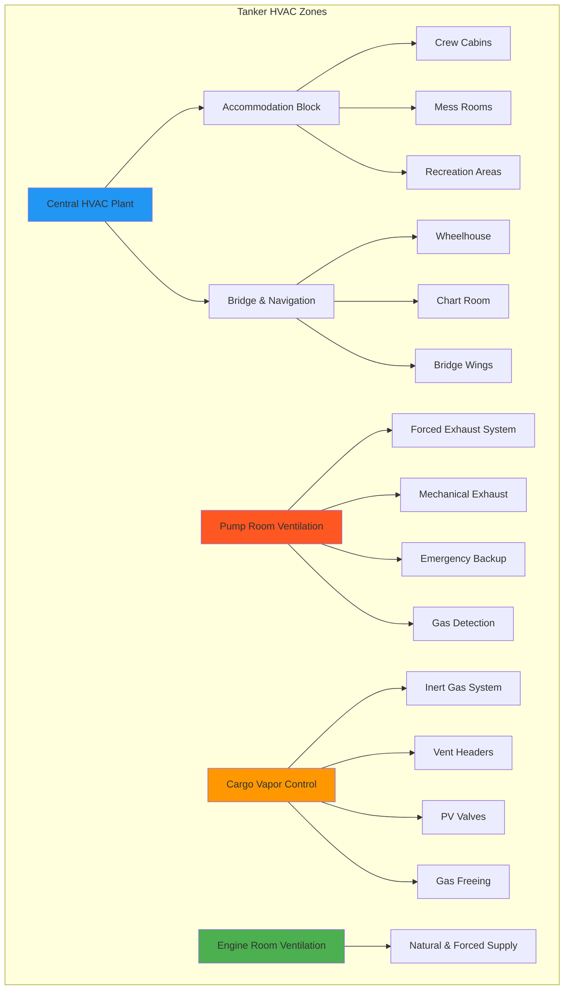

Tankers and bulk carriers present unique HVAC challenges due to hazardous cargo atmospheres, pump room ventilation requirements, and the separation of accommodation spaces from cargo areas. These vessels require specialized ventilation systems that comply with SOLAS (Safety of Life at Sea) and IMO (International Maritime Organization) regulations for hazardous cargo handling.

## System Configuration

Tanker and bulk carrier HVAC systems divide the vessel into distinct zones with different ventilation and conditioning requirements. The accommodation block receives full climate control, while cargo and machinery spaces require specialized ventilation.

## Pump Room Ventilation Requirements

Pump rooms on tankers require continuous mechanical ventilation to prevent accumulation of explosive vapors. SOLAS Chapter II-2 Regulation 4.5.2 mandates specific ventilation rates.

### Ventilation Rate Calculation

The required air change rate for pump rooms:

$$
Q_{\text{pump}} = N \times V
$$

where:
- $Q_{\text{pump}}$ = required airflow (m³/h)
- $N$ = air changes per hour (minimum 20 ACH per SOLAS)
- $V$ = pump room volume (m³)

For explosion safety, the dilution ventilation rate:

$$
Q_{\text{dilution}} = \frac{q_{\text{vap}} \times 10^4}{C_{\text{LEL}} \times K}
$$

where:
- $q_{\text{vap}}$ = maximum vapor generation rate (kg/h)
- $C_{\text{LEL}}$ = lower explosive limit concentration (%)
- $K$ = safety factor (typically 0.25, or 25% of LEL)

### Pump Room Design Parameters

| Parameter | Requirement | Standard |
|-----------|-------------|----------|
| Minimum air changes | 20 ACH | SOLAS II-2/4.5.2 |
| Exhaust location | Lower section, multiple points | IMO MSC.1/Circ.1432 |
| Fan type | Non-sparking, explosion-proof | IEC 60079 |
| Backup system | Emergency ventilation required | SOLAS II-2/4.5.2.3 |
| Inlet location | Upper deck, weather side | IMO guidelines |
| Duct velocity | 15-20 m/s minimum | SOLAS requirements |
| Control | Continuous operation when cargo present | SOLAS II-2/4.5.2.1 |
| Gas detection | Fixed hydrocarbon detectors | SOLAS XI-1/7 |

## Cargo Area Ventilation

Cargo tanks and surrounding areas require specialized ventilation to manage hydrocarbon vapors and inert gas atmospheres.

### Ventilation Modes

**Normal venting:**
$$
Q_{\text{vent}} = \frac{Q_{\text{cargo}} \times \beta \times (T_{\text{cargo}} + 273.15)}{P_{\text{atm}}}
$$

where:
- $Q_{\text{cargo}}$ = cargo loading rate (m³/h)
- $\beta$ = vapor expansion coefficient (typically 1.2-1.4)
- $T_{\text{cargo}}$ = cargo temperature (°C)
- $P_{\text{atm}}$ = atmospheric pressure (kPa)

### Cargo Vapor Control Systems

| System Type | Application | Capacity Basis |
|-------------|-------------|----------------|
| High-velocity vent valves | Pressure/vacuum relief | 125% max loading rate |
| Inert gas system | Tank atmosphere control | 125% max discharge rate |
| Vapor recovery unit | Emission control | 100% cargo vapor generation |
| Gas-free fan system | Tank cleaning operations | 3-5 tank volumes/hour |
| Closed loop vapor return | Shore connection | Match loading rate |

## Accommodation HVAC Systems

The accommodation block on tankers is typically located aft, separated from cargo operations by a cofferdam and positioned above the cargo tank area.

### Cooling Load Calculation

Total cooling load for accommodation spaces:

$$
Q_{\text{total}} = Q_{\text{sens}} + Q_{\text{lat}} + Q_{\text{solar}} + Q_{\text{deck}}
$$

Deck heat gain from cargo tanks below:

$$
Q_{\text{deck}} = U \times A \times (T_{\text{cargo}} - T_{\text{cabin}})
$$

where:
- $U$ = overall heat transfer coefficient (typically 0.3-0.5 W/m²·K with insulation)
- $A$ = deck area over cargo tanks (m²)
- $T_{\text{cargo}}$ = cargo temperature (°C, can reach 60-80°C for heated cargoes)
- $T_{\text{cabin}}$ = desired cabin temperature (typically 24°C)

### Accommodation Space Requirements

| Space Type | Air Changes/Hour | Supply Air Temp | Notes |
|------------|------------------|-----------------|-------|
| Crew cabins | 6-8 ACH | 16-18°C | 100% fresh air option |
| Officers' cabins | 6-8 ACH | 16-18°C | Individual control |
| Mess rooms | 8-12 ACH | 16-18°C | Higher occupancy density |
| Galley | 20-30 ACH | Ambient | Dedicated exhaust |
| Gymnasium | 10-15 ACH | 18-20°C | High latent load |
| Hospital | 8-10 ACH | 22-24°C | Positive pressure |
| Laundry | 15-20 ACH | Ambient | Heat/moisture removal |
| Corridors | 4-6 ACH | 20-22°C | Distribution paths |

## Hazardous Area Classification

Tanker HVAC systems must account for hazardous zone classifications per IEC 60092-502.

### Zone Requirements

**Zone 0 (Continuous hazard):**
- Inside cargo tanks
- No ventilation equipment permitted

**Zone 1 (Intermittent hazard):**
- Pump rooms, cargo compressor rooms
- Explosion-proof equipment required
- Continuous mechanical ventilation mandatory

**Zone 2 (Abnormal conditions only):**
- Open deck cargo area (3m horizontal, 2.4m vertical from sources)
- Weather-protected equipment acceptable
- Pressure maintenance ventilation

## Bridge and Navigation Spaces

Bridge HVAC systems maintain constant temperature for equipment operation and provide comfort during long watches.

### Bridge HVAC Loads

Equipment heat load calculation:

$$
Q_{\text{equip}} = \sum (P_i \times 3.412 \times f_u)
$$

where:
- $P_i$ = individual equipment power (W)
- $f_u$ = usage factor (typically 0.7-0.9 for navigation equipment)
- 3.412 = conversion factor BTU/h per Watt

### Navigation Space Parameters

| Space | Temperature Range | Humidity Control | Special Requirements |
|-------|-------------------|------------------|----------------------|
| Wheelhouse | 22-24°C | Not critical | Minimal noise (<50 dB) |
| Chart room | 20-22°C | 40-60% RH | Equipment cooling priority |
| Radio room | 20-22°C | 40-50% RH | High equipment density |
| Bridge wings | Heating only | N/A | Windscreen anti-fog |
| Radar room | 18-20°C | <60% RH | Dedicated cooling |

## Safety and Compliance

All tanker HVAC systems must comply with:

- **SOLAS Chapter II-2:** Fire safety, ventilation requirements
- **IMO Resolution MSC.1/Circ.1432:** Revised guidelines for ventilation
- **IEC 60092-502:** Electrical installations in hazardous areas
- **ISGOTT:** International Safety Guide for Oil Tankers and Terminals
- **OCIMF:** Oil Companies International Marine Forum recommendations

### Gas Detection Integration

HVAC systems interface with fixed gas detection systems:
- Automatic ventilation shutdown on high gas alarm
- Emergency ventilation activation protocols
- Accommodation pressurization during vapor release
- Control room monitoring integration

## Energy Efficiency Considerations

Tankers operate for extended periods in tropical waters, making HVAC energy consumption significant.

**Efficiency measures:**
- Variable speed drives on ventilation fans (20-30% energy savings)
- Heat recovery from engine jacket water for accommodation heating
- Free cooling during cold weather operations
- Optimized accommodation insulation (minimize deck heat gain)
- LED lighting reducing internal heat loads
- Economizer cycles for bridge and control rooms

Proper HVAC system design for tankers and bulk carriers ensures crew safety, regulatory compliance, and operational efficiency while managing the unique challenges of hazardous cargo atmospheres and extended sea voyages.
