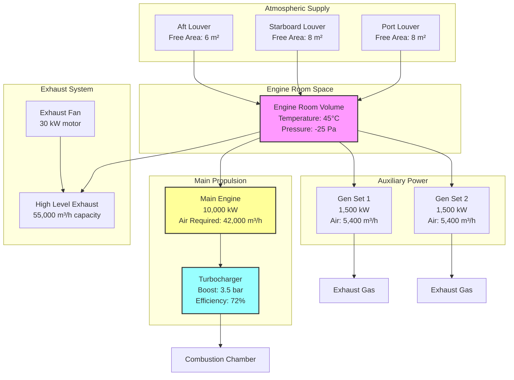

# Marine Engine Room Combustion Air

Combustion air supply is the primary function of marine engine room ventilation systems. Insufficient airflow causes incomplete combustion, power loss, overheating, and excessive emissions. Marine diesel engines consume substantial air volumes—a 10,000 kW main engine requires approximately 50,000 m³/h of combustion air at full load.

## Fundamental Combustion Air Requirements

### Stoichiometric Air Requirement

The theoretical air requirement for complete diesel fuel combustion is based on fuel chemistry. For marine diesel fuels, the stoichiometric relationship is:

$$A_{stoich} = \frac{11.5 \times (C + 0.375S) + 34.5H - 4.3O}{100}$$

Where:
- $A_{stoich}$ = Stoichiometric air requirement (kg air/kg fuel)
- $C$ = Carbon content by mass (% by weight)
- $H$ = Hydrogen content by mass (% by weight)
- $O$ = Oxygen content by mass (% by weight)
- $S$ = Sulfur content by mass (% by weight)

For typical marine diesel oil (MDO): C=87%, H=12.6%, O=0.4%, S=0.5%

$$A_{stoich} = \frac{11.5(87 + 0.375 \times 0.5) + 34.5 \times 12.6 - 4.3 \times 0.4}{100} = 14.3 \text{ kg air/kg fuel}$$

### Actual Air Requirement with Excess Air

Diesel engines operate with excess air to ensure complete combustion. The actual air requirement is:

$$\dot{m}_{air} = A_{stoich} \times (1 + EA) \times \dot{m}_{fuel}$$

Where:
- $\dot{m}_{air}$ = Actual air mass flow (kg/s)
- $EA$ = Excess air ratio (typically 1.5-2.5 for marine diesels)
- $\dot{m}_{fuel}$ = Fuel consumption rate (kg/s)

Excess air ratios by engine type:

| Engine Type | Excess Air Ratio | Total Air/Fuel Ratio |
|-------------|------------------|---------------------|
| Low-speed 2-stroke (main propulsion) | 1.8-2.2 | 28-32 kg/kg |
| Medium-speed 4-stroke (auxiliary) | 1.5-2.0 | 23-29 kg/kg |
| High-speed 4-stroke (generators) | 1.4-1.8 | 21-27 kg/kg |
| Emergency diesel generators | 1.6-2.0 | 24-29 kg/kg |

### Volumetric Flow Rate Calculation

Convert mass flow to volumetric flow at engine room conditions:

$$Q_{comb} = \frac{\dot{m}_{air} \times 3600}{\rho_{air}}$$

Where:
- $Q_{comb}$ = Volumetric airflow (m³/h)
- $\rho_{air}$ = Air density at engine room temperature (kg/m³)

At 45°C engine room temperature: $\rho_{air} = 1.11$ kg/m³

## Simplified Design Calculations

### Power-Based Method

For preliminary design, combustion air is calculated directly from engine power:

$$Q_{eng} = P_{eng} \times k_{fuel} \times SF$$

Where:
- $Q_{eng}$ = Required airflow (m³/h)
- $P_{eng}$ = Engine rated power (kW)
- $k_{fuel}$ = Fuel-specific air factor (m³/kW·h)
- $SF$ = Safety factor (1.25-1.50)

#### Fuel-Specific Air Factors

| Fuel Type | $k_{fuel}$ (m³/kW·h) | Typical Application |
|-----------|---------------------|---------------------|
| Marine Diesel Oil (MDO) | 0.36 | Auxiliary engines, generators |
| Marine Gas Oil (MGO) | 0.34 | High-speed diesels |
| Intermediate Fuel Oil (IFO 180) | 0.40 | Medium-speed engines |
| Heavy Fuel Oil (HFO 380) | 0.42 | Low-speed main engines |
| Low Sulfur Fuel Oil (LSFO) | 0.38 | Post-2020 compliance fuel |

### Multiple Engine Calculation

For engine rooms with multiple power sources operating simultaneously:

$$Q_{total} = SF \times \sum_{i=1}^{n} (P_i \times k_{fuel,i} \times LF_i)$$

Where:
- $LF_i$ = Load factor for engine $i$ (typically 0.85 for continuous duty)
- $n$ = Number of engines

**Design assumption:** Calculate for all main engines plus 50% of auxiliary capacity, or maximum credible simultaneous load.

## Turbocharger Air Requirements

### Turbocharged Engine Considerations

Modern marine diesels are turbocharged, meaning the turbocharger supplies most combustion air directly. However, the engine room must supply:

1. **Turbocharger intake air** (primary requirement)
2. **Scavenging air** (crankcase ventilation)
3. **Cooling air** for alternator and auxiliaries

The total engine room ventilation must account for all sources.

### Turbocharger Air Density Effect

Turbochargers are sensitive to inlet air density. Reduced air density (from high temperature or low barometric pressure) decreases engine power:

$$P_{actual} = P_{rated} \times \frac{\rho_{actual}}{\rho_{ISO}}$$

Where:
- $P_{actual}$ = Actual available power (kW)
- $P_{rated}$ = ISO rated power at 25°C, 100 kPa (kW)
- $\rho_{ISO}$ = 1.184 kg/m³ (ISO conditions)

**Critical design point:** Engine room temperature directly affects turbocharger efficiency and engine power output. Each 10°C increase above ISO conditions reduces power by approximately 3-5%.

### Turbocharger Pressure Drop Budget

The air intake system pressure drop reduces turbocharger efficiency:

$$\Delta P_{intake} = \Delta P_{louver} + \Delta P_{filter} + \Delta P_{duct}$$

Maximum allowable: **$\Delta P_{intake} < 1.5$ kPa** (manufacturer specific)

Typical component pressure drops:

| Component | Pressure Drop (Pa) | Notes |
|-----------|-------------------|-------|
| Weathertight louvers | 80-150 | Clean condition |
| Pre-filters (mesh) | 50-80 | Salt spray protection |
| Air filters (if used) | 100-200 | Rarely used in engine rooms |
| Intake ducting | 20-40 per 10m | Based on velocity |
| Bends and transitions | 15-30 each | 90° bends, R/D > 1.5 |

## Louver and Intake Sizing

### Free Area Requirements

Combustion air louvers must provide adequate free area to limit velocity and pressure drop:

$$A_{free} = \frac{Q_{total}}{3600 \times V_{max}}$$

Where:
- $A_{free}$ = Required free area (m²)
- $V_{max}$ = Maximum allowable velocity (m/s)

**Design velocities:**
- Weathertight louvers: 4-6 m/s (clean condition)
- Storm louvers: 3-5 m/s (higher resistance)
- Emergency generator intakes: 5-7 m/s (shorter duration operation)

### Louver Pressure Drop Calculation

Pressure drop through louvers follows the orifice equation:

$$\Delta P_{louver} = \frac{\rho_{air} \times V^2}{2 \times C_d^2}$$

Where:
- $C_d$ = Discharge coefficient (0.60-0.75 for marine louvers)
- $V$ = Face velocity through free area (m/s)

### Louver Selection Factors

Marine engine room louvers require:

1. **Weathertight construction** - Prevent water ingress in heavy seas
2. **Drainage system** - Internal gutters and drains for accumulated water
3. **Corrosion resistance** - Aluminum, stainless steel, or coated carbon steel
4. **Structural strength** - Withstand green water impact (up to 5 kPa)
5. **Classification approval** - Type approval from relevant class society

| Louver Type | Free Area Ratio | Typical $C_d$ | Weather Rating |
|-------------|-----------------|---------------|----------------|
| Gravity shutters | 0.45-0.55 | 0.65 | Light duty |
| Weathertight drainable | 0.35-0.45 | 0.62 | Heavy weather |
| Storm louvers | 0.25-0.35 | 0.58 | Severe weather |
| Acoustic louvers | 0.30-0.40 | 0.60 | Weather + noise |

### Multiple Intake Location Strategy

Distribute combustion air intakes to ensure air supply under various vessel operating conditions:

- **Port and starboard sides** - Maintain airflow during vessel heel
- **Forward and aft locations** - Account for trim conditions
- **Vertical separation** - Reduce simultaneous water ingress risk
- **Minimum height** - Typically 2.5-3.0 m above waterline

## Combustion Air System Design

## Regulatory Standards and Requirements

### SOLAS Chapter II-2 Requirements

International Convention for Safety of Life at Sea (SOLAS) mandates:

**Regulation 4.5.1:** Machinery spaces of category A shall be provided with ventilation adequate for the operation of machinery and auxiliaries under all weather conditions.

Minimum ventilation rates:
- **Main engine rooms:** 30 air changes per hour (ACH)
- **Auxiliary machinery spaces:** 20 ACH
- **Emergency generator rooms:** 30 ACH with independent supply

Calculation basis: Use **greater value** between combustion air calculation and minimum ACH requirement.

### ISO 8861 Standard

ISO 8861:1998 "Shipbuilding - Engine room ventilation in diesel-engined ships" provides detailed design methodology:

**Combustion air requirement:**

$$Q = k \times P_{MCR} \times (0.044 \times t + 1)$$

Where:
- $Q$ = Required airflow (m³/s)
- $k$ = 0.001 for 4-stroke, 0.0012 for 2-stroke
- $P_{MCR}$ = Maximum continuous rating (kW)
- $t$ = Engine room temperature (°C)

**Heat dissipation air requirement:** Calculated separately and added to combustion air.

### Classification Society Rules

Major classification societies impose additional requirements:

| Society | Key Requirement | Typical Margin |
|---------|----------------|----------------|
| Lloyd's Register (LR) | Minimum 30 ACH, combustion verified | 1.25× calculated |
| DNV-GL | Combustion + heat removal, max 50°C | 1.30× calculated |
| American Bureau of Shipping (ABS) | ISO 8861 compliance mandatory | 1.25× calculated |
| Bureau Veritas (BV) | Separate emergency gen ventilation | 1.30× calculated |
| ClassNK (Japan) | Tropical rating requirements | 1.35× calculated |

### Tropical and Extreme Climate Ratings

For vessels operating in tropical waters (ambient >35°C) or high-altitude ports (low barometric pressure), additional design margins apply:

$$Q_{tropical} = Q_{standard} \times \frac{318}{(273 + t_{ambient})} \times \frac{101.3}{P_{barometric}}$$

Where:
- $t_{ambient}$ = Maximum ambient temperature (°C)
- $P_{barometric}$ = Minimum barometric pressure (kPa)

Standard tropical condition: 45°C ambient, 100 kPa barometric pressure.

## Practical Design Example

**Given:**
- Main engine: 12,000 kW (2-stroke, HFO)
- Diesel generators: 2 × 1,800 kW (4-stroke, MDO)
- Engine room volume: 2,500 m³
- Design temperature: 45°C

**Calculate total combustion air requirement:**

Main engine:
$$Q_{main} = 12,000 \times 0.42 \times 1.30 = 6,552 \text{ m}^3/\text{h}$$

Generators (both running):
$$Q_{gen} = 2 \times 1,800 \times 0.36 \times 1.25 = 1,620 \text{ m}^3/\text{h}$$

Total combustion air:
$$Q_{comb} = 6,552 + 1,620 = 8,172 \text{ m}^3/\text{h}$$

Check minimum ACH:
$$Q_{ACH} = 2,500 \times 30 = 75,000 \text{ m}^3/\text{h}$$

**Design basis: 75,000 m³/h** (ACH requirement governs)

Louver free area required (5 m/s design velocity):
$$A_{free} = \frac{75,000}{3,600 \times 5} = 4.17 \text{ m}^2$$

With typical weathertight louver (40% free area ratio):
$$A_{louver} = \frac{4.17}{0.40} = 10.4 \text{ m}^2 \text{ total louver face area}$$

Use: 3 louvers × 3.5 m² each = 10.5 m² (port, starboard, aft locations)

## Design Best Practices

### Air Distribution Strategy

1. **Low-level intake locations** - Supply air below engine centerline for upward sweep
2. **Multiple separated intakes** - Redundancy for weather/damage scenarios
3. **Direct path to turbocharger** - Minimize pressure drop and temperature rise
4. **Avoid recirculation** - Separate hot exhaust air path from cool intake

### Common Design Errors

| Error | Consequence | Correction |
|-------|-------------|------------|
| Insufficient free area | High velocity, excessive pressure drop | Increase louver size 30-50% |
| Single intake location | Loss of air during heel/trim | Multiple distributed intakes |
| Intake near exhaust | Hot air recirculation | Separate by >5m horizontal distance |
| No drainage | Water accumulation, corrosion | Integral drain pans and overboard drains |
| Inadequate screening | FOD risk to turbocharger | 10-15 mm mesh screens at all intakes |

### Performance Verification

Commission testing should verify:
- **Airflow measurement** - Traverse measurements at louver locations
- **Pressure drop verification** - Static pressure at turbocharger inlet < limit
- **Temperature distribution** - Maximum engine room temperature ≤ 50°C at full load
- **No recirculation** - Smoke test confirms air path from intake to exhaust

Install permanent differential pressure indicators across critical intake louvers to monitor filter/screen fouling during operation.

---

**Related Topics:**
- Heat Removal Calculations
- Exhaust System Design
- Emergency Ventilation Systems
- Engine Room Fire Protection
