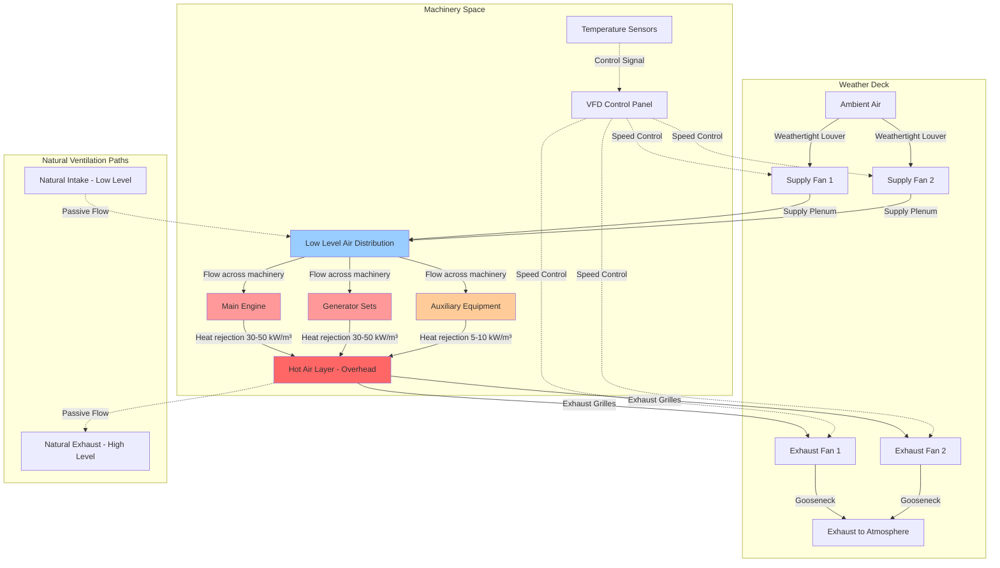

# Engine Room Cooling and Ventilation Systems

Marine engine room ventilation serves the dual purpose of providing combustion air for machinery and removing substantial heat loads generated during operation. The cooling function maintains machinery space temperatures within acceptable limits to ensure equipment reliability, personnel safety, and compliance with classification society rules. Proper ventilation design balances heat removal requirements against practical constraints of fan power consumption, noise generation, and system reliability.

## Forced Ventilation Systems

Forced ventilation employs mechanical fans to drive airflow through machinery spaces at rates sufficient for both combustion air supply and heat removal. This approach provides predictable performance independent of vessel speed and wind conditions.

### System Configuration

Forced ventilation systems utilize supply fans that pressurize the machinery space and exhaust fans that extract heated air. The typical arrangement places supply fans at low levels to introduce cool air near the deck, with exhaust fans positioned high to remove the hottest air accumulated near the overhead.

**Supply Fan Arrangement**

Supply fans draw ambient air through weathertight louvers equipped with drain systems to prevent seawater ingress. The fans discharge into distribution plenums that direct air across machinery. Multiple supply points ensure uniform air distribution throughout the space. Fan placement considers:

- Accessibility for maintenance without entering confined spaces
- Protection from weather and spray
- Adequate intake area (1.5-2.0 times fan inlet area)
- Drainage for condensate and incidental water entry
- Noise transmission to adjacent spaces

**Exhaust Fan Configuration**

Exhaust fans mount near the overhead in the hottest zones. The exhaust uptakes penetrate the weather deck through sealed openings with mushroom-type ventilators or gooseneck terminations. Exhaust capacity typically exceeds supply by 10-15% to maintain slight negative pressure, preventing migration of hot air, fumes, and oil mist to adjacent accommodation spaces.

### Heat Load Calculation

Total heat load determines the required ventilation airflow for adequate cooling. The comprehensive heat load includes all sources within the machinery space.

#### Engine Heat Rejection

Diesel engines reject heat through multiple mechanisms:

$$Q_{\text{eng}} = P_{\text{brake}} \times \eta_{\text{rad}}$$

Where:
- $Q_{\text{eng}}$ = Engine heat rejection to space (kW)
- $P_{\text{brake}}$ = Brake power output (kW)
- $\eta_{\text{rad}}$ = Radiation efficiency factor (0.03-0.05)

The radiation efficiency factor accounts for heat transfer from the engine block, exhaust manifolds, turbochargers, and associated components. Low-speed diesel engines typically exhibit $\eta_{\text{rad}} = 0.03$ due to better insulation, while medium-speed engines reach 0.04-0.05.

#### Generator Losses

Generator electrical losses convert to heat within the machinery space:

$$Q_{\text{gen}} = P_{\text{elec}} \times \left(\frac{1}{\eta_{\text{gen}}} - 1\right)$$

Where:
- $Q_{\text{gen}}$ = Generator heat loss (kW)
- $P_{\text{elec}}$ = Electrical output (kW)
- $\eta_{\text{gen}}$ = Generator efficiency (0.93-0.96)

Modern marine generators achieve 94-96% efficiency, resulting in 4-6% of rated output appearing as heat load.

#### Piping and Equipment

Hot piping systems radiate heat based on surface temperature and insulation effectiveness:

$$Q_{\text{pipe}} = U \times A \times (T_{\text{pipe}} - T_{\text{amb}})$$

Where:
- $Q_{\text{pipe}}$ = Piping heat loss (W)
- $U$ = Overall heat transfer coefficient (2-8 W/m²K depending on insulation)
- $A$ = Pipe surface area (m²)
- $T_{\text{pipe}}$ = Pipe surface temperature (°C)
- $T_{\text{amb}}$ = Ambient air temperature (°C)

For estimation purposes, piping heat losses range from 50-100 W/m² of exposed surface.

#### Total Heat Load

The comprehensive machinery space heat load sums all contributions:

$$Q_{\text{total}} = \sum Q_{\text{eng,i}} + \sum Q_{\text{gen,j}} + Q_{\text{pipe}} + Q_{\text{aux}} + Q_{\text{solar}}$$

Where:
- $Q_{\text{aux}}$ = Auxiliary equipment heat (pumps, compressors, 1-2 kW each)
- $Q_{\text{solar}}$ = Solar gain through exposed deck (150-300 W/m²)

### Required Airflow Calculation

The ventilation airflow required to remove heat while maintaining acceptable temperature rise is:

$$Q_{\text{air}} = \frac{Q_{\text{total}}}{\rho \times c_p \times \Delta T} \times 3600$$

Where:
- $Q_{\text{air}}$ = Required airflow (m³/h)
- $Q_{\text{total}}$ = Total heat load (kW)
- $\rho$ = Air density (1.2 kg/m³ at sea level, 15°C)
- $c_p$ = Specific heat of air (1.005 kJ/kg·K)
- $\Delta T$ = Allowable temperature rise (°C)
- 3600 = Conversion factor (s/h)

Simplifying with standard conditions:

$$Q_{\text{air}} = \frac{Q_{\text{total}} \times 2985}{\Delta T}$$

The allowable temperature rise typically ranges from 10-15°C. Lower temperature rise requires higher airflow but maintains cooler space conditions. Higher temperature rise reduces fan power but may exceed maximum allowable machinery space temperature.

### Temperature Limits

Classification societies and engine manufacturers specify maximum ambient temperatures for machinery spaces:

| Space Type | Maximum Temperature | Basis |
|------------|-------------------|-------|
| Main engine room | 45°C | ISO 3046 engine rating standard |
| Auxiliary machinery | 45°C | Classification society rules |
| Emergency generator | 50°C | Short-term operation acceptable |
| Boiler room | 50°C | Personnel access limitation |
| Pump rooms | 40°C | Reduced due to potential flammable atmosphere |
| Steering gear room | 45°C | SOLAS Chapter II-1 requirement |

Exceeding these limits results in:
- Reduced engine power output (derating by 1-2% per 5°C above rating)
- Accelerated lubricant degradation
- Increased thermal stress on components
- Unsafe working conditions for personnel
- Non-compliance with classification society surveys

### Design Airflow Rates

Actual design airflow must satisfy multiple criteria simultaneously:

| Criterion | Typical Requirement | Application |
|-----------|-------------------|-------------|
| Combustion air | $P_{\text{total}} \times 0.36$ to $0.42$ m³/kWh | Diesel engines at MCR |
| Heat removal | $\frac{Q_{\text{total}} \times 2985}{\Delta T}$ m³/h | Temperature control |
| Minimum air changes | 30 ACH | SOLAS Chapter II-2 |
| Personnel ventilation | 0.3 m³/min per person | When manned |

The design airflow equals the maximum value from all criteria. For most machinery spaces, heat removal governs rather than combustion air requirements.

## Natural Ventilation

Natural ventilation relies on wind pressure and thermal buoyancy to induce airflow without mechanical fans. This approach provides backup ventilation capability when electrical power is unavailable and reduces operating costs by eliminating fan power consumption.

### Operating Principles

Natural ventilation develops driving pressure through two mechanisms:

**Wind Pressure**

When wind encounters the vessel superstructure, it creates pressure differentials. Windward openings experience positive pressure, while leeward openings see negative pressure. The pressure difference drives airflow:

$$\Delta P_{\text{wind}} = C_p \times \frac{1}{2} \times \rho \times v^2$$

Where:
- $\Delta P_{\text{wind}}$ = Wind pressure difference (Pa)
- $C_p$ = Pressure coefficient (0.5-0.9 windward, -0.3 to -0.5 leeward)
- $\rho$ = Air density (1.2 kg/m³)
- $v$ = Wind velocity (m/s)

Total pressure difference between windward and leeward openings reaches:

$$\Delta P_{\text{total}} = (C_{p,\text{wind}} - C_{p,\text{lee}}) \times \frac{1}{2} \times \rho \times v^2$$

For typical coefficients, this yields $\Delta P_{\text{total}} \approx 0.5 \times \rho \times v^2$.

**Stack Effect**

Temperature difference between machinery space air and ambient air creates buoyancy-driven flow. Hot air rises through exhaust openings while cooler air enters through low-level intakes:

$$\Delta P_{\text{stack}} = \rho \times g \times h \times \frac{\Delta T}{T_{\text{avg}}}$$

Where:
- $\Delta P_{\text{stack}}$ = Stack pressure (Pa)
- $g$ = Gravitational acceleration (9.81 m/s²)
- $h$ = Height difference between inlet and outlet (m)
- $\Delta T$ = Temperature difference (K)
- $T_{\text{avg}}$ = Average absolute temperature (K)

For a 10 m height and 20°C temperature difference at 25°C average:

$$\Delta P_{\text{stack}} = 1.2 \times 9.81 \times 10 \times \frac{20}{298} = 7.9 \text{ Pa}$$

### Airflow Estimation

Natural ventilation airflow depends on driving pressure and opening resistance:

$$Q_{\text{nat}} = C_d \times A_{\text{eff}} \times \sqrt{\frac{2 \times \Delta P}{\rho}}$$

Where:
- $Q_{\text{nat}}$ = Natural airflow (m³/s)
- $C_d$ = Discharge coefficient (0.6-0.75 for marine louvers)
- $A_{\text{eff}}$ = Effective opening area (m²)
- $\Delta P$ = Total driving pressure (Pa)

For combined wind and stack effects:

$$\Delta P = \sqrt{\Delta P_{\text{wind}}^2 + \Delta P_{\text{stack}}^2}$$

### Design Considerations

Natural ventilation provides only 10-30% of the airflow achievable with mechanical ventilation. Its effectiveness depends on:

**Opening Sizing**

Intake and exhaust openings must provide adequate free area. The effective area accounts for louver blockage, screens, and flow resistance:

$$A_{\text{eff}} = A_{\text{gross}} \times \alpha_{\text{louver}} \times \alpha_{\text{screen}}$$

Where typical values are:
- $\alpha_{\text{louver}} = 0.45$ for weathertight marine louvers
- $\alpha_{\text{screen}} = 0.75$ for bird screens

**Positioning**

Openings should be positioned to maximize pressure differences:
- Intakes on windward sides and weather decks
- Exhausts on leeward sides or at high elevation
- Maximum vertical separation between inlet and outlet
- Multiple openings on different aspects to accommodate variable wind direction

**Limitations**

Natural ventilation cannot maintain machinery space temperatures within classification society limits during full-power operation. It serves as:
- Supplemental cooling during reduced-power operation
- Emergency ventilation when electrical power is lost
- Reduced ventilation during maintenance periods
- Passive cooling for unattended spaces

## Temperature Control Strategies

Maintaining machinery space temperature within acceptable limits requires active control strategies that adapt ventilation rates to varying heat loads and ambient conditions.

### Variable Speed Fan Control

Variable frequency drives (VFDs) on ventilation fans modulate airflow in response to measured temperatures. This approach provides:

**Energy Savings**

Fan power consumption follows the cube law:

$$P_{\text{fan}} = k \times Q^3$$

Reducing airflow to 75% of design reduces power to 42% of full-load consumption. During reduced-power operation or cool ambient conditions, substantial energy savings result from VFD control.

**Temperature Stability**

Multiple temperature sensors positioned throughout the machinery space feed a control algorithm that adjusts fan speed to maintain setpoint:

$$\text{Fan Speed} = \text{Speed}_{\text{min}} + \left(\frac{T_{\text{actual}} - T_{\text{setpoint}}}{T_{\text{max}} - T_{\text{setpoint}}}\right) \times (\text{Speed}_{\text{max}} - \text{Speed}_{\text{min}})$$

PID control algorithms provide smooth response to load changes while preventing oscillation.

### Multi-Stage Fan Operation

Systems with multiple fans enable discrete capacity control by starting and stopping units based on demand. A typical four-fan system operates:

- 1 fan: <25% heat load
- 2 fans: 25-50% heat load
- 3 fans: 50-75% heat load
- 4 fans: >75% heat load

This approach provides redundancy and allows maintenance on individual units while maintaining adequate ventilation.

### Temperature-Controlled Dampers

Automatic dampers modulate airflow through different paths within the ventilation system. Applications include:

**Mixing Dampers**

During cold ambient conditions, recirculating warm machinery space air prevents overcooling. Mixing dampers proportion fresh air and recirculated air to maintain optimal temperature.

**Bypass Dampers**

Direct a portion of supply air around machinery to reduce local velocities while maintaining total airflow for combustion air requirements.

### Supplemental Cooling Systems

When ambient air temperature approaches or exceeds machinery space design limits, ventilation alone cannot maintain acceptable temperatures. Supplemental systems include:

**Air Washers**

Evaporative cooling reduces supply air temperature by 5-10°C in dry ambient conditions. Seawater spray washers are common on marine applications, but require corrosion-resistant construction and regular maintenance to prevent salt buildup.

**Chilled Air Systems**

Large vessels may incorporate chilled water coils in supply air streams to reduce inlet temperature. This approach requires substantial chiller capacity (100-200 kW per 10,000 m³/h of supply air for 10°C temperature reduction) but enables operation in extreme ambient conditions.

## Ventilation System Schematic

The following diagram illustrates the comprehensive forced ventilation arrangement for a marine engine room:

## Performance Verification

Validation of ventilation system performance ensures compliance with design intent and regulatory requirements.

### Airflow Measurement

Direct measurement of total ventilation airflow presents challenges due to large duct sizes and access limitations. Practical methods include:

**Fan Performance Testing**

Manufacturers provide fan curves relating airflow to static pressure. Measuring static pressure at the fan discharge using manometer ports allows determination of operating point and corresponding airflow.

**Velocity Traverse**

For ducted sections, traverse measurements using pitot tubes or thermal anemometers determine average velocity:

$$Q = A_{\text{duct}} \times v_{\text{avg}} \times 3600$$

Where $v_{\text{avg}}$ is the area-weighted average velocity from the traverse grid.

### Temperature Survey

Comprehensive temperature mapping validates heat removal performance:

| Measurement Location | Typical Operating Temperature | Maximum Allowable |
|---------------------|------------------------------|-------------------|
| Supply air (inlet) | Ambient (varies by location) | Ambient + 5°C |
| Machinery space (work level) | Ambient + 10-15°C | 45°C |
| Near engine block | Ambient + 15-20°C | 50°C |
| Overhead (exhaust) | Ambient + 15-25°C | 55°C |
| Exhaust air (outlet) | Ambient + 12-18°C | 60°C |

Temperature rise from inlet to exhaust should match calculated values based on heat load and airflow.

### Compliance Documentation

Classification society surveys require documentation demonstrating:

1. Calculated heat loads with component breakdown
2. Required airflow based on heat removal and combustion air
3. Fan performance data showing operating points
4. Measured airflow rates during sea trials
5. Temperature survey results at multiple operating conditions
6. Verification of automatic control system functionality

Non-compliance requires corrective measures ranging from control adjustment to additional fan installation.

## Operational Optimization

Effective operation of engine room ventilation systems balances cooling performance against energy consumption and equipment wear.

### Load-Based Scheduling

Correlating fan operation to machinery load reduces unnecessary energy consumption:

| Machinery Load | Typical Heat Rejection | Fan Operation |
|----------------|----------------------|---------------|
| Idle/Harbor | 20-30% of full power | Minimum speed (40-50%) |
| Maneuvering | 40-60% of full power | Moderate speed (60-70%) |
| Sea passage | 70-85% of full power | High speed (80-90%) |
| Full power | 100% of full power | Maximum speed (100%) |

Automatic load sensing through power measurement or shaft speed monitoring enables dynamic fan control without manual intervention.

### Ambient Compensation

Adjusting ventilation rates for ambient temperature optimizes cooling efficiency. When ambient temperature is low, reduced airflow maintains machinery space temperature while decreasing fan power:

$$\text{Adjusted Airflow} = Q_{\text{design}} \times \sqrt{\frac{\Delta T_{\text{design}}}{\Delta T_{\text{actual}}}}$$

This relationship maintains constant heat removal while adapting to available temperature differential.

### Maintenance Scheduling

Ventilation system maintenance affects reliability and efficiency:

- **Filter cleaning:** Monthly or when pressure drop exceeds 150 Pa
- **Louver inspection:** Quarterly for corrosion and drainage function
- **Fan bearing lubrication:** Per manufacturer schedule (typically 2000-4000 hours)
- **Belt inspection:** Monthly for tension and wear (belt-driven units)
- **VFD inspection:** Annual for control functionality and heat sink cleanliness

Proper maintenance prevents performance degradation and extends equipment service life to 15-20 years in the harsh marine environment.

Marine engine room cooling and ventilation systems must reliably remove substantial heat loads under all operating conditions. Successful designs employ forced ventilation as the primary cooling method, supplemented by natural ventilation for emergency backup. Accurate heat load calculation, proper fan sizing, and effective temperature control strategies ensure machinery space temperatures remain within classification society limits while optimizing energy consumption. Compliance with SOLAS requirements and classification society rules mandates comprehensive documentation and performance verification during sea trials and periodic surveys.
