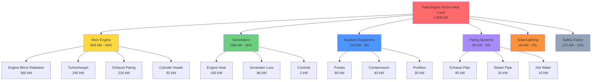

Marine engine rooms generate extreme heat loads requiring substantial ventilation airflow. Unlike land-based installations, shipboard machinery spaces concentrate multiple heat sources within confined volumes while operating continuously across varying ambient conditions. Accurate heat load calculation determines required ventilation capacity to maintain safe working temperatures below regulatory limits of 45-50°C.

## Heat Generation Mechanisms

Heat rejection from marine diesel engines and auxiliary machinery occurs through three primary modes: radiation from hot surfaces, convection to surrounding air, and conduction through structural contacts.

### Radiative Heat Transfer

Hot engine components emit thermal radiation proportional to the fourth power of absolute surface temperature. The Stefan-Boltzmann law governs this transfer:

$$Q_{\text{rad}} = \epsilon \sigma A (T_s^4 - T_\infty^4)$$

Where:
- $Q_{\text{rad}}$ = Radiative heat transfer rate (W)
- $\epsilon$ = Surface emissivity (0.85-0.95 for oxidized metal)
- $\sigma$ = Stefan-Boltzmann constant (5.67 × 10⁻⁸ W/m²K⁴)
- $A$ = Surface area (m²)
- $T_s$ = Surface temperature (K)
- $T_\infty$ = Ambient temperature (K)

Engine block surfaces typically operate at 90-120°C, turbocharger casings at 200-350°C, and exhaust manifolds at 300-450°C. Radiative heat transfer becomes dominant at elevated surface temperatures, particularly from exhaust system components.

### Convective Heat Transfer

Natural and forced convection remove heat from machinery surfaces through air circulation. The convective heat transfer rate follows Newton's law of cooling:

$$Q_{\text{conv}} = h A (T_s - T_\infty)$$

Where:
- $Q_{\text{conv}}$ = Convective heat transfer rate (W)
- $h$ = Convection coefficient (W/m²K)
- $A$ = Surface area (m²)
- $T_s$ = Surface temperature (°C)
- $T_\infty$ = Air temperature (°C)

Natural convection coefficients range from 5-15 W/m²K for vertical surfaces and 2-8 W/m²K for horizontal surfaces facing upward. Forced convection from ventilation airflow increases coefficients to 20-50 W/m²K depending on air velocity and surface geometry.

### Exhaust System Heat

Exhaust gas carries substantial thermal energy that radiates and convects to the engine room despite insulation. The exhaust heat loss to the space is:

$$Q_{\text{exh}} = \dot{m}_{\text{exh}} c_p (T_{\text{in}} - T_{\text{out}}) \times f_{\text{loss}}$$

Where:
- $\dot{m}_{\text{exh}}$ = Exhaust mass flow rate (kg/s)
- $c_p$ = Specific heat of exhaust gas (1.1 kJ/kgK)
- $T_{\text{in}}$ = Exhaust gas inlet temperature (°C)
- $T_{\text{out}}$ = Exhaust gas outlet temperature (°C)
- $f_{\text{loss}}$ = Fraction lost to space (0.02-0.04)

For a medium-speed diesel engine, exhaust temperatures range from 350-450°C at the turbocharger outlet. Even with 100mm mineral wool insulation, 2-4% of exhaust heat energy radiates into the machinery space.

## Component Heat Output

Each machinery component contributes to total engine room heat load based on operating power and efficiency losses.

### Main Propulsion Engines

Diesel engines reject heat to the surrounding space through multiple pathways:

| Heat Source | Percentage of Fuel Energy | Heat Load Factor |
|-------------|---------------------------|------------------|
| Engine block radiation | 2.5-3.5% | 0.030 × P_eng |
| Cylinder head convection | 1.0-1.5% | 0.013 × P_eng |
| Turbocharger radiation | 1.5-2.5% | 0.020 × P_eng |
| Exhaust piping radiation | 1.5-2.0% | 0.018 × P_eng |
| Lubricating oil cooler | 0.5-1.0% | 0.008 × P_eng |
| Total engine heat rejection | 7-10% | 0.089 × P_eng |

For a 12 MW propulsion engine operating at 85% load:

$$Q_{\text{eng}} = 0.089 \times 12,000 \times 0.85 = 908 \text{ kW}$$

This represents nearly 1 MW of heat requiring removal through ventilation.

### Auxiliary Generators

Generator sets combine diesel engine heat with electrical inefficiency losses:

| Component | Heat Output |
|-----------|-------------|
| Diesel engine (per table above) | 0.089 × P_mech |
| Generator inefficiency (5-7%) | 0.06 × P_elec |
| Radiator fan heat (if enclosed) | 0.01 × P_elec |
| Control panel losses | 500-1500 W |

For an 800 kW generator:

$$Q_{\text{gen}} = 0.089 \times 900 + 0.06 \times 800 + 1000 = 129 \text{ kW}$$

### Auxiliary Equipment

Secondary machinery contributes additional thermal load:

| Equipment | Typical Heat Output |
|-----------|---------------------|
| Main seawater pumps (per pump) | 3-8 kW |
| Fuel oil purifiers | 5-12 kW |
| Lubricating oil purifiers | 4-10 kW |
| Air compressors (per unit) | 8-15 kW |
| Hydraulic power units | 10-20 kW |
| Hot piping surfaces (per m²) | 150-300 W/m² |
| Boiler casing radiation | 0.02 × boiler rating |

### Piping System Heat Loss

Hot piping for exhaust, steam, and thermal oil systems radiates heat despite insulation. Calculate exposed surface heat loss:

$$Q_{\text{pipe}} = U A (T_{\text{pipe}} - T_{\text{amb}})$$

Where:
- $U$ = Overall heat transfer coefficient (W/m²K)
- $A$ = Pipe outer surface area (m²)

Typical U-values for insulated piping:

| Service | Temperature | U-Value (W/m²K) |
|---------|-------------|-----------------|
| Exhaust (insulated) | 350-450°C | 1.5-2.5 |
| Steam (insulated) | 150-180°C | 0.8-1.2 |
| Thermal oil | 200-250°C | 1.0-1.5 |
| Hot freshwater | 80-95°C | 0.6-0.9 |

## Total Heat Load Calculation

Aggregate all heat sources to determine total sensible cooling load requiring ventilation removal:

$$Q_{\text{total}} = \sum Q_{\text{eng}} + \sum Q_{\text{gen}} + \sum Q_{\text{aux}} + Q_{\text{pipe}} + Q_{\text{solar}} + Q_{\text{lighting}}$$

For a typical medium-sized vessel with 12 MW main engine, two 800 kW generators, and auxiliary equipment:

$$Q_{\text{total}} = 908 + 2(129) + 150 + 80 + 40 = 1,436 \text{ kW}$$

Add a 10-15% safety factor to account for solar gain on upper machinery spaces and uninsulated surfaces:

$$Q_{\text{design}} = 1,436 \times 1.12 = 1,608 \text{ kW}$$

## Ventilation Airflow Requirements

Required ventilation airflow removes sensible heat while limiting temperature rise across the machinery space.

### Heat Balance Equation

The fundamental relationship between heat removal and airflow:

$$Q = \dot{m} c_p \Delta T = \rho Q_v c_p \Delta T$$

Solving for volumetric flow rate:

$$Q_v = \frac{Q}{\rho c_p \Delta T}$$

Where:
- $Q_v$ = Volumetric airflow (m³/s)
- $Q$ = Heat removal rate (kW)
- $\rho$ = Air density (1.2 kg/m³ at sea level, 20°C)
- $c_p$ = Specific heat of air (1.005 kJ/kgK)
- $\Delta T$ = Allowable temperature rise (K)

### Allowable Temperature Rise

Classification society rules limit machinery space temperatures to 45-50°C maximum. With tropical ambient conditions of 35°C, allowable temperature rise is 10-15°C.

For the example 1,608 kW heat load with 12°C temperature rise:

$$Q_v = \frac{1,608}{1.2 \times 1.005 \times 12} = 111.2 \text{ m}^3\text{/s} = 400,320 \text{ m}^3\text{/h}$$

This enormous airflow illustrates the ventilation challenge in marine engine rooms.

### Air Changes Per Hour

Express ventilation rate as air changes relative to space volume. For an engine room volume of 2,500 m³:

$$\text{ACH} = \frac{Q_v \times 3600}{V_{\text{space}}} = \frac{400,320}{2,500} = 160 \text{ air changes/hour}$$

This exceeds the minimum SOLAS requirement of 30 ACH, confirming heat removal governs the ventilation requirement rather than minimum air change criteria.

## Engine Room Heat Sources

## Design Considerations

### Surface Temperature Limits

SOLAS regulation II-1/3-5 requires touchable surface temperatures not exceed 60°C to prevent personnel burns. Exhaust piping and turbocharger surfaces require thermal insulation to meet this standard while reducing radiant heat load.

Insulation thickness calculation for cylindrical piping:

$$t = r_i \left[\left(\frac{T_{\text{pipe}} - T_{\text{amb}}}{T_{\text{surf}} - T_{\text{amb}}}\right)^{1/2} - 1\right]$$

Where:
- $t$ = Insulation thickness (mm)
- $r_i$ = Inner pipe radius (mm)
- $T_{\text{pipe}}$ = Pipe temperature (°C)
- $T_{\text{surf}}$ = Surface temperature limit (60°C)
- $T_{\text{amb}}$ = Ambient temperature (45°C)

### Altitude Effects

Air density decreases with altitude, reducing mass flow rate for a given volumetric flow:

$$\rho_h = \rho_0 \left(1 - \frac{h}{44,300}\right)^{4.256}$$

Where:
- $\rho_h$ = Density at altitude h (kg/m³)
- $\rho_0$ = Sea level density (1.225 kg/m³)
- $h$ = Altitude (m)

For vessels operating on high-altitude lakes (e.g., Lake Titicaca at 3,800m), air density reduces to 0.76 kg/m³, requiring 60% greater volumetric airflow for equivalent heat removal.

### Transient Loading

Engine heat output varies with load demand. Part-load operation reduces heat rejection proportionally:

| Engine Load | Heat Rejection Factor |
|-------------|----------------------|
| 100% MCR | 1.00 |
| 85% MCR | 0.87 |
| 75% MCR | 0.78 |
| 50% MCR | 0.58 |
| 25% MCR | 0.35 |

Variable speed fans controlled by temperature sensors modulate ventilation airflow to match actual heat load, reducing electrical consumption during low-load operation.

## Regulatory Standards

Marine engine room heat removal design must comply with classification society rules and international standards.

### Classification Society Requirements

- **ABS (American Bureau of Shipping):** Section 4-8-4/3 specifies machinery space temperature limits
- **DNV-GL:** DNVGL-RU-SHIP Pt.4 Ch.9 establishes ventilation capacity requirements
- **Lloyd's Register:** Rules and Regulations Part 5 Chapter 10 defines heat load calculations
- **Bureau Veritas:** NR467 Part C Chapter 4 provides thermal design criteria

### IMO Standards

- **SOLAS II-2/20:** Machinery space ventilation and firefighting systems
- **ISO 8861:1998:** Shipbuilding - Engine room ventilation in diesel-engined ships
- **IMO Resolution A.468(XII):** Code on noise levels onboard ships

### Temperature Limits

| Space Type | Maximum Temperature | Standard |
|------------|---------------------|----------|
| Main machinery space | 45°C | SOLAS |
| Generator room | 45°C | SOLAS |
| Emergency generator | 50°C | SOLAS |
| Steering gear room | 45°C | Classification rules |
| Working areas | 40°C | ISO 8861 |

Continuous operation at these maximum temperatures is permitted, though design targets of 40-42°C provide operational margin.

## Thermal Management Strategies

Effective engine room cooling combines proper insulation, strategic air distribution, and supplemental cooling where required.

**Insulation Optimization**

Prioritize insulation of highest temperature surfaces first for maximum heat load reduction. Exhaust systems, turbochargers, and boiler casings provide best return on insulation investment. Use mineral wool (density 96-128 kg/m³) with aluminum or stainless steel jacketing.

**Air Distribution Patterns**

Supply air at low level displaces upward through the space, absorbing heat continuously. Exhaust extraction at high points prevents hot air stratification. Maintain 10-15% excess exhaust over supply capacity to create slight negative pressure, preventing hot air migration to adjacent compartments.

**Spot Cooling**

High heat sources benefit from dedicated forced air cooling. Direct ducted supply air across generator radiators, engine intercoolers, and lubricating oil coolers. This localized approach reduces the required general ventilation airflow.

Marine engine room heat removal represents one of the most demanding ventilation applications. Proper thermal analysis accounting for all heat sources ensures adequate system capacity to maintain safe operating conditions throughout the vessel's operational envelope.
