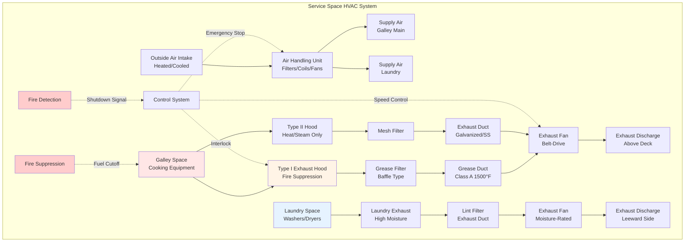

Marine galleys and laundries generate extreme heat, moisture, and contaminant loads in confined spaces while presenting significant fire safety concerns. These service spaces require specialized HVAC design to maintain safe working conditions, prevent odor migration, and ensure compliance with SOLAS, USCG, and classification society requirements.

## Service Space Load Characteristics

Galleys represent the highest sensible and latent heat load concentration on most vessels, with cooking equipment generating 30,000-100,000 BTU/hr per appliance. Laundries produce substantial moisture loads from washing and drying operations, with heat gains from equipment and process steam.

### Galley Heat Load Calculation

Total galley heat load combines appliance loads, lighting, occupancy, and ventilation air:

$$Q_{total} = Q_{appliance} + Q_{lights} + Q_{occupancy} + Q_{ventilation}$$

$$Q_{appliance} = \sum_{i=1}^{n} (P_i \times U_i \times F_i \times R_i)$$

where $P_i$ = appliance nameplate power (kW), $U_i$ = usage factor (0.3-0.7 for cooking equipment), $F_i$ = radiation factor (0.3-0.5 depending on hood capture), $R_i$ = rated load factor (typically 0.8-1.0).

Sensible heat ratio in galleys ranges from 0.65-0.75, with latent heat from cooking processes, dishwashing, and personnel activity.

### Laundry Load Calculation

Laundry spaces experience high latent loads from steam presses, dryers, and wet fabric handling:

$$Q_{latent,laundry} = m_{evap} \times h_{fg}$$

where $m_{evap}$ = moisture evaporation rate (kg/hr), $h_{fg}$ = latent heat of vaporization (2257 kJ/kg at atmospheric pressure).

For tumble dryers, approximate latent load:

$$Q_{latent,dryer} = \frac{W_{fabric} \times M_{content}}{t_{dry}} \times h_{fg}$$

where $W_{fabric}$ = fabric weight (kg/load), $M_{content}$ = moisture content (typically 0.5-0.7 kg water/kg dry fabric), $t_{dry}$ = drying time (hours).

## Ventilation Requirements

Marine service space ventilation rates exceed typical commercial standards due to space constraints, equipment density, and regulatory requirements.

| Space Type | Air Changes/Hour | Minimum CFM/ft² | Supply Air | Exhaust |
|------------|------------------|-----------------|------------|---------|
| Main Galley | 30-40 ACH | 2.0-3.0 | Required | Required |
| Scullery/Dishwashing | 40-50 ACH | 2.5-4.0 | Required | Required |
| Bakery | 25-35 ACH | 1.5-2.5 | Required | Required |
| Laundry (washing) | 30-40 ACH | 2.0-3.0 | Required | Required |
| Laundry (drying/pressing) | 40-60 ACH | 3.0-5.0 | Required | Required |
| Dry Stores | 8-12 ACH | 0.5-1.0 | Required | Optional |
| Walk-in Refrigerators | 2-4 ACH | - | Optional | Optional |

USCG regulations (46 CFR 62.35) require mechanical ventilation in all machinery and service spaces with minimum rates varying by classification.

## Exhaust Hood Design

Galley exhaust hoods must capture cooking effluent while minimizing interference with shipboard fire suppression systems. SOLAS requires Type I hoods over grease-producing equipment with integral fire suppression.

Hood exhaust flow rate:

$$Q_{hood} = V_{capture} \times A_{hood} \times 60$$

where $V_{capture}$ = capture velocity (100-150 fpm for wall canopy, 150-200 fpm for island hoods), $A_{hood}$ = hood face area (ft²).

For grease-laden vapor applications, minimum exhaust rate of 400 CFM per linear foot of hood length for wall-mounted canopies, 600 CFM/ft for island configurations.

### Makeup Air Requirements

Supply air must equal 80-90% of exhaust to maintain slight negative pressure (-0.02 to -0.05 in. w.c.) preventing odor migration to accommodation spaces. Makeup air should be tempered to within 10-15°F of galley temperature to avoid thermal discomfort.

## Odor and Contaminant Control

Service space ventilation systems employ multiple strategies to prevent odor transfer:

- Dedicated exhaust systems discharging above accommodation air intakes
- Negative pressure differential (-0.02 to -0.10 in. w.c. relative to corridors)
- Carbon filtration or electrostatic precipitation for odor-intensive operations
- Direct galley deck penetration exhaust runs minimizing horizontal ductwork
- Vestibule or air curtain separation at galley entrances

Exhaust discharge locations must comply with SOLAS regulation II-2/4.2 requiring discharge away from air intakes and accommodation spaces with minimum separation distances based on vessel type.

## Fire Safety Integration

Marine galley HVAC systems integrate with fire safety systems per SOLAS Chapter II-2:

1. **Automatic fire dampers** at galley boundary penetrations (Type A-60 or A-30 divisions)
2. **Hood-mounted suppression systems** (wet chemical or CO₂) with automatic fuel shutoff
3. **Ventilation shutdown** via bridge-controlled emergency stops
4. **Grease duct fire protection** - Class A grease ducts with 1500°F rating
5. **Duct access panels** for inspection and cleaning at 12-foot maximum spacing

## System Design Considerations

### Equipment Selection

- **Corrosion-resistant construction**: Type 304/316 stainless steel for salt atmosphere exposure
- **Grease-rated exhaust fans**: Spark-proof, high-temperature capable (300-400°F continuous)
- **Vibration isolation**: Critical for shipboard installation to prevent structural transmission
- **Accessible filters**: Removable baffle grease filters, mesh filters for Type II hoods
- **Weatherproof discharge**: Protected terminations for above-deck exhaust

### Ductwork Routing

Galley and laundry exhaust ducts follow dedicated paths:

- Minimum 18-gauge galvanized or stainless steel construction
- Grease ducts: 16-gauge minimum, welded joints, 1500°F fire rating
- Slope toward collection points (1/4 inch per foot minimum)
- Avoid horizontal runs exceeding 10 feet without cleanout access
- Penetrations through fire divisions require approved dampers and seals

### Capacity Optimization

Variable exhaust volume systems modulate hood exhaust based on cooking activity, reducing energy consumption during low-use periods while maintaining code-required minimums. Interlocked supply air volume tracks exhaust changes, preserving space pressure relationships.

## Inspection and Maintenance

SOLAS mandates quarterly inspection of galley ventilation systems with documented cleaning of grease-laden components. Classification societies require annual survey verification of fire damper operation, exhaust fan performance, and duct integrity.

Grease accumulation represents the primary fire hazard - maximum 25% duct area reduction before mandatory cleaning. Ultrasonic thickness testing detects corrosion in exhaust ductwork exposed to marine atmosphere and high-temperature cooking effluent.

Marine galley and laundry HVAC systems balance extreme load demands with stringent safety requirements in space-constrained environments. Proper design ensures crew safety, prevents accommodation space contamination, and maintains regulatory compliance across vessel operating conditions.
