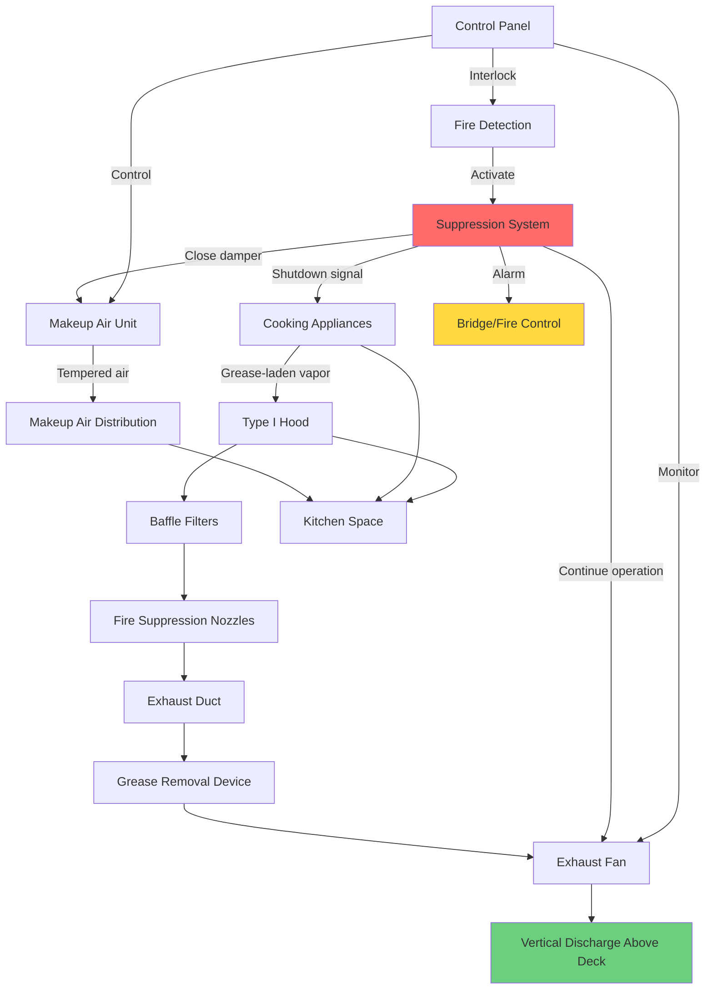

## Overview

Shipboard commercial kitchens present unique HVAC challenges combining stringent fire safety requirements, limited space, vessel motion considerations, and the need for grease-laden vapor removal in a confined environment. Marine galley HVAC systems must maintain safe air quality while managing high heat loads from cooking equipment, integrating with fire suppression systems, and operating reliably in harsh marine conditions.

## Exhaust Hood Design

### Hood Types and Applications

Marine galleys utilize specialized exhaust hoods designed for ship installations:

**Type I Hoods (Grease Extraction)**
- Required for all grease-producing appliances
- Minimum 24-gauge stainless steel construction (316 marine grade)
- Welded seams with liquid-tight construction
- Integral grease gutters with minimum 3% slope
- UL 710 listed for marine applications

**Type II Hoods (Heat and Vapor)**
- Used for non-grease producing equipment
- Steam kettles, dishwashers, ovens
- Lighter construction acceptable
- Condensate collection required

### Hood Exhaust Rates

Exhaust flow rates depend on appliance type, cooking style, and hood configuration:

| Equipment Type | Exhaust Rate (CFM/ft²) | Typical Duty |
|----------------|------------------------|--------------|
| Heavy-duty charbroilers | 400-500 | Continuous high-heat |
| Medium-duty ranges | 300-400 | Standard cooking |
| Light-duty ovens | 200-300 | Bakery operations |
| Fryers | 300-400 | Deep-frying |
| Steamers | 250-350 | Pressure cooking |
| Griddles | 200-300 | Flat-top cooking |
| Wok stations | 500-600 | High-heat stir-frying |

### Exhaust Calculation

The total exhaust requirement combines convective heat removal and capture velocity:

$$Q_{total} = Q_{convective} + Q_{capture}$$

Where convective heat removal is:

$$Q_{convective} = \frac{q_{sensible}}{1.08 \times \Delta T}$$

$$q_{sensible} = \text{Appliance heat output (Btu/hr)}$$
$$\Delta T = \text{Temperature rise across hood (°F), typically 50-100°F}$$

Capture velocity requirement:

$$Q_{capture} = A_{face} \times V_{capture}$$

$$A_{face} = \text{Hood face area (ft²)}$$
$$V_{capture} = \text{Capture velocity (fpm), typically 100-150 fpm for wall canopy}$$

For shipboard installations with vessel motion, increase exhaust by 15-20%:

$$Q_{marine} = Q_{total} \times 1.15$$

## Grease Filtration Systems

### Baffle Filters

Marine-grade baffle filters provide primary grease removal:

**Performance Requirements**
- Minimum 70% grease removal efficiency
- UL 1046 listed
- 304 or 316 stainless steel construction
- Removable for cleaning
- 2-inch nominal thickness

**Pressure Drop**
$$\Delta P_{filter} = K_{filter} \times \left(\frac{V_{face}}{1000}\right)^{1.8}$$

$$K_{filter} = \text{Filter coefficient, typically 0.8-1.2 for baffle filters}$$
$$V_{face} = \text{Face velocity through filter (fpm), typically 350-400 fpm}$$

### High-Efficiency Grease Removal

Advanced filtration systems for naval vessels and passenger ships:

- Multi-stage filtration achieving 90-95% removal
- Water-wash systems with automated cleaning
- Electrostatic precipitators (ESPs) for critical applications
- Reduced ductwork grease accumulation
- Extended cleaning intervals

## Fire Suppression Integration

### System Coordination

Marine galley fire suppression integrates with HVAC controls per NFPA 96 and IMO regulations:

**Pre-engineered Wet Chemical Systems**
- Ansul R-102, Kidde, or equivalent
- Automatic activation via fusible links
- Manual pull stations at exits
- Hood, duct, and appliance protection

**HVAC Interlock Sequence**
1. Fire detection activates suppression
2. Exhaust fan continues operation
3. Makeup air damper closes immediately
4. Gas/electric supply disconnects
5. Alarm notification to bridge

### Duct Fire Protection

Exhaust ductwork requires continuous fire protection:

- All-welded 16-gauge 304 stainless steel minimum
- Listed for grease duct service
- Access panels every 12 feet maximum
- Slope minimum 1/4 inch per foot toward hood
- No horizontal runs exceeding 75% of duct length
- Fire suppression nozzles in duct (if run exceeds 12 feet)

## Makeup Air Systems

### Design Requirements

Makeup air replaces exhaust while maintaining galley comfort:

**Flow Balance**
$$Q_{MA} = Q_{exhaust} - Q_{transfer}$$

$$Q_{MA} = \text{Makeup air required (CFM)}$$
$$Q_{exhaust} = \text{Total hood exhaust (CFM)}$$
$$Q_{transfer} = \text{Air from adjacent spaces (CFM), typically 10-15% of exhaust}$$

**Negative Pressure Control**

Maintain slight negative pressure to prevent grease migration:

$$\Delta P_{galley} = -0.01 \text{ to } -0.03 \text{ in. w.c.}$$

### Makeup Air Conditioning

Shipboard makeup air units provide tempered, filtered air:

**Heating Capacity**

$$q_{heating} = 1.08 \times Q_{MA} \times (T_{supply} - T_{outdoor})$$

Winter design: Heat to 60-65°F minimum

**Cooling Capacity**

$$q_{cooling} = 1.08 \times Q_{MA} \times (T_{outdoor} - T_{supply}) + (0.68 \times Q_{MA} \times \Delta W)$$

$$\Delta W = \text{Humidity ratio difference (lb/lb)}$$

Summer design: Cool to 70-75°F maximum

### Distribution Methods

| Method | Application | Advantages | Limitations |
|--------|-------------|------------|-------------|
| Ceiling diffusers | Small galleys | Simple installation | Poor heat removal |
| Side-wall displacement | Medium galleys | Good mixing | Space requirements |
| Hood-integrated supply | All sizes | Direct replacement | Higher first cost |
| Perimeter baseboard | Cold climates | Floor warming | Limited capacity |

## Heat Load Calculations

Total galley heat load includes appliance radiation, convection, and lighting:

$$q_{total} = q_{appliances} \times F_{usage} \times F_{radiation} + q_{lighting} + q_{envelope}$$

**Appliance Heat Gain**

$$q_{appliances} = \sum (\text{Nameplate rating} \times F_{usage} \times F_{radiation})$$

| Appliance Type | Usage Factor | Radiation Factor |
|----------------|--------------|------------------|
| Ranges | 0.30-0.40 | 0.35-0.45 |
| Ovens | 0.50-0.70 | 0.15-0.25 |
| Fryers | 0.70-0.85 | 0.30-0.40 |
| Griddles | 0.60-0.75 | 0.25-0.35 |
| Charbroilers | 0.70-0.85 | 0.40-0.50 |
| Steam kettles | 0.60-0.80 | 0.15-0.25 |

Under-hood appliances captured by exhaust reduce space cooling load by 60-80%.

## Marine-Specific Considerations

### Vessel Motion

Design provisions for ship roll and pitch:

- Increased capture velocity (add 15-20%)
- Deeper hood overhangs (minimum 12 inches)
- Positive grease drain slope in all orientations
- Flexible duct connections at equipment
- Vibration isolation on all rotating equipment

### Space Constraints

Maximize efficiency in limited footprint:

- Compact makeup air units with integral heating/cooling
- Vertical duct routing to minimize horizontal runs
- Combination hood/makeup air assemblies
- High-efficiency grease removal to reduce duct size

### Corrosion Protection

Marine environment requires enhanced materials:

- 316 stainless steel for all exhaust components
- Passivation of welded seams
- Protective coatings on structural supports
- Sacrificial anodes on fans in salt air environments

## Standards and Regulations

**NFPA 96**: Standard for Ventilation Control and Fire Protection of Commercial Cooking Operations
- Hood design and installation requirements
- Duct construction and clearances
- Fire suppression system integration
- Cleaning and maintenance protocols

**IMO SOLAS Chapter II-2**: Fire Safety on Passenger and Cargo Ships
- Galley ventilation and fire protection
- Fuel shutoff requirements
- Fire detection and alarm systems

**ABS/DNV Requirements**: Classification society standards
- Material specifications
- Structural support and vibration
- Emergency shutdown systems

**ASHRAE Applications Handbook**: Marine vessels chapter
- Design conditions and heat loads
- Ventilation rates and air distribution

## Maintenance and Operation

### Filter Cleaning Schedule

| Filter Type | Cleaning Frequency | Method |
|-------------|-------------------|--------|
| Baffle filters | Daily | Dishwasher or alkaline soak |
| Mesh filters | Every shift | Hot water detergent wash |
| ESP collectors | Weekly | Automated wash cycle |

### Grease Duct Cleaning

Professional cleaning required per NFPA 96:

- High-volume operations: Monthly to quarterly
- Moderate-volume: Quarterly to semi-annually
- Low-volume: Semi-annually to annually
- Inspection and documentation required
- Access via cleanout ports

### Fire Suppression Testing

Semi-annual inspection and testing:
- Fusible link replacement
- Nozzle inspection and cleaning
- Manual pull station operation
- System pressure verification
- HVAC interlock function test

## Operational Best Practices

**Startup Sequence**
1. Verify fire suppression system armed
2. Start exhaust fan and verify airflow
3. Activate makeup air system
4. Confirm negative pressure in galley
5. Enable cooking equipment

**Energy Conservation**
- Variable-speed exhaust based on cooking activity
- Demand-controlled ventilation with optical sensors
- Heat recovery from exhaust air (water heating)
- Night setback when galley secured

**Safety Protocols**
- Daily visual inspection of filters and ductwork
- Weekly fire suppression system check
- Monthly airflow verification
- Quarterly comprehensive inspection
- Annual professional duct cleaning

---

*Marine galley HVAC systems require specialized design addressing fire safety, grease control, and marine environmental factors while maintaining crew comfort and operational efficiency in demanding shipboard conditions.*
