## Overview

Marine dishwashing areas present extreme HVAC challenges due to high moisture generation, steam production, and stringent sanitation requirements in confined spaces. Commercial dishwashers operating continuously in ship galleys release substantial quantities of moisture and heat that must be captured and removed effectively to prevent condensation damage, maintain sanitary conditions, and ensure crew comfort.

The confined nature of marine spaces amplifies these challenges. Inadequate ventilation leads to condensation on overhead surfaces, bulkheads, and electrical equipment, creating corrosion risks and unsanitary conditions. Proper HVAC design must account for the cyclical nature of dishwasher operations, space constraints, and the need for makeup air in an environment where outside air must be conditioned.

## Dishwasher Heat and Moisture Loads

Commercial dishwashers in marine galleys produce significant sensible and latent heat loads during operation. The total heat release depends on dishwasher type, capacity, and cycle frequency.

### Load Calculation

The total heat load from a dishwasher consists of sensible and latent components:

$$Q_{total} = Q_{sensible} + Q_{latent}$$

Where sensible heat from the dishwasher body and heated water is:

$$Q_{sensible} = \dot{m}_{water} \cdot c_p \cdot \Delta T \cdot \eta_{loss} + Q_{enclosure}$$

Latent heat from moisture evaporation and steam release:

$$Q_{latent} = \dot{m}_{evap} \cdot h_{fg}$$

For a typical flight-type dishwasher, the evaporation rate during operation can be estimated:

$$\dot{m}_{evap} = 0.15 \text{ to } 0.30 \text{ kg/h per rack/h capacity}$$

The total exhaust hood load including safety factor:

$$Q_{hood} = (Q_{sensible} + Q_{latent}) \cdot SF$$

Where SF = 1.25 to 1.50 (safety factor accounting for door openings and peak loads).

### Typical Heat Generation Rates

| Dishwasher Type | Sensible Heat (kW) | Latent Heat (kW) | Total Heat (kW) | Moisture Release (kg/h) |
|-----------------|-------------------|------------------|-----------------|-------------------------|
| Door Type (Single Tank) | 2.5 - 4.0 | 8.0 - 12.0 | 10.5 - 16.0 | 12 - 18 |
| Conveyor Type (Flight) | 8.0 - 15.0 | 25.0 - 40.0 | 33.0 - 55.0 | 36 - 60 |
| Undercounter Type | 1.5 - 2.5 | 4.0 - 7.0 | 5.5 - 9.5 | 6 - 11 |
| Pot/Pan Washer | 3.5 - 6.0 | 10.0 - 18.0 | 13.5 - 24.0 | 15 - 27 |

## Exhaust Hood Design

Marine dishwasher exhaust hoods must capture all steam and moisture before it enters the galley space. Unlike cooking hoods, dishwasher hoods deal primarily with steam plumes rather than thermal plumes with grease.

### Hood Airflow Requirements

Exhaust airflow rate based on hood coverage area:

$$Q_{exhaust} = A_{hood} \cdot v_{capture} \cdot K_{adjustment}$$

Where:
- $A_{hood}$ = hood face area (m²)
- $v_{capture}$ = capture velocity (0.25 - 0.40 m/s for dishwashers)
- $K_{adjustment}$ = cross-draft adjustment factor (1.2 - 1.5)

For condensing-type hoods (recommended for marine applications):

$$Q_{condensing} = 0.6 \cdot Q_{standard}$$

Condensing hoods reduce exhaust requirements by 30-40% through internal cooling coils that condense steam before it reaches the exhaust system.

### Hood Configuration

Marine dishwasher hoods typically use:

**Type I Condensing Hoods:**
- Internal cooling coils at 4-7°C chilled water
- Condensate collection system with indirect drain
- Reduced exhaust airflow (150-250 m³/h per linear meter)
- Stainless steel construction (304 or 316)

**Type II Standard Hoods:**
- Higher exhaust rates (300-400 m³/h per linear meter)
- No grease filtration required (moisture only)
- Requires larger duct sizes and fan capacity

## Ventilation System Design

```mermaid
graph TB
    subgraph "Dishwashing Area Ventilation"
        DW[Commercial Dishwasher<br/>Steam Generation<br/>12-60 kg/h moisture]

        HOOD[Condensing Exhaust Hood<br/>Type I Marine Grade<br/>316 Stainless Steel]

        COIL[Cooling Coil System<br/>Chilled Water 4-7°C<br/>Condensation]

        DRAIN[Condensate Drain<br/>Indirect Connection<br/>Air Gap Required]

        EF[Exhaust Fan<br/>Corrosion Resistant<br/>Variable Speed]

        DUCT[Exhaust Ductwork<br/>Sloped for Drainage<br/>Insulated]

        DISCH[Discharge to Exterior<br/>Above Waterline<br/>Rain Protection]

        MA[Makeup Air System<br/>Filtered & Conditioned<br/>Slight Negative Pressure]

        DIST[Distribution Diffusers<br/>Low Velocity Ceiling<br/>Directed Away from Hood]

        CTRL[BAS Controls<br/>Interlocked with<br/>Dishwasher Operation]
    end

    DW -->|Steam Plume| HOOD
    HOOD -->|Internal| COIL
    COIL -->|Condensate| DRAIN
    HOOD -->|Exhaust Air| EF
    EF -->|Moisture-Laden Air| DUCT
    DUCT -->|Overboard| DISCH

    MA -->|Conditioned Air| DIST
    DIST -->|Replacement Air| DW

    CTRL -.->|Monitor/Control| EF
    CTRL -.->|Monitor/Control| MA
    CTRL -.->|Interlock| DW

    style DW fill:#ffcccc
    style HOOD fill:#cce5ff
    style COIL fill:#b3d9ff
    style EF fill:#99ccff
    style MA fill:#ffffcc
    style CTRL fill:#ccffcc
```

## Makeup Air Requirements

Exhaust from dishwasher hoods must be replaced with conditioned makeup air to prevent negative pressurization of the galley space. Excessive negative pressure causes:

- Door operation difficulties
- Infiltration of unconditioned air from adjacent spaces
- Backdrafting of combustion appliances (if present)
- Reduced exhaust system performance

### Makeup Air Calculation

For balanced operation:

$$Q_{makeup} = Q_{exhaust} - Q_{transfer}$$

Where $Q_{transfer}$ represents acceptable air transfer from adjacent galley areas (typically 20-30% of exhaust).

Makeup air should be:
- Filtered (minimum MERV 8)
- Conditioned to within 5°C of space temperature
- Delivered at low velocity (< 0.50 m/s at discharge)
- Directed away from exhaust hood capture zone

Marine applications require 100% outside air makeup (no recirculation) to maintain sanitation standards per NSF/ANSI 37.

## Condensation Prevention

Condensation control is critical in marine dishwashing areas due to cold metal surfaces (hull, structural members) and high moisture content.

### Prevention Strategies

**Exhaust System Insulation:**

Required thermal resistance for exhaust ductwork:

$$R_{insulation} \geq \frac{T_{duct} - T_{dewpoint}}{U_{max} \cdot (T_{duct} - T_{ambient})}$$

Minimum insulation: 50mm fiberglass (R-2.1 m²·K/W) with vapor barrier jacket.

**Ductwork Slope:**

All horizontal exhaust ductwork must slope toward condensate drains:

$$slope = \frac{1}{96} \text{ to } \frac{1}{48}$$

(1-2% grade minimum)

**Surface Temperature Management:**

Maintain all exposed surfaces above dewpoint temperature:

$$T_{surface} > T_{dewpoint} + 3°C$$

This typically requires:
- Space temperature: 22-24°C
- Relative humidity: < 60%
- Continuous air movement across surfaces

## Sanitation Requirements

Marine galley dishwashing areas must meet stringent sanitation standards established by flag state regulations, USPH (US Public Health), and IMO guidelines.

### Ventilation Standards

| Parameter | Requirement | Standard |
|-----------|-------------|----------|
| Minimum Ventilation Rate | 30 ACH during operation | NSF/ANSI 37 |
| Exhaust Capture Efficiency | ≥ 95% steam capture | Marine Classification Society |
| Makeup Air Quality | MERV 8 minimum filtration | IMO Resolution A.468(XII) |
| Space Pressure | -2.5 to -7.5 Pa vs. adjacent | USPH Vessel Sanitation Program |
| Exhaust Discharge | > 3m from air intakes | IMO MARPOL Annex VI |

### Material Requirements

All HVAC components in dishwashing areas must use corrosion-resistant materials:

- **Ductwork:** 316L stainless steel (preferred) or 304 SS with marine-grade coatings
- **Hoods:** 316 SS, minimum 16 gauge (1.5mm)
- **Fans:** Spark-resistant construction, sealed bearings
- **Dampers:** Stainless steel blades and frames
- **Fasteners:** 316 SS or Monel (no carbon steel)

### Drainage Systems

Condensate drainage must provide air gap separation:

$$h_{gap} \geq 2 \times D_{drain}$$

Where $D_{drain}$ is the drain pipe diameter, with minimum 50mm gap.

Indirect drain connections prevent backflow from drainage systems into HVAC equipment, maintaining sanitation requirements.

## Controls and Integration

Modern marine dishwasher ventilation systems integrate with Building Automation Systems (BAS) for efficiency and safety.

### Control Sequences

**Dishwasher Operation Sequence:**

1. Dishwasher start signal → Exhaust fan energizes to full speed
2. 30-second delay → Makeup air fan starts (prevents excessive negative pressure)
3. During operation → Exhaust fan maintains constant CFM
4. Dishwasher stop signal → 5-minute exhaust overrun (purge residual moisture)
5. Exhaust stops → Makeup air reduces to minimum ventilation rate

**Variable Exhaust Control:**

For installations with multiple dishwashers:

$$Q_{exhaust,total} = \sum_{i=1}^{n} (Q_{i} \cdot status_i)$$

Where $status_i$ = 1 (operating) or 0 (off) for each dishwasher.

VFD-controlled exhaust fans modulate based on actual demand, reducing energy consumption by 40-60% compared to constant-volume systems.

### Safety Interlocks

Critical interlocks for marine safety:

- Exhaust fan failure → Dishwasher operation prevented
- Excessive negative pressure (< -12.5 Pa) → Makeup air increase
- Fire detection → Exhaust system shutdown, dampers close
- Condensate overflow → Equipment shutdown alarm

## Performance Verification

After installation, marine dishwasher ventilation systems require testing and adjustment to verify performance.

### Test Procedures

**Capture Efficiency Test:**

Visual smoke test during peak dishwasher operation. Acceptance criteria: ≥ 95% of visible steam captured by hood with no escape to galley space.

**Airflow Verification:**

$$Q_{measured} = V_{duct} \cdot A_{duct} \cdot K_{correction}$$

Measurements at all access points with pitot-tube traverse or thermal anemometer.

**Pressure Differential Verification:**

Space pressure relative to adjacent areas:

- Galley to dining: -5 Pa ± 2 Pa
- Dishwashing area to galley: -2.5 Pa ± 1.5 Pa

## Energy Efficiency Measures

Marine vessels demand energy-conscious HVAC design due to limited power generation capacity.

### Efficiency Strategies

| Strategy | Energy Savings | Implementation |
|----------|---------------|----------------|
| Condensing Hood Technology | 30-40% exhaust reduction | Chilled water coils in hood |
| Demand-Based Ventilation | 40-60% fan energy | VFD control, operation sensing |
| Heat Recovery from Exhaust | 15-25% makeup air heating | Run-around loop or plate HX |
| High-Efficiency Dishwashers | 20-30% total load reduction | ENERGY STAR rated equipment |
| Integrated Controls | 10-20% system energy | BAS optimization |

**Heat Recovery Calculation:**

Recoverable heat from dishwasher exhaust:

$$Q_{recovery} = \dot{m}_{exhaust} \cdot c_p \cdot (T_{exhaust} - T_{ambient}) \cdot \eta_{HX}$$

Where $\eta_{HX}$ = 0.50 to 0.70 for typical run-around loop systems.

This recovered heat preheats makeup air during cold weather operations, reducing heating load by 15-25%.

## Conclusion

Marine dishwashing area HVAC systems require specialized design to address extreme moisture loads, space constraints, and stringent sanitation requirements. Proper hood selection, adequate exhaust capacity, effective condensation control, and integrated makeup air systems are essential for maintaining safe, sanitary, and efficient operations aboard vessels. Condensing hood technology combined with demand-based ventilation controls provides optimal performance while minimizing energy consumption in this challenging application.
