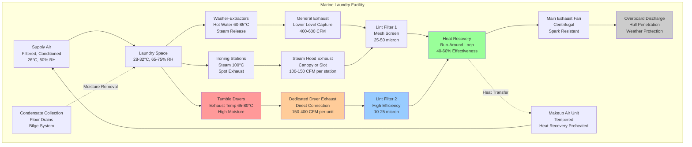

## Overview

Marine laundry facilities present unique HVAC challenges due to extreme heat and moisture generation in confined spaces. Shipboard laundries operate continuously with limited ventilation capacity, requiring specialized exhaust systems, aggressive moisture control, and heat recovery strategies to maintain acceptable conditions while minimizing energy consumption.

The primary HVAC concerns include managing humidity levels exceeding 70% RH, removing lint-laden exhaust air, recovering sensible and latent heat, providing adequate makeup air, and preventing condensation in adjacent compartments. Proper ventilation design prevents mold growth, protects electronic equipment, and maintains crew comfort in these high-load spaces.

## Heat and Moisture Load Calculations

### Sensible Heat from Equipment

Commercial washers and dryers generate substantial sensible heat loads that must be removed through ventilation:

$$Q_s = \sum_{i=1}^{n} \left( P_i \times \eta_i \times f_u \right)$$

Where:
- $Q_s$ = Total sensible heat gain (W)
- $P_i$ = Nameplate power of equipment $i$ (W)
- $\eta_i$ = Heat release efficiency (0.70-0.90 for washers, 0.40-0.60 for dryers)
- $f_u$ = Utilization factor (0.60-0.85 for marine laundries)
- $n$ = Number of equipment items

### Moisture Generation Rate

Washing machines and dryers release significant moisture that must be exhausted to prevent condensation:

$$\dot{m}_w = \sum_{j=1}^{m} \left( C_j \times L_j \times E_j \times f_c \right)$$

Where:
- $\dot{m}_w$ = Total moisture generation rate (kg/h)
- $C_j$ = Machine capacity (kg dry laundry)
- $L_j$ = Moisture extraction per cycle (kg water/kg dry laundry)
- $E_j$ = Evaporation efficiency (0.85-0.95 for dryers)
- $f_c$ = Cycle frequency (cycles/h)
- $m$ = Number of moisture-generating equipment

**Typical moisture extraction values:**
- Washing machines: 0.5-0.8 kg water/kg dry laundry (residual moisture)
- Dryers: 0.4-0.7 kg water/kg dry laundry (evaporated to exhaust)

### Required Exhaust Airflow

The exhaust airflow must remove both sensible heat and latent moisture:

$$\dot{V}_{exh} = \max \left( \frac{Q_s}{\rho c_p \Delta T}, \frac{\dot{m}_w}{\rho (\omega_{exh} - \omega_{supply})} \right)$$

Where:
- $\dot{V}_{exh}$ = Required exhaust airflow (m³/s)
- $\rho$ = Air density (kg/m³)
- $c_p$ = Specific heat of air (1.006 kJ/kg·K)
- $\Delta T$ = Temperature difference between exhaust and supply (K)
- $\omega_{exh}$ = Humidity ratio of exhaust air (kg water/kg dry air)
- $\omega_{supply}$ = Humidity ratio of supply air (kg water/kg dry air)

## Exhaust Requirements by Equipment

| Equipment Type | Minimum Exhaust Rate | Connection Type | Duct Velocity | Lint Load |
|----------------|---------------------|-----------------|---------------|-----------|
| Commercial dryer (10 kg) | 150-200 CFM (250-340 m³/h) | Direct connection | 1500-2500 fpm (7.6-12.7 m/s) | High |
| Commercial dryer (15 kg) | 225-300 CFM (380-510 m³/h) | Direct connection | 1500-2500 fpm (7.6-12.7 m/s) | High |
| Tumble dryer (20 kg) | 300-400 CFM (510-680 m³/h) | Direct connection | 1500-2500 fpm (7.6-12.7 m/s) | High |
| Washer-extractor | 50-100 CFM (85-170 m³/h) | General exhaust | 1000-1500 fpm (5.1-7.6 m/s) | Medium |
| Ironing station | 100-150 CFM (170-255 m³/h) | Hood capture | 800-1200 fpm (4.1-6.1 m/s) | Low |
| Folding table area | 1.5-2.0 ACH | General exhaust | 600-1000 fpm (3.0-5.1 m/s) | Low |

**Notes:**
- Direct connection mandatory for dryers per NFPA 120
- Duct velocity must prevent lint settling (minimum 1500 fpm for dryer exhaust)
- Metal ducts only; no flexible ducting allowed for dryer exhaust

## Marine Laundry Ventilation System

## Lint Filtration Requirements

### Filtration Stages

**Primary lint separation:**
- Mesh screen filters: 25-50 micron capture
- Located immediately downstream of dryer exhaust
- Cleanable design with access doors
- Inspection weekly, cleaning as needed

**Secondary filtration:**
- High-efficiency lint filters: 10-25 micron
- Prevents lint accumulation in heat recovery devices
- Differential pressure monitoring (replace at 1.5" w.g.)
- Critical for preventing fire hazards

**Filter specifications for marine service:**
- Corrosion-resistant materials (316 stainless steel)
- Vibration-resistant mounting
- Tool-free access for cleaning
- Pressure drop monitoring with alarm at 2.0" w.g.

### Lint Removal System Design

| System Component | Design Requirement | Performance Target |
|------------------|-------------------|-------------------|
| Primary filter | Mesh screen, 25-50 micron | 70-85% lint capture by mass |
| Secondary filter | Bag or cartridge, 10-25 micron | 90-95% of remaining lint |
| Filter velocity | 200-400 fpm (1.0-2.0 m/s) | Minimize pressure drop |
| Cleaning access | Tool-free, swing-out | Clean in <5 minutes |
| Differential pressure switch | Alarm at 1.5" w.g. | Prevent system degradation |
| Duct design | No horizontal runs, 45° minimum slope | Prevent lint accumulation |

## Heat Recovery Strategies

### Run-Around Loop Systems

Run-around loop heat recovery systems effectively recover 40-60% of exhaust heat without cross-contamination:

$$\epsilon_{ral} = \frac{\dot{Q}_{recovered}}{\dot{Q}_{available}} = \frac{\dot{m}_{min} c_p (T_{exh,in} - T_{exh,out})}{\dot{m}_{min} c_p (T_{exh,in} - T_{supply,in})}$$

Where:
- $\epsilon_{ral}$ = Run-around loop effectiveness (0.40-0.60)
- $\dot{Q}_{recovered}$ = Recovered heat rate (W)
- $\dot{Q}_{available}$ = Available exhaust heat (W)
- $\dot{m}_{min}$ = Minimum mass flow rate (kg/s)
- $T_{exh,in}$ = Exhaust air entering temperature (°C)
- $T_{exh,out}$ = Exhaust air leaving temperature (°C)
- $T_{supply,in}$ = Supply air entering temperature (°C)

**Marine laundry heat recovery advantages:**
- No cross-contamination between lint-laden exhaust and clean supply
- Coils can be located remotely (suitable for ship compartment constraints)
- Glycol solution prevents freezing (irrelevant for marine but provides corrosion protection)
- Individual coil cleaning possible without system shutdown

### Heat Recovery Performance

| Exhaust Condition | Supply Preheating | Energy Recovery | Annual Savings (Typical) |
|-------------------|-------------------|-----------------|--------------------------|
| 75°C, 80% RH | 15°C → 35°C | 45-55 kW | 40,000-50,000 kWh |
| 70°C, 75% RH | 20°C → 38°C | 38-48 kW | 35,000-45,000 kWh |
| 65°C, 70% RH | 22°C → 36°C | 32-42 kW | 30,000-40,000 kWh |

**Note:** Savings assume 16 hours/day operation, 300 days/year for cruise ship laundry.

## Humidity Control Strategies

### Ventilation-Based Moisture Removal

Maintain laundry space humidity below 75% RH through adequate exhaust:

$$RH_{space} = \frac{\omega_{space}}{\omega_{sat}(T_{space})} \times 100\%$$

**Target conditions:**
- Laundry space: 28-32°C, 65-75% RH maximum
- Adjacent corridors: 24-26°C, 55-65% RH maximum
- Humidity differential: Maintain negative pressure to prevent migration

### Dehumidification Requirements

Supplemental dehumidification may be required when:
- Laundry operates >16 hours/day
- Ambient conditions exceed 30°C, 70% RH
- Makeup air quantity is limited by ship ventilation capacity

**Desiccant dehumidification:**
- Effective for high-temperature, high-humidity exhaust
- Can achieve 40-50°C dew point reduction
- Regeneration heat available from dryer exhaust

## Design Standards and References

**Applicable marine standards:**
- IMO SOLAS Chapter II-2: Fire safety, lint control
- ANSI/ASHRAE 62.1: Ventilation for acceptable air quality
- NFPA 120: Standard for Fire Prevention and Control in Coal Mines (dryer exhaust provisions applicable)
- IEEE 45: Recommended Practice for Electrical Installations on Shipboard
- Classification society rules (ABS, DNV-GL, Lloyd's): Ventilation and fire safety

**Design exhaust rates:**
- Minimum 25 ACH for laundry spaces (per classification society rules)
- Dryer exhaust per manufacturer specifications (typically 150-400 CFM per unit)
- General exhaust sufficient to maintain <75% RH

**Safety considerations:**
- All electrical equipment rated for high-humidity service (IP65 minimum)
- Lint filters inspected and cleaned weekly
- Dryer exhaust ducts inspected monthly for lint accumulation
- Fire dampers not permitted in dryer exhaust (per NFPA 120)
- Emergency ventilation override for fire conditions

## Condensation Prevention

### Critical Control Measures

**Duct insulation:**
- All exhaust ducts: 2" (50 mm) closed-cell insulation minimum
- Vapor barrier required on all cold surfaces
- Particular attention to hull penetrations

**Pressure relationships:**
- Laundry space: -5 to -10 Pa relative to corridors
- Prevents moisture migration to accommodations
- Exhaust 10-15% greater than supply

**Surface temperature control:**
- All surfaces maintained >5°C above dew point
- Insulation on cold water piping
- Dehumidification in equipment rooms

---

**Related Topics:**
- [Galley and Laundry HVAC](../)
- [Commercial Kitchen](../commercial-kitchen/)
- [Dishwashing Area](../dishwashing-area/)
- [Ships and Marine HVAC](../../)
