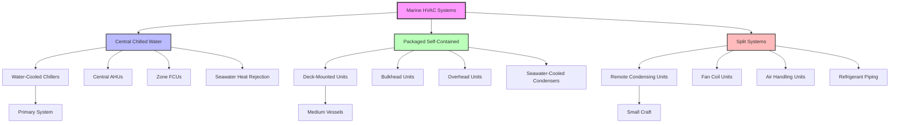

Marine HVAC systems face unique operational challenges that distinguish them from terrestrial applications. Space limitations, motion-induced stresses, corrosive saltwater environments, and variable electrical power quality require specialized system architectures and component selection.

## Unique Marine Challenges

**Environmental Factors:**
- Continuous exposure to salt-laden air accelerating corrosion
- Extreme ambient conditions: -40°F to 130°F depending on operating regions
- High humidity levels (85-95% RH in tropical zones)
- Ship motion inducing vibration and shock loads
- Seawater temperature variations: 28°F (Arctic) to 95°F (Persian Gulf)

**Operational Constraints:**
- Limited space and weight allowances
- Power generation constraints and voltage/frequency variations
- Continuous operation requirements (24/7/365)
- Minimal maintenance access during voyages
- Redundancy requirements for critical spaces

**Regulatory Requirements:**
- SOLAS (Safety of Life at Sea) compliance
- Classification society rules (ABS, DNV, Lloyd's Register)
- IMO environmental regulations
- Military specifications (MIL-STD) for naval vessels

## Marine HVAC Load Calculations

Total cooling load for marine spaces accounts for transmission, solar, internal, and ventilation components with marine-specific adjustments:

$$Q_{total} = Q_{trans} + Q_{solar} + Q_{internal} + Q_{vent} + Q_{mech}$$

**Transmission Load Through Hull:**

$$Q_{trans} = U \cdot A \cdot (t_{sw} - t_{indoor}) \cdot F_{motion}$$

where:
- $U$ = overall heat transfer coefficient (Btu/hr·ft²·°F)
- $A$ = surface area (ft²)
- $t_{sw}$ = seawater temperature (°F)
- $t_{indoor}$ = design indoor temperature (°F)
- $F_{motion}$ = motion factor (1.1-1.15 for enhanced convection)

**Solar Heat Gain (Deck and Superstructure):**

$$Q_{solar} = A_{proj} \cdot SHGF \cdot SC \cdot CLF \cdot F_{reflect}$$

where:
- $A_{proj}$ = projected area (ft²)
- $SHGF$ = solar heat gain factor (Btu/hr·ft²)
- $SC$ = shading coefficient
- $CLF$ = cooling load factor
- $F_{reflect}$ = water reflection factor (1.15-1.25)

**Mechanical Equipment Heat:**

$$Q_{mech} = 2545 \cdot \eta \cdot kW_{installed} \cdot DF$$

where:
- $\eta$ = motor efficiency
- $kW_{installed}$ = installed power
- $DF$ = diversity factor (0.6-0.8 for engine rooms)

**Ventilation Load:**

$$Q_{vent} = 1.08 \cdot CFM \cdot \Delta T + 0.68 \cdot CFM \cdot \Delta W$$

For minimum outside air per ASHRAE 62.1 and SNAME T&R 3-42 standards.

## Marine HVAC System Types

## System Architecture Comparison

| System Type | Advantages | Disadvantages | Typical Application |
|-------------|-----------|---------------|---------------------|
| **Central Chilled Water** | High efficiency, centralized maintenance, flexible zoning, quiet in spaces | High initial cost, complex piping, single-point failure risk | Large cruise ships, naval vessels, offshore platforms |
| **Packaged Self-Contained** | Lower first cost, modular redundancy, simple installation | Less efficient, distributed maintenance, space intensive | Cargo ships, ferries, medium commercial vessels |
| **Split Systems** | Flexible layout, moderate cost, zone control | Refrigerant piping limitations, multiple compressors | Small craft, yachts, patrol boats, tugs |
| **Hybrid Systems** | Optimized efficiency, staged redundancy | Complex controls, higher maintenance | Multi-mission vessels, research ships |

## System Selection Criteria

**Vessel Size Classification:**

| Vessel Length | Tonnage | Recommended Primary System | Backup System |
|---------------|---------|---------------------------|---------------|
| < 100 ft | < 500 GT | Split systems | Portable units |
| 100-300 ft | 500-5,000 GT | Packaged units | Split systems |
| 300-600 ft | 5,000-25,000 GT | Central chilled water or packaged | Packaged units |
| > 600 ft | > 25,000 GT | Central chilled water | Zoned chilled water |

**Load Density Considerations:**

$$\text{Load Density} = \frac{Q_{total}}{V_{conditioned}} \quad (\text{Btu/hr·ft}^3)$$

- **Low density** (< 5 Btu/hr·ft³): Cargo holds, storage → Natural/mechanical ventilation
- **Medium density** (5-15 Btu/hr·ft³): Accommodations, offices → Packaged or chilled water
- **High density** (> 15 Btu/hr·ft³): Galleys, engine control rooms → Central chilled water with dedicated AHUs

## Component Selection for Marine Duty

**Chillers:**
- Seawater-cooled condensers with cupro-nickel tubes (70/30 or 90/10 alloy)
- Titanium condensers for extended life in severe service
- Centrifugal chillers (> 100 tons) or screw chillers (20-100 tons)
- Minimum 2 chillers for redundancy (N+1 configuration)

**Air Handling Equipment:**
- Marine-grade construction: 316 stainless steel or epoxy-coated aluminum
- Shock-mounted for vibration isolation (0.5-1.0 inch deflection)
- Drip-proof motors (NEMA Type 2) or totally enclosed (NEMA Type 4)
- Condensate drain pans with continuous slope and trapped outlets

**Ductwork:**
- Galvanized steel with epoxy coating or 316 stainless steel
- Welded seams for watertight integrity
- Maximum 2500 fpm velocity to reduce noise
- Fire dampers per SOLAS requirements at zone boundaries

**Piping Systems:**
- Cupro-nickel (90/10) for seawater service
- Type 316 stainless steel for chilled water in corrosive environments
- Dezincification-resistant brass fittings
- Isolation valves every 2-3 compartments for damage control

## Seawater Cooling Integration

Marine HVAC systems utilize seawater as the heat rejection medium, eliminating the need for cooling towers:

$$Q_{reject} = \dot{m}_{sw} \cdot c_{p} \cdot \Delta T_{sw}$$

where:
- $\dot{m}_{sw}$ = seawater flow rate (lb/hr)
- $c_{p}$ = specific heat of seawater ≈ 0.94 Btu/lb·°F
- $\Delta T_{sw}$ = temperature rise (typically 10-15°F)

**Seawater System Design:**
- Dual seawater pumps for redundancy
- Strainers with automatic backwash capability
- Electrolytic or impressed current cathodic protection
- Biofouling control: hypochlorite injection or copper-nickel materials

## Control System Architecture

Modern marine HVAC employs networked controls integrating with vessel management systems:

- **Zone temperature control**: ±2°F setpoint accuracy
- **Sequencing**: Chiller staging based on load (typically 40%, 60%, 80%, 100%)
- **Demand limiting**: Load shedding during peak electrical demand
- **Automatic switchover**: Redundant equipment activation on failure
- **Remote monitoring**: Bridge/engine room status displays

**Energy Efficiency Strategies:**
- Variable frequency drives on chilled water pumps (30-40% energy savings)
- Seawater temperature reset (lower chiller lift when seawater is cold)
- Demand-controlled ventilation using CO₂ sensors
- Heat recovery from engine jacket water and exhaust

## Standards and References

**ASHRAE Applications Handbook:**
- Chapter 14: Merchant Vessels
- Design conditions and load calculations specific to marine environments

**SNAME T&R Bulletins:**
- T&R 3-42: HVAC Air Distribution Systems
- T&R 4-16: Marine HVAC Plant Design

**Classification Society Rules:**
- ABS Rules for Building and Classing Steel Vessels
- DNV Rules for Classification of Ships
- Lloyd's Register Rules and Regulations

**Military Specifications:**
- MIL-STD-1623: Submarine Atmospheric Control
- MIL-STD-167: Mechanical Vibrations of Shipboard Equipment

Marine HVAC system selection requires balancing efficiency, reliability, space constraints, and lifecycle costs within the harsh maritime environment. Proper system architecture ensures comfort, equipment longevity, and operational safety throughout the vessel's service life.
