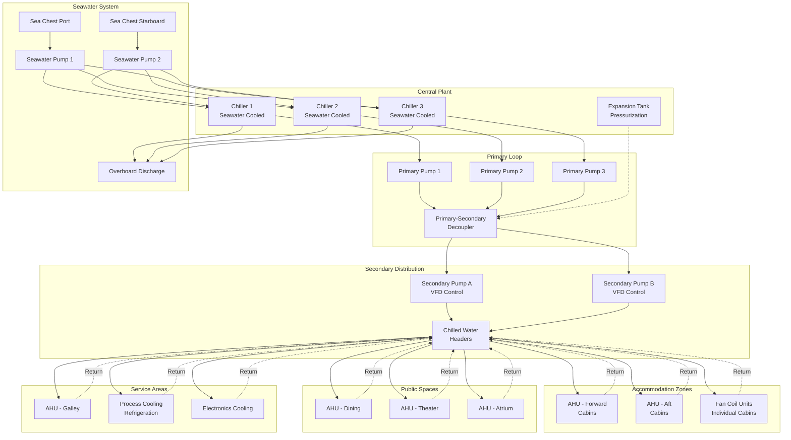

Central chilled water systems represent the primary HVAC approach for large commercial vessels, cruise ships, and naval combatants. These systems employ centralized refrigeration equipment with distributed cooling capacity through a water-based distribution network. The marine environment imposes specialized requirements including seawater cooling, redundancy for continuous operation, compensation for vessel motion, and equipment designed for shock, vibration, and corrosive conditions.

## Marine Chiller Plant Configuration

Shipboard chilled water plants differ fundamentally from land-based installations due to space constraints, redundancy requirements, and heat rejection limitations.

**Chiller Arrangement**

Multiple chillers provide redundancy and operational flexibility. Configuration depends on vessel type and criticality:

| Vessel Type | Typical Configuration | Redundancy Level | Total Capacity |
|-------------|----------------------|------------------|----------------|
| Cargo vessels | 2 chillers @ 60% each | N+0 (minimum) | 120% design load |
| Passenger ships | 3-4 chillers @ 40% each | N+1 | 120-160% design load |
| Cruise ships | 6-10 chillers @ 20-25% each | N+2 | 140-180% design load |
| Naval combatants | 4-6 chillers @ 33-50% each | N+1 to N+2 | 150-200% design load |
| Hospital ships | 4+ chillers @ 33% each | N+2 | 165% design load |

The redundancy ensures continued operation during maintenance, equipment failure, or battle damage scenarios. Cruise ships require the highest redundancy to maintain passenger comfort under all conditions, while naval vessels prioritize survivability with geographically separated equipment.

**Plant Location**

Chiller placement balances several competing factors. Proximity to machinery spaces provides access to seawater cooling loops and reduces refrigerant piping runs for condenser heat rejection. However, machinery space temperatures (40-50°C) reduce chiller efficiency and complicate maintenance access. Large vessels separate chilled water production into dedicated air conditioning machinery rooms with controlled ambient temperatures of 25-35°C.

Vertical placement typically positions chillers on lower decks near the waterline to minimize seawater pumping head and provide gravitational drainage. Naval vessels distribute chillers across multiple fire zones and watertight compartments to prevent single-point failure from flooding or fire casualties.

## Seawater Cooling Systems

Heat rejection through seawater condensers represents the standard approach for marine applications, eliminating the need for cooling towers while utilizing an unlimited heat sink.

**Condenser Design**

Shell-and-tube heat exchangers with seawater flowing through tubes provide optimal performance and maintainability. Tube material selection determines longevity and maintenance requirements:

| Material | Application | Seawater Velocity | Heat Transfer Coefficient | Service Life |
|----------|-------------|-------------------|--------------------------|--------------|
| 90-10 Cupronickel | Standard commercial | 2.0-2.4 m/s | 850-1100 W/m²K | 15-20 years |
| 70-30 Cupronickel | Polluted waters | 2.2-2.5 m/s | 900-1200 W/m²K | 20-25 years |
| Titanium | Highly corrosive | 2.0-2.8 m/s | 700-950 W/m²K | 30+ years |
| Admiralty brass | Legacy installations | 1.8-2.2 m/s | 950-1250 W/m²K | 10-15 years |

Tube velocity must balance heat transfer enhancement against erosion damage. Velocities below 2.0 m/s allow biological fouling, while velocities exceeding 2.5 m/s accelerate erosion in copper alloys. Titanium tubes tolerate higher velocities due to superior erosion resistance but provide lower heat transfer coefficients requiring larger surface areas.

**Seawater System Arrangement**

The seawater cooling loop comprises sea chests, pumps, piping distribution, and overboard discharge. Redundant sea chests positioned on opposite sides of the hull ensure cooling water availability regardless of vessel list angle. Each sea chest includes coarse screens (50-75 mm openings) to exclude debris and marine life.

Seawater pumps sized for 110-120% of design flow overcome friction losses through piping, condenser tubes, and strainers. Centrifugal pumps with bronze or duplex stainless steel casings resist corrosion while providing adequate head. Pump placement below the waterline provides positive suction head, eliminating priming concerns.

Temperature rise through condensers typically ranges from 5-8°C. Lower temperature rises require higher flow rates, increasing pump power but improving heat rejection efficiency. The relationship follows:

$$Q_{rejection} = \dot{m}_{sw} c_{p,sw} \Delta T_{sw}$$

where $Q_{rejection}$ represents total heat rejection (kW), $\dot{m}_{sw}$ is seawater mass flow rate (kg/s), $c_{p,sw}$ is seawater specific heat (approximately 3.99 kJ/kg·K), and $\Delta T_{sw}$ is temperature rise (K).

Discharge temperature regulations limit thermal pollution. Most jurisdictions restrict discharge to 10°C above ambient seawater temperature at the point of release.

## Marine Chiller Sizing

Chiller capacity determination requires analysis of sensible and latent loads throughout the vessel, accounting for solar gains, internal heat generation, and infiltration.

**Cooling Load Components**

Total vessel cooling load comprises:

$$Q_{total} = Q_{sensible} + Q_{latent} + Q_{ventilation} + Q_{equipment} + Q_{solar}$$

where:
- $Q_{sensible}$ = sensible heat from conduction through hull, decks, and superstructure
- $Q_{latent}$ = latent heat from occupant moisture and cooking processes
- $Q_{ventilation}$ = heat load from outdoor air ventilation requirements
- $Q_{equipment}$ = heat rejection from galley equipment, electronics, lighting
- $Q_{solar}$ = solar radiation through windows and absorbed by exposed surfaces

**Chiller Capacity Calculation**

Individual chiller capacity accounts for redundancy requirements and diversity factors:

$$Q_{chiller} = \frac{Q_{total} \times SF \times DF}{n - r}$$

where:
- $Q_{chiller}$ = individual chiller capacity (tons or kW)
- $Q_{total}$ = total calculated cooling load
- $SF$ = safety factor (typically 1.10-1.15)
- $DF$ = diversity factor (0.75-0.85 for passenger vessels, 0.90-1.0 for cargo)
- $n$ = total number of chillers
- $r$ = number of redundant chillers

**Seawater Flow Rate**

Required seawater flow for condenser cooling:

$$\dot{V}_{sw} = \frac{Q_{chiller} \times (1 + \frac{1}{COP})}{\rho_{sw} c_{p,sw} \Delta T_{sw}}$$

where:
- $\dot{V}_{sw}$ = seawater volumetric flow rate (m³/s)
- $COP$ = coefficient of performance (typically 4.5-5.5 for marine chillers)
- $\rho_{sw}$ = seawater density (approximately 1025 kg/m³)
- $\Delta T_{sw}$ = design temperature rise (5-8 K)

**Chilled Water Flow Rate**

Distribution system flow requirements:

$$\dot{V}_{chw} = \frac{Q_{chiller}}{\rho_{chw} c_{p,chw} \Delta T_{chw}}$$

where:
- $\dot{V}_{chw}$ = chilled water flow rate (m³/s or L/s)
- $\rho_{chw}$ = chilled water density (approximately 1000 kg/m³ at 7°C)
- $c_{p,chw}$ = chilled water specific heat (4.18 kJ/kg·K)
- $\Delta T_{chw}$ = chilled water temperature differential (typically 5-7 K)

Marine systems typically employ 6-7°C supply water temperature with 12-13°C return, providing adequate dehumidification while maintaining reasonable flow rates.

## Chilled Water Distribution System

The distribution network conveys cooling capacity from central chillers to air handling units, fan coil units, and process cooling loads throughout the vessel.

**Primary-Secondary Pumping**

This configuration decouples chiller flow from distribution flow, allowing independent optimization. Primary pumps maintain constant flow through operating chillers, ensuring adequate evaporator velocity for heat transfer and refrigerant control stability. Secondary pumps modulate via variable frequency drives to match building load, reducing pumping energy during part-load operation.

The decoupler pipe length must provide adequate hydraulic separation:

$$L_{decoupler} = 10 \times D_{pipe}$$

where $L_{decoupler}$ is the minimum decoupler length and $D_{pipe}$ is the pipe diameter. This ensures flow in one loop does not induce flow in the other loop.

**Piping Design Considerations**

Marine chilled water piping requires specialized details to accommodate vessel motion and vibration:

Expansion compensation through flexible pipe loops or expansion joints absorbs thermal movement and hull flexing. Pipe supports spaced at 2-3 meter intervals prevent sagging while allowing longitudinal movement. Spring hangers maintain support during roll and pitch by compensating for angle changes up to 15-20 degrees.

Pipe material selection balances cost, corrosion resistance, and weight. Copper (Type L) provides excellent corrosion resistance for small diameter piping (<50 mm). Carbon steel with internal coating serves larger distribution mains (>50 mm), while stainless steel 316L offers superior longevity in corrosive environments at premium cost.

Insulation prevents condensation on cold surfaces, which creates slipping hazards and promotes corrosion. Closed-cell elastomeric foam with vapor barrier facing maintains thermal performance in humid marine environments. Minimum insulation thickness:

$$t_{ins} = \frac{k_{ins}(T_{ambient} - T_{pipe})}{\dot{q}_{max}}$$

where $t_{ins}$ is insulation thickness (m), $k_{ins}$ is insulation thermal conductivity (W/m·K), and $\dot{q}_{max}$ is maximum acceptable heat gain (W/m²).

## Roll and Pitch Effects

Vessel motion creates dynamic forces on piping systems and affects fluid distribution within heat exchangers.

**Inclinometer-Based Compensation**

Modern systems employ inclinometers measuring roll and pitch angles to adjust pump operation. During sustained roll (up to 30 degrees for passenger vessels, 45 degrees for naval combatants), liquid accumulates on the low side of horizontal pipes and heat exchanger tubes. This uneven distribution reduces heat transfer effectiveness and can cause refrigerant control instability.

Compensation strategies include:
- Increased refrigerant charge to maintain liquid coverage during roll
- Enhanced pump capacity (15-20% above static requirements) to overcome gravitational head changes
- Check valves preventing reverse flow during severe pitch
- Accumulators on low-pressure refrigerant lines to prevent liquid slugging

**Structural Loading**

Dynamic forces from vessel motion create stress on pipe supports and equipment foundations:

$$F_{dynamic} = m \times a_{max} \times (1 + \phi_{roll})$$

where $F_{dynamic}$ is the dynamic force on supports (N), $m$ is the mass of pipe and contents (kg), $a_{max}$ is maximum acceleration (typically 0.3-0.5g for commercial vessels, up to 2.0g for naval combatants), and $\phi_{roll}$ is the roll angle factor accounting for cyclic loading.

All piping supports must withstand combined static and dynamic loads with safety factors of 3:1 minimum for commercial vessels, 5:1 for naval applications per SNAME T&R Bulletin 3-47.

## Control Systems and Automation

Shipboard chilled water plants employ sophisticated control strategies to optimize efficiency while maintaining redundancy.

**Chiller Staging**

Lead-lag control sequences chillers based on load demand measured through return water temperature or flow rate. The control logic stagings additional chillers when:

$$\Delta T_{return} < (T_{setpoint} - T_{deadband})$$

indicating insufficient capacity. Alternatively, flow-based staging adds capacity when:

$$\dot{V}_{actual} > 0.85 \times \dot{V}_{design}$$

Rotation algorithms equalize runtime across all chillers, preventing preferential wear. Lockout timers prevent short-cycling by enforcing minimum off-times of 10-15 minutes between start attempts.

**Remote Monitoring**

Integration with vessel management systems provides centralized oversight of:
- Chiller operating status and capacity
- Seawater inlet and discharge temperatures
- Chilled water supply and return temperatures
- Flow rates through primary and secondary loops
- Alarm conditions including low flow, high temperature, refrigerant leaks

Bridge monitoring allows engineering officers to verify system status without entering machinery spaces. Satellite communications enable shore-based technical support for troubleshooting complex issues during voyages.

## Redundancy and Reliability

Continuous operation requirements demand robust redundancy at multiple system levels.

**N+1 and N+2 Configurations**

The designation indicates total chillers (N) plus spare capacity. A 3-chiller plant with N+1 redundancy operates with two chillers providing 100% capacity, with the third available for backup. This configuration tolerates single-chiller failure without loss of cooling.

Cruise ships typically employ N+2 redundancy, allowing continued operation with two simultaneous failures. A 6-chiller configuration might operate with four chillers at 75% capacity, with two full spares available.

**Component Redundancy**

Critical components require duplication:
- Seawater pumps: minimum two pumps at 100% capacity each
- Secondary chilled water pumps: two or more with VFD control
- Expansion tanks: dual tanks for primary and secondary loops
- Instrumentation: redundant temperature and flow sensors

**Maintenance Access**

Equipment layout must accommodate removal and replacement without dry-docking. Chillers positioned with adequate overhead clearance allow tube bundle extraction for cleaning or re-tubing. Removable deck plates or hatches provide crane access to machinery spaces for major component replacement.

## Marine Standards and Specifications

Shipboard chilled water systems must comply with classification society requirements and industry standards.

**SNAME (Society of Naval Architects and Marine Engineers)**

SNAME T&R Bulletin 3-47 "HVAC Systems for Surface Ships" provides design guidance including:
- Vibration isolation requirements for rotating equipment
- Shock mounting specifications for naval applications (MIL-S-901)
- Pipe support spacing and restraint methods
- Seawater velocity limits and material specifications

**Classification Society Rules**

ABS (American Bureau of Shipping), DNV (Det Norske Veritas), Lloyd's Register, and other societies specify:
- Minimum redundancy levels based on vessel type
- Material approvals for marine service
- Pressure vessel certification for refrigerant systems
- Electric motor enclosure ratings (typically IP56 minimum)

**IMO Requirements**

International Maritime Organization regulations establish:
- Maximum noise levels in accommodation spaces (60 dB(A) per Resolution A.468)
- Refrigerant regulations under MARPOL Annex VI
- Fire protection requirements for machinery spaces
- Thermal discharge limits to prevent environmental impact

**Type Approval Testing**

Marine equipment requires type approval certification demonstrating:
- Vibration resistance per IEC 60092-504 (2-25 Hz swept frequency)
- Inclination testing at design heel angles
- Salt spray exposure per ASTM B117 (1000+ hours)
- Temperature cycling between -20°C and +65°C ambient

Equipment passing type approval receives certification valid across multiple classification societies, streamlining approval for new vessel installations.

## Conclusion

Central chilled water systems provide efficient, reliable climate control for large marine vessels. The specialized requirements of seawater cooling, redundant configuration, motion compensation, and marine-rated equipment distinguish these installations from land-based applications. Proper design requires integration of thermodynamic principles, marine engineering standards, and operational considerations to deliver systems capable of continuous service in the demanding maritime environment. Adherence to SNAME guidelines, classification society rules, and IMO regulations ensures installations meet safety and performance requirements while providing the redundancy necessary for extended voyages without shore support.
