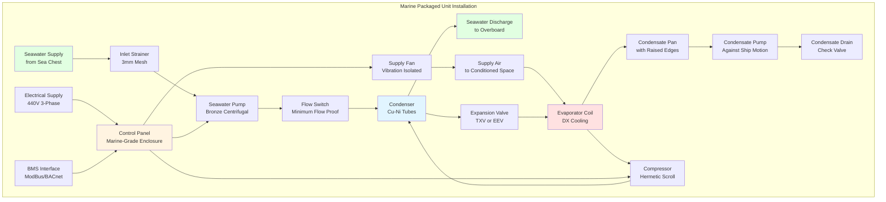

Marine packaged HVAC units provide self-contained climate control solutions specifically engineered for shipboard environments. These factory-assembled systems integrate all refrigeration components, air handling, and controls into compact, marine-grade enclosures designed to withstand corrosive atmospheres, continuous vibration, and space constraints inherent to vessel installations.

## Packaged Unit Fundamentals

Self-contained marine packaged units eliminate field refrigerant piping and reduce installation complexity compared to split systems. Each unit houses the compressor, evaporator, condenser, expansion device, and air-moving equipment within a single cabinet. This configuration minimizes refrigerant charge, simplifies maintenance, and provides zone-level redundancy critical for shipboard operations.

**System Architecture**

Marine packaged units operate on the vapor compression refrigeration cycle with either air-cooled or seawater-cooled condensers. The cooling capacity is determined by the heat transfer effectiveness at both the evaporator and condenser:

$$Q_{\text{total}} = \dot{m}_a \cdot (h_{\text{entering}} - h_{\text{leaving}})$$

where the mass flow rate of air through the evaporator coil ($\dot{m}_a$, kg/s) and the enthalpy difference across the coil (kJ/kg) define the total cooling capacity. For marine applications, this splits into sensible and latent components:

$$Q_{\text{sensible}} = \dot{m}_a \cdot c_{p,a} \cdot (T_{\text{db,in}} - T_{\text{db,out}})$$

$$Q_{\text{latent}} = \dot{m}_a \cdot h_{fg} \cdot (\omega_{\text{in}} - \omega_{\text{out}})$$

The sensible heat ratio (SHR) for marine applications typically ranges from 0.70-0.85, reflecting the high latent loads from salt-air infiltration and moisture-laden ventilation air.

**Condenser Cooling Methods**

Seawater-cooled condensers dominate marine packaged unit design due to superior heat rejection efficiency and independence from ambient air temperature. The required seawater flow rate is:

$$\dot{m}_{\text{sw}} = \frac{Q_{\text{rejection}}}{\rho_{\text{sw}} \cdot c_{p,sw} \cdot \Delta T_{\text{sw}}}$$

where condenser heat rejection ($Q_{\text{rejection}}$) equals compressor power input plus evaporator capacity. Typical seawater temperature rise ranges from 5-8°C through the condenser, with flow velocities maintained at 2.0-2.5 m/s to prevent biofouling while limiting erosion of tube surfaces.

## Marine Packaged Unit Types

Different vessel types and space configurations require specialized packaged unit designs optimized for specific installation constraints and operational requirements.

| Unit Type | Cooling Capacity | Condenser Type | Primary Application | Installation Location |
|-----------|------------------|----------------|---------------------|----------------------|
| Compact Wall Mount | 3.5-10.5 kW | Seawater | Individual cabins, small offices | Through bulkhead |
| Deck-Mounted Horizontal | 10.5-35 kW | Seawater/Air | Crew quarters, mess halls | Above overhead in passageways |
| Vertical Floor-Mounted | 17.5-70 kW | Seawater | Large spaces, control rooms | Corner/utility space |
| Split Packaged | 35-105 kW | Seawater | Bridge, operations centers | Evaporator in space, condenser remote |
| Modular Air Handler | 70-175 kW | Seawater (separate chiller) | Main salons, dining areas | Dedicated mechanical space |
| Self-Contained Rooftop | 35-140 kW | Air-cooled | Weather deck spaces | Exterior mounting |

**Compact Wall-Mount Units**

Through-bulkhead units provide individual zone control for cabins and small spaces. The evaporator section extends into the conditioned space while the condensing section mounts in an adjacent passageway or exterior to the accommodation. This configuration allows servicing without entering occupied spaces and maintains cabin noise levels below 40 dB(A).

Construction features marine-grade sheet metal with powder-coat finish over corrosion-resistant primer. Condensate drains incorporate check valves to prevent backflow during ship motion, and drain pans include 50-75 mm raised edges to contain water during pitch and roll conditions.

**Seawater-Cooled Vertical Units**

Free-standing vertical units maximize floor space efficiency in equipment rooms and control centers. The evaporator coil mounts above a supply air plenum with integral blower, while the compressor and seawater-cooled condenser occupy the lower section. This arrangement places high-maintenance components at accessible heights while minimizing required floor area to 0.5-0.8 m².

Seawater piping connects to ship services through isolation valves and strainers. Flow switches provide compressor lockout on loss of cooling water, and temperature sensors monitor discharge water to detect condenser fouling. Cupronickel condenser tubes (90-10 Cu-Ni alloy) provide 20-year service life in seawater applications with proper water treatment.

**Air-Cooled Weather Deck Units**

Vessels with adequate exterior space may employ air-cooled packaged units mounted on weather decks or superstructure roofs. These self-contained units eliminate seawater piping but require enhanced corrosion protection for direct salt spray exposure. Aluminum coil fins receive epoxy coating, and condenser fans use sealed motors with IP56 (NEMA 4) enclosures.

Air-cooled units experience capacity degradation as ambient temperature increases above design conditions. Capacity correction factors range from 0.85-0.95 for operation at 45°C ambient compared to rated capacity at 35°C. This necessitates oversizing by 10-15% when operating in tropical regions.

## Seawater Cooling Systems

Direct seawater cooling provides the most thermodynamically efficient heat rejection method for marine applications, utilizing ocean temperatures of 5-30°C compared to ambient air temperatures that may exceed 40°C in tropical regions.

**Condenser Design**

Shell-and-tube condensers with seawater in tubes and refrigerant condensing on the shell side dominate marine packaged units. Tube diameter of 19-25 mm provides adequate flow area while maintaining cleaning access. Enhanced tubes with internal rifling or corrugation increase heat transfer coefficients from 3500 W/m²K for smooth tubes to 5000-6500 W/m²K for enhanced surfaces.

The log-mean temperature difference (LMTD) method determines required heat transfer area:

$$Q_{\text{cond}} = U \cdot A \cdot \text{LMTD}$$

where overall heat transfer coefficient ($U$) ranges from 800-1200 W/m²K for cupronickel tubes with typical fouling factors of 0.000088 m²K/W (0.0005 h·ft²·°F/BTU) for treated seawater.

**Seawater Circuit Components**

Each packaged unit requires dedicated seawater supply and return connections. The circuit includes:

1. **Seawater pump**: Centrifugal or positive displacement, bronze or super-duplex stainless construction, flow rate 0.03-0.05 L/s per kW of cooling capacity
2. **Inlet strainer**: 3-5 mm mesh, accessible basket for cleaning, pressure drop <10 kPa when clean
3. **Flow switch**: Paddle or thermal type, proves minimum flow before compressor start
4. **Temperature sensors**: Monitor inlet and outlet temperatures for performance trending
5. **Isolation valves**: Bronze ball valves for service isolation, manual or automated

Seawater velocity through condenser tubes is maintained at 2.0-2.5 m/s. Lower velocities allow biofouling and sedimentation, while higher velocities cause erosion-corrosion, particularly in turbulent zones at tube inlets.

## Modular Construction Advantages

Marine packaged units utilize modular design principles that facilitate installation through narrow passageways and watertight doors common on vessels.

**Sectional Assembly**

Large-capacity units employ bolted-panel construction allowing field assembly in confined spaces. Individual sections (compressor module, evaporator section, control panel) measure less than 600 mm width for passage through standard marine doors. Refrigerant connections use brazed or flared fittings rather than welded joints to enable disassembly for major component replacement.

This modularity extends to maintenance procedures. Compressor assemblies mount on slide-out rails allowing removal without disconnecting refrigerant lines. Evaporator coils lift out through access panels sized for replacement without cabinet removal. Control boards employ plug-in connectors rather than hardwired terminals.

**Standardized Interfaces**

Marine-grade packaged units maintain standardized connection points for shipboard services:

- Electrical: Terminal blocks for 440V/60Hz 3-phase or 220V/50Hz 3-phase per vessel power system
- Seawater: Flanged or threaded connections sized for standard marine pipe schedules
- Condensate drain: Threaded connection with check valve, 25-40 mm diameter
- Control signals: Terminal strip for remote monitoring and Building Management System (BMS) integration

## Marine-Grade Construction Features

Shipboard environmental conditions necessitate enhanced construction beyond standard commercial HVAC equipment specifications.

**Corrosion Protection**

All external surfaces receive multi-layer coating systems. Base metal undergoes zinc-rich epoxy primer application followed by polyurethane topcoat. Fasteners use 316 stainless steel rather than zinc-plated carbon steel. Electrical components mount in NEMA 4X (IP66) enclosures with gasket seals to prevent salt-air intrusion.

Internal components exposed to condensate employ 304 stainless steel for drain pans and support brackets. Evaporator and air-cooled condenser coils receive epoxy coating over aluminum fins. Copper refrigerant tubing uses brazed rather than soldered joints to withstand vibration-induced stress cycling.

**Vibration and Shock Resistance**

Continuous engine vibration and wave-induced motion create fatigue loading on all mechanical connections. Compressors mount on spring isolators sized for 90% isolation efficiency at ship's dominant vibration frequency (typically 8-12 Hz for diesel propulsion). Refrigerant piping includes vibration loops and flexible sections at all rigid interfaces.

Naval vessels require shock-hardened construction per MIL-S-901 specifications. This involves additional bracing of internal components, shock-isolated mounting, and testing to withstand 2-5G vertical and 1-3G horizontal shock loads representing nearby explosion effects.

**Space Optimization**

Packaged units designed for marine service minimize volume while maintaining serviceability. Typical footprint efficiency achieves 70-100 W/m² of floor area for vertical units and 150-200 W/m² for horizontal overhead-mounted configurations. This compares to 40-60 W/m² for standard commercial equipment.

Component arrangement prioritizes accessibility of high-maintenance items. Compressors, control boards, and drive belts (for belt-driven fans) locate behind panels removable with basic hand tools. Filter sections allow replacement without system shutdown. Refrigerant service valves extend to cabinet exterior for gauge connection without opening enclosures.

## Control Systems and Integration

Marine packaged units incorporate microprocessor-based controls providing autonomous operation while interfacing with vessel management systems.

**Local Control Functions**

Onboard controllers regulate:

- Capacity modulation via compressor unloading or variable-speed drive
- Supply air temperature control with proportional-integral (PI) algorithms
- Seawater pump sequencing and flow monitoring
- Defrost cycles for low-temperature applications
- Alarm generation and local annunciation

Setpoint adjustment occurs through local display panels with override capability from remote stations. Temperature control maintains ±1°C of setpoint under steady-state conditions using thermistor sensors with 0.1°C resolution.

**Remote Monitoring**

Communication protocols (ModBus RTU, BACnet, or proprietary systems) provide data points to central monitoring stations:

- Operating status (running, standby, alarm)
- Space temperature and relative humidity
- Seawater inlet/outlet temperatures and flow rate
- Compressor run hours and cycle counts
- Filter pressure drop and replacement indicators
- Refrigerant pressures (suction and discharge)

This integration enables centralized control from bridge or engine control room stations, critical for unmanned machinery space operations on modern vessels.

## Standards and Certifications

Marine packaged HVAC units must comply with classification society requirements and international maritime regulations.

**Type Approval Requirements**

Classification societies (ABS, DNV, Lloyd's Register, Bureau Veritas) grant type approval following design review and prototype testing. Requirements include:

- Vibration testing per IEC 60068-2-6 or equivalent classification society standard
- Inclination testing at 15° and 22.5° heel and trim angles
- Salt spray exposure per ASTM B117 (minimum 500 hours)
- Electromagnetic compatibility (EMC) testing per IEC 60945
- Pressure testing of refrigerant circuits to 1.5× working pressure
- Electrical safety certification to IEC 60092 marine electrical standards

**Performance Verification**

Factory testing validates rated capacity, power consumption, and airflow at specified conditions. Marine packaged units must demonstrate capacity at seawater inlet temperatures ranging from 5-32°C and entering air conditions from 20-30°C dry bulb with relative humidity up to 70%.

Energy efficiency requirements per ISO 5149 (refrigeration equipment) specify minimum coefficient of performance (COP) values of 2.5-3.0 for seawater-cooled units at standard rating conditions. This represents compressor energy efficiency factor (EER) of 8.5-10.2 BTU/Wh.

## Application Considerations

Proper selection and installation of marine packaged units requires analysis of vessel-specific factors beyond standard HVAC design practice.

**Load Calculation Adjustments**

Shipboard cooling loads differ from land-based applications due to:

- Higher solar gain through weather deck overheads (up to 1000 W/m² in tropical conditions)
- Infiltration through non-weathertight doors and ventilation systems
- Heat gain from adjacent machinery spaces through bulkheads
- Variable occupancy patterns during different operational modes
- Increased outdoor air requirements per marine habitability standards (minimum 8.5 L/s per person)

These factors typically increase calculated loads by 15-25% compared to equivalent shore-based spaces.

**Redundancy Planning**

Critical spaces such as bridge, radio room, and engine control room require redundant cooling capacity. Common approaches include:

- Dual 100% capacity units with automatic changeover on failure
- Multiple 50% units with N+1 redundancy
- Combination of packaged units and emergency cooling fans for backup ventilation

Equipment rooms and crew accommodations typically operate with single units but maintain spare unit inventory for rapid replacement during port calls.

Marine packaged HVAC units provide robust, self-contained climate control solutions optimized for the demanding shipboard environment. The integration of all refrigeration components within compact, corrosion-resistant enclosures simplifies installation while providing the modularity and reliability essential for extended operations at sea. Proper selection requires consideration of marine-specific factors including seawater cooling capabilities, vibration resistance, space constraints, and regulatory compliance with classification society standards.
